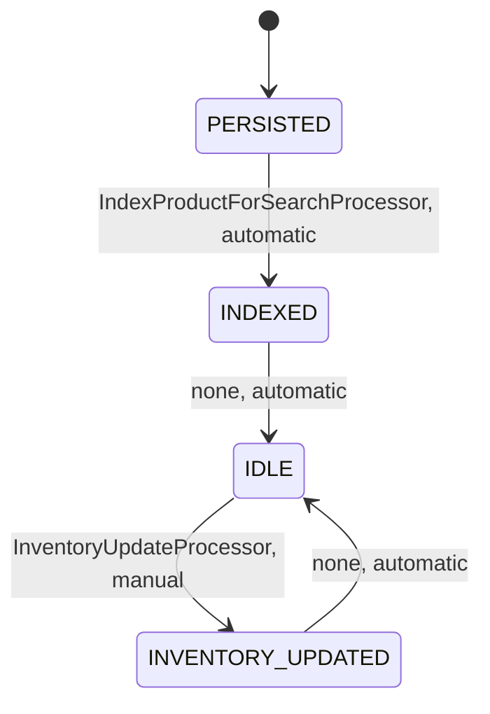
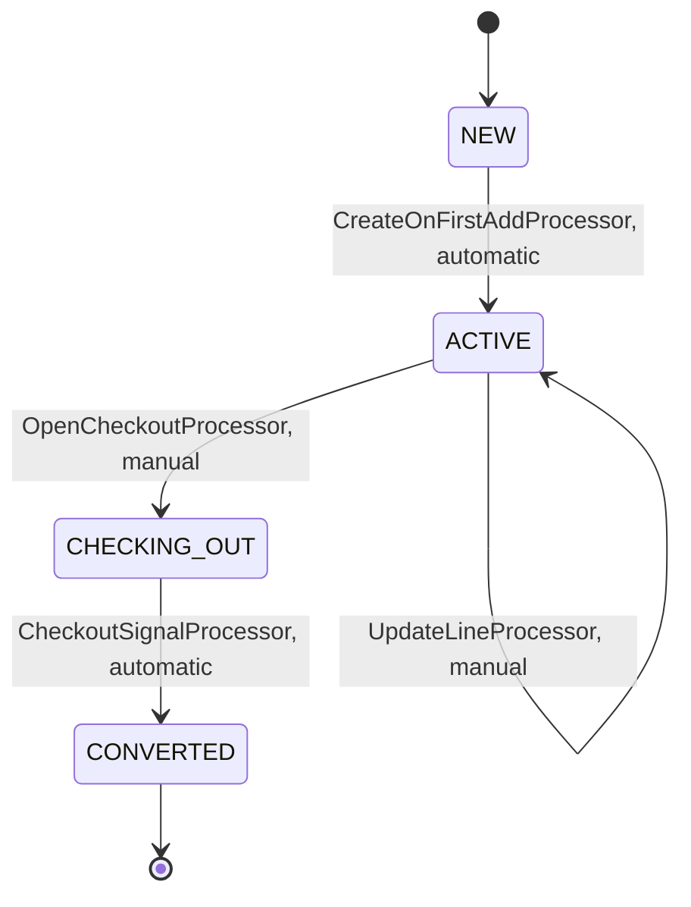
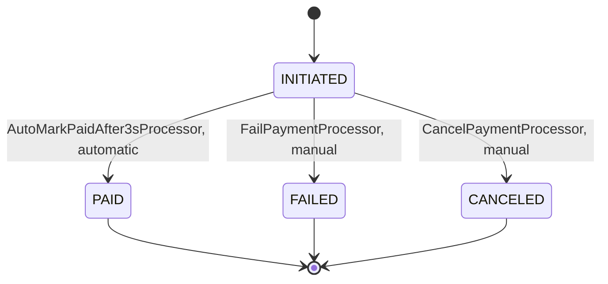
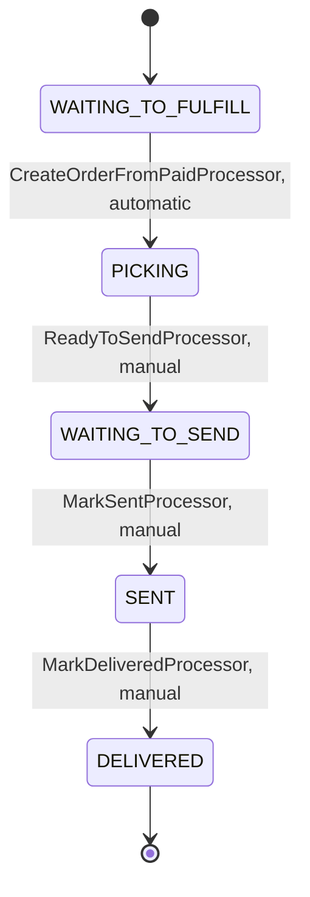
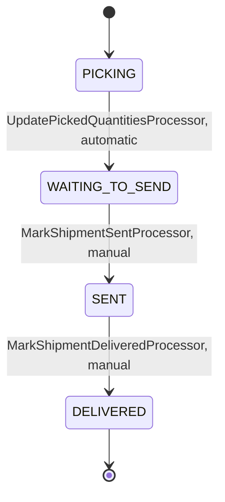

### 1. Entity Definitions
```
Product:
- sku: string (unique identifier)
- name: string
- description: string
- price: number
- quantityAvailable: number
- category: string
- warehouseId: string|null
- attributes: object
- myAdditionalField: string
- localizations: object
- media: array
- options: object
- variants: array
- bundles: array
- inventory: object
- compliance: object
- relationships: object
- events: array
- createdAt: string (ISO)
- updatedAt: string (ISO)

Cart:
- cartId: string
- status: string (NEW | ACTIVE | CHECKING_OUT | CONVERTED)
- lines: array of { sku: string, name: string, price: number, qty: number }
- totalItems: number
- grandTotal: number
- guestContact: object|null
- createdAt: string (ISO)
- updatedAt: string (ISO)

Payment:
- paymentId: string
- cartId: string
- amount: number
- status: string (INITIATED | PAID | FAILED | CANCELED)
- provider: string (DUMMY)
- createdAt: string (ISO)
- updatedAt: string (ISO)

Order:
- orderId: string
- orderNumber: string (short ULID)
- status: string (WAITING_TO_FULFILL | PICKING | WAITING_TO_SEND | SENT | DELIVERED)
- lines: array of { sku, name, unitPrice, qty, lineTotal }
- totals: object { items: number, grand: number }
- guestContact: object
- createdAt: string (ISO)
- updatedAt: string (ISO)

Shipment:
- shipmentId: string
- orderId: string
- status: string (PICKING | WAITING_TO_SEND | SENT | DELIVERED)
- lines: array of { sku, qtyOrdered, qtyPicked, qtyShipped }
- createdAt: string (ISO)
- updatedAt: string (ISO)
```

### 2. Entity workflows

Product workflow:
1. Persist Product -> index for search
2. Optional InventoryUpdate events -> adjust quantityAvailable
3. Completed


```mermaid
stateDiagram-v2
    [*] --> PERSISTED
    PERSISTED --> INDEXED : IndexProductForSearchProcessor, automatic
    INDEXED --> IDLE : none, automatic
    IDLE --> INVENTORY_UPDATED : InventoryUpdateProcessor, manual
    INVENTORY_UPDATED --> IDLE : none, automatic
```
Processors/Criteria: IndexProductForSearchProcessor, InventoryUpdateProcessor. Criterion: ProductHasInventoryChangesCriterion.

Cart workflow:
1. CREATE_ON_FIRST_ADD: NEW cart created and first line added -> ACTIVE (automatic on POST)
2. ADD_ITEM / DECREMENT_ITEM / REMOVE_ITEM: recalc totals -> stay ACTIVE (manual via API)
3. OPEN_CHECKOUT: ACTIVE -> CHECKING_OUT (manual)
4. CHECKOUT signal: CHECKING_OUT -> CONVERTED (automatic when Order created)


```mermaid
stateDiagram-v2
    [*] --> NEW
    NEW --> ACTIVE : CreateOnFirstAddProcessor, automatic
    ACTIVE --> ACTIVE : AddLineProcessor, manual
    ACTIVE --> ACTIVE : UpdateLineProcessor, manual
    ACTIVE --> CHECKING_OUT : OpenCheckoutProcessor, manual
    CHECKING_OUT --> CONVERTED : CheckoutSignalProcessor, automatic
    CONVERTED --> [*]
```
Processors/Criteria: CreateOnFirstAddProcessor, RecalculateTotalsProcessor, OpenCheckoutProcessor, CheckoutSignalProcessor. Criterion: CartHasLinesCriterion.

Payment workflow:
1. START_DUMMY_PAYMENT: create Payment INITIATED (POST) -> AUTO_MARK_PAID after ~3s -> PAID (automatic)
2. Failure/cancel paths allowed


```mermaid
stateDiagram-v2
    [*] --> INITIATED
    INITIATED --> PAID : AutoMarkPaidAfter3sProcessor, automatic
    INITIATED --> FAILED : FailPaymentProcessor, manual
    INITIATED --> CANCELED : CancelPaymentProcessor, manual
    PAID --> [*]
    FAILED --> [*]
    CANCELED --> [*]
```
Processors/Criteria: CreateDummyPaymentProcessor, AutoMarkPaidAfter3sProcessor. Criterion: PaymentIsPaidCriterion.

Order workflow:
1. CREATE_ORDER_FROM_PAID (automatic when Payment PAID + request to create) -> create Order WAITING_TO_FULFILL
2. Decrement Product.quantityAvailable (no reservations) -> create one Shipment in PICKING
3. READY_TO_SEND -> WAITING_TO_SEND (manual)
4. MARK_SENT -> SENT (manual/ops)
5. MARK_DELIVERED -> DELIVERED (manual/ops)


```mermaid
stateDiagram-v2
    [*] --> WAITING_TO_FULFILL
    WAITING_TO_FULFILL --> PICKING : CreateOrderFromPaidProcessor, automatic
    PICKING --> WAITING_TO_SEND : ReadyToSendProcessor, manual
    WAITING_TO_SEND --> SENT : MarkSentProcessor, manual
    SENT --> DELIVERED : MarkDeliveredProcessor, manual
    DELIVERED --> [*]
```
Processors/Criteria: CreateOrderFromPaidProcessor, DecrementStockProcessor, CreateShipmentProcessor. Criterion: PaymentIsPaidCriterion.

Shipment workflow:
1. Created in PICKING
2. PICKING -> WAITING_TO_SEND when items picked
3. WAITING_TO_SEND -> SENT when dispatched
4. SENT -> DELIVERED when delivered


```mermaid
stateDiagram-v2
    [*] --> PICKING
    PICKING --> WAITING_TO_SEND : UpdatePickedQuantitiesProcessor, automatic
    WAITING_TO_SEND --> SENT : MarkShipmentSentProcessor, manual
    SENT --> DELIVERED : MarkShipmentDeliveredProcessor, manual
    DELIVERED --> [*]
```
Processors/Criteria: UpdatePickedQuantitiesProcessor, MarkShipmentSentProcessor. Criterion: ShipmentReadyToSendCriterion.

### 3. Pseudo code for processor classes

RecalculateTotalsProcessor
```pseudo
class RecalculateTotalsProcessor:
  process(cart):
    totalItems = sum(line.qty for line in cart.lines)
    grandTotal = sum(line.qty * line.price for line in cart.lines)
    cart.totalItems = totalItems
    cart.grandTotal = grandTotal
    persist cart (emit cart.updated event)
```

AutoMarkPaidAfter3sProcessor
```pseudo
class AutoMarkPaidAfter3sProcessor:
  process(payment):
    schedule(after=3s):
      fetch payment
      if payment.status == "INITIATED":
        payment.status = "PAID"
        persist payment (emit payment.updated event)
```

CreateOrderFromPaidProcessor
```pseudo
class CreateOrderFromPaidProcessor:
  process(request with cartId, paymentId):
    assert Payment.status == PAID
    fetch cart
    order = snapshot cart lines + guestContact
    order.orderNumber = shortULID()
    order.status = "WAITING_TO_FULFILL"
    persist order (emit order.created)
    for each line in order.lines:
      DecrementStockProcessor.process(line.sku, line.qty)
    CreateShipmentProcessor.process(order)
```

DecrementStockProcessor
```pseudo
class DecrementStockProcessor:
  process(sku, qty):
    product = fetch Product by sku
    product.quantityAvailable = product.quantityAvailable - qty
    persist product (emit product.updated)
```

CreateShipmentProcessor
```pseudo
class CreateShipmentProcessor:
  process(order):
    shipment.lines = map order.lines to { sku, qtyOrdered, qtyPicked:0, qtyShipped:0 }
    shipment.status = "PICKING"
    persist shipment (emit shipment.created)
```

### 4. API Endpoints Design Rules

General rule: POST endpoints return only technicalId. GET endpoints return stored entity. GET by technicalId for every POST-created entity.

Products
- GET /ui/products?search=&category=&minPrice=&maxPrice=&page=&pageSize=
  Response (list slim DTO):
```json
[
  { "sku":"SKU1", "name":"...", "description":"...", "price":10.0, "quantityAvailable":5, "category":"phones", "imageUrl":"https://..." }
]
```
- GET /ui/products/{sku}
  Response: full Product document (as persisted)

Cart
- POST /ui/cart
  Request (first add may be empty or include first line)
```json
{ "firstLine": { "sku":"SKU1", "qty":1 } }
```
  Response:
```json
{ "technicalId":"<cart_technical_id>" }
```
- GET /ui/cart/{technicalId}
  Response: full Cart object
- POST /ui/cart/{technicalId}/lines
```json
{ "sku":"SKU1", "qty":1 }
```
  Response:
```json
{ "technicalId":"<operation_technical_id>" }
```
- PATCH /ui/cart/{technicalId}/lines
```json
{ "sku":"SKU1", "qty":2 }
```
  Response:
```json
{ "technicalId":"<operation_technical_id>" }
```
- POST /ui/cart/{technicalId}/open-checkout
  Response:
```json
{ "technicalId":"<operation_technical_id>" }
```

Checkout
- POST /ui/checkout/{cartTechnicalId}
```json
{ "guestContact": { "name":"Jane", "email":"j@example.com", "phone":"", "address": { "line1":"...", "city":"...", "postcode":"...", "country":"..." } } }
```
Response:
```json
{ "technicalId":"<checkout_technical_id>" }
```

Payment
- POST /ui/payment/start
```json
{ "cartId":"<cartTechnicalId>" }
```
Response:
```json
{ "technicalId":"<payment_technical_id>" }
```
- GET /ui/payment/{technicalId}
  Response: full Payment object

Order
- POST /ui/order/create
```json
{ "paymentId":"<paymentTechnicalId>", "cartId":"<cartTechnicalId>" }
```
Response:
```json
{ "technicalId":"<order_technical_id>" }
```
- GET /ui/order/{technicalId}
  Response: full Order object

Notes:
- All POST operations persist an entity which triggers Cyoda workflows/processors described above.
- Use minimal processors per workflow (listed) and 1-2 criteria per workflow (e.g., PaymentIsPaidCriterion, CartHasLinesCriterion, ShipmentReadyToSendCriterion).