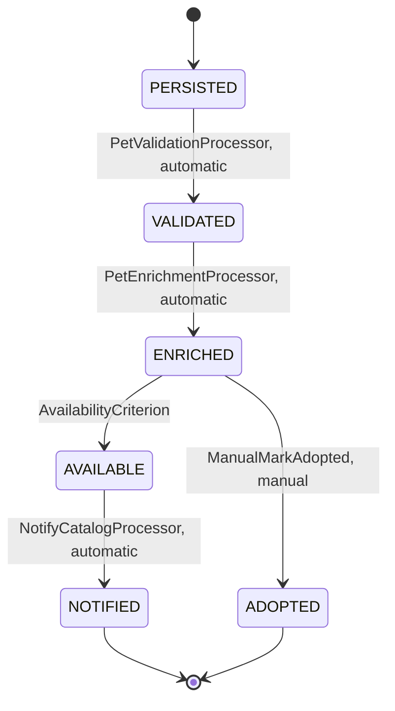
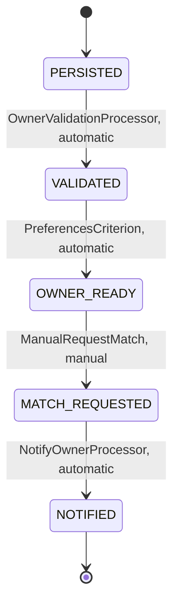
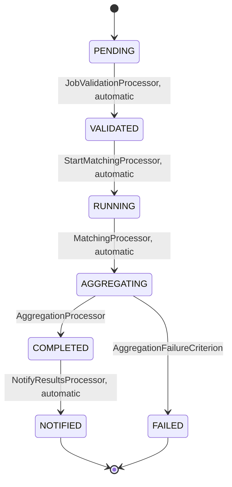

### 1. Entity Definitions
```
Pet:
- id: String (unique business id from Petstore or generated)
- name: String (pet name)
- species: String (e.g., cat, dog)
- breed: String (breed info)
- age: Integer (years)
- status: String (e.g., AVAILABLE, ADOPTED)
- sourceUrl: String (original Petstore record url)
- photoUrls: List<String> (images)
- vaccinations: List<String> (vaccination records)

Owner:
- id: String (unique owner id)
- name: String (owner full name)
- contactEmail: String (contact email)
- phone: String (contact phone)
- address: String (postal address)
- preferences: String (desired species/breed/age range)

AdoptionJob:
- id: String (business id)
- ownerId: String (owner requesting matches)
- criteria: String (textual criteria or JSON filter)
- status: String (PENDING, RUNNING, COMPLETED, FAILED)
- createdAt: String (timestamp)
- resultCount: Integer (number of matched pets)
- resultsPreview: List<String> (pet ids matched)
```

Notes: defaulted to 3 entities as none were explicitly provided.

### 2. Entity workflows

Pet workflow:
1. Initial State: PERSISTED (entity persisted by ingestion or manual add)
2. Validation: Run PetValidationProcessor (automatic)
3. Enrichment: Run PetEnrichmentProcessor to normalize fields and fetch photos (automatic)
4. Availability decision: Set AVAILABLE or QUARANTINE/ADOPTED (automatic/manual)
5. Notification: NotifyCatalogProcessor to update catalog subscribers (automatic)

```mermaid
stateDiagram-v2
    [*] --> PERSISTED
    PERSISTED --> VALIDATED : PetValidationProcessor, automatic
    VALIDATED --> ENRICHED : PetEnrichmentProcessor, automatic
    ENRICHED --> AVAILABLE : AvailabilityCriterion
    ENRICHED --> ADOPTED : ManualMarkAdopted, manual
    AVAILABLE --> NOTIFIED : NotifyCatalogProcessor, automatic
    NOTIFIED --> [*]
    ADOPTED --> [*]
```
Pet processors/criteria:
- Processors: PetValidationProcessor, PetEnrichmentProcessor, NotifyCatalogProcessor
- Criteria: AvailabilityCriterion
- Pseudocode: see section 3

Owner workflow:
1. Initial State: PERSISTED (owner added via signup or imported)
2. Validation: OwnerValidationProcessor (automatic)
3. PreferenceReview: PreferencesCriterion applied (automatic)
4. ReadyForMatching: OWNER_READY (manual acceptance possible)
5. Notification: NotifyOwnerProcessor (automatic)

```mermaid
stateDiagram-v2
    [*] --> PERSISTED
    PERSISTED --> VALIDATED : OwnerValidationProcessor, automatic
    VALIDATED --> OWNER_READY : PreferencesCriterion, automatic
    OWNER_READY --> MATCH_REQUESTED : ManualRequestMatch, manual
    MATCH_REQUESTED --> NOTIFIED : NotifyOwnerProcessor, automatic
    NOTIFIED --> [*]
```
Owner processors/criteria:
- Processors: OwnerValidationProcessor, NotifyOwnerProcessor
- Criteria: PreferencesCriterion

AdoptionJob workflow:
1. Initial State: PENDING (POST creates job -> event)
2. Validation: JobValidationProcessor (automatic)
3. Matching: Run MatchingProcessor to query pets and score matches (automatic)
4. Aggregation: Aggregate results and persist matches (automatic)
5. Completion: COMPLETED or FAILED (automatic)
6. Notification: Send job results to owner (automatic)

```mermaid
stateDiagram-v2
    [*] --> PENDING
    PENDING --> VALIDATED : JobValidationProcessor, automatic
    VALIDATED --> RUNNING : StartMatchingProcessor, automatic
    RUNNING --> AGGREGATING : MatchingProcessor, automatic
    AGGREGATING --> COMPLETED : AggregationProcessor
    AGGREGATING --> FAILED : AggregationFailureCriterion
    COMPLETED --> NOTIFIED : NotifyResultsProcessor, automatic
    NOTIFIED --> [*]
    FAILED --> [*]
```
AdoptionJob processors/criteria:
- Processors: JobValidationProcessor, MatchingProcessor, AggregationProcessor, NotifyResultsProcessor
- Criteria: AggregationFailureCriterion

### 3. Pseudo code for processor classes
Example: PetEnrichmentProcessor
```text
class PetEnrichmentProcessor {
  process(pet) {
    // normalize species/breed casing
    pet.species = normalize(pet.species)
    pet.breed = normalize(pet.breed)
    // fetch photos from sourceUrl if missing
    if empty(pet.photoUrls) then pet.photoUrls = fetchPhotos(pet.sourceUrl)
    persist(pet)
  }
}
```
MatchingProcessor (simplified)
```text
class MatchingProcessor {
  process(job) {
    owner = loadOwner(job.ownerId)
    candidates = queryPets(AVAILABLE, owner.preferences)
    scored = scoreCandidates(candidates, owner.preferences)
    top = takeTop(scored, 10)
    job.resultsPreview = extractIds(top)
    job.resultCount = size(top)
    persistMatches(job, top)
  }
}
```
JobValidationProcessor and others follow similar structure: validate fields, set status, persist.

### 4. API Endpoints Design Rules

POST endpoints (create orchestration jobs — return only technicalId)
- POST /jobs/ingest-pets
```json
Request:
{
  "sourceUrl": "https://petstore.example/api/pets",
  "runMode": "FULL" 
}
Response:
"technicalId-12345"
```

- POST /jobs/adoption-match
```json
Request:
{
  "ownerId": "owner-789",
  "criteria": "{\"species\":\"cat\",\"ageMax\":3}"
}
Response:
"technicalId-67890"
```

GET endpoints (retrieve results)
- GET /jobs/{technicalId}
```json
Response:
{
  "id":"job-1",
  "status":"COMPLETED",
  "resultCount":4,
  "resultsPreview":["pet-12","pet-34"]
}
```

- GET /pets/{id}
```json
Response:
{
  "id":"pet-12",
  "name":"Whiskers",
  "species":"cat",
  "status":"AVAILABLE"
}
```

- GET /owners/{id}
```json
Response:
{
  "id":"owner-789",
  "name":"Ava Smith",
  "contactEmail":"ava@example.com"
}
```

Notes and Cyoda behavior:
- Every POST of an orchestration entity (AdoptionJob, IngestPetsJob) is an EVENT: Cyoda will start the corresponding workflow automatically and invoke processors/criteria listed above.
- Business entities (Pet, Owner) are typically persisted by processors inside those workflows (not via extra POSTs); their persistence triggers their workflows in Cyoda.
- If you want additional GET-by-condition endpoints (e.g., search pets by species), specify and I will add them.