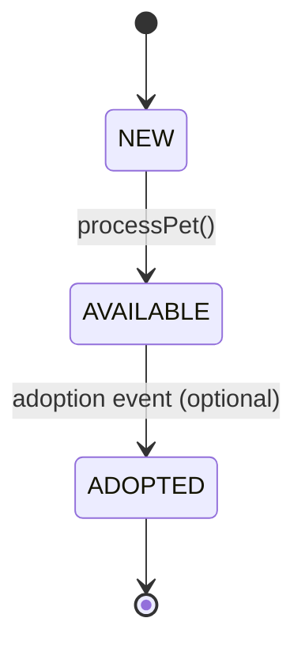
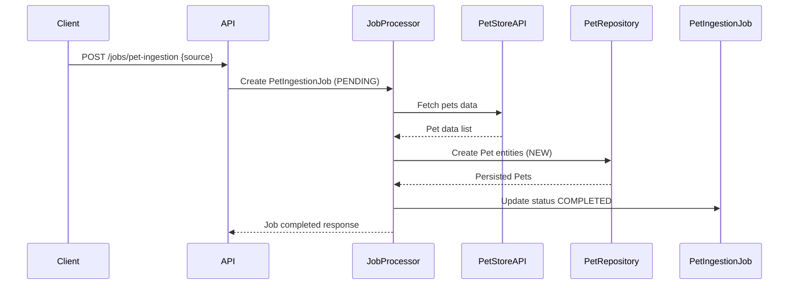

Certainly! Here is the well-formatted final version of your functional requirements for the 'Purrfect Pets' API app using Event-Driven Architecture:

### 1. Entity Definitions

```
PetIngestionJob:
  - jobId: String (unique identifier for the ingestion job)
  - createdAt: DateTime (timestamp when job is created)
  - source: String (data source info, e.g., Petstore API)
  - status: StatusEnum (PENDING, PROCESSING, COMPLETED, FAILED)

Pet:
  - petId: String (unique pet identifier from Petstore)
  - name: String (pet's name)
  - category: String (e.g., cat, dog, bird)
  - photoUrls: List<String> (list of pet image URLs)
  - tags: List<String> (pet tags or descriptors)
  - status: StatusEnum (NEW, AVAILABLE, ADOPTED)
```

### 2. Process Method Flows

```
processPetIngestionJob() Flow:
1. Initial State: Job created with PENDING status
2. Validation: Verify job parameters (source URL, schema)
3. Processing: Fetch data from Petstore API, parse pet entries
4. Persistence: Create immutable Pet entities for each new pet
5. Completion: Update job status to COMPLETED or FAILED
6. Notification: Log or trigger downstream events if needed

processPet() Flow:
1. Initial State: Pet created with NEW status
2. Validation: Ensure required pet fields are present
3. Enrichment: Optionally enrich pet data (e.g., add fun facts)
4. Availability: Mark pet as AVAILABLE for queries
5. Completion: Finalize pet entity state
```

### 3. API Endpoints Design

| Method | Endpoint              | Description                      | Request Body              | Response                 |
|--------|-----------------------|--------------------------------|---------------------------|--------------------------|
| POST   | /jobs/pet-ingestion   | Create PetIngestionJob (triggers ingestion event) | `{ "source": "PetstoreAPI" }` | `{ "jobId": "...", "status": "PENDING" }` |
| POST   | /pets                 | Create Pet (typically internal, triggered by ingestion) | Pet JSON entity          | Created Pet JSON         |
| GET    | /pets                 | List all available pets         | N/A                       | List of Pets             |
| GET    | /pets/{petId}         | Retrieve a specific pet         | N/A                       | Pet JSON                 |

### 4. Request/Response Formats

**Create PetIngestionJob Request**

```json
{
  "source": "PetstoreAPI"
}
```

**Create PetIngestionJob Response**

```json
{
  "jobId": "job-123",
  "status": "PENDING"
}
```

**Pet Entity Example**

```json
{
  "petId": "pet-456",
  "name": "Whiskers",
  "category": "cat",
  "photoUrls": ["http://image1.jpg", "http://image2.jpg"],
  "tags": ["cute", "playful"],
  "status": "AVAILABLE"
}
```

---

### Visual Representations

**PetIngestionJob Lifecycle State Diagram**


```mermaid
stateDiagram-v2
    [*] --> PENDING
    PENDING --> PROCESSING : processPetIngestionJob()
    PROCESSING --> COMPLETED : success
    PROCESSING --> FAILED : error
    COMPLETED --> [*]
    FAILED --> [*]
```

**Pet Lifecycle State Diagram**


```mermaid
stateDiagram-v2
    [*] --> NEW
    NEW --> AVAILABLE : processPet()
    AVAILABLE --> ADOPTED : adoption event (optional)
    ADOPTED --> [*]
```

**Event-Driven Processing Chain**


```mermaid
sequenceDiagram
    participant Client
    participant API
    participant JobProcessor
    participant PetStoreAPI
    participant PetRepository

    Client->>API: POST /jobs/pet-ingestion {source}
    API->>JobProcessor: Create PetIngestionJob (PENDING)
    JobProcessor->>PetStoreAPI: Fetch pets data
    PetStoreAPI-->>JobProcessor: Pet data list
    JobProcessor->>PetRepository: Create Pet entities (NEW)
    PetRepository-->>JobProcessor: Persisted Pets
    JobProcessor->>PetIngestionJob: Update status COMPLETED
    JobProcessor-->>API: Job completed response
```

---

If you have no further changes, these will guide the backend development on the Cyoda platform. Please feel free to reach out if you want to refine or add anything later!