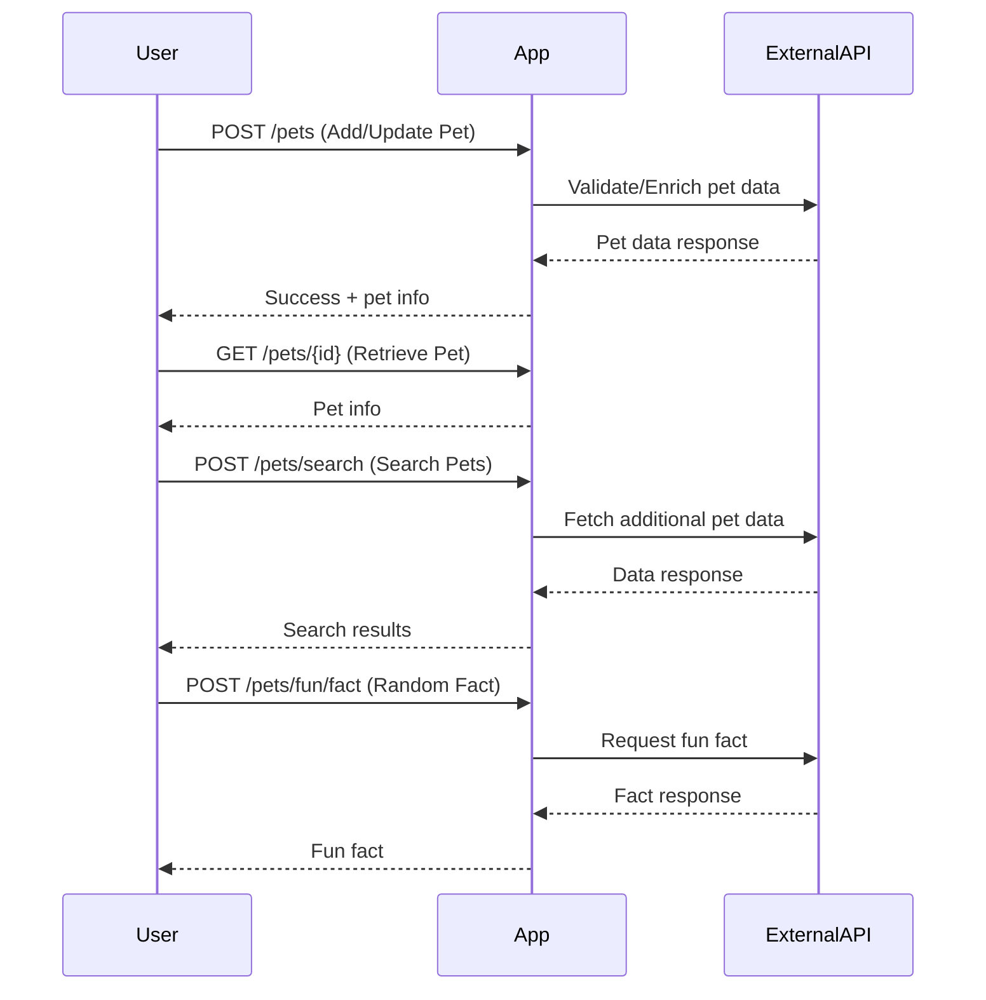
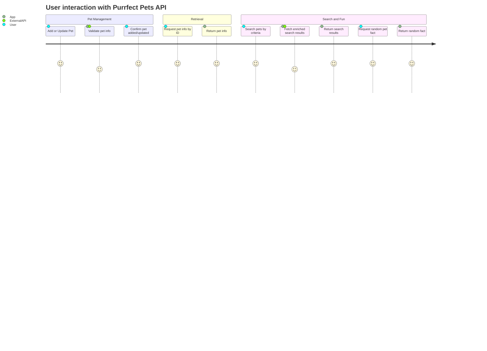

# Purrfect Pets API - Functional Requirements

## API Endpoints

### 1. Add or Update Pet Info (POST /pets)
- **Description:** Add a new pet or update an existing pet's details. This endpoint invokes external Petstore API data to enrich or validate pet info.
- **Request:**
```json
{
  "id": "optional, for update",
  "name": "string",
  "category": "string",
  "tags": ["string"],
  "status": "available | pending | sold"
}
```
- **Response:**
```json
{
  "success": true,
  "pet": {
    "id": "generated or updated id",
    "name": "string",
    "category": "string",
    "tags": ["string"],
    "status": "available | pending | sold"
  }
}
```

### 2. Get Pet Info by ID (GET /pets/{id})
- **Description:** Retrieve pet details stored in the application by pet ID.
- **Response:**
```json
{
  "id": "string",
  "name": "string",
  "category": "string",
  "tags": ["string"],
  "status": "available | pending | sold"
}
```

### 3. Search Pets (POST /pets/search)
- **Description:** Search pets by criteria (category, status, tags). This endpoint may invoke external Petstore API data to enrich results or add fun features.
- **Request:**
```json
{
  "category": "optional string",
  "status": "optional string",
  "tags": ["optional string"]
}
```
- **Response:**
```json
{
  "results": [
    {
      "id": "string",
      "name": "string",
      "category": "string",
      "tags": ["string"],
      "status": "available | pending | sold"
    }
  ]
}
```

### 4. Fun Feature: Random Pet Fact (POST /pets/fun/fact)
- **Description:** Returns a random pet-related fact or trivia, possibly fetched or generated using external data.
- **Request:** Empty or optional context.
- **Response:**
```json
{
  "fact": "string"
}
```

---

## Mermaid Sequence Diagram: User-App Interaction


```mermaid
sequenceDiagram
    participant User
    participant App
    participant ExternalAPI

    User->>App: POST /pets (Add/Update Pet)
    App->>ExternalAPI: Validate/Enrich pet data
    ExternalAPI-->>App: Pet data response
    App-->>User: Success + pet info

    User->>App: GET /pets/{id} (Retrieve Pet)
    App-->>User: Pet info

    User->>App: POST /pets/search (Search Pets)
    App->>ExternalAPI: Fetch additional pet data
    ExternalAPI-->>App: Data response
    App-->>User: Search results

    User->>App: POST /pets/fun/fact (Random Fact)
    App->>ExternalAPI: Request fun fact
    ExternalAPI-->>App: Fact response
    App-->>User: Fun fact
```

---

## Mermaid Journey Diagram: User API Usage Flow


```mermaid
journey
    title User interaction with Purrfect Pets API
    section Pet Management
      Add or Update Pet: 5: User
      Validate pet info: 4: App, ExternalAPI
      Confirm pet added/updated: 5: User
    section Retrieval
      Request pet info by ID: 5: User
      Return pet info: 5: App
    section Search and Fun
      Search pets by criteria: 5: User
      Fetch enriched search results: 4: App, ExternalAPI
      Return search results: 5: App
      Request random pet fact: 5: User
      Return random fact: 5: App
```