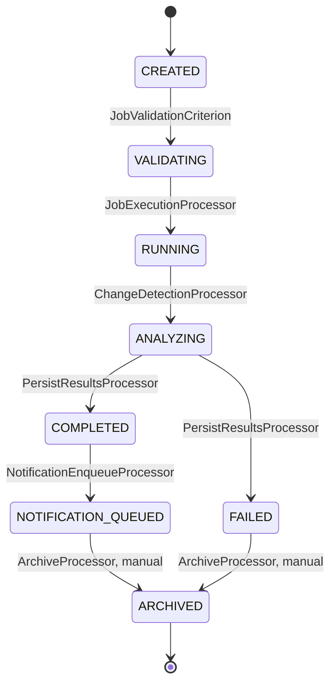
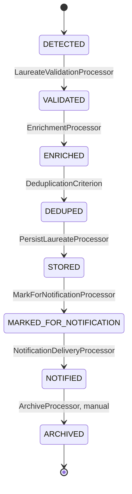
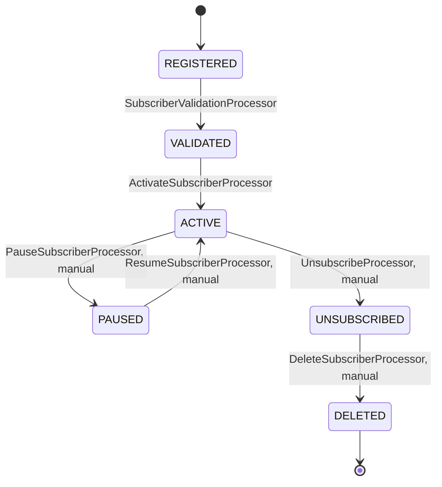

### 1. Entity Definitions
```
Job:
- jobId: String (business identifier for the job)
- name: String (human friendly name)
- sourceEndpoint: String (OpenDataSoft API endpoint or feed)
- schedule: String (cron or frequency descriptor)
- createdAt: String (timestamp)
- status: String (current job status)
- lastRunAt: String (timestamp of last run)
- retryCount: Integer (automatic retry attempts made)
- parameters: Map (job-specific parameters)
- resultSummary: String (short summary of last run)

Laureate:
- laureateId: String (source id from OpenDataSoft)
- fullName: String (person name)
- prizeYear: Integer (year of prize)
- category: String (prize category)
- country: String (country of laureate)
- affiliations: List (affiliation names)
- rawPayload: String (original source JSON)
- detectedAt: String (timestamp when detected)
- changeType: String (new updated deleted)
- published: Boolean (whether notifications queued)

Subscriber:
- subscriberId: String (business identifier)
- name: String (display name)
- contactEndpoint: String (email or webhook URL)
- filters: Map (category prizeYear country etc.)
- format: String (summary full json)
- status: String (active paused unsubscribed)
- createdAt: String (timestamp)
```

### 2. Entity workflows

Job workflow:
1. Initial State: Job created (event on POST)
2. Validation: Check job parameters and source reachability (automatic)
3. Execution: Fetch data from source, generate Laureate events (automatic)
4. Analysis: Detect new/updated/deleted laureates (automatic)
5. Completion: Mark job as COMPLETED or FAILED (automatic)
6. Notification: Enqueue notifications for matched subscribers (automatic)
7. Archive: Move old runs to archived (manual or scheduled)


```mermaid
stateDiagram-v2
    [*] --> CREATED
    CREATED --> VALIDATING : JobValidationCriterion
    VALIDATING --> RUNNING : JobExecutionProcessor
    RUNNING --> ANALYZING : ChangeDetectionProcessor
    ANALYZING --> COMPLETED : PersistResultsProcessor
    ANALYZING --> FAILED : PersistResultsProcessor
    COMPLETED --> NOTIFICATION_QUEUED : NotificationEnqueueProcessor
    NOTIFICATION_QUEUED --> ARCHIVED : ArchiveProcessor, manual
    FAILED --> ARCHIVED : ArchiveProcessor, manual
    ARCHIVED --> [*]
```

Needed processors/criteria for Job:
- Criteria: JobValidationCriterion
- Processors: JobExecutionProcessor, ChangeDetectionProcessor, PersistResultsProcessor, NotificationEnqueueProcessor, ArchiveProcessor

Laureate workflow:
1. Initial State: Detected (created by Job process)
2. Validation: Verify required fields (automatic)
3. Enrichment: Resolve affiliations, normalize country (automatic)
4. Deduplication: Compare to stored record (automatic)
5. Storage: Insert or update stored Laureate (automatic)
6. MarkedForNotification: If changeType relevant, mark for subscriber matching (automatic)
7. Notified: Notifications delivered (automatic)
8. Archived: Old versions archived (manual/automatic)


```mermaid
stateDiagram-v2
    [*] --> DETECTED
    DETECTED --> VALIDATED : LaureateValidationProcessor
    VALIDATED --> ENRICHED : EnrichmentProcessor
    ENRICHED --> DEDUPED : DeduplicationCriterion
    DEDUPED --> STORED : PersistLaureateProcessor
    STORED --> MARKED_FOR_NOTIFICATION : MarkForNotificationProcessor
    MARKED_FOR_NOTIFICATION --> NOTIFIED : NotificationDeliveryProcessor
    NOTIFIED --> ARCHIVED : ArchiveProcessor, manual
    ARCHIVED --> [*]
```

Needed processors/criteria for Laureate:
- Criteria: DeduplicationCriterion
- Processors: LaureateValidationProcessor, EnrichmentProcessor, PersistLaureateProcessor, MarkForNotificationProcessor, NotificationDeliveryProcessor

Subscriber workflow:
1. Initial State: Registered (POST event)
2. Validation: Validate contact and filters (automatic)
3. Activation: Move to Active (manual approval optional or automatic)
4. Active: Receive notifications (automatic)
5. Paused/Unsubscribed: Manual transitions by user
6. Deleted: Manual removal (archival)


```mermaid
stateDiagram-v2
    [*] --> REGISTERED
    REGISTERED --> VALIDATED : SubscriberValidationProcessor
    VALIDATED --> ACTIVE : ActivateSubscriberProcessor
    ACTIVE --> PAUSED : PauseSubscriberProcessor, manual
    PAUSED --> ACTIVE : ResumeSubscriberProcessor, manual
    ACTIVE --> UNSUBSCRIBED : UnsubscribeProcessor, manual
    UNSUBSCRIBED --> DELETED : DeleteSubscriberProcessor, manual
    DELETED --> [*]
```

Needed processors/criteria for Subscriber:
- Criteria: SubscriberFilterCriterion (used by notification matching)
- Processors: SubscriberValidationProcessor, ActivateSubscriberProcessor, PauseSubscriberProcessor, UnsubscribeProcessor

### 3. Pseudo code for processor classes

JobExecutionProcessor
```text
class JobExecutionProcessor {
  process(job) {
    records = fetch(job.sourceEndpoint, job.parameters)
    for r in records:
      laureateEvent = mapToLaureateEvent(r, job)
      persistEvent(laureateEvent) // triggers Laureate workflow in Cyoda
    job.resultSummary = summary(records)
    return job
  }
}
```

PersistLaureateProcessor
```text
class PersistLaureateProcessor {
  process(laureate) {
    if DeduplicationCriterion.matches(laureate):
      updateExisting(laureate)
    else:
      insert(laureate)
    markPublishedIfNeeded(laureate)
  }
}
```

NotificationEnqueueProcessor / NotificationDeliveryProcessor
```text
class NotificationEnqueueProcessor {
  process(jobOrLaureate) {
    subscribers = findSubscribersMatching(laureate.filters)
    for s in subscribers:
      createNotificationRecord(laureate, s)
  }
}
class NotificationDeliveryProcessor {
  process(notification) {
    send(notification.contactEndpoint, format(notification))
    updateDeliveryStatus(notification)
  }
}
```

### 4. API Endpoints Design Rules

Rules applied: POST endpoints trigger entity creation events and must return only technicalId. GET endpoints retrieve stored results. POST exists for orchestration (Job) and for Subscriber registration (business actor). Laureate creation is done by Job processing so no POST for Laureate.

- POST /jobs
  - Request:
  ```json
  {
    "jobId": "job_2025_01",
    "name": "Daily Nobel Poll",
    "sourceEndpoint": "https://api.opendatasoft/…",
    "schedule": "0 0 * * *",
    "parameters": {}
  }
  ```
  - Response:
  ```json
  { "technicalId": "tch_abc123" }
  ```

- GET /jobs/{technicalId}
  - Response:
  ```json
  {
    "jobId": "job_2025_01",
    "name": "Daily Nobel Poll",
    "sourceEndpoint": "...",
    "schedule": "0 0 * * *",
    "createdAt": "...",
    "status": "COMPLETED",
    "lastRunAt": "...",
    "resultSummary": "10 new 3 updated"
  }
  ```

- POST /subscribers
  - Request:
  ```json
  {
    "subscriberId": "sub_42",
    "name": "Research Team",
    "contactEndpoint": "https://hooks.example.com/notify",
    "filters": { "category": "physics" },
    "format": "summary"
  }
  ```
  - Response:
  ```json
  { "technicalId": "tch_sub_987" }
  ```

- GET /subscribers/{technicalId}
  - Response:
  ```json
  {
    "subscriberId": "sub_42",
    "name": "Research Team",
    "contactEndpoint": "https://hooks.example.com/notify",
    "filters": { "category": "physics" },
    "status": "ACTIVE",
    "createdAt": "..."
  }
  ```

- GET /laureates/{laureateId}
  - Response:
  ```json
  {
    "laureateId": "laureate_123",
    "fullName": "Ada Example",
    "prizeYear": 2024,
    "category": "physics",
    "affiliations": [],
    "changeType": "new",
    "detectedAt": "..."
  }
  ```

Notes:
- If you want more than these 3 entities, tell me (max 10 will be considered).  
- I can refine criteria and processor names or make any transition manual/automatic per your preference.