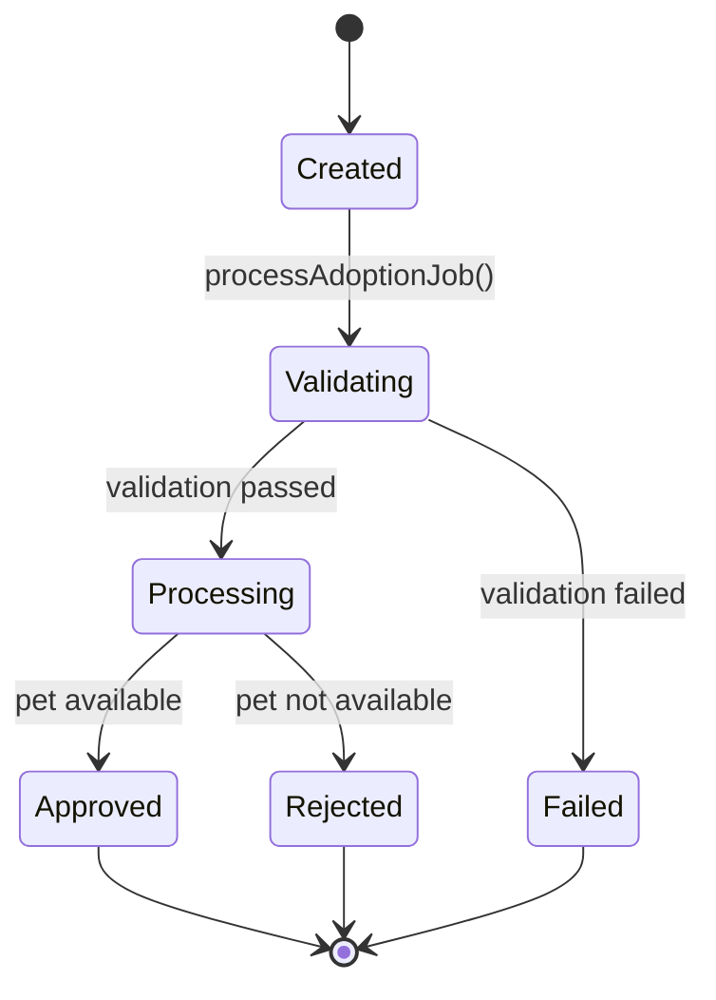
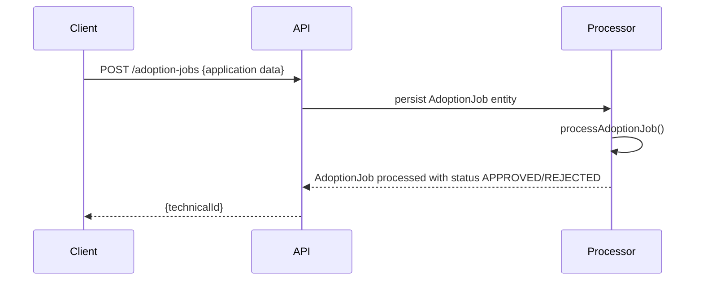
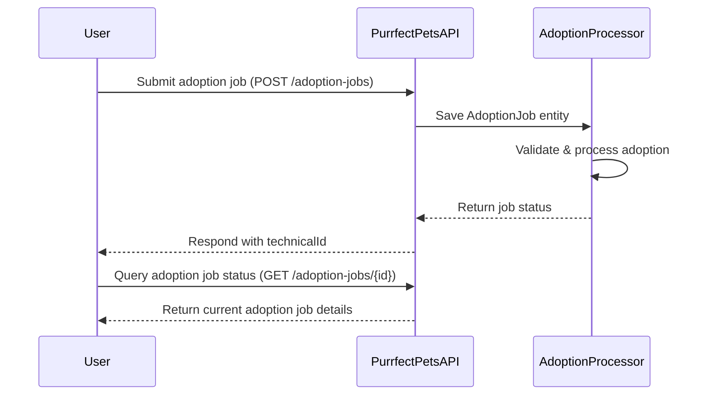

### 1. Entity Definitions

```
AdoptionJob:
- applicantName: String (Name of the pet adoption applicant)
- applicantEmail: String (Email of the applicant)
- petId: Long (The ID of the pet to be adopted)
- applicationDate: String (ISO date string when the application was submitted)
- status: String (Current status of the job: PENDING, APPROVED, REJECTED)
- notes: String (Optional notes about the application)

Pet:
- name: String (Name of the pet)
- category: String (Pet category, e.g., Cat, Dog)
- tags: String (Comma-separated tags describing the pet)
- status: String (Pet availability status: available, pending, sold)
- photoUrls: String (Comma-separated URLs of pet photos)
- description: String (Description or fun facts about the pet)

FunFact:
- petCategory: String (Category of pet the fact relates to)
- factText: String (A fun or interesting fact about pets)
- createdDate: String (ISO date string when the fact was added)
```

---

### 2. Process Method Flows

```
processAdoptionJob() Flow:
1. Initial State: AdoptionJob created with status = PENDING.
2. Validation: Validate applicant's email format and pet availability.
3. Processing: 
   - Check if pet with petId is available.
   - Assign status APPROVED if pet is available; else REJECTED.
   - Update pet status to 'pending' if approved.
4. Completion: Persist final AdoptionJob status.
5. Notification: Send confirmation email to applicant (simulated).

processPet() Flow:
1. Initial State: Pet entity created.
2. Validation: Check required fields (name, category, status).
3. Processing: Store pet data; categorize pet for easy lookup.
4. Completion: Pet is available for adoption or other operations.
5. Optional: Trigger fun fact update or mood simulation events (if configured).

processFunFact() Flow:
1. Initial State: FunFact entity created.
2. Validation: Ensure factText is not empty.
3. Processing: Store fun fact linked to pet category.
4. Completion: Fact ready to be served on request.
```

---

### 3. API Endpoints Design

| Entity       | POST Endpoint                   | GET by technicalId Endpoint                 | GET by condition Endpoint (optional)       |
|--------------|--------------------------------|---------------------------------------------|---------------------------------------------|
| AdoptionJob  | POST /adoption-jobs             | GET /adoption-jobs/{technicalId}            | GET /adoption-jobs?status=APPROVED          |
| Pet          | POST /pets                     | GET /pets/{technicalId}                      | GET /pets?status=available&category=Cat     |
| FunFact      | POST /fun-facts                | GET /fun-facts/{technicalId}                 | GET /fun-facts?petCategory=Dog               |

- POST endpoints return only `{ "technicalId": "<generated_id>" }`
- Immutable creation only; no update/delete endpoints.

---

### 4. Request/Response Formats

**POST /adoption-jobs Request:**

```json
{
  "applicantName": "Jane Doe",
  "applicantEmail": "jane@example.com",
  "petId": 123,
  "applicationDate": "2024-06-01T10:00:00Z",
  "notes": "I have a big backyard!"
}
```

**POST /adoption-jobs Response:**

```json
{
  "technicalId": "job-987654321"
}
```

---

**GET /adoption-jobs/{technicalId} Response:**

```json
{
  "applicantName": "Jane Doe",
  "applicantEmail": "jane@example.com",
  "petId": 123,
  "applicationDate": "2024-06-01T10:00:00Z",
  "status": "APPROVED",
  "notes": "I have a big backyard!"
}
```

---

**POST /pets Request:**

```json
{
  "name": "Whiskers",
  "category": "Cat",
  "tags": "fluffy,playful",
  "status": "available",
  "photoUrls": "http://example.com/photo1.jpg,http://example.com/photo2.jpg",
  "description": "A playful cat who loves yarn."
}
```

**POST /pets Response:**

```json
{
  "technicalId": "pet-123456789"
}
```

---

### Mermaid Diagrams

**AdoptionJob Entity Lifecycle:**


```mermaid
stateDiagram-v2
    [*] --> Created
    Created --> Validating : processAdoptionJob()
    Validating --> Processing : validation passed
    Validating --> Failed : validation failed
    Processing --> Approved : pet available
    Processing --> Rejected : pet not available
    Approved --> [*]
    Rejected --> [*]
    Failed --> [*]
```

---

**Event-Driven Processing Chain:**


```mermaid
sequenceDiagram
    participant Client
    participant API
    participant Processor

    Client->>API: POST /adoption-jobs {application data}
    API->>Processor: persist AdoptionJob entity
    Processor->>Processor: processAdoptionJob()
    Processor-->>API: AdoptionJob processed with status APPROVED/REJECTED
    API-->>Client: {technicalId}
```

---

**User Interaction Sequence for Pet Adoption:**


```mermaid
sequenceDiagram
    participant User
    participant PurrfectPetsAPI
    participant AdoptionProcessor

    User->>PurrfectPetsAPI: Submit adoption job (POST /adoption-jobs)
    PurrfectPetsAPI->>AdoptionProcessor: Save AdoptionJob entity
    AdoptionProcessor->>AdoptionProcessor: Validate & process adoption
    AdoptionProcessor-->>PurrfectPetsAPI: Return job status
    PurrfectPetsAPI-->>User: Respond with technicalId
    User->>PurrfectPetsAPI: Query adoption job status (GET /adoption-jobs/{id})
    PurrfectPetsAPI-->>User: Return current adoption job details
```