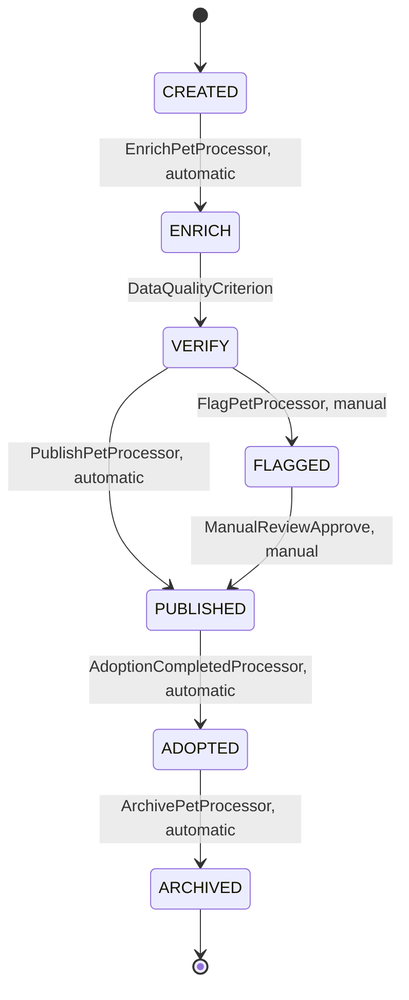
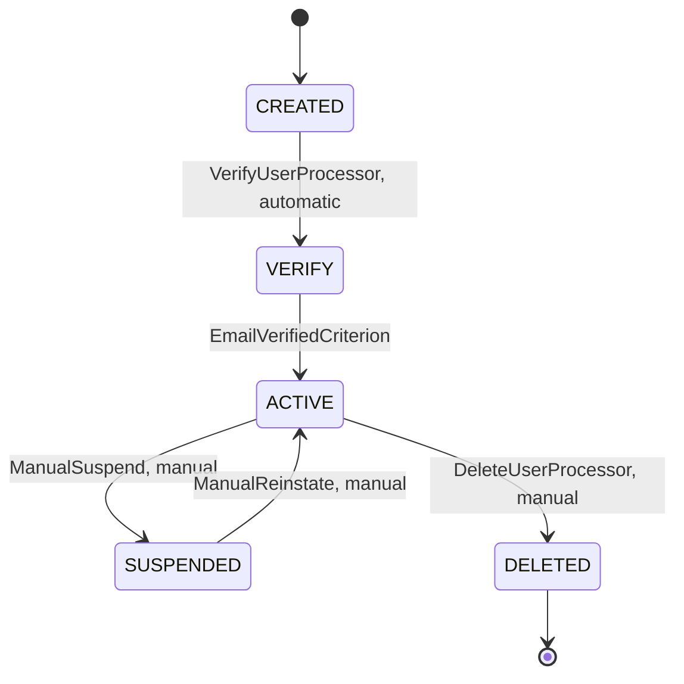
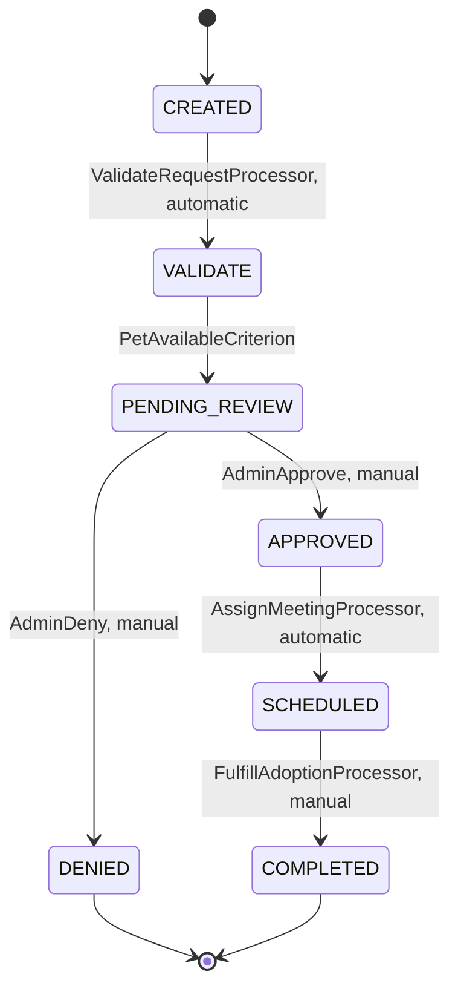

### 1. Entity Definitions
```
Pet:
- petId: String (external Petstore id)
- name: String (pet name)
- species: String (cat/dog/etc)
- breed: String (breed)
- age: Integer (years or months)
- gender: String (M/F/other)
- status: String (available/adopted/fostered)
- photos: Array(String) (image URLs)
- description: String (short bio)
- temperament: String (notes)
- tags: Array(String) (search tags)
- source: String (Petstore API source)
- importedAt: DateTime (when ingested)

User:
- userId: String (external id)
- name: String (full name)
- email: String (contact email)
- role: String (adopter/admin/owner)
- contact: String (phone)
- preferences: Object (species/breed/age prefs)
- favorites: Array(String) (petIds)
- createdAt: DateTime

AdoptionRequest:
- requestId: String
- petId: String
- userId: String
- type: String (adopt/foster/buy)
- status: String (pending/approved/denied/cancelled/completed)
- submittedAt: DateTime
- notes: String
- outcomeAt: DateTime
```

### 2. Entity workflows

Pet workflow:
1. Initial State: CREATED when persisted (event triggers enrichment)
2. Enrichment: automatic metadata augmentation from Petstore
3. Verification: quality and duplicate checks
4. Publishing: mark AVAILABLE or FLAGGED for manual review
5. Lifecycle: when adoption completes -> ADOPTED -> ARCHIVED


```mermaid
stateDiagram-v2
    [*] --> CREATED
    CREATED --> ENRICH : EnrichPetProcessor, automatic
    ENRICH --> VERIFY : DataQualityCriterion
    VERIFY --> PUBLISHED : PublishPetProcessor, automatic
    VERIFY --> FLAGGED : FlagPetProcessor, manual
    FLAGGED --> PUBLISHED : ManualReviewApprove, manual
    PUBLISHED --> ADOPTED : AdoptionCompletedProcessor, automatic
    ADOPTED --> ARCHIVED : ArchivePetProcessor, automatic
    ARCHIVED --> [*]
```

Processors: EnrichPetProcessor, PublishPetProcessor, FlagPetProcessor, ArchivePetProcessor  
Criteria: DataQualityCriterion, DuplicatePetCriterion

User workflow:
1. CREATED on sign-up
2. Verification: email or identity checks
3. Activation: ACTIVE or SUSPENDED
4. Deactivation/Deletion


```mermaid
stateDiagram-v2
    [*] --> CREATED
    CREATED --> VERIFY : VerifyUserProcessor, automatic
    VERIFY --> ACTIVE : EmailVerifiedCriterion
    ACTIVE --> SUSPENDED : ManualSuspend, manual
    SUSPENDED --> ACTIVE : ManualReinstate, manual
    ACTIVE --> DELETED : DeleteUserProcessor, manual
    DELETED --> [*]
```

Processors: VerifyUserProcessor, ProfileEnrichmentProcessor, DeleteUserProcessor  
Criteria: EmailVerifiedCriterion

AdoptionRequest workflow:
1. CREATED when user posts request
2. Validation: check pet availability and user eligibility
3. Review: PENDING_REVIEW (admin manual) or AUTO_APPROVED
4. Fulfillment: SCHEDULE_MEETING -> COMPLETED or DENIED/CANCELLED


```mermaid
stateDiagram-v2
    [*] --> CREATED
    CREATED --> VALIDATE : ValidateRequestProcessor, automatic
    VALIDATE --> PENDING_REVIEW : PetAvailableCriterion
    PENDING_REVIEW --> APPROVED : AdminApprove, manual
    APPROVED --> SCHEDULED : AssignMeetingProcessor, automatic
    SCHEDULED --> COMPLETED : FulfillAdoptionProcessor, manual
    PENDING_REVIEW --> DENIED : AdminDeny, manual
    DENIED --> [*]
    COMPLETED --> [*]
```

Processors: ValidateRequestProcessor, AssignMeetingProcessor, FulfillAdoptionProcessor, NotifyUserProcessor  
Criteria: PetAvailableCriterion, UserEligibleCriterion

---

### 3. Pseudo code for processor classes (concise)

EnrichPetProcessor
```pseudo
class EnrichPetProcessor {
  process(pet) {
    pet.tags = extractTags(pet.description)
    pet.photos = normalizePhotos(pet.photos)
    pet.importedAt = now()
    save(pet)
  }
}
```

ValidateRequestProcessor
```pseudo
class ValidateRequestProcessor {
  process(request) {
    pet = findPet(request.petId)
    if not pet or pet.status != available then mark request status denied and save
    if user fails eligibility then mark request denied and save
    else set request status pending_review and save
  }
}
```

AssignMeetingProcessor
```pseudo
class AssignMeetingProcessor {
  process(request) {
    slot = findNextAvailableSlot(request.userId)
    notifyAdmin(request, slot)
    update request with scheduled slot and status scheduled
    save(request)
  }
}
```

### 4. API Endpoints Design Rules

- POST endpoints create entities and trigger Cyoda workflows. POST responses return only technicalId.
- GET by technicalId to retrieve persisted result for each POST-created entity.
- No GET by condition unless requested.

Endpoints and JSON formats:

Create Pet
POST /pets
Request:
```json
{
  "petId":"123",
  "name":"Mittens",
  "species":"cat",
  "breed":"Siamese",
  "age":2,
  "gender":"F",
  "photos":["http://..."],
  "description":"Playful lap cat",
  "source":"PetstoreAPI"
}
```
Response:
```json
{"technicalId":"tch_pet_abcdef"}
```
GET /pets/{technicalId} Response:
```json
{
  "technicalId":"tch_pet_abcdef",
  "pet":{ ...Pet fields as stored... }
}
```

Create User
POST /users
Request:
```json
{
  "userId":"u_42",
  "name":"Alex Doe",
  "email":"alex@example.com",
  "role":"adopter"
}
```
Response:
```json
{"technicalId":"tch_user_xyz"}
```
GET /users/{technicalId} returns stored User object.

Create AdoptionRequest
POST /adoption-requests
Request:
```json
{
  "requestId":"r_100",
  "petId":"123",
  "userId":"u_42",
  "type":"adopt",
  "notes":"Has fenced yard"
}
```
Response:
```json
{"technicalId":"tch_request_789"}
```
GET /adoption-requests/{technicalId} returns stored AdoptionRequest object.

If you want, I can expand criteria/processors pseudocode, add GET-by-condition endpoints, or increase entity count up to 10.