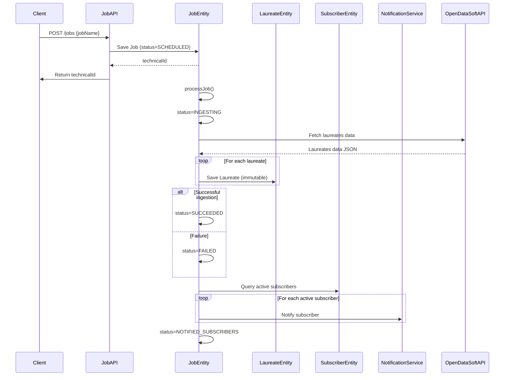
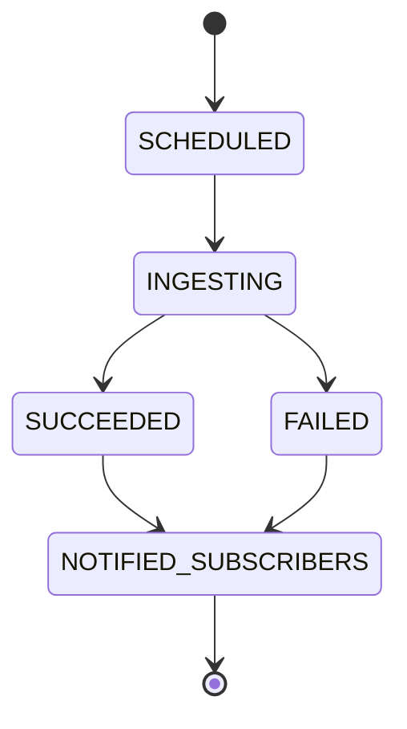

# Functional Requirements

---

## 1. Entity Definitions

```
Job:
- jobName: String (name/identifier of the job)
- status: String (current state of the job lifecycle; e.g., SCHEDULED, INGESTING, SUCCEEDED, FAILED, NOTIFIED_SUBSCRIBERS)
- createdAt: LocalDateTime (timestamp when job was created)
- triggeredBy: String (optional, info about who or what triggered the job)

Laureate:
- laureateId: String (unique identifier from source data)
- firstname: String (laureates first name)
- surname: String (laureates surname)
- born: String (date of birth in ISO format)
- died: String (date of death in ISO format or null)
- borncountry: String (country of birth)
- borncountrycode: String (ISO country code)
- borncity: String (city of birth)
- gender: String (gender of laureate)
- year: String (year laureate received Nobel Prize)
- category: String (Nobel Prize category)
- motivation: String (reason for award)
- affiliationName: String (affiliated institution name)
- affiliationCity: String (affiliated institution city)
- affiliationCountry: String (affiliated institution country)

Subscriber:
- subscriberId: String (unique identifier for subscriber)
- contactType: String (e.g., "email", "webhook")
- contactAddress: String (email address or webhook URL)
- active: Boolean (whether subscriber should receive notifications)
```

---

## 2. Process Method Flows

```
processJob() Flow:
1. Initial: Job entity is created with status SCHEDULED.
2. Validation: Check required job parameters (jobName, status).
3. Processing: 
   - Change status to INGESTING.
   - Fetch Nobel laureate data from OpenDataSoft API.
   - For each laureate record retrieved, save a new Laureate entity (immutable creation).
4. Completion:
   - If all data ingested successfully, set status to SUCCEEDED.
   - Else, set status to FAILED.
5. Notification:
   - Trigger notification logic to all active Subscribers.
   - Update job status to NOTIFIED_SUBSCRIBERS.
```

```
processLaureate() Flow:
1. Initial: Laureate entity is created (immutable).
2. Validation: Check mandatory fields (laureateId, firstname, surname, year, category).
3. Enrichment:
   - Normalize country codes.
   - Calculate any derived fields if necessary (e.g., age at award).
4. Persistence: Save laureate data as immutable record.
```

```
processSubscriber() Flow:
1. Initial: Subscriber entity created.
2. Validation: Verify contactType and contactAddress formats.
3. Persistence: Save subscriber as active/inactive.
4. No further processing unless triggered by Job completion event.
```

---

## 3. API Endpoints

| Entity    | POST Endpoint         | Response                  | GET by technicalId Endpoint | Response                        |
|-----------|----------------------|---------------------------|-----------------------------|--------------------------------|
| Job       | POST `/jobs`          | `{ "technicalId": "..." }`| GET `/jobs/{technicalId}`    | Full Job entity JSON           |
| Laureate  | *No POST endpoint* (created implicitly via Job processing) | N/A                       | GET `/laureates/{technicalId}` | Full Laureate entity JSON      |
| Subscriber| POST `/subscribers`   | `{ "technicalId": "..." }`| GET `/subscribers/{technicalId}` | Full Subscriber entity JSON |

- No update/delete endpoints will be provided for any entity as per EDA immutability principle.
- GET by non-technicalId fields only if explicitly requested (not included here).

---

## 4. Request/Response JSON Formats

**POST /jobs Request**  
```json
{
  "jobName": "Ingest Nobel Laureates 2024"
}
```

**POST /jobs Response**  
```json
{
  "technicalId": "job-123456"
}
```

**GET /jobs/{technicalId} Response**  
```json
{
  "jobName": "Ingest Nobel Laureates 2024",
  "status": "NOTIFIED_SUBSCRIBERS",
  "createdAt": "2024-06-01T10:00:00",
  "triggeredBy": "system"
}
```

---

**POST /subscribers Request**  
```json
{
  "contactType": "email",
  "contactAddress": "user@example.com",
  "active": true
}
```

**POST /subscribers Response**  
```json
{
  "technicalId": "subscriber-987654"
}
```

**GET /subscribers/{technicalId} Response**  
```json
{
  "contactType": "email",
  "contactAddress": "user@example.com",
  "active": true
}
```

---

## Mermaid Diagrams


```mermaid
sequenceDiagram
    participant Client
    participant JobAPI
    participant JobEntity
    participant LaureateEntity
    participant SubscriberEntity
    participant NotificationService

    Client->>JobAPI: POST /jobs {jobName}
    JobAPI->>JobEntity: Save Job (status=SCHEDULED)
    JobEntity-->>JobAPI: technicalId
    JobAPI->>Client: Return technicalId

    JobEntity->>JobEntity: processJob()
    JobEntity->>JobEntity: status=INGESTING
    JobEntity->>OpenDataSoftAPI: Fetch laureates data
    OpenDataSoftAPI-->>JobEntity: Laureates data JSON
    loop For each laureate
        JobEntity->>LaureateEntity: Save Laureate (immutable)
    end
    alt Successful ingestion
        JobEntity->>JobEntity: status=SUCCEEDED
    else Failure
        JobEntity->>JobEntity: status=FAILED
    end
    JobEntity->>SubscriberEntity: Query active subscribers
    loop For each active subscriber
        JobEntity->>NotificationService: Notify subscriber
    end
    JobEntity->>JobEntity: status=NOTIFIED_SUBSCRIBERS
```


```mermaid
stateDiagram-v2
    [*] --> SCHEDULED
    SCHEDULED --> INGESTING
    INGESTING --> SUCCEEDED
    INGESTING --> FAILED
    SUCCEEDED --> NOTIFIED_SUBSCRIBERS
    FAILED --> NOTIFIED_SUBSCRIBERS
    NOTIFIED_SUBSCRIBERS --> [*]
```
