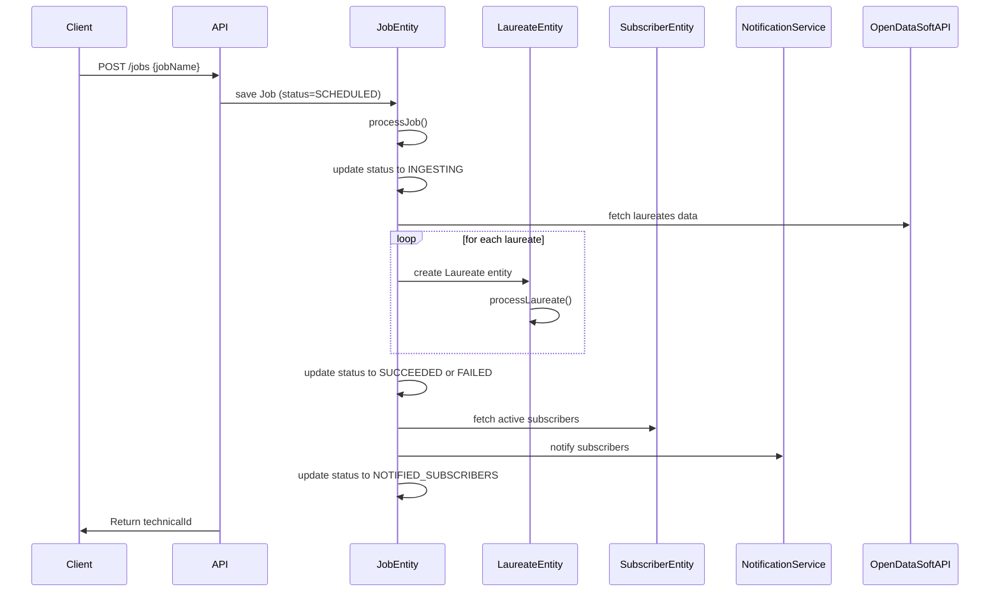
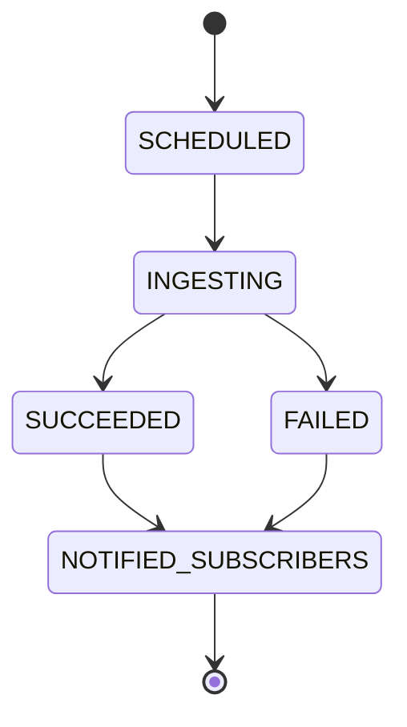

### 1. Entity Definitions

```
Job:
- jobName: String (name of the ingestion job)
- status: String (job lifecycle state: SCHEDULED, INGESTING, SUCCEEDED, FAILED, NOTIFIED_SUBSCRIBERS)
- createdAt: DateTime (timestamp when the job was created)
- resultSummary: String (summary of ingestion results or errors)

Laureate:
- laureateId: Integer (unique ID from data source)
- firstname: String (laureate first name)
- surname: String (laureate surname)
- gender: String (gender of laureate)
- born: Date (birthdate)
- died: Date (death date if applicable, nullable)
- borncountry: String (country of birth)
- borncountrycode: String (ISO country code)
- borncity: String (city of birth)
- year: String (year of Nobel Prize award)
- category: String (award category)
- motivation: String (award motivation text)
- affiliationName: String (name of affiliated institution)
- affiliationCity: String (affiliation city)
- affiliationCountry: String (affiliation country)

Subscriber:
- contactType: String (type of contact, e.g., "email" or "webhook")
- contactValue: String (email address or webhook URL)
- isActive: Boolean (whether subscriber is active)
```

---

### 2. Process Method Flows

```
processJob() Flow:
1. Job entity is created with status = "SCHEDULED"
2. Validate job parameters if any (via checkJob criteria if invoked)
3. Update status to "INGESTING"
4. Fetch Nobel laureates data from OpenDataSoft API
5. For each laureate record, create a new Laureate entity (immutable creation)
6. Upon successful ingestion of all laureates, update Job status to "SUCCEEDED"
   If errors occur, update status to "FAILED"
7. Trigger notification to all active Subscribers
8. Update Job status to "NOTIFIED_SUBSCRIBERS"
```

```
processLaureate() Flow:
1. Validate laureate data fields (via checkLaureate criteria if invoked)
2. Enrich laureate data (e.g., normalize country codes, calculate age if needed)
3. Persist laureate entity as immutable record
4. No further processing unless explicitly triggered
```

```
processSubscriber() Flow:
1. Validate subscriber contact info (via checkSubscriber criteria if invoked)
2. Persist subscriber entity
3. No further automated processing upon subscriber save
4. Subscribers are used during Job notification stage only
```

---

### 3. API Endpoints

#### Job

- **POST /jobs**  
  Request:  
  ```json
  {
    "jobName": "Ingest Nobel Laureates 2024"
  }
  ```  
  Response:  
  ```json
  {
    "technicalId": "string-generated-id"
  }
  ```

- **GET /jobs/{technicalId}**  
  Response:  
  ```json
  {
    "jobName": "Ingest Nobel Laureates 2024",
    "status": "NOTIFIED_SUBSCRIBERS",
    "createdAt": "2024-06-01T12:00:00Z",
    "resultSummary": "Ingested 500 laureates, 0 errors"
  }
  ```

#### Laureate

- **POST /laureates** *(optional: can be triggered internally, not exposed if not needed)*  
  Request:  
  ```json
  {
    "laureateId": 853,
    "firstname": "Akira",
    "surname": "Suzuki",
    "gender": "male",
    "born": "1930-09-12",
    "died": null,
    "borncountry": "Japan",
    "borncountrycode": "JP",
    "borncity": "Mukawa",
    "year": "2010",
    "category": "Chemistry",
    "motivation": "\"for palladium-catalyzed cross couplings in organic synthesis\"",
    "affiliationName": "Hokkaido University",
    "affiliationCity": "Sapporo",
    "affiliationCountry": "Japan"
  }
  ```  
  Response:  
  ```json
  {
    "technicalId": "string-generated-id"
  }
  ```

- **GET /laureates/{technicalId}**  
  Response contains full laureate data as above.

#### Subscriber

- **POST /subscribers**  
  Request:  
  ```json
  {
    "contactType": "email",
    "contactValue": "user@example.com",
    "isActive": true
  }
  ```  
  Response:  
  ```json
  {
    "technicalId": "string-generated-id"
  }
  ```

- **GET /subscribers/{technicalId}**  
  Response:  
  ```json
  {
    "contactType": "email",
    "contactValue": "user@example.com",
    "isActive": true
  }
  ```

---

### 4. Mermaid Diagrams


```mermaid
sequenceDiagram
    participant Client
    participant API
    participant JobEntity
    participant LaureateEntity
    participant SubscriberEntity
    participant NotificationService

    Client->>API: POST /jobs {jobName}
    API->>JobEntity: save Job (status=SCHEDULED)
    JobEntity->>JobEntity: processJob()
    JobEntity->>JobEntity: update status to INGESTING
    JobEntity->>OpenDataSoftAPI: fetch laureates data
    loop for each laureate
        JobEntity->>LaureateEntity: create Laureate entity
        LaureateEntity->>LaureateEntity: processLaureate()
    end
    JobEntity->>JobEntity: update status to SUCCEEDED or FAILED
    JobEntity->>SubscriberEntity: fetch active subscribers
    JobEntity->>NotificationService: notify subscribers
    JobEntity->>JobEntity: update status to NOTIFIED_SUBSCRIBERS
    API->>Client: Return technicalId
```


```mermaid
stateDiagram-v2
    [*] --> SCHEDULED
    SCHEDULED --> INGESTING
    INGESTING --> SUCCEEDED
    INGESTING --> FAILED
    SUCCEEDED --> NOTIFIED_SUBSCRIBERS
    FAILED --> NOTIFIED_SUBSCRIBERS
    NOTIFIED_SUBSCRIBERS --> [*]
```