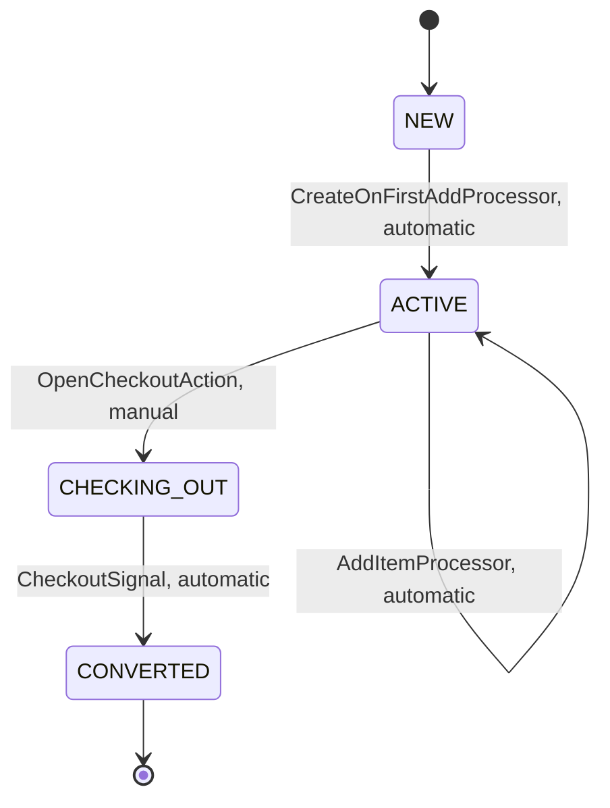
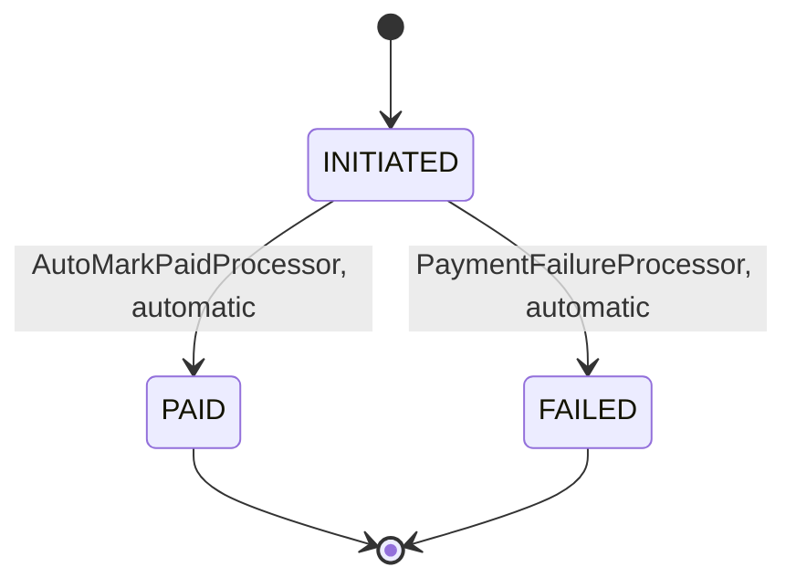
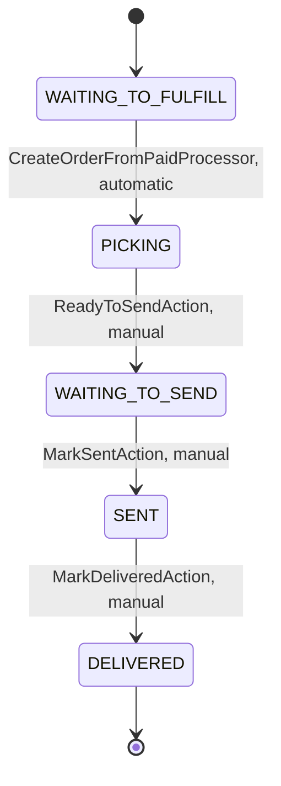
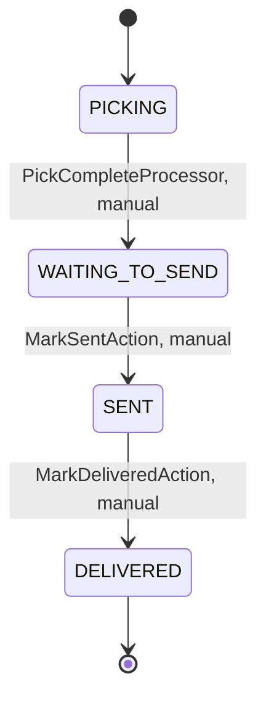

### 1. Entity Definitions
```
Product:
- sku: string (unique product code)
- name: string (title)
- description: string (long description)
- price: number (base price)
- quantityAvailable: number (fast availability projection)
- category: string (catalog category)
- warehouseId: string|null (primary node)
- attributes: object (brand/model/dimensions/weight/hazards/custom)
- localizations: object (locale content)
- media: array (images/docs)
- options: object (axes/constraints)
- variants: array (variant definitions)
- bundles: array (kits/bundles)
- inventory: object (nodes/policies)
- compliance: object (docs/restrictions)
- relationships: object (suppliers/relatedProducts)
- events: array (audit events)

Cart:
- cartId: string (business cart id)
- status: string (NEW/ACTIVE/CHECKING_OUT/CONVERTED)
- lines: array ( { sku, name, price, qty } )
- totalItems: number
- grandTotal: number
- guestContact: object (name,email,phone,address)
- createdAt: string
- updatedAt: string

Payment:
- paymentId: string
- cartId: string
- amount: number
- status: string (INITIATED/PAID/FAILED/CANCELED)
- provider: string (DUMMY)
- createdAt: string
- updatedAt: string

Order:
- orderId: string
- orderNumber: string (short ULID)
- status: string (WAITING_TO_FULFILL/PICKING/WAITING_TO_SEND/SENT/DELIVERED)
- lines: array ( { sku, name, unitPrice, qty, lineTotal } )
- totals: object (items, grand)
- guestContact: object (name,email,phone,address)
- createdAt: string
- updatedAt: string

Shipment:
- shipmentId: string
- orderId: string
- status: string (PICKING/WAITING_TO_SEND/SENT/DELIVERED)
- lines: array ( { sku, qtyOrdered, qtyPicked, qtyShipped } )
- createdAt: string
- updatedAt: string
```

### 2. Entity workflows

Cart workflow:
1. CREATE_ON_FIRST_ADD: persist Cart with NEW then add first line → recalc totals → ACTIVE (automatic)
2. ADD/DECR/REMOVE_LINE: stay ACTIVE, RecalculateTotals (automatic)
3. OPEN_CHECKOUT: ACTIVE → CHECKING_OUT (manual via UI)
4. CHECKOUT signal: CHECKING_OUT → CONVERTED (automatic/orchestration)

```mermaid
stateDiagram-v2
    [*] --> NEW
    NEW --> ACTIVE : CreateOnFirstAddProcessor, automatic
    ACTIVE --> ACTIVE : AddItemProcessor, automatic
    ACTIVE --> CHECKING_OUT : OpenCheckoutAction, manual
    CHECKING_OUT --> CONVERTED : CheckoutSignal, automatic
    CONVERTED --> [*]
```
Processors/criteria: RecalculateTotalsProcessor, CreateOnFirstAddProcessor, CheckoutSignalCriterion

Payment workflow:
1. START_DUMMY_PAYMENT: persist Payment INITIATED (automatic)
2. AUTO_MARK_PAID: after ~3s AutoMarkPaidProcessor flips to PAID (automatic)

```mermaid
stateDiagram-v2
    [*] --> INITIATED
    INITIATED --> PAID : AutoMarkPaidProcessor, automatic
    INITIATED --> FAILED : PaymentFailureProcessor, automatic
    PAID --> [*]
    FAILED --> [*]
```
Processors/criteria: CreateDummyPaymentProcessor, AutoMarkPaidProcessor, PaymentCompletedCriterion

Order workflow:
1. CREATE_ORDER_FROM_PAID: on Payment PAID → snapshot Cart → create Order WAITING_TO_FULFILL (automatic)
2. CREATE_SHIPMENT: create Shipment in PICKING and decrement Product.quantityAvailable (automatic)
3. READY_TO_SEND/MARK_SENT/MARK_DELIVERED: advance Shipment → update Order status (manual transitions simulated by Ops)

```mermaid
stateDiagram-v2
    [*] --> WAITING_TO_FULFILL
    WAITING_TO_FULFILL --> PICKING : CreateOrderFromPaidProcessor, automatic
    PICKING --> WAITING_TO_SEND : ReadyToSendAction, manual
    WAITING_TO_SEND --> SENT : MarkSentAction, manual
    SENT --> DELIVERED : MarkDeliveredAction, manual
    DELIVERED --> [*]
```
Processors/criteria: CreateOrderFromPaidProcessor, DecrementStockProcessor, CreateShipmentProcessor, PaymentPaidCriterion

Shipment workflow:
1. CREATE: created in PICKING (automatic)
2. PICK_COMPLETE -> WAITING_TO_SEND (manual)
3. MARK_SENT -> SENT (manual)
4. MARK_DELIVERED -> DELIVERED (manual)

```mermaid
stateDiagram-v2
    [*] --> PICKING
    PICKING --> WAITING_TO_SEND : PickCompleteProcessor, manual
    WAITING_TO_SEND --> SENT : MarkSentAction, manual
    SENT --> DELIVERED : MarkDeliveredAction, manual
    DELIVERED --> [*]
```
Processors/criteria: PickCompleteProcessor, ShipmentReadyCriterion

### 3. Pseudo code for processor classes
RecalculateTotalsProcessor:
```
process(cart):
  totals = sum(line.qty * line.price for line in cart.lines)
  cart.totalItems = sum(line.qty)
  cart.grandTotal = totals
  persist cart
```
AutoMarkPaidProcessor:
```
process(payment):
  wait 3 seconds
  if payment still INITIATED:
    payment.status = PAID
    persist payment
```
CreateOrderFromPaidProcessor:
```
process(payment):
  if PaymentPaidCriterion(payment):
    cart = loadCart(payment.cartId)
    order = snapshot cart lines + guestContact
    order.orderNumber = shortULID()
    order.status = WAITING_TO_FULFILL
    persist order
    for each line in order.lines:
      product = loadProduct(line.sku)
      product.quantityAvailable -= line.qty
      persist product
    create Shipment in PICKING for order
```

### 4. API Endpoints Design Rules (UI-facing /ui/**)
- POST endpoints return only technicalId.
- GET endpoints return stored entity by technicalId.

Endpoints (request / response):

POST /ui/cart
```json
{ "action":"createOrReturn" }
```
response:
```json
{ "technicalId": "t-cart-123" }
```

POST /ui/cart/{technicalId}/lines
```json
{ "sku":"SKU-1", "qty":2 }
```
response:
```json
{ "technicalId": "t-cart-123" }
```

PATCH /ui/cart/{technicalId}/lines
```json
{ "sku":"SKU-1", "qty":1 }
```
response:
```json
{ "technicalId": "t-cart-123" }
```

POST /ui/cart/{technicalId}/open-checkout
```json
{}
```
response:
```json
{ "technicalId": "t-cart-123" }
```

POST /ui/checkout/{technicalId}
```json
{ "guestContact": { "name":"Jane", "email":"j@x.com", "address": { "line1":"1 St", "city":"City", "postcode":"PC1", "country":"GB" } } }
```
response:
```json
{ "technicalId": "t-cart-123" }
```

POST /ui/payment/start
```json
{ "cartId":"t-cart-123" }
```
response:
```json
{ "technicalId": "t-payment-456" }
```

GET /ui/payment/{technicalId}
response: Payment entity JSON

POST /ui/order/create
```json
{ "paymentId":"t-payment-456", "cartId":"t-cart-123" }
```
response:
```json
{ "technicalId": "t-order-789" }
```

GET /ui/order/{technicalId}
response: Order entity JSON

GET /ui/products?search=&category=&minPrice=&maxPrice=&page=&pageSize=
response: list of slim DTOs mapped from full Product docs

GET /ui/products/{sku}
response: full Product document (as persisted)

Notes:
- All POSTs persist entities (events) which trigger Cyoda workflows/processors described above.
- POST responses must include only technicalId per rules.