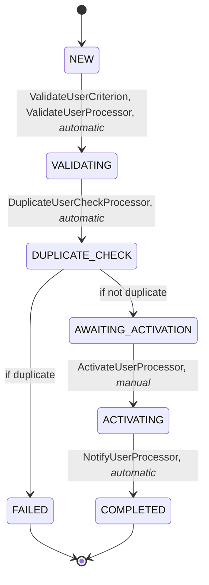
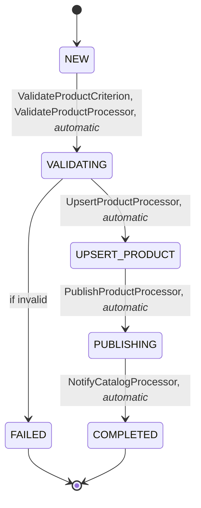
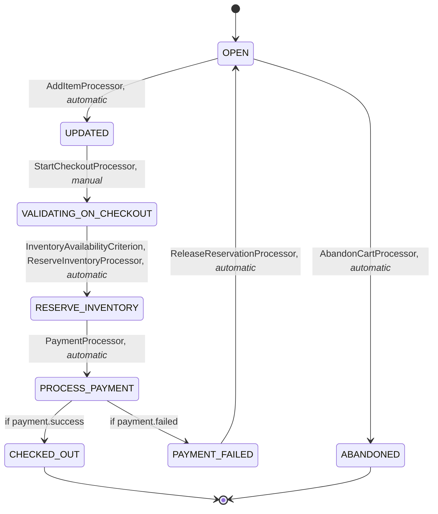
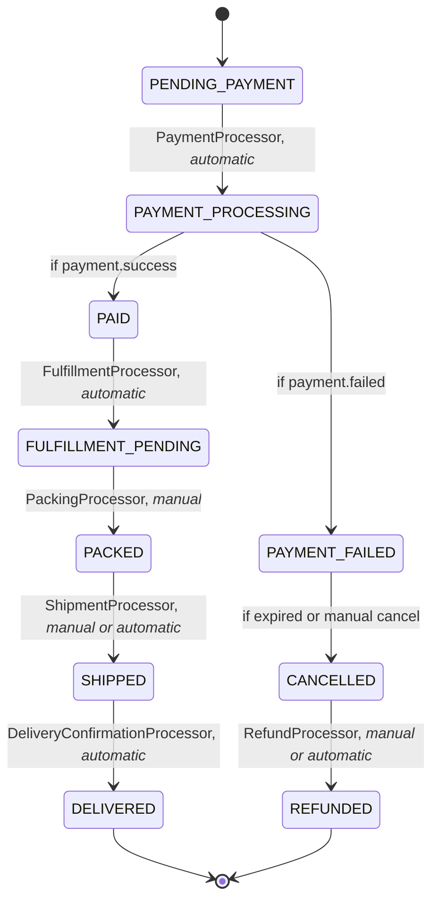
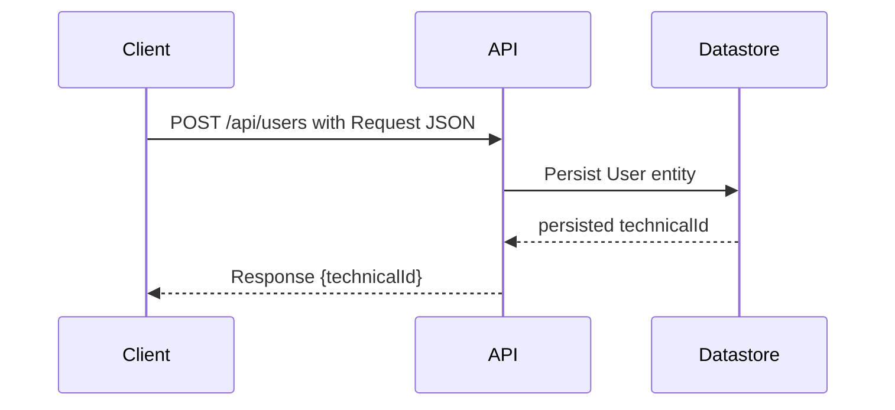
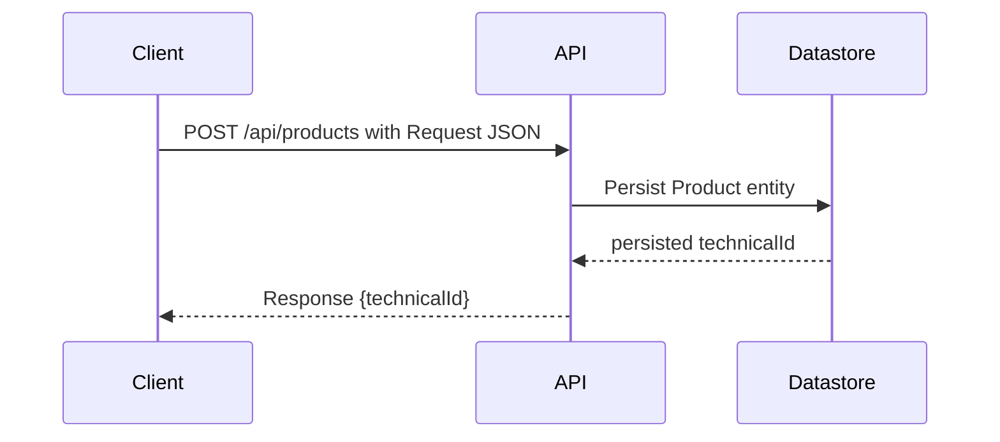
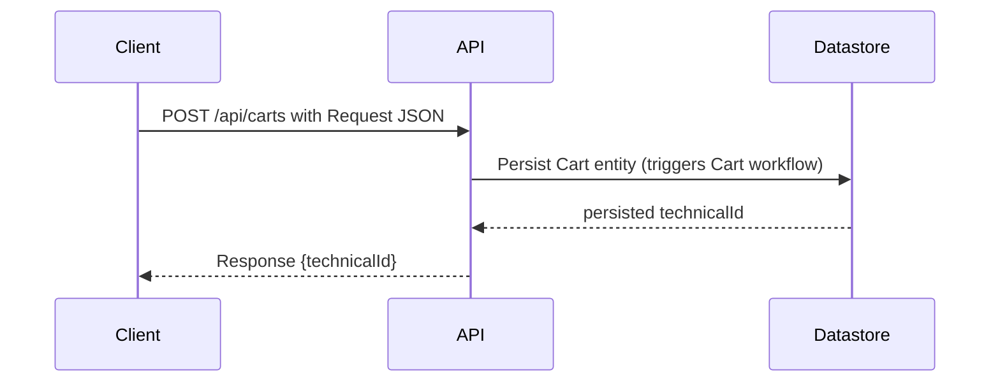
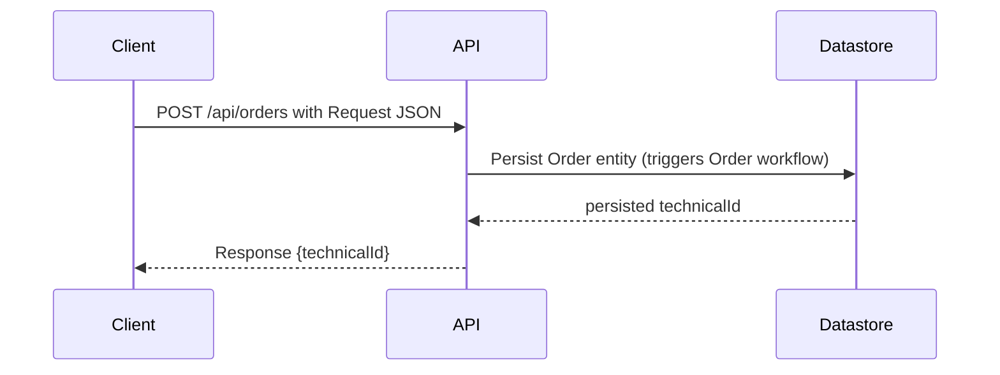

# Entity Definitions
```
User:
- id: String (UUID, primary business identifier)
- role: String (Admin or Customer)
- email: String (unique contact and login)
- name: String (display name)
- passwordHash: String (hashed password)
- createdAt: String (ISO8601 timestamp)
- active: Boolean (account enabled/disabled)

Product:
- id: String (UUID, primary business identifier)
- sku: String (stock keeping unit)
- name: String (product title)
- description: String (detailed description)
- price: Number (BigDecimal, unit price)
- currency: String (ISO currency code)
- availableQuantity: Integer (stock available)
- active: Boolean (catalog active flag)
- createdAt: String (ISO8601 timestamp)

Cart:
- id: String (UUID, primary business identifier)
- customerId: String (UUID referencing User)
- items: Array of Objects (CartItem)
  - productId: String (UUID referencing Product)
  - quantity: Integer (requested quantity)
  - unitPrice: Number (snapshot of price at add time)
- totalAmount: Number (computed total of items)
- currency: String (ISO currency code)
- status: String (OPEN, CHECKOUT_IN_PROGRESS, CHECKED_OUT, ABANDONED)
- createdAt: String (ISO8601 timestamp)
- updatedAt: String (ISO8601 timestamp)

Order:
- id: String (UUID, primary business identifier)
- customerId: String (UUID referencing User)
- items: Array of Objects (OrderItem)
  - productId: String (UUID referencing Product)
  - quantity: Integer
  - unitPrice: Number
- totalAmount: Number
- currency: String (ISO currency code)
- status: String (PENDING_PAYMENT, PAID, PACKED, SHIPPED, DELIVERED, CANCELLED, REFUNDED)
- paymentStatus: String (NOT_ATTEMPTED, AUTHORIZED, CAPTURED, FAILED)
- shippingAddress: String (free text shipping address)
- billingAddress: String (free text billing address)
- createdAt: String (ISO8601 timestamp)
- updatedAt: String (ISO8601 timestamp)
```

# Entity Workflows

## User workflow
1. Initial State: User persisted as NEW (event triggers workflow)
2. Validation: Validate fields (email format, required fields)
3. Duplicate Check: Check if email or external id already exists
4. Activation: If Admin-created and approved => set active true; if Customer registration => require email verification step (manual or automated)
5. Completion: Mark workflow COMPLETED and send welcome/notification or return error (FAILED)
6. Notification: Send account creation/verification email


```mermaid
stateDiagram-v2
    [*] --> NEW
    NEW --> VALIDATING : ValidateUserCriterion, ValidateUserProcessor, *automatic*
    VALIDATING --> DUPLICATE_CHECK : DuplicateUserCheckProcessor, *automatic*
    DUPLICATE_CHECK --> AWAITING_ACTIVATION : if not duplicate
    DUPLICATE_CHECK --> FAILED : if duplicate
    AWAITING_ACTIVATION --> ACTIVATING : ActivateUserProcessor, *manual*
    ACTIVATING --> COMPLETED : NotifyUserProcessor, *automatic*
    FAILED --> [*]
    COMPLETED --> [*]
```

Criterion and Processor classes (User):
- ValidateUserCriterion (checks required fields)
- ValidateUserProcessor (pseudocode)
  - pseudo:
    - if missing required fields then set entity.error and mark validation failed
    - else mark valid
- DuplicateUserCheckProcessor (pseudocode)
  - pseudo:
    - query Users by email
    - if exists mark entity.duplicate true and fail
- ActivateUserProcessor (pseudocode)
  - pseudo:
    - if role == Admin then set active true
    - if Customer then send verification email and set active false until verified
- NotifyUserProcessor (pseudocode)
  - pseudo:
    - call EmailService.sendWelcome(entity.email)

## Product workflow
1. Initial State: Product persisted as NEW (import or manual add triggers workflow)
2. Validation: Validate SKU, price, currency, required fields
3. Upsert: Insert new product or update existing product (merge on sku or id)
4. Publish: Mark active flag based on admin input or import rules
5. Completion: Notify catalog update listeners (search index, cache invalidation)


```mermaid
stateDiagram-v2
    [*] --> NEW
    NEW --> VALIDATING : ValidateProductCriterion, ValidateProductProcessor, *automatic*
    VALIDATING --> UPSERT_PRODUCT : UpsertProductProcessor, *automatic*
    UPSERT_PRODUCT --> PUBLISHING : PublishProductProcessor, *automatic*
    PUBLISHING --> COMPLETED : NotifyCatalogProcessor, *automatic*
    VALIDATING --> FAILED : if invalid
    FAILED --> [*]
    COMPLETED --> [*]
```

Criterion and Processor classes (Product):
- ValidateProductCriterion
- ValidateProductProcessor (pseudocode)
  - pseudo:
    - check sku non-empty, price > 0, currency present
    - collect validation errors if any
- UpsertProductProcessor (pseudocode)
  - pseudo:
    - if product.sku exists then update record else insert new
    - apply business rules for availableQuantity if provided
- PublishProductProcessor (pseudocode)
  - pseudo:
    - set active flag based on payload or default
- NotifyCatalogProcessor (pseudocode)
  - pseudo:
    - call SearchIndexService.index(product)
    - call CacheService.invalidate(product.id)

## Cart workflow
1. Initial State: Cart created with status OPEN (persist triggers workflow)
2. Item Management: Items added/updated/removed (each update triggers recalculation)
3. Validation: On checkout initiation, validate item availability (automatic)
4. Checkout Initiated: Transition to CHECKOUT_IN_PROGRESS (manual user action)
5. Checkout Processing: Reserve inventory and attempt payment (automatic)
6. Completion:
   - On payment success: set status CHECKED_OUT and create Order entity (automatic)
   - On payment failure: set status OPEN or FAILED and release reservations
7. Abandonment: Cart may transition to ABANDONED after TTL expiration (automatic)


```mermaid
stateDiagram-v2
    [*] --> OPEN
    OPEN --> UPDATED : AddItemProcessor, *automatic*
    UPDATED --> VALIDATING_ON_CHECKOUT : StartCheckoutProcessor, *manual*
    VALIDATING_ON_CHECKOUT --> RESERVE_INVENTORY : InventoryAvailabilityCriterion, ReserveInventoryProcessor, *automatic*
    RESERVE_INVENTORY --> PROCESS_PAYMENT : PaymentProcessor, *automatic*
    PROCESS_PAYMENT --> CHECKED_OUT : if payment.success
    PROCESS_PAYMENT --> PAYMENT_FAILED : if payment.failed
    PAYMENT_FAILED --> OPEN : ReleaseReservationProcessor, *automatic*
    CHECKED_OUT --> [*]
    OPEN --> ABANDONED : AbandonCartProcessor, *automatic*
    ABANDONED --> [*]
```

Criterion and Processor classes (Cart):
- InventoryAvailabilityCriterion (checks availability for all items)
- AddItemProcessor (pseudocode)
  - pseudo:
    - validate productId exists
    - snapshot unitPrice from Product
    - add or update item quantity
    - recalc totalAmount
- StartCheckoutProcessor (pseudocode)
  - pseudo:
    - validate cart not empty
    - set status CHECKOUT_IN_PROGRESS and updatedAt
- ReserveInventoryProcessor (pseudocode)
  - pseudo:
    - for each item check Product.availableQuantity >= quantity
    - decrement Product.availableQuantity temporarily (or mark reserved)
    - persist reservations
    - if any insufficient, raise error
- PaymentProcessor (pseudocode)
  - pseudo:
    - call PaymentGateway.authorizeAndCapture(paymentDetails, amount)
    - if success return success, else return failure
- ReleaseReservationProcessor (pseudocode)
  - pseudo:
    - revert reserved quantities back to Product.availableQuantity
- AbandonCartProcessor (pseudocode)
  - pseudo:
    - mark status ABANDONED after inactivity TTL

## Order workflow
1. Initial State: Order created as PENDING_PAYMENT (created by Cart workflow when checkout succeeds or by explicit POST)
2. Payment Authorization: Attempt to authorize/capture payment (automatic)
3. Payment Result:
   - AUTHORIZED/CAPTURED -> move to PAID
   - FAILED -> PENDING_PAYMENT or CANCELLED
4. Fulfillment: On PAID, send to fulfillment: PACKED -> SHIPPED -> DELIVERED (mix of automatic and manual)
5. Cancellation/Refunds: Admin/manual operations can transition to CANCELLED or REFUNDED; a refund workflow triggers payment reversal


```mermaid
stateDiagram-v2
    [*] --> PENDING_PAYMENT
    PENDING_PAYMENT --> PAYMENT_PROCESSING : PaymentProcessor, *automatic*
    PAYMENT_PROCESSING --> PAID : if payment.success
    PAYMENT_PROCESSING --> PAYMENT_FAILED : if payment.failed
    PAYMENT_FAILED --> CANCELLED : if expired or manual cancel
    PAID --> FULFILLMENT_PENDING : FulfillmentProcessor, *automatic*
    FULFILLMENT_PENDING --> PACKED : PackingProcessor, *manual*
    PACKED --> SHIPPED : ShipmentProcessor, *manual or automatic*
    SHIPPED --> DELIVERED : DeliveryConfirmationProcessor, *automatic*
    DELIVERED --> [*]
    CANCELLED --> REFUNDED : RefundProcessor, *manual or automatic*
    REFUNDED --> [*]
```

Criterion and Processor classes (Order):
- PaymentProcessor (pseudocode)
  - pseudo:
    - call PaymentGateway.charge(order.totalAmount, paymentMethod)
    - update paymentStatus and order.status based on response
- FulfillmentProcessor (pseudocode)
  - pseudo:
    - call WarehouseService.createFulfillment(order)
    - update order.status to FULFILLMENT_PENDING
- PackingProcessor (pseudocode)
  - pseudo:
    - manual/warehouse confirms packed items -> set order.status PACKED
- ShipmentProcessor (pseudocode)
  - pseudo:
    - call CarrierService.createShipment(order)
    - set tracking number and status SHIPPED
- RefundProcessor (pseudocode)
  - pseudo:
    - call PaymentGateway.refund(chargeId)
    - update paymentStatus REFUNDED and order.status REFUNDED

# API Endpoints Design (rules applied)
- POST endpoints create entities (trigger events). Each POST returns only {"technicalId": "string"} and nothing else.
- GET endpoints for retrieving stored results only.
- GET by technicalId present for all entities created via POST.
- No GET by non-technical fields included (not explicitly requested).
- GET all endpoints optional (provided here as OPTIONAL).

# Endpoints and JSON request/response formats

## 1) Users
- POST /api/users
  - Request JSON:
    {
      "role": "Customer",
      "email": "user@example.com",
      "name": "Full Name",
      "password": "plaintextOrClientHash"
    }
  - Response JSON:
    {
      "technicalId": "string"
    }
- GET /api/users/{technicalId}
  - Response JSON:
    {
      "id": "string",
      "role": "string",
      "email": "string",
      "name": "string",
      "createdAt": "string",
      "active": true
    }


```mermaid
sequenceDiagram
    participant Client
    participant API
    participant Datastore
    Client->>API: POST /api/users with Request JSON
    API->>Datastore: Persist User entity
    Datastore-->>API: persisted technicalId
    API-->>Client: Response {technicalId}
```

## 2) Products
- POST /api/products
  - Request JSON:
    {
      "sku": "SKU123",
      "name": "Product Name",
      "description": "Details",
      "price": 19.99,
      "currency": "USD",
      "availableQuantity": 100,
      "active": true
    }
  - Response JSON:
    {
      "technicalId": "string"
    }
- GET /api/products/{technicalId}
  - Response JSON:
    {
      "id": "string",
      "sku": "string",
      "name": "string",
      "description": "string",
      "price": 0.0,
      "currency": "string",
      "availableQuantity": 0,
      "active": true,
      "createdAt": "string"
    }


```mermaid
sequenceDiagram
    participant Client
    participant API
    participant Datastore
    Client->>API: POST /api/products with Request JSON
    API->>Datastore: Persist Product entity
    Datastore-->>API: persisted technicalId
    API-->>Client: Response {technicalId}
```

## 3) Carts
- POST /api/carts
  - Request JSON:
    {
      "customerId": "string",
      "items": [
        { "productId": "string", "quantity": 2 }
      ],
      "currency": "USD"
    }
  - Response JSON:
    {
      "technicalId": "string"
    }
- GET /api/carts/{technicalId}
  - Response JSON:
    {
      "id": "string",
      "customerId": "string",
      "items": [
        { "productId": "string", "quantity": 2, "unitPrice": 19.99 }
      ],
      "totalAmount": 39.98,
      "currency": "USD",
      "status": "OPEN",
      "createdAt": "string",
      "updatedAt": "string"
    }


```mermaid
sequenceDiagram
    participant Client
    participant API
    participant Datastore
    Client->>API: POST /api/carts with Request JSON
    API->>Datastore: Persist Cart entity (triggers Cart workflow)
    Datastore-->>API: persisted technicalId
    API-->>Client: Response {technicalId}
```

## 4) Orders
- POST /api/orders
  - Request JSON:
    {
      "customerId": "string",
      "cartId": "string", // optional; server may create order from cart
      "paymentMethod": { "type": "card", "token": "..." },
      "shippingAddress": "string",
      "billingAddress": "string"
    }
  - Response JSON:
    {
      "technicalId": "string"
    }
- GET /api/orders/{technicalId}
  - Response JSON:
    {
      "id": "string",
      "customerId": "string",
      "items": [
        { "productId": "string", "quantity": 2, "unitPrice": 19.99 }
      ],
      "totalAmount": 39.98,
      "currency": "USD",
      "status": "PAID",
      "paymentStatus": "CAPTURED",
      "shippingAddress": "string",
      "billingAddress": "string",
      "createdAt": "string",
      "updatedAt": "string"
    }


```mermaid
sequenceDiagram
    participant Client
    participant API
    participant Datastore
    Client->>API: POST /api/orders with Request JSON
    API->>Datastore: Persist Order entity (triggers Order workflow)
    Datastore-->>API: persisted technicalId
    API-->>Client: Response {technicalId}
```

# Event-Driven Processing Notes (how persistence triggers processing)
- Each POST that persists a User/Product/Cart/Order emits an EntityCreated event (e.g., UserCreatedEvent, ProductCreatedEvent, CartCreatedEvent, OrderCreatedEvent).
- Cyoda (or the EDA orchestration component) subscribes to these events and invokes the entity's process method which runs the workflow described above.
- Processors and criteria are implemented as Java 21 classes (e.g., ValidateProductProcessor implements Processor<Product>) and invoked by the workflow engine.
- Processors should be idempotent where possible. For example ReserveInventoryProcessor must be safe to retry.

# Required Java classes (overview):
- Criteria interfaces and implementations:
  - ValidateUserCriterion, InventoryAvailabilityCriterion, ValidateProductCriterion
- Processor interfaces and implementations:
  - ValidateUserProcessor, DuplicateUserCheckProcessor, ActivateUserProcessor, NotifyUserProcessor
  - ValidateProductProcessor, UpsertProductProcessor, PublishProductProcessor, NotifyCatalogProcessor
  - AddItemProcessor, StartCheckoutProcessor, ReserveInventoryProcessor, PaymentProcessor, ReleaseReservationProcessor, AbandonCartProcessor
  - PaymentProcessor, FulfillmentProcessor, PackingProcessor, ShipmentProcessor, RefundProcessor
- Event classes:
  - UserCreatedEvent, ProductCreatedEvent, CartCreatedEvent, OrderCreatedEvent
- Workflow orchestrator bindings:
  - Register entity class with Cyoda so that persistence triggers process(entity)

# Assumptions and Constraints
- Programming Language: Java 21
- The POST endpoints return only technicalId in response (technicalId is an infrastructure-generated identifier, not part of the entity payload).
- No additional entities beyond User, Product, Cart, Order are added.
- Payment gateway, email, search index, and warehouse services are external integrations invoked by processors.
- All timestamps are ISO8601 strings.
- Role values, statuses, and payment states are stored as Strings (do not use enums).

**Please review the generated entities and workflows. If you need any changes, please let me know. Feel free to click Approve if this requirement meets your expectations or if you are ready to proceed.**