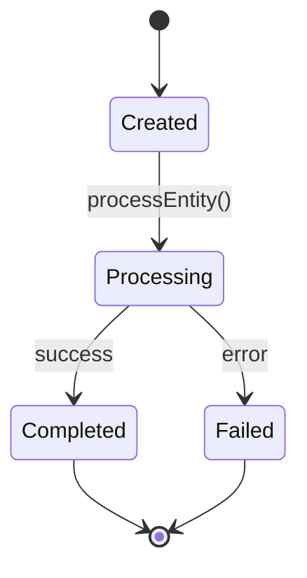
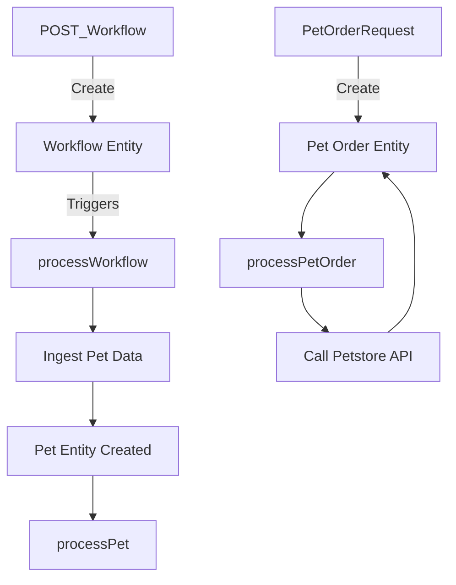
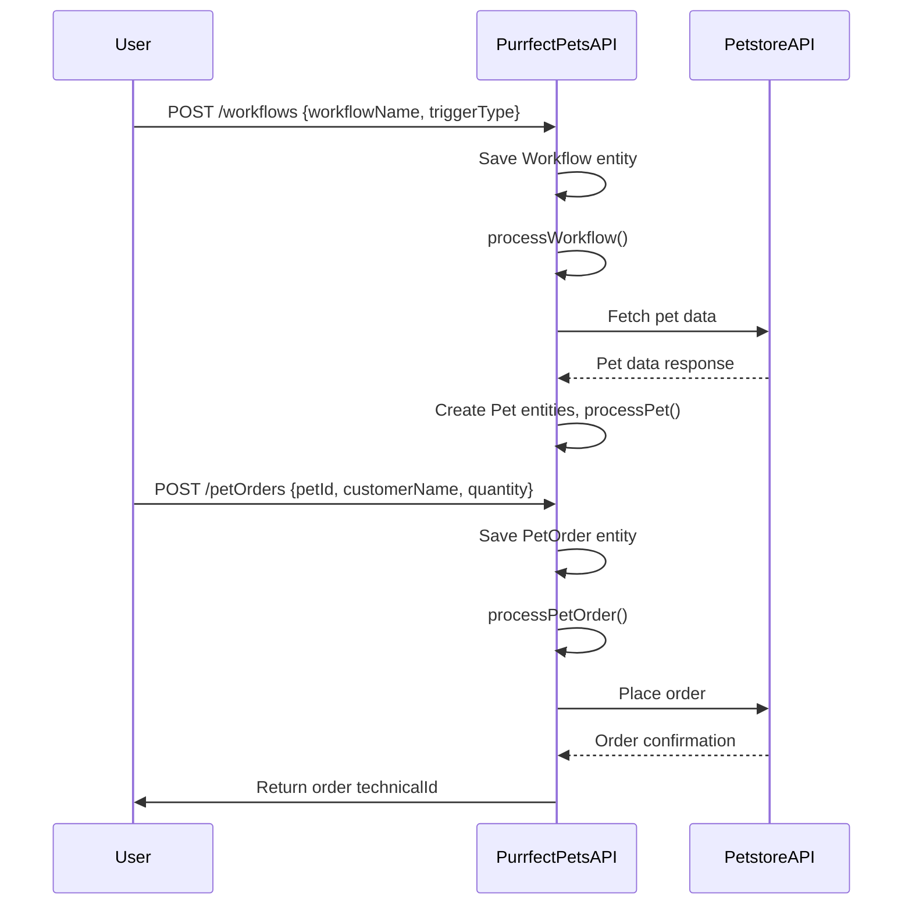

### 1. Entity Definitions

``` 
Workflow: 
- workflowName: String (name of the orchestration workflow)
- triggerType: String (type of trigger e.g., manual, scheduled)
- status: StatusEnum (CREATED, PROCESSING, COMPLETED, FAILED)

PetOrder: 
- petId: Long (ID referencing the pet from Petstore API)
- customerName: String (name of the person placing the order)
- quantity: Integer (number of pets ordered)
- orderDate: DateTime (timestamp of the order)
- status: StatusEnum (PENDING, APPROVED, FULFILLED, CANCELLED)

Pet: 
- petId: Long (unique ID from Petstore API)
- name: String (pet's name)
- category: String (category/type of pet)
- photoUrls: List<String> (photos of the pet)
- tags: List<String> (tags describing the pet)
- status: StatusEnum (AVAILABLE, PENDING, SOLD)
```

---

### 2. Process Method Flows

``` 
processWorkflow() Flow:
1. Initial State: Workflow created with CREATED status  
2. Validation: Check workflow parameters and trigger type  
3. Processing: Start orchestration (e.g., ingest pet data, process orders)  
4. Completion: Update workflow status to COMPLETED or FAILED  
5. Notification: Trigger events or callbacks based on workflow outcome  

processPetOrder() Flow:
1. Initial State: PetOrder created with PENDING status  
2. Validation: Verify pet availability and order details  
3. Processing: Place order via Petstore API if pet is AVAILABLE  
4. Completion: Update PetOrder status to APPROVED or CANCELLED  
5. Notification: Send order confirmation or failure notice  

processPet() Flow:
1. Initial State: Pet entity created when new pet data ingested  
2. Validation: Validate pet data fields and status  
3. Processing: Save pet data locally or update cache  
4. Completion: Set pet status accordingly (AVAILABLE, PENDING, SOLD)  
5. Notification: Trigger pet update events if needed  
```

---

### 3. API Endpoints Design

| HTTP Method | Endpoint               | Description                                   | Request Body                   | Response                   |
|-------------|------------------------|-----------------------------------------------|-------------------------------|----------------------------|
| POST        | `/workflows`           | Create a new Workflow (starts orchestration) | `{ "workflowName": "...", "triggerType": "..." }` | `{ "technicalId": "uuid" }` |
| GET         | `/workflows/{technicalId}` | Retrieve Workflow status and details         | N/A                           | Workflow entity JSON        |
| POST        | `/petOrders`           | Create a new PetOrder (triggers ordering)    | `{ "petId": ..., "customerName": "...", "quantity": ... }` | `{ "technicalId": "uuid" }` |
| GET         | `/petOrders/{technicalId}` | Retrieve PetOrder status and details          | N/A                           | PetOrder entity JSON        |
| POST        | `/pets`                | Create new Pet entity (e.g., from ingestion) | `{ "petId": ..., "name": "...", "category": "...", ... }` | `{ "technicalId": "uuid" }` |
| GET         | `/pets/{technicalId}`  | Retrieve Pet details                           | N/A                           | Pet entity JSON             |

- No PUT, PATCH, DELETE endpoints to maintain immutability unless explicitly requested.  
- GET by conditions or GET all endpoints can be added later if required.  

---

### 4. Request/Response Formats

**POST /workflows Request Example:**

```json
{
  "workflowName": "DailyPetIngestion",
  "triggerType": "scheduled"
}
```

**POST /workflows Response Example:**

```json
{
  "technicalId": "workflow-123e4567-e89b-12d3-a456-426614174000"
}
```

**POST /petOrders Request Example:**

```json
{
  "petId": 101,
  "customerName": "Alice",
  "quantity": 1
}
```

**POST /petOrders Response Example:**

```json
{
  "technicalId": "order-123e4567-e89b-12d3-a456-426614174001"
}
```

**POST /pets Request Example:**

```json
{
  "petId": 101,
  "name": "Whiskers",
  "category": "Cat",
  "photoUrls": ["http://example.com/whiskers1.jpg"],
  "tags": ["cute", "small"],
  "status": "AVAILABLE"
}
```

**POST /pets Response Example:**

```json
{
  "technicalId": "pet-123e4567-e89b-12d3-a456-426614174002"
}
```

---

### Mermaid Diagrams

**Entity Lifecycle State Diagram**


```mermaid
stateDiagram-v2
    [*] --> Created
    Created --> Processing : processEntity()
    Processing --> Completed : success
    Processing --> Failed : error
    Completed --> [*]
    Failed --> [*]
```

**Event-Driven Processing Chain**


```mermaid
graph TD
    POST_Workflow -->|Create| WorkflowEntity[Workflow Entity]
    WorkflowEntity -->|Triggers| processWorkflow
    processWorkflow --> PetIngestion[Ingest Pet Data]
    PetIngestion --> PetEntity[Pet Entity Created]
    PetEntity --> processPet
    PetOrderRequest -->|Create| PetOrderEntity[Pet Order Entity]
    PetOrderEntity --> processPetOrder
    processPetOrder --> PetstoreAPI[Call Petstore API]
    PetstoreAPI --> PetOrderEntity
```

**User Interaction Sequence Flow**


```mermaid
sequenceDiagram
    participant User
    participant PurrfectPetsAPI
    participant PetstoreAPI

    User->>PurrfectPetsAPI: POST /workflows {workflowName, triggerType}
    PurrfectPetsAPI->>PurrfectPetsAPI: Save Workflow entity
    PurrfectPetsAPI->>PurrfectPetsAPI: processWorkflow()
    PurrfectPetsAPI->>PetstoreAPI: Fetch pet data
    PetstoreAPI-->>PurrfectPetsAPI: Pet data response
    PurrfectPetsAPI->>PurrfectPetsAPI: Create Pet entities, processPet()
    User->>PurrfectPetsAPI: POST /petOrders {petId, customerName, quantity}
    PurrfectPetsAPI->>PurrfectPetsAPI: Save PetOrder entity
    PurrfectPetsAPI->>PurrfectPetsAPI: processPetOrder()
    PurrfectPetsAPI->>PetstoreAPI: Place order
    PetstoreAPI-->>PurrfectPetsAPI: Order confirmation
    PurrfectPetsAPI->>User: Return order technicalId
```

---

Please let me know if you need any further adjustments or additions!