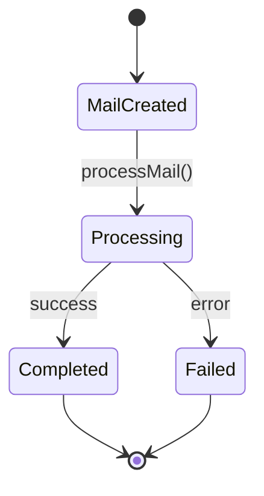
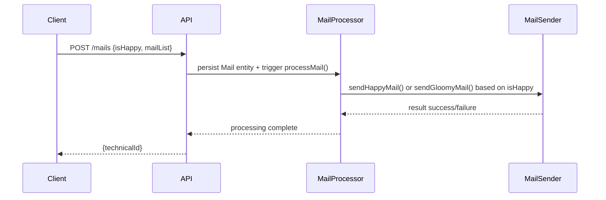

### 1. Entity Definitions

``` 
Mail:
- isHappy: Boolean (Indicates if the mail is happy (true) or gloomy (false))
- mailList: List<String> (List of email recipient addresses)
```

---

### 2. Process Method Flows

```
processMail() Flow:
1. Initial State: Mail entity is created (immutable creation) with isHappy and mailList fields.
2. Validation: Optionally validate mailList is non-empty and emails are syntactically valid.
3. Processing:
   - If isHappy == true, trigger sendHappyMail processor logic to send happy mail content to mailList.
   - If isHappy == false, trigger sendGloomyMail processor logic to send gloomy mail content to mailList.
4. Completion: Mark mail event as processed (internally or via status field if extended).
5. Notification: Log success/failure of mail sending.
```

---

### 3. API Endpoints Design

| HTTP Method | Endpoint       | Purpose                               | Request Body               | Response Body          |
|-------------|----------------|-------------------------------------|----------------------------|-----------------------|
| POST        | `/mails`       | Create a new Mail entity (triggers processMail event) | `{ "isHappy": true, "mailList": ["a@example.com"] }` | `{ "technicalId": "uuid" }` |
| GET         | `/mails/{technicalId}` | Retrieve processed mail entity by technicalId | None                       | `{ "isHappy": true, "mailList": [...], "status": "COMPLETED" }` |

*No update or delete endpoints provided, per EDA immutability principle.*

---

### 4. Request/Response Formats

#### POST /mails

**Request:**
```json
{
  "isHappy": true,
  "mailList": [
    "recipient1@example.com",
    "recipient2@example.com"
  ]
}
```

**Response:**
```json
{
  "technicalId": "123e4567-e89b-12d3-a456-426614174000"
}
```

#### GET /mails/{technicalId}

**Response:**
```json
{
  "isHappy": true,
  "mailList": [
    "recipient1@example.com",
    "recipient2@example.com"
  ],
  "status": "COMPLETED"
}
```

---

### 5. Visual Representations

#### Mail Entity Lifecycle State Diagram


```mermaid
stateDiagram-v2
    [*] --> MailCreated
    MailCreated --> Processing : processMail()
    Processing --> Completed : success
    Processing --> Failed : error
    Completed --> [*]
    Failed --> [*]
```

#### Event-Driven Processing Chain


```mermaid
sequenceDiagram
    participant Client
    participant API
    participant MailProcessor
    participant MailSender

    Client->>API: POST /mails {isHappy, mailList}
    API->>MailProcessor: persist Mail entity + trigger processMail()
    MailProcessor->>MailSender: sendHappyMail() or sendGloomyMail() based on isHappy
    MailSender-->>MailProcessor: result success/failure
    MailProcessor-->>API: processing complete
    API-->>Client: {technicalId}
```

---

### Summary of Confirmed Functional Requirements

```markdown
- Use one entity `Mail` with fields `isHappy` and `mailList`.
- Trigger `processMail()` automatically on Mail creation.
- Send different mail content based on `isHappy`.
- POST `/mails` creates Mail and returns `technicalId`.
- GET `/mails/{technicalId}` retrieves processing result.
- Immutable entity creation only; no updates or deletes.
```

Please let me know if you need any clarifications or additions!