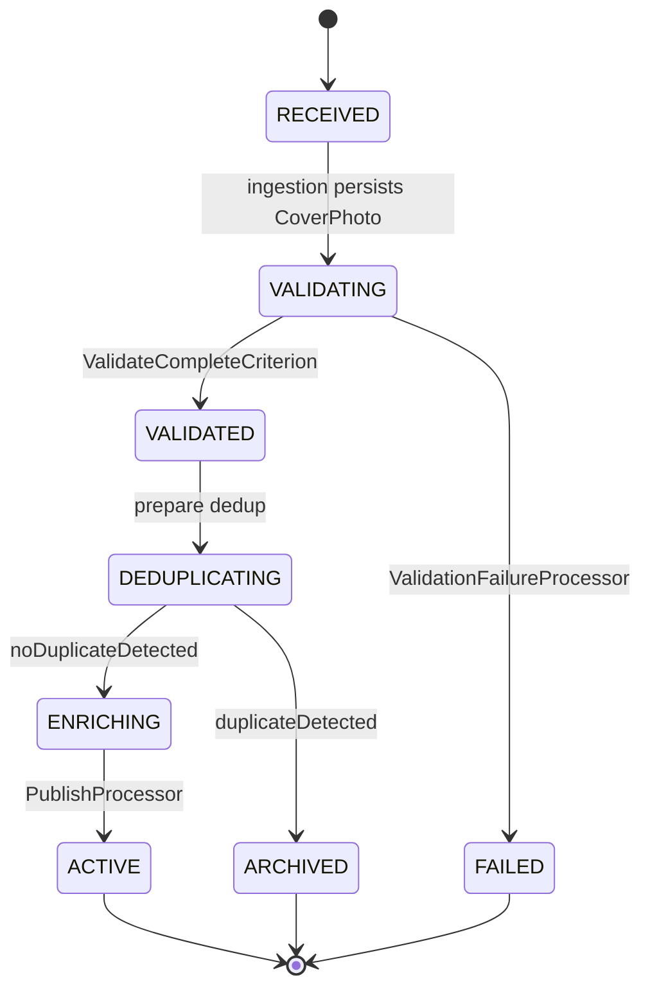
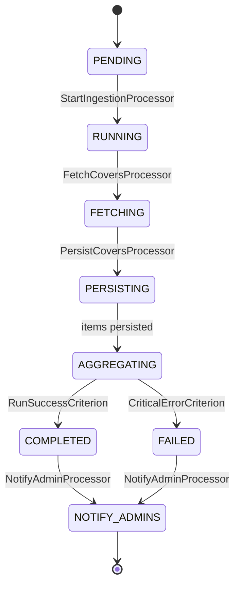
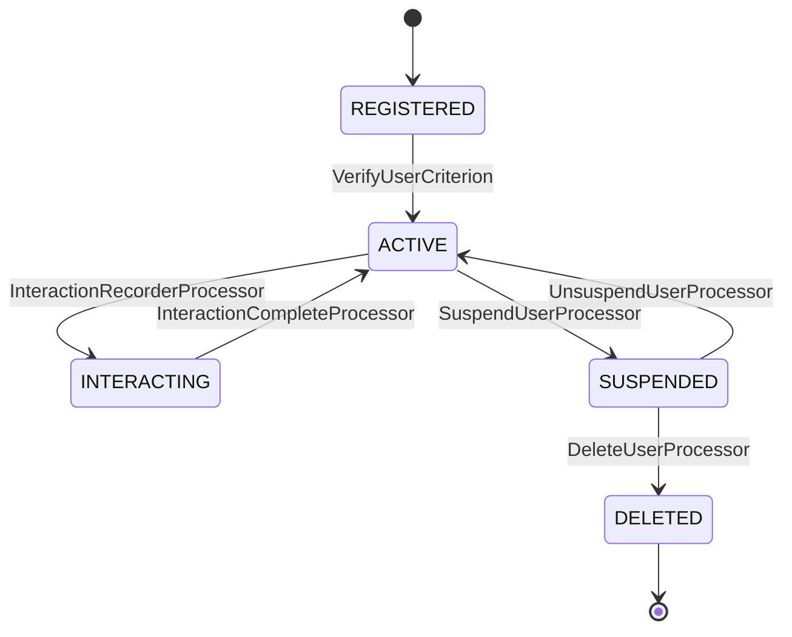

# Functional Requirements

This document defines the functional requirements, entity models, workflows, processors and API rules for the Cover Photo ingestion prototype. It consolidates and updates the logic to ensure consistency between entity fields, workflows, processors and APIs.

## 1. Entity Definitions

General conventions:
- Every persisted business entity has a system-assigned `technicalId: String` (UUID) used internally and returned by POST endpoints. Entities that also contain an origin identifier include a separate `originId` or `coverId` field as noted.
- Timestamps use ISO-8601 UTC.
- Status fields are enumerations; allowed values are documented with the entity.

### CoverPhoto
- technicalId: String (system UUID)
- coverId: String (origin identifier from source, e.g. Fakerest) — optional if origin not available
- title: String (display title)
- bookId: String (related book id from source) — optional
- imageUrl: String (location of image) — required
- fetchedAt: DateTime (when this item was fetched from source)
- tags: List<String> (classification tags) — default []
- status: String (enum: RECEIVED, VALIDATING, VALIDATED, DEDUPLICATING, ENRICHING, ACTIVE, ARCHIVED, FAILED)
- metadata: Object (derived metadata: dimensions, size, mimeType, thumbnails, imageHash, basicChecked:Boolean)
  - metadata.dimensions: String (e.g. "600x800")
  - metadata.size: Integer (bytes)
  - metadata.mimeType: String
  - metadata.imageHash: String (perceptual hash or sha256)
  - metadata.thumbnails: Object (urls, sizes)
  - metadata.basicChecked: Boolean
- originPayload: Object (raw source payload) — store for traceability
- duplicateOf: String (technicalId of the CoverPhoto it duplicates) or null
- ingestionJobId: String (technicalId of the IngestionJob that created it)
- errorFlag: Boolean (true when validation/processing failed)
- processingAttempts: Integer (retry counter)
- lastProcessedAt: DateTime (last processing timestamp)
- publishedAt: DateTime (when moved to ACTIVE) — optional
- createdAt: DateTime
- updatedAt: DateTime

Notes:
- `status` flow is tracked explicitly (RECEIVED -> VALIDATING -> DEDUPLICATING -> ENRICHING -> ACTIVE). Duplicates traverse to ARCHIVED. Failures move to FAILED.
- `imageHash` is used for deduplication; both exact (sha256) and perceptual (pHash) approaches are supported.


### IngestionJob
- technicalId: String (system UUID)
- jobName: String (human readable name)
- scheduledFor: DateTime (planned start time) — optional
- startedAt: DateTime (actual start) — optional
- finishedAt: DateTime (actual end) — optional
- fetchedCount: Integer (total items fetched)
- newCount: Integer (new cover photos created)
- duplicateCount: Integer (duplicates detected)
- errorCount: Integer (items that failed processing)
- errorSummary: Object (structured summary; short message + counts + top error types)
- status: String (enum: PENDING, RUNNING, COMPLETED, FAILED)
- initiatedBy: String (scheduler/manual user id)
- runParameters: Object (options for this run)
- createdAt: DateTime
- updatedAt: DateTime

Notes:
- `fetchedCount`, `newCount`, `duplicateCount` and `errorCount` are computed incrementally and finalized on completion.
- `errorSummary` should indicate whether a failure is critical (e.g. critical boolean or derived from error rate threshold).


### User
- technicalId: String (system UUID)
- userId: String (business user identifier) — optional, can be external id
- role: String (enum: viewer, admin, curator, system)
- email: String
- emailVerified: Boolean
- preferences: Object (filters, display preferences)
- favorites: List<String> (list of CoverPhoto technicalIds)
- notificationPreferences: Object (which notifications to receive)
- createdAt: DateTime
- lastActiveAt: DateTime
- status: String (enum: REGISTERED, ACTIVE, SUSPENDED, DELETED)

Notes:
- Interactions (favorites, downloads, views) are recorded in a separate Interaction/ActionLog entity rather than embedding a log inside the user record.


## 2. Workflows and State Machines

Overview notes:
- Workflows are asynchronous, event-driven and idempotent. Each processor should tolerate retries (processingAttempts) and be safe to re-run.
- Side effects (thumbnail generation, external notifications) should be written to separate stores/queues and not block the primary state transition unless critical.
- Criteria (RunSuccessCriterion, DuplicateDetectedCriterion, etc.) are parameterized by configuration (thresholds, timeout values) and are not hard-coded in processors.

### CoverPhoto workflow (states)
States: RECEIVED -> VALIDATING -> (VALIDATED -> DEDUPLICATING) -> (ENRICHING -> ACTIVE) or ARCHIVED or FAILED

Mermaid state diagram:


```mermaid
stateDiagram-v2
    [*] --> RECEIVED
    RECEIVED --> VALIDATING : ingestion persists CoverPhoto
    VALIDATING --> VALIDATED : ValidateCompleteCriterion
    VALIDATING --> FAILED : ValidationFailureProcessor
    VALIDATED --> DEDUPLICATING : prepare dedup
    DEDUPLICATING --> ENRICHING : noDuplicateDetected
    DEDUPLICATING --> ARCHIVED : duplicateDetected
    ENRICHING --> ACTIVE : PublishProcessor
    ACTIVE --> [*]
    ARCHIVED --> [*]
    FAILED --> [*]
```

Processor responsibilities and behavior overview:
- ValidateMetadataProcessor: ensures required fields (imageUrl, title when required) and basic accessibility checks (HEAD or small GET) are successful. Distinguish between transient network errors (retryable) and permanent validation errors (non-retryable). On permanent failure set `errorFlag=true` and `status=FAILED`.

- DeduplicateProcessor: compute/obtain image hashes (sha256 for exact match, perceptual hash for near-duplicate). Search existing CoverPhotos by exact hash first, then by perceptual-match threshold (configurable Hamming distance). If duplicate found then set `duplicateOf` to matched `technicalId` and `status=ARCHIVED` and stop further enrichment. If not duplicate, clear `duplicateOf` and continue.

- EnrichMetadataProcessor: derive dimensions, mimeType, generate thumbnails (store references in metadata.thumbnails), categorize tags (using title and image features), and persist metadata. If enrichment fails due to a transient service error, increment `processingAttempts` and retry according to backoff policy. Mark `errorFlag=true` and `status=FAILED` only after exhausting retries.

- PublishProcessor: final checks that required metadata and checks are present (metadata.basicChecked == true, metadata.imageHash present, not duplicate, not errorFlag). If checks pass, set `status=ACTIVE` and `publishedAt=now()`. If not, leave as ARCHIVED or FAILED depending on prior state.

- ValidationFailureProcessor: collates failure reason(s), sets `errorFlag`, updates `processingAttempts` and `lastProcessedAt`, and (optionally) posts the item for manual review. Failures that are transient should schedule retries rather than final failing.

Additional operational rules:
- `processingAttempts` is incremented on each processor run that performs network I/O or non-idempotent operations.
- Processors should update `lastProcessedAt` when they perform significant work.
- Deduplication should be deterministic and periodically re-run (reconciliation job) against updated matching strategy if matching thresholds or algorithms change.


### IngestionJob workflow
States: PENDING -> RUNNING -> FETCHING -> PERSISTING (CoverPhoto creation) -> AGGREGATING -> (COMPLETED | FAILED) -> NOTIFY_ADMINS -> [*]

Mermaid state diagram:


```mermaid
stateDiagram-v2
    [*] --> PENDING
    PENDING --> RUNNING : StartIngestionProcessor
    RUNNING --> FETCHING : FetchCoversProcessor
    FETCHING --> PERSISTING : PersistCoversProcessor
    PERSISTING --> AGGREGATING : items persisted
    AGGREGATING --> COMPLETED : RunSuccessCriterion
    AGGREGATING --> FAILED : CriticalErrorCriterion
    COMPLETED --> NOTIFY_ADMINS : NotifyAdminProcessor
    FAILED --> NOTIFY_ADMINS : NotifyAdminProcessor
    NOTIFY_ADMINS --> [*]
```

Processor responsibilities and behavior overview:
- FetchCoversProcessor: calls the external source with `runParameters`. Should handle pagination, backoff on transient failures, and capture the raw origin payload per item. Sets `job.fetchedCount` as items are read.

- PersistCoversProcessor: persists each fetched item as a `CoverPhoto` with initial `status=RECEIVED`, `ingestionJobId` and `originPayload`. Persistence of each CoverPhoto triggers the CoverPhoto workflow asynchronously. The Persist processor should be idempotent (deduplicate by origin id or item hash) to tolerate retries.

- AggregateResultsProcessor: after item processing (or after timeout), compute `newCount`, `duplicateCount`, `errorCount`, and produce `errorSummary` (structured). Decide final job `status` using `RunSuccessCriterion` and `CriticalErrorCriterion` (configurable thresholds). Set `finishedAt` and persist summary.

- NotifyAdminProcessor: create/queue notifications when job ends with status FAILED or when error thresholds exceed admin-configured alerting thresholds.

Run success/failure criteria (examples - configurable):
- RunSuccessCriterion: errorRate <= 10% AND criticalErrors == 0
- CriticalErrorCriterion: errorRate > 20% OR criticalErrors > 0

Notes:
- The job's `status` should reflect the overall outcome, not transient item-level failures. Per-item failures are tracked on CoverPhoto.
- Ingestion jobs must log and expose operation-level telemetry (timings, retries) for observability.


### User workflow
States: REGISTERED -> ACTIVE -> INTERACTING -> ACTIVE ... or SUSPENDED -> DELETED

Mermaid state diagram:


```mermaid
stateDiagram-v2
    [*] --> REGISTERED
    REGISTERED --> ACTIVE : VerifyUserCriterion
    ACTIVE --> INTERACTING : InteractionRecorderProcessor
    INTERACTING --> ACTIVE : InteractionCompleteProcessor
    ACTIVE --> SUSPENDED : SuspendUserProcessor
    SUSPENDED --> ACTIVE : UnsuspendUserProcessor
    SUSPENDED --> DELETED : DeleteUserProcessor
    DELETED --> [*]
```

Processor responsibilities and behavior overview:
- VerifyUserCriterion: email verification or admin action moves user to ACTIVE.
- InteractionRecorderProcessor: record interactions in a separate Interaction table with (userTechnicalId, coverTechnicalId, actionType, timestamp). Update `lastActiveAt` on the User.
- SuspendUserProcessor / UnsuspendUserProcessor / DeleteUserProcessor: administrative actions updating `status` and recording audit logs.


## 3. Processor Pseudocode (updated and consistent)

Guiding principles:
- Idempotency: Persist operations must avoid creating duplicates if re-run.
- Retries: Distinguish transient errors from permanent failures. Use a configurable retry/backoff policy.
- Observability: processors should emit logs/metrics and update entity fields (`processingAttempts`, `lastProcessedAt`, `errorFlag`).

ValidateMetadataProcessor

```java
class ValidateMetadataProcessor {
  void process(CoverPhoto cp) {
    cp.processingAttempts = cp.processingAttempts + 1
    cp.lastProcessedAt = now()

    if missing(cp.imageUrl) {
      cp.errorFlag = true
      cp.status = FAILED
      persist(cp)
      return
    }

    // quick accessibility check (HEAD or small GET)
    result = tryHeadRequest(cp.imageUrl)
    if result.success then
      cp.metadata.basicChecked = true
      cp.status = VALIDATED
      persist(cp)
      return
    else if result.transientError and cp.processingAttempts < MAX_RETRIES then
      scheduleRetry(cp)
      persist(cp)
      return
    else
      cp.errorFlag = true
      cp.status = FAILED
      persist(cp)
      return
    end
  }
}
```

DeduplicateProcessor

```java
class DeduplicateProcessor {
  void process(CoverPhoto cp) {
    cp.processingAttempts = cp.processingAttempts + 1
    cp.lastProcessedAt = now()

    cp.metadata.imageHash = computeImageHash(cp.imageUrl) // sha256 and pHash

    match = findExistingByExactHash(cp.metadata.imageHash.sha256)
    if match == null then
      match = findByPerceptualHashThreshold(cp.metadata.imageHash.pHash, HAMMING_THRESHOLD)
    end

    if match != null then
      cp.duplicateOf = match.technicalId
      cp.status = ARCHIVED
    else
      cp.duplicateOf = null
      cp.status = DEDUPLICATING // or advance to ENRICHING by coordinator
    end
    persist(cp)
  }
}
```

EnrichMetadataProcessor

```java
class EnrichMetadataProcessor {
  void process(CoverPhoto cp) {
    cp.processingAttempts = cp.processingAttempts + 1
    cp.lastProcessedAt = now()

    try {
      cp.metadata.dimensions = getImageDimensions(cp.imageUrl)
      cp.metadata.size = getImageSize(cp.imageUrl)
      cp.metadata.mimeType = detectMimeType(cp.imageUrl)
      cp.metadata.thumbnails = generateAndStoreThumbnails(cp.imageUrl)

      cp.tags = deriveTagsFromTitleAndImage(cp.title, cp.metadata)
      cp.status = ENRICHING
      persist(cp)
    } catch (TransientServiceException e) {
      if cp.processingAttempts < MAX_RETRIES then
        scheduleRetry(cp)
      else
        cp.errorFlag = true
        cp.status = FAILED
        persist(cp)
      end
    } catch (PermanentException e) {
      cp.errorFlag = true
      cp.status = FAILED
      persist(cp)
    }
  }
}
```

PublishProcessor

```java
class PublishProcessor {
  void process(CoverPhoto cp) {
    cp.lastProcessedAt = now()

    if cp.errorFlag == false && cp.duplicateOf == null &&
       cp.metadata.basicChecked == true && cp.metadata.imageHash != null then
      cp.status = ACTIVE
      cp.publishedAt = now()
    else
      // if duplicateOf set, leave as ARCHIVED; if errorFlag true, leave as FAILED
    end
    persist(cp)
  }
}
```

FetchCoversProcessor (IngestionJob)

```java
class FetchCoversProcessor {
  void process(IngestionJob job) {
    job.startedAt = now()
    job.status = RUNNING
    persist(job)

    items = callExternalApi(job.runParameters) // handle paging and partial failures
    job.fetchedCount = items.length
    persist(job)

    for each item in items do
      // idempotency: try to upsert by origin id or computed item hash
      cp = buildCoverPhotoFromOrigin(item)
      cp.status = RECEIVED
      cp.ingestionJobId = job.technicalId
      upsertCoverPhoto(cp)
      // cover photo persistence triggers CoverPhoto workflow asynchronously
    end
  }
}
```

AggregateResultsProcessor

```java
class AggregateResultsProcessor {
  void process(IngestionJob job) {
    job.newCount = countNewCoversLinkedToJob(job.technicalId)
    job.duplicateCount = countDuplicatesLinkedToJob(job.technicalId)
    job.errorCount = countFailedCoversLinkedToJob(job.technicalId)

    job.errorSummary = summarizeErrors(job.technicalId)
    job.finishedAt = now()

    double errorRate = (job.fetchedCount == 0) ? 0 : job.errorCount / (double) job.fetchedCount
    if errorRate > CONFIG.CRITICAL_ERROR_RATE or job.errorSummary.containsCriticalErrors then
      job.status = FAILED
    else
      job.status = COMPLETED
    end

    persist(job)
  }
}
```

NotifyAdminProcessor

```java
class NotifyAdminProcessor {
  void process(IngestionJob job) {
    if job.status == FAILED or job.errorCount > CONFIG.ADMIN_ALERT_THRESHOLD then
      createAdminNotification(job.technicalId, job.errorSummary)
    end
  }
}
```

InteractionRecorderProcessor (User interactions)

```java
class InteractionRecorderProcessor {
  void process(userTechnicalId, action) {
    // action = {coverTechnicalId, actionType}
    recordInteraction(userTechnicalId, action.coverTechnicalId, action.actionType, now())
    updateUserLastActive(userTechnicalId, now())
  }
}
```


## 4. API Endpoints and Design Rules

Design rules (updated):
- POST endpoints should return 201 Created with a body containing at minimum the `technicalId` and also include a Location header when appropriate. Returning only the technicalId in the body is allowed, but for usability include the Location.
- GET endpoints return the full stored entity representation (including `technicalId`).
- Where a business/origin id exists (e.g. `coverId`) it is stored on the entity but the canonical primary key for APIs is the `technicalId`.
- IngestionJob: POST + GET by `technicalId`.
- User: POST + GET by `technicalId`.
- CoverPhoto: created by IngestionJob; available by GET /coverphotos/{technicalId}. A listing endpoint (GET /coverphotos) is allowed and required for UI and admin use-cases.
- POST endpoints must be idempotent where appropriate (client-supplied idempotency keys for repeated requests are recommended).

Endpoints (examples):

1) Create IngestionJob
- POST /ingestion-jobs
Request body example:
```json
{
  "jobName": "weekly-cover-fetch",
  "scheduledFor": "2025-08-23T02:00:00Z",
  "initiatedBy": "scheduler",
  "runParameters": { "source": "fakerest", "maxItems": 500 }
}
```
Response (201):
```json
{ "technicalId": "ingest-uuid-1234" }
```
Location header: /ingestion-jobs/ingest-uuid-1234

2) Get IngestionJob by technicalId
- GET /ingestion-jobs/{technicalId}
Response example:
```json
{
  "technicalId": "ingest-uuid-1234",
  "jobName": "weekly-cover-fetch",
  "scheduledFor": "2025-08-23T02:00:00Z",
  "startedAt": "2025-08-23T02:00:05Z",
  "finishedAt": "2025-08-23T02:05:00Z",
  "fetchedCount": 120,
  "newCount": 100,
  "duplicateCount": 20,
  "errorCount": 0,
  "errorSummary": { "message": "5 transient fetch errors", "topErrors": [] },
  "status": "COMPLETED",
  "initiatedBy": "scheduler",
  "runParameters": {"source":"fakerest","maxItems":500},
  "createdAt": "2025-08-23T01:59:00Z"
}
```

3) Create User
- POST /users
Request example:
```json
{
  "userId": "u-456",
  "email": "alice@example.com",
  "role": "viewer",
  "preferences": { "viewMode":"grid" }
}
```
Response (201):
```json
{ "technicalId": "user-uuid-789" }
```
Location header: /users/user-uuid-789

4) Get User by technicalId
- GET /users/{technicalId}
Response example:
```json
{
  "technicalId": "user-uuid-789",
  "userId": "u-456",
  "email": "alice@example.com",
  "role": "viewer",
  "preferences": { "viewMode":"grid" },
  "favorites": [],
  "notificationPreferences": { "dailySummary": true },
  "createdAt": "2025-08-01T12:00:00Z",
  "lastActiveAt": "2025-08-20T09:00:00Z",
  "status": "ACTIVE"
}
```

5) Get CoverPhoto by technicalId
- GET /coverphotos/{technicalId}
Response example:
```json
{
  "technicalId": "cover-uuid-111",
  "coverId": "o-77",
  "title": "Example Cover",
  "bookId": "b-77",
  "imageUrl": "https://...",
  "fetchedAt": "2025-08-23T02:01:00Z",
  "tags": ["fiction"],
  "status": "ACTIVE",
  "metadata": { "dimensions":"600x800", "size":12345, "mimeType":"image/jpeg", "imageHash": {"sha256":"...","pHash":"..."} },
  "originPayload": {},
  "duplicateOf": null,
  "ingestionJobId": "ingest-uuid-1234",
  "errorFlag": false,
  "processingAttempts": 1,
  "lastProcessedAt": "2025-08-23T02:02:00Z",
  "publishedAt": "2025-08-23T02:03:00Z",
  "createdAt": "2025-08-23T02:01:00Z",
  "updatedAt": "2025-08-23T02:03:00Z"
}
```

Optional endpoints and considerations:
- GET /coverphotos?status=ACTIVE&tag=fiction — filtering/listing for UI is recommended.
- POST /coverphotos is not part of the public ingestion contract (cover photos are created by IngestionJob). If direct creation is allowed, it must follow the same validation/deduplication path.
- Admin endpoints for reprocessing a CoverPhoto or running reconciliation should be provided (e.g. POST /admin/coverphotos/{technicalId}/reprocess).


## 5. Operational and Consistency Rules
- Idempotency: persist/upsert operations should deduplicate by origin id or computed content hash to avoid duplicates on retries.
- Retry/backoff: transient operations (HTTP calls to external sources, thumbnail generation services) should be retried with exponential backoff. Permanent errors should be surfaced as non-retryable and set `errorFlag`.
- Reconciliation: support periodic reconciliation for deduplication and metadata enrichment when algorithms improve. Reprocessing should be explicit via admin API with audit logs.
- Observability: all processors should emit structured logs and metrics (counts, latencies, error types). IngestionJob must persist fetch timing and retry counts for troubleshooting.
- Security: restrict administrative APIs and ingestion control endpoints with role-based access control; sanitize stored originPayloads for PII before storage.


## 6. Configuration and Thresholds (examples)
- MAX_RETRIES (per processor): 3
- CONFIG.CRITICAL_ERROR_RATE: 0.20 (20%)
- CONFIG.ADMIN_ALERT_THRESHOLD: 0.05 * fetchedCount (5%)
- HAMMING_THRESHOLD (perceptual hash): 10 (tunable)


## 7. Migration / Backwards Compatibility Notes
- Existing stored entities without `technicalId` should be backfilled with generated UUIDs and references updated.
- If changing deduplication algorithm, run reconciliation job and avoid simultaneously changing active ingestion thresholds; apply in a controlled migration window.


---

If you want, I can:
- Expand the model with additional entities (Report, Notification, ActionLog) and workflows.
- Produce sequence diagrams for end-to-end ingestion and admin reprocess flows.
- Produce JSON Schema or OpenAPI portions for the endpoints above.

Which would you like next?