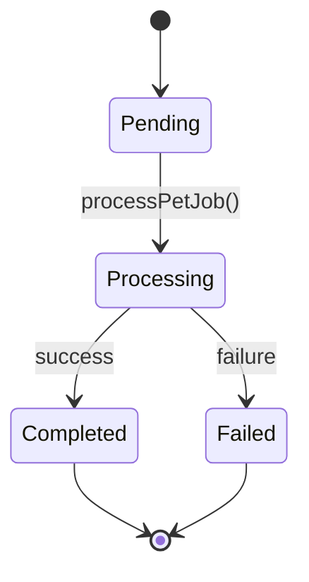
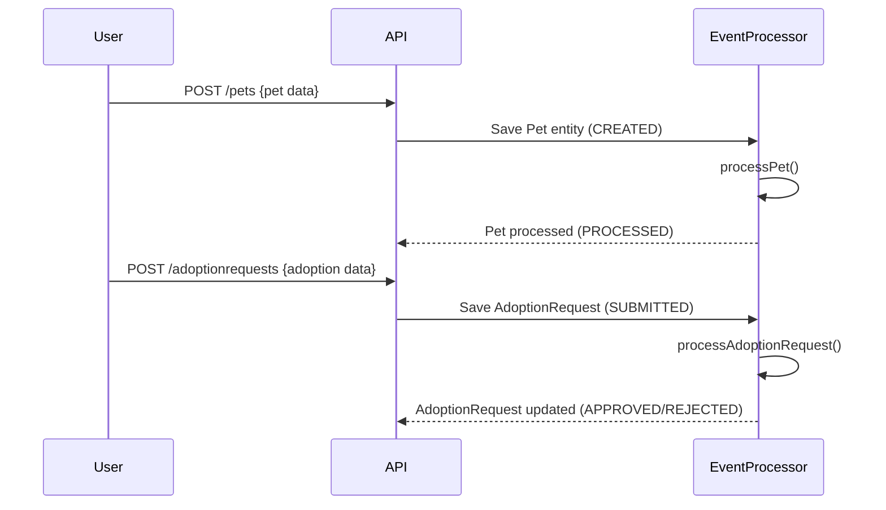

### 1. Entity Definitions

``` 
PetJob: 
- id: UUID (unique job identifier) 
- createdAt: DateTime (job creation timestamp) 
- petType: String (type of pet to process, e.g., cat, dog, all) 
- operation: String (requested operation, e.g., "ingest", "updateStatus") 
- status: StatusEnum (PENDING, PROCESSING, COMPLETED, FAILED) 

Pet: 
- id: UUID (unique pet identifier) 
- name: String (pet's name) 
- type: String (pet's species/type, e.g., cat, dog, bird) 
- age: Integer (pet's age in years) 
- adoptionStatus: String (e.g., AVAILABLE, PENDING, ADOPTED) 
- status: StatusEnum (CREATED, PROCESSED) 

AdoptionRequest: 
- id: UUID (unique request identifier) 
- petId: UUID (reference to Pet) 
- requesterName: String (person requesting adoption) 
- requestDate: DateTime (date of request) 
- status: StatusEnum (SUBMITTED, APPROVED, REJECTED) 
```

---

### 2. Process Method Flows

``` 
processPetJob() Flow:
1. Initial State: PetJob created with PENDING status
2. Validation: Validate petType and operation correctness
3. Dispatch: Trigger corresponding business logic (e.g., ingest Pet data, update statuses)
4. Processing: Invoke downstream events or calls (e.g., create Pet entities, update AdoptionRequests)
5. Completion: Update PetJob status to COMPLETED or FAILED based on outcomes
6. Notification: Optionally notify external systems or logs

processPet() Flow:
1. Initial State: Pet entity created with CREATED status
2. Validation: Verify pet data integrity and required fields
3. Enrichment: Possibly augment data (e.g., assign default adoption status)
4. Persistence: Save immutable Pet record
5. Completion: Update status to PROCESSED

processAdoptionRequest() Flow:
1. Initial State: AdoptionRequest created with SUBMITTED status
2. Validation: Check pet availability and request completeness
3. Decision: Approve or reject adoption based on business rules
4. Update: Change status to APPROVED or REJECTED accordingly
5. Notification: Trigger downstream notifications or events
```

---

### 3. API Endpoints & JSON Formats

- **POST /petjobs**  
  Create a PetJob to trigger processing (e.g., ingest pets)  
  Request:  
  ```json
  {
    "petType": "cat",
    "operation": "ingest"
  }
  ```  
  Response:  
  ```json
  {
    "id": "uuid",
    "status": "PENDING",
    "createdAt": "timestamp"
  }
  ```

- **POST /pets**  
  Add new pet entity (creates immutable record)  
  Request:  
  ```json
  {
    "name": "Whiskers",
    "type": "cat",
    "age": 2,
    "adoptionStatus": "AVAILABLE"
  }
  ```  
  Response:  
  ```json
  {
    "id": "uuid",
    "status": "CREATED"
  }
  ```

- **POST /adoptionrequests**  
  Submit an adoption request  
  Request:  
  ```json
  {
    "petId": "uuid",
    "requesterName": "Alice"
  }
  ```  
  Response:  
  ```json
  {
    "id": "uuid",
    "status": "SUBMITTED",
    "requestDate": "timestamp"
  }
  ```

- **GET /pets/{id}**  
  Retrieve pet details (read-only)  
  Response:  
  ```json
  {
    "id": "uuid",
    "name": "Whiskers",
    "type": "cat",
    "age": 2,
    "adoptionStatus": "AVAILABLE"
  }
  ```

---

### 4. Mermaid Diagrams

#### Entity Lifecycle State Diagram (PetJob example)


```mermaid
stateDiagram-v2
    [*] --> Pending
    Pending --> Processing : processPetJob()
    Processing --> Completed : success
    Processing --> Failed : failure
    Completed --> [*]
    Failed --> [*]
```

#### Event-Driven Processing Chain

```mermaid
flowchart TD
    PetJob_Created["PetJob Created (PENDING)"] -->|processPetJob()| Validation
    Validation -->|valid| Dispatch
    Dispatch --> Processing
    Processing -->|success| Completed
    Processing -->|fail| Failed
```

#### User Interaction Sequence Flow (Creating Pet & Adoption Request)


```mermaid
sequenceDiagram
    participant User
    participant API
    participant EventProcessor

    User->>API: POST /pets {pet data}
    API->>EventProcessor: Save Pet entity (CREATED)
    EventProcessor->>EventProcessor: processPet()
    EventProcessor-->>API: Pet processed (PROCESSED)
    User->>API: POST /adoptionrequests {adoption data}
    API->>EventProcessor: Save AdoptionRequest (SUBMITTED)
    EventProcessor->>EventProcessor: processAdoptionRequest()
    EventProcessor-->>API: AdoptionRequest updated (APPROVED/REJECTED)
```

---

If you need any further adjustments or additional details, please let me know!