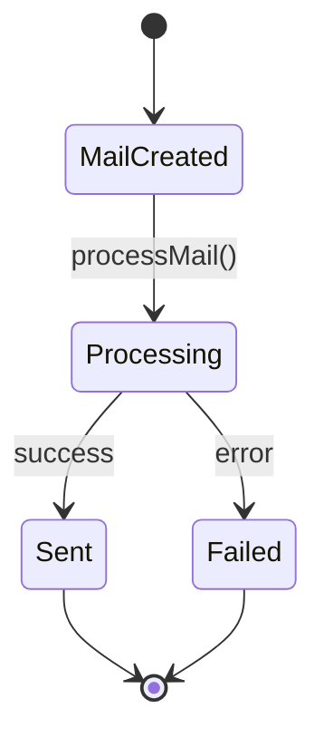
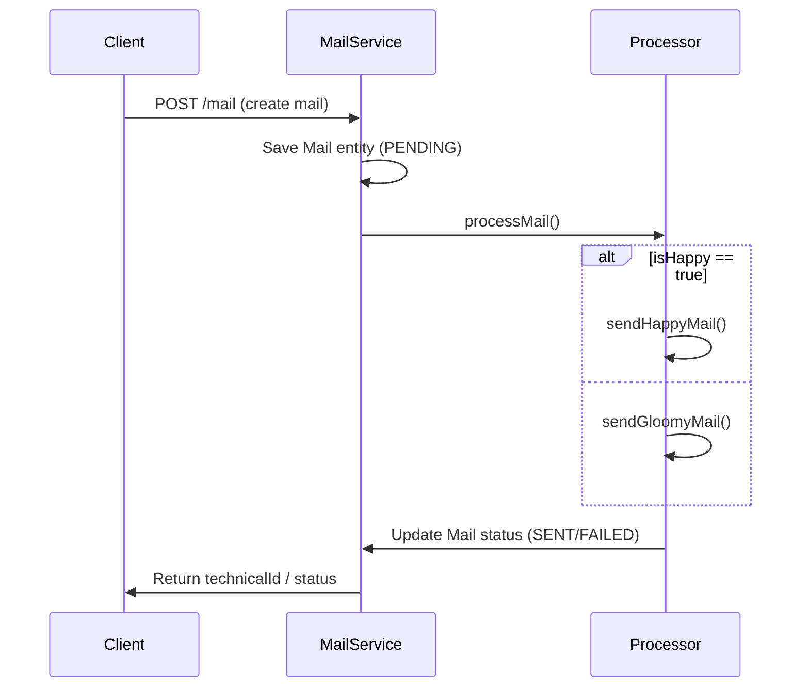

Certainly! Here is the well-formatted final version of your functional requirements for the happy mail application following the Event-Driven Architecture approach:

---

### 1. Entity Definitions

```
Mail:
- isHappy: Boolean (indicates if the mail is happy or gloomy)
- mailList: List<String> (list of email addresses to send the mail to)
- status: MailStatusEnum (entity lifecycle state: PENDING, SENT, FAILED)
```

---

### 2. Process Method Flows

```
processMail() Flow:
1. Initial State: Mail entity created with PENDING status
2. Validation: Run checkMailIsHappy() and checkMailIsGloomy() criteria to determine mail type
3. Processing:
   - If isHappy == true, trigger sendHappyMail processor
   - Else, trigger sendGloomyMail processor
4. Completion: Update status to SENT if mail sent successfully, otherwise FAILED
5. Notification: Log or send event about mail delivery result (optional)
```

---

### 3. API Endpoints Design

- **POST /mail**  
  - Creates a new Mail entity (immutable creation)  
  - Request body contains `isHappy` and `mailList`  
  - Returns only the entity `technicalId`  

- **GET /mail/{technicalId}**  
  - Retrieves the Mail entity by its technicalId, including current status and details

- **(Optional) GET /mail?isHappy=true**  
  - Retrieves mails filtered by happy/gloomy status (only if explicitly requested)

---

### 4. Request/Response Formats

**POST /mail**  
Request JSON:
```json
{
  "isHappy": true,
  "mailList": ["user1@example.com", "user2@example.com"]
}
```

Response JSON:
```json
{
  "technicalId": "123e4567-e89b-12d3-a456-426614174000"
}
```

**GET /mail/{technicalId}**  
Response JSON:
```json
{
  "isHappy": true,
  "mailList": ["user1@example.com", "user2@example.com"],
  "status": "SENT"
}
```

---

### Mermaid Diagrams

#### Mail Entity Lifecycle


```mermaid
stateDiagram-v2
    [*] --> MailCreated
    MailCreated --> Processing : processMail()
    Processing --> Sent : success
    Processing --> Failed : error
    Sent --> [*]
    Failed --> [*]
```

#### Event-Driven Processing Chain


```mermaid
sequenceDiagram
    participant Client
    participant MailService
    participant Processor

    Client->>MailService: POST /mail (create mail)
    MailService->>MailService: Save Mail entity (PENDING)
    MailService->>Processor: processMail()
    alt isHappy == true
        Processor->>Processor: sendHappyMail()
    else
        Processor->>Processor: sendGloomyMail()
    end
    Processor->>MailService: Update Mail status (SENT/FAILED)
    MailService->>Client: Return technicalId / status
```

---

Please feel free to ask if you want to add any additional features or endpoints!