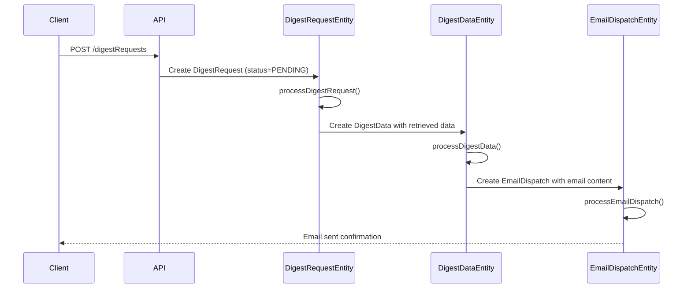
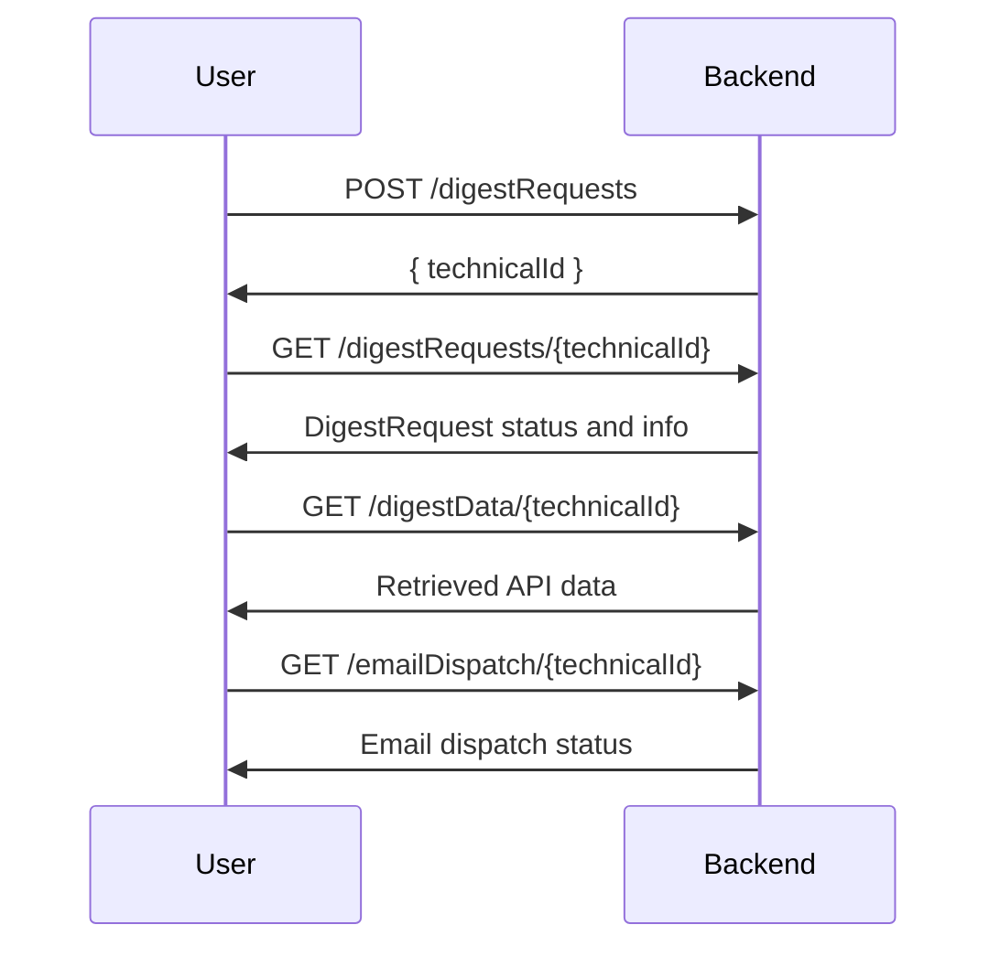

### 1. Entity Definitions

``` 
DigestRequest:  
- userEmail: String (email address to send the digest)  
- requestMetadata: String (JSON or String data describing the request parameters)  
- externalApiEndpoint: String (target endpoint of Petstore Swagger API to retrieve data)  
- requestTimestamp: Instant (time when digest request was created)  
- status: String (current processing status, e.g., PENDING, PROCESSING, COMPLETED, FAILED)  

DigestData:  
- digestRequestId: String (reference to DigestRequest technicalId)  
- retrievedData: String (raw JSON or formatted data retrieved from external API)  
- processedTimestamp: Instant (when data retrieval was completed)  

EmailDispatch:  
- digestRequestId: String (reference to DigestRequest technicalId)  
- emailContent: String (compiled digest content, HTML or plain text)  
- dispatchTimestamp: Instant (when email was sent)  
- status: String (email sending status, e.g., SENT, FAILED)  
```

---

### 2. Process Method Flows

``` 
processDigestRequest() Flow:  
1. Initial State: DigestRequest created with status = PENDING  
2. Validation: Validate userEmail format and required fields  
3. Processing:  
   - Retrieve data from the specified externalApiEndpoint on the Petstore Swagger API  
   - Persist retrieved data as DigestData entity  
4. Completion: Update DigestRequest status to COMPLETED or FAILED based on retrieval success  
5. Trigger: Automatically trigger processEmailDispatch() for the same DigestRequest  

processDigestData() Flow:  
1. Initial State: DigestData created linked to DigestRequest  
2. Processing: Format and prepare the retrievedData into emailContent  
3. Completion: Create EmailDispatch entity with prepared emailContent  

processEmailDispatch() Flow:  
1. Initial State: EmailDispatch created with status = PENDING  
2. Processing: Send emailContent to userEmail from DigestRequest  
3. Completion: Update EmailDispatch status to SENT or FAILED depending on email sending outcome  
```

---

### 3. API Endpoints Design

| Method | Endpoint                      | Purpose                                              | Request Body                  | Response                   |
|--------|-------------------------------|------------------------------------------------------|-------------------------------|----------------------------|
| POST   | `/digestRequests`              | Create new DigestRequest (triggers processing)       | `{ userEmail, requestMetadata, externalApiEndpoint }` | `{ technicalId }`           |
| GET    | `/digestRequests/{technicalId}` | Retrieve DigestRequest status and info               | N/A                           | `{ userEmail, status, requestMetadata, ... }` |
| GET    | `/digestData/{technicalId}`    | Retrieve raw or processed data linked to DigestRequest | N/A                           | `{ retrievedData, processedTimestamp }`         |
| GET    | `/emailDispatch/{technicalId}` | Retrieve email dispatch status and details            | N/A                           | `{ emailContent, status, dispatchTimestamp }`   |

- No update or delete endpoints provided (immutable creation only).  
- POST endpoint only for orchestration entity: DigestRequest.  

---

### 4. Request/Response JSON Formats

**POST /digestRequests Request**

```json
{
  "userEmail": "user@example.com",
  "requestMetadata": "{\"category\":\"pets\",\"type\":\"dog\"}",
  "externalApiEndpoint": "/pet/findByStatus?status=available"
}
```

**POST /digestRequests Response**

```json
{
  "technicalId": "abc123xyz"
}
```

**GET /digestRequests/{technicalId} Response**

```json
{
  "userEmail": "user@example.com",
  "requestMetadata": "{\"category\":\"pets\",\"type\":\"dog\"}",
  "externalApiEndpoint": "/pet/findByStatus?status=available",
  "status": "COMPLETED",
  "requestTimestamp": "2024-06-01T12:00:00Z"
}
```

**GET /digestData/{technicalId} Response**

```json
{
  "retrievedData": "{...json data from Petstore API...}",
  "processedTimestamp": "2024-06-01T12:01:00Z"
}
```

**GET /emailDispatch/{technicalId} Response**

```json
{
  "emailContent": "<html><body>Digest content...</body></html>",
  "status": "SENT",
  "dispatchTimestamp": "2024-06-01T12:02:00Z"
}
```

---

### Mermaid Diagrams

**Entity Lifecycle State Diagram for DigestRequest**


```mermaid
stateDiagram-v2
    [*] --> Pending
    Pending --> Processing : processDigestRequest()
    Processing --> Completed : success
    Processing --> Failed : error
    Completed --> [*]
    Failed --> [*]
```

**Event-Driven Processing Chain**


```mermaid
sequenceDiagram
    participant Client
    participant API
    participant DigestRequestEntity
    participant DigestDataEntity
    participant EmailDispatchEntity

    Client->>API: POST /digestRequests
    API->>DigestRequestEntity: Create DigestRequest (status=PENDING)
    DigestRequestEntity->>DigestRequestEntity: processDigestRequest()
    DigestRequestEntity->>DigestDataEntity: Create DigestData with retrieved data
    DigestDataEntity->>DigestDataEntity: processDigestData()
    DigestDataEntity->>EmailDispatchEntity: Create EmailDispatch with email content
    EmailDispatchEntity->>EmailDispatchEntity: processEmailDispatch()
    EmailDispatchEntity-->>Client: Email sent confirmation
```

**User Interaction Sequence Flow**


```mermaid
sequenceDiagram
    participant User
    participant Backend

    User->>Backend: POST /digestRequests
    Backend->>User: { technicalId }
    User->>Backend: GET /digestRequests/{technicalId}
    Backend->>User: DigestRequest status and info
    User->>Backend: GET /digestData/{technicalId}
    Backend->>User: Retrieved API data
    User->>Backend: GET /emailDispatch/{technicalId}
    Backend->>User: Email dispatch status
```

---

This completes the functional requirements for your event-driven digest request processing system. Please let me know if you need any further refinements!