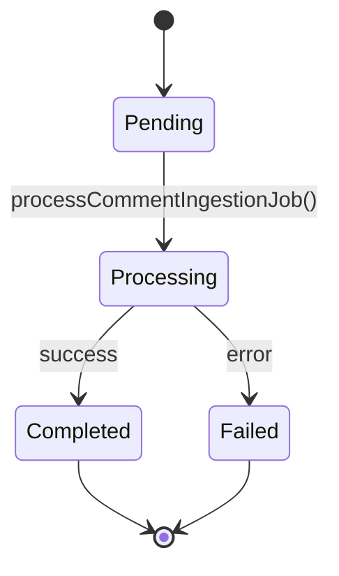
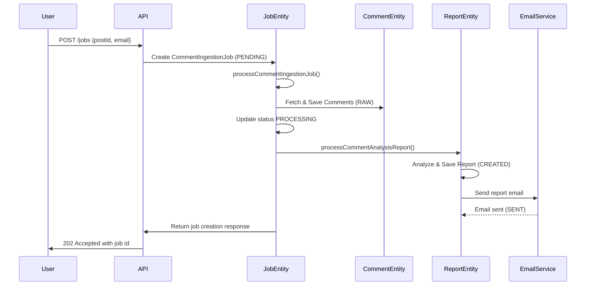

### 1. Entity Definitions

``` 
CommentIngestionJob:
- id: UUID (unique identifier for the job)
- postId: Long (the post ID to fetch comments for)
- status: StatusEnum (PENDING, PROCESSING, COMPLETED, FAILED)
- requestedAt: DateTime (timestamp when job was created)
- completedAt: DateTime (timestamp when job finished)
- reportEmail: String (email address to send analysis report)

Comment:
- id: Long (comment ID from external source)
- postId: Long (post ID the comment belongs to)
- name: String (commenter's name)
- email: String (commenter's email)
- body: String (comment text)
- ingestionJobId: UUID (reference to the CommentIngestionJob that ingested this comment)
- status: StatusEnum (RAW, ANALYZED)

CommentAnalysisReport:
- id: UUID (unique report ID)
- ingestionJobId: UUID (reference to related ingestion job)
- keywordCounts: Map<String, Integer> (count of keywords found)
- totalComments: Integer (number of comments analyzed)
- sentimentSummary: String (optional, summary of sentiment if applicable)
- generatedAt: DateTime (timestamp of report generation)
- status: StatusEnum (CREATED, SENT)
```

---

### 2. Process Method Flows

```
processCommentIngestionJob() Flow:
1. Initial State: CommentIngestionJob created with PENDING status
2. Validation: Verify postId and reportEmail are valid
3. Processing: Fetch comments from https://jsonplaceholder.typicode.com/comments?postId={postId}
4. Persistence: Save each Comment entity with RAW status linked to the ingestion job
5. Update Job status to PROCESSING
6. Trigger processCommentAnalysisReport() after comments saved
7. Upon completion, update status to COMPLETED or FAILED
8. Send notification email with report (triggered after report generation)
```

```
processCommentAnalysisReport() Flow:
1. Initial State: Triggered after comments are ingested (RAW)
2. Processing: Analyze comments (e.g., keyword counting, sentiment summary)
3. Create CommentAnalysisReport entity with results and status CREATED
4. Persist report and update related entities as needed
5. Trigger email sending event (not an entity but a notification step)
6. Update report status to SENT after successful email dispatch
```

---

### 3. API Endpoints

| Endpoint                  | Method | Purpose                                                                 | Request Body Example                       | Response Example                           |
|---------------------------|--------|-------------------------------------------------------------------------|--------------------------------------------|--------------------------------------------|
| /jobs                     | POST   | Create new CommentIngestionJob (triggers ingestion & analysis)          | `{ "postId": 1, "reportEmail": "user@example.com" }` | `{ "id": "uuid", "status": "PENDING" }`  |
| /jobs/{jobId}             | GET    | Get status of a job and summary                                         | N/A                                        | `{ "id": "uuid", "status": "COMPLETED", "requestedAt": "...", "completedAt": "..." }` |
| /jobs/{jobId}/report      | GET    | Retrieve generated analysis report                                      | N/A                                        | `{ "keywordCounts": {...}, "totalComments": 10, "sentimentSummary": "...", "generatedAt": "..." }` |

---

### 4. Request/Response Formats

**Create Job Request:**

```json
{
  "postId": 1,
  "reportEmail": "user@example.com"
}
```

**Create Job Response:**

```json
{
  "id": "123e4567-e89b-12d3-a456-426614174000",
  "status": "PENDING"
}
```

**Get Job Status Response:**

```json
{
  "id": "123e4567-e89b-12d3-a456-426614174000",
  "postId": 1,
  "status": "COMPLETED",
  "requestedAt": "2024-06-01T12:00:00Z",
  "completedAt": "2024-06-01T12:05:00Z",
  "reportEmail": "user@example.com"
}
```

**Get Report Response:**

```json
{
  "keywordCounts": {
    "test": 5,
    "example": 3
  },
  "totalComments": 10,
  "sentimentSummary": "Mostly positive",
  "generatedAt": "2024-06-01T12:06:00Z"
}
```

---

### Mermaid Diagrams

**Entity Lifecycle State Diagram (CommentIngestionJob):**


```mermaid
stateDiagram-v2
    [*] --> Pending
    Pending --> Processing : processCommentIngestionJob()
    Processing --> Completed : success
    Processing --> Failed : error
    Completed --> [*]
    Failed --> [*]
```

**Event-Driven Processing Chain:**

```mermaid
flowchart TD
    JobCreated[CommentIngestionJob Created]
    JobProcessing[processCommentIngestionJob()]
    CommentsSaved[Comments Persisted]
    AnalysisProcessing[processCommentAnalysisReport()]
    ReportCreated[Report Created]
    EmailSent[Report Email Sent]

    JobCreated --> JobProcessing --> CommentsSaved --> AnalysisProcessing --> ReportCreated --> EmailSent
```

**User Interaction Sequence Flow:**


```mermaid
sequenceDiagram
    participant User
    participant API
    participant JobEntity
    participant CommentEntity
    participant ReportEntity
    participant EmailService

    User->>API: POST /jobs {postId, email}
    API->>JobEntity: Create CommentIngestionJob (PENDING)
    JobEntity->>JobEntity: processCommentIngestionJob()
    JobEntity->>CommentEntity: Fetch & Save Comments (RAW)
    JobEntity->>JobEntity: Update status PROCESSING
    JobEntity->>ReportEntity: processCommentAnalysisReport()
    ReportEntity->>ReportEntity: Analyze & Save Report (CREATED)
    ReportEntity->>EmailService: Send report email
    EmailService-->>ReportEntity: Email sent (SENT)
    JobEntity->>API: Return job creation response
    API->>User: 202 Accepted with job id
```

---

If you need further details or adjustments, feel free to ask!