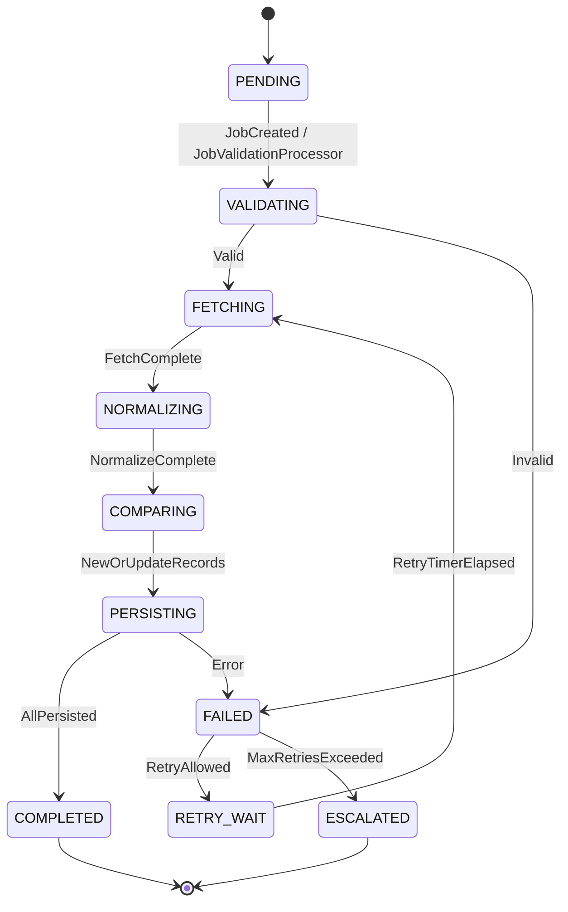

# Functional Requirements — Laureate Ingestion & Notification Prototype

Last updated: 2025-08-15

Summary
- This document defines the canonical, up-to-date functional requirements for the ingestion, normalization, deduplication/versioning, persistence and subscriber notification flows of the Laureate prototype.
- It replaces and clarifies previous logic: stricter enums for statuses, explicit idempotency and retry behavior, structured filters, backpressure and batching rules, and REST response conventions.

Revision notes (high-level changes)
- Introduced explicit enums and constraints for status and lifecycle fields.
- Clarified schedule handling (cron expression + manual flag) and added idempotency tokens for job runs.
- Made transformRules a structured mapping (JSON) rather than opaque String where possible; added validation step.
- Defined retry/backoff policy and dead-letter/escalation handling for jobs and notifications.
- Subscriber filters changed from unstructured String to a structured Filter DSL (JSON) supporting boolean operators, year ranges and categories.
- POST endpoints now follow REST conventions: 201 Created + Location header; responses still include technicalId JSON (compatibility maintained).
- Expanded processor pseudocode to be idempotent, transactional and to include batch/paging support.

---

## 1. Entity Definitions
Types and expectations for persisted entities. All timestamp fields are ISO-8601 strings.

Job
- id (technicalId): String (UUID assigned by system)
- name: String
- sourceUrl: String (OpenDataSoft or other feed endpoint)
- schedule: String|null (cron expression) — nullable for manual-only jobs
- manual: Boolean (true for jobs that must be manually triggered)
- transformRules: JSON/Object (structured mapping or rule set used for normalization)
- status: Enum {PENDING, VALIDATING, FETCHING, NORMALIZING, COMPARING, PERSISTING, COMPLETED, FAILED, RETRY_WAIT, ESCALATED}
- lastRunAt: String|null (timestamp of last run)
- runId: String|null (idempotency token for the last run)
- resultSummary: Object {created: Integer, updated: Integer, unchanged: Integer, failed: Integer}
- retryCount: Integer (current consecutive retry attempts)
- maxRetries: Integer (configured max attempts)
- createdBy: String
- createdAt: String
- updatedAt: String
- meta: Object (optional extra metadata)

Laureate
- id (laureateId): String (UUID)
- naturalKey: String (an application-determined natural uniqueness key — composite of name+year+category or hashed canonical form)
- fullName: String (canonical normalized name)
- rawFullName: String (from source)
- year: Integer
- category: String
- citation: String
- affiliations: Array<String> (normalized list)
- nationality: String
- sourceRecordId: String (reference to raw payload or source record ID)
- lifecycleStatus: Enum {NEW, UPDATED, UNCHANGED}
- matchTags: Array<String> (computed keywords/categories)
- version: Integer (optimistic locking / change version)
- createdAt: String
- updatedAt: String
- provenance: Object (source metadata, transformRulesVersion, jobRunId)

Subscriber
- id (technicalId): String (UUID)
- name: String
- contactMethod: Enum {EMAIL, WEBHOOK, SMS}
- contactAddress: String (email address, webhook endpoint, phone number)
- active: Boolean
- filters: Object (structured Filter DSL - e.g. {"and":[{"category":"Physics"},{"year":{"gte":2000,"lte":2024}}]})
- deliveryPreference: Enum {IMMEDIATE, DIGEST_DAILY, DIGEST_WEEKLY}
- backfillFromDate: String|null (ISO date to start backfill)
- lastNotifiedAt: String|null
- notificationHistorySummary: Object (counts/last X deliveries)
- createdAt: String
- updatedAt: String
- meta: Object (e.g. webhook secret, rateLimit preferences)

Notes
- All enums should be enforced by API validation and stored consistently.
- transformRules should be schema-validated; if the source rule format cannot be expressed as structured JSON, store as rawRules and include parseVersion.

---

## 2. Event types (publish/subscribe model)
- JobCreated (jobId, runId)
- JobValidationFailed (jobId, reasons)
- JobFetchFailed (jobId, runId, reason)
- JobCompleted (jobId, runId, resultSummary)
- LaureateNormalized (payload, jobId, runId)
- LaureatePersisted (laureateId, lifecycleStatus, version, provenance)
- NotificationEnqueued (notificationId)
- NotificationDelivered (notificationId)
- NotificationFailed (notificationId, reason)
- SubscriberCreated / SubscriberUpdated / SubscriberDeactivated

These events are used to drive the asynchronous processors described below.

---

## 3. Workflows and processors
General principles
- Processors must be idempotent. Use dedupe keys, database uniqueness constraints and event runId provenance to avoid duplicate processing.
- Prefer small transactions: persist minimal required state then emit events.
- Use batching when fetching/normalizing records; respect source rate limits and paging.
- Use exponential backoff and a dead-letter/escalation path for failed jobs/notifications.

### Job workflow (updated)
1. Job created (POST /jobs) -> status PENDING. System assigns job.id.
2. Validation: parse/validate schedule, transformRules, and optionally do a head request to sourceUrl. If invalid -> JobValidationFailed and status FAILED.
3. Fetching (for scheduled or manual run): create runId (UUID) and set status FETCHING. Fetch records in pages, applying rate-limit and timeouts.
4. Normalization: for each fetched record, transform using transformRules (structured). Emit LaureateNormalized events in batches.
5. Comparison (Dedup & Version): for each normalized record run DedupAndVersionProcessor which computes naturalKey and compares with existing record, sets lifecycleStatus (NEW/UPDATED/UNCHANGED) and version increments for changes. Emit PersistLaureate events only for NEW or UPDATED.
6. Persist Laureate: Persist (upsert) laureates. Use optimistic locking via version number and store provenance including job runId. Emit LaureatePersisted event.
7. Result: aggregate counts to resultSummary; set status COMPLETED. If transient errors occur, mark FAILED and schedule retry per policy.
8. Retry/Escalate: On failures apply exponential backoff up to maxRetries. After exceeding maxRetries move job.status to ESCALATED and emit an alert for manual intervention.

Mermaid (state diagram — unchanged in structure but with clarified status names):

```mermaid
stateDiagram-v2
    [*] --> PENDING
    PENDING --> VALIDATING : JobCreated / JobValidationProcessor
    VALIDATING --> FETCHING : Valid
    VALIDATING --> FAILED : Invalid
    FETCHING --> NORMALIZING : FetchComplete
    NORMALIZING --> COMPARING : NormalizeComplete
    COMPARING --> PERSISTING : NewOrUpdateRecords
    PERSISTING --> COMPLETED : AllPersisted
    PERSISTING --> FAILED : Error
    FAILED --> RETRY_WAIT : RetryAllowed
    RETRY_WAIT --> FETCHING : RetryTimerElapsed
    FAILED --> ESCALATED : MaxRetriesExceeded
    COMPLETED --> [*]
    ESCALATED --> [*]
```

Required processors (updated names & responsibilities)
- JobValidationProcessor: validates schedule, sourceUrl reachable (optional), transformRules parseable.
- JobFetchProcessor: implements paged fetch with retries, rate-limit handling and produces raw records in batches.
- NormalizeProcessor: deterministic normalization; supports rule versions; emits LaureateNormalized.
- DedupAndVersionProcessor: computes naturalKey, compares with existing, decides NEW/UPDATED/UNCHANGED and sets version.
- PersistLaureateProcessor: upsert laureate and emit LaureatePersisted. Idempotent using naturalKey + job.runId provenance.
- JobCompletionProcessor / JobFailProcessor / JobRetryProcessor / ManualEscalateProcessor: finalize job status, schedule retries and escalate.

Key pseudocode updates (high level)
JobFetchProcessor
```
class JobFetchProcessor {
  process(job, runId) {
    for each page from fetchPages(job.sourceUrl):
      for raw in page.records:
        normalized = NormalizeProcessor.normalize(raw, job.transformRules)
        publishBatchEvent('LaureateNormalized', normalized, jobId=job.id, runId=runId)
  }
}
```

DedupAndVersionProcessor
```
class DedupAndVersionProcessor {
  process(normalized, jobId, runId) {
    naturalKey = computeNaturalKey(normalized)
    existing = findByNaturalKey(naturalKey)
    if not existing:
      normalized.lifecycleStatus = NEW
      normalized.version = 1
      publish PersistLaureate(normalized, jobId, runId)
    else if hasSignificantChange(existing, normalized):
      normalized.version = existing.version + 1
      normalized.lifecycleStatus = UPDATED
      publish PersistLaureate(normalized, jobId, runId)
    else:
      normalized.lifecycleStatus = UNCHANGED
      // optionally update lastSeenAt, do not persist a new version
  }
}
```

PersistLaureateProcessor
```
class PersistLaureateProcessor {
  process(payload) {
    // Upsert semantics with optimistic locking
    begin transaction
      existing = findByNaturalKey(payload.naturalKey)
      if not existing:
        insert new laureate with version=payload.version
      else if payload.version > existing.version:
        update fields, set version=payload.version
      // store provenance: jobId, runId, transformRulesVersion
      commit
    publish LaureatePersisted(laureateId, lifecycleStatus, version, provenance)
  }
}
```

Idempotency notes
- Include job.runId and sourceRecordId in provenance. If the same run attempts to persist the same naturalKey+version again, PersistLaureateProcessor must be a no-op.
- For external fetch retries, dedupe by sourceRecordId and runId to avoid reprocessing identical records.

### Laureate workflow (updated)
1. On LaureatePersisted event -> Enrichment (compute matchTags, normalize affiliations, lookup controlled vocabularies).
2. Matching: run MatchingProcessor against active subscribers. Use structured filters and boolean logic; support fuzzy match thresholds configurable per subscriber.
3. For each match, create NotificationItem and enqueue respecting subscriber.deliveryPreference and deduplication rules (avoid duplicate notifications for same laureate+subscriber+change-window).
4. NotificationDispatch: deliver immediate notifications or add to digest queue. Implement per-subscriber rate limits, retries and backoff; failed deliveries go to retry queue then to dead-letter if exhausted.
5. Audit/Archive: persist notification outcomes and lifecycleStatus changes.
6. ManualReview: if a laureate change matches manual-review rules (high-profile category or large data change), pause automatic notification and create a manual review task.

Processors required
- EnrichmentProcessor
- MatchingProcessor (uses SubscriberMatchCriterion)
- ScheduleNotificationProcessor
- NotificationDispatchProcessor
- NotificationSuccessProcessor / NotificationFailureProcessor / NotificationRetryProcessor
- ManualReviewProcessor
- AuditProcessor

Matching pseudocode update
```
class MatchingProcessor {
  process(laureate) {
    subscribers = queryActiveSubscribers(pageable)
    for s in subscribers:
      if matchesStructuredFilter(s.filters, laureate):
        if not alreadyNotifiedRecently(s.id, laureate.id, window=s.meta.dedupWindow)
          enqueue NotificationItem(subscriberId=s.id, laureateId=laureate.id, deliveryPreference=s.deliveryPreference, changeType=laureate.lifecycleStatus)
  }
}
```

NotificationDispatchProcessor update
```
class NotificationDispatchProcessor {
  process(notificationItem) {
    if notificationItem.deliveryPreference == IMMEDIATE:
      deliver(notificationItem)
    else:
      appendToDigest(notificationItem, subscriberId)
  }
  deliver(item) {
    attempt delivery with configured retries and exponential backoff
    on success: mark delivered and publish NotificationDelivered
    on final failure: publish NotificationFailed and route to dead-letter / manual review alert
  }
}
```

### Subscriber workflow (updated)
1. POST /subscribers -> validate payload. If valid create subscriber (ACTIVE depending on validation) and return technicalId. If backfillFromDate present and allowed, enqueue Backfill job.
2. Validation: ensure contactMethod and contactAddress formats; for WEBHOOK optionally verify callback (challenge-response) and optionally require a secret.
3. Activation: smaller backfills may run automatically; large backfills (configurable threshold by record count or time window) require manual approval before running.
4. BackfillProcessor: query laureates since backfillFromDate in a paged manner and enqueue notifications applying same matching rules.
5. Update/Deactivate: Subscribers can update filters or deliveryPreference; updates may trigger re-validation and optional backfill if required.

Backfill pseudocode (updated)
```
class BackfillProcessor {
  process(subscriber) {
    for r in queryLaureatesSince(subscriber.backfillFromDate, pageable):
      if matches(s.filters, r):
        enqueue NotificationItem(subscriberId=s.id, laureateId=r.id)
  }
}
```

Notes
- Backfill processing must be asynchronous and cancellable. If the result set exceeds configured thresholds, require manual approval and rate-limit processing.
- Keep processors idempotent: check notification history before enqueueing duplicate notifications.

---

## 4. API Endpoints and Rules (updated)
General rules
- POST endpoints create orchestrations; they return 201 Created with Location header set to the resource URL and a JSON body containing { "technicalId": "<id>" }.
- POST must accept an Idempotency-Key header. If the same Idempotency-Key is used, return the previously created technicalId instead of creating a duplicate.
- GET by technicalId returns the persisted entity. GET endpoints are read-only and must not trigger processing.
- Where a POST triggers asynchronous background work (Job or Subscriber backfill), that processing runs independently of the POST response; the returned technicalId is sufficient to monitor progress.

Endpoints
1) Create Job
- POST /jobs
Request JSON (validate):
```
{
  "name": "String",
  "sourceUrl": "String",
  "schedule": "String|null",
  "manual": Boolean,
  "transformRules": Object,
  "createdBy": "String",
  "maxRetries": Integer(optional)
}
```
Response: 201 Created
Headers: Location: /jobs/{technicalId}
Body (exact):
```
{ "technicalId": "String" }
```
GET /jobs/{technicalId} returns full Job entity.

2) Create Subscriber
- POST /subscribers
Request JSON (validate):
```
{
  "name": "String",
  "contactMethod": "EMAIL|WEBHOOK|SMS",
  "contactAddress": "String",
  "filters": Object (Filter DSL),
  "deliveryPreference": "IMMEDIATE|DIGEST_DAILY|DIGEST_WEEKLY",
  "backfillFromDate": "String|null",
  "meta": Object(optional)
}
```
Response: 201 Created, Location header and body { "technicalId": "String" }
GET /subscribers/{technicalId} returns full Subscriber entity.

3) Retrieve Laureate (read-only)
- GET /laureates/{technicalId}
Response: 200 with full Laureate entity.

Rules and notes
- POST responses must include only technicalId in the body to avoid leaking internal details.
- Use Idempotency-Key for duplicate protection on POST operations.
- Backfill is asynchronous and may be subject to manual approval if large.
- GET APIs should support conditional requests (ETag/If-None-Match) for efficiency.

---

## 5. Business rules and edge cases
- Source paging: when sourceUrl provides page tokens, JobFetchProcessor must follow them until exhausted or a configured page limit per run.
- Data schema drift: NormalizeProcessor must support transformRules with versioning. If normalization fails for a record, mark the record failed and continue; aggregate failed counts for job resultSummary.
- Duplicate notifications: avoid notifying the same subscriber about the same laureate and change more than once within a configurable deduplication window (default 7 days).
- High-impact changes: if a laureate change affects controlled fields (e.g., name corrected, category changed), and the subscriber match would cause a new notification, mark for ManualReview if the change meets configured high-impact criteria.
- Webhook delivery: sign notifications with subscriber.meta.webhookSecret if present; implement retries with exponential backoff and jitter.
- Security: only allow POST /jobs and POST /subscribers to authenticated users; preserve createdBy.
- Observability: emit metrics for records fetched, normalized, persisted, notifications enqueued, delivered, failed; log job.runId and traceId for request tracing.

---

If you want I can:
- Provide example payloads for the structured transformRules and filters DSL,
- Expand pseudocode into language-specific implementations or unit-testable algorithms,
- Produce an example end-to-end mermaid sequence (Job POST → Laureate created → Subscriber notified).

Which of these (if any) would you like next?