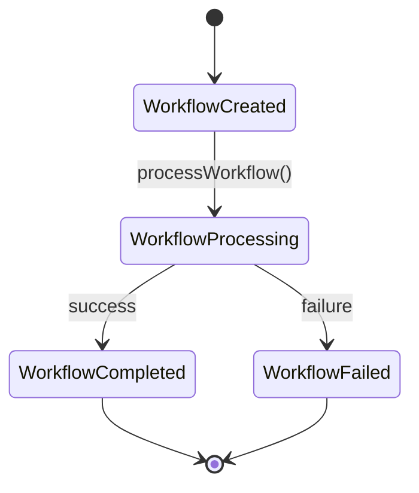
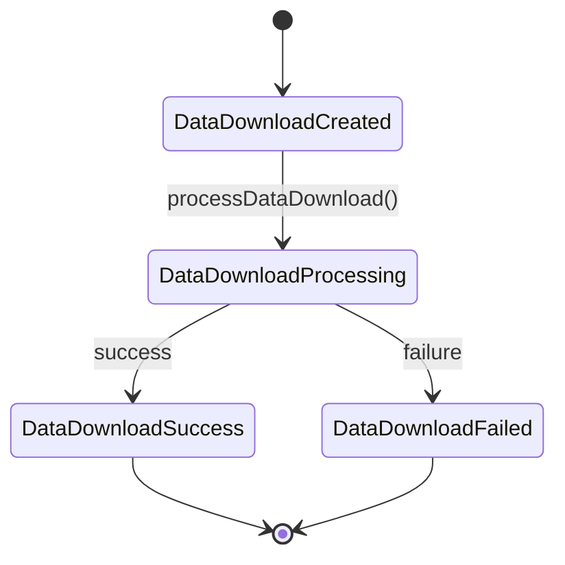
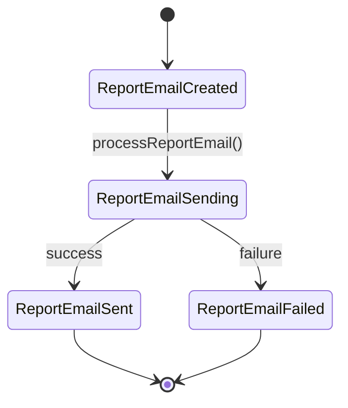
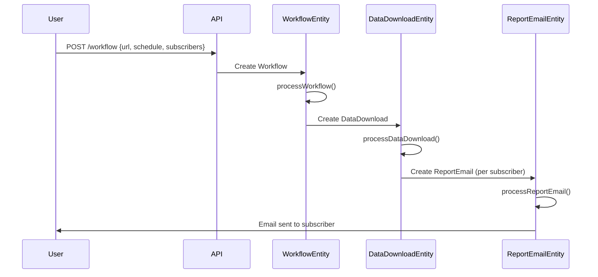

### 1. Entity Definitions

``` 
Workflow:
- url: String (URL to download CSV data)
- scheduleCron: String (Cron expression to schedule the workflow run)
- subscribers: List<String> (List of subscriber emails to send report)
- status: String (Current status of the workflow run, e.g., PENDING, PROCESSING, COMPLETED, FAILED)
- report: String (Analysis report generated after processing)

DataDownload:
- workflowTechnicalId: String (Reference to the Workflow that triggered this download)
- downloadUrl: String (URL from which data was downloaded)
- dataContent: String (Raw CSV data content as string)
- status: String (Download status: PENDING, SUCCESS, FAILED)
- timestamp: String (Download timestamp)

ReportEmail:
- workflowTechnicalId: String (Reference to the Workflow)
- emailTo: String (Subscriber email address)
- emailContent: String (Email body content including report)
- status: String (Email sending status: PENDING, SENT, FAILED)
- timestamp: String (Email sending timestamp)
```

### 2. Process Method Flows

```
processWorkflow() Flow:
1. Initial State: Workflow created with PENDING status
2. Validation: Check URL format and subscriber emails (optional criteria checks)
3. Processing:
   a. Create DataDownload entity to start data fetch
   b. Trigger processDataDownload() via DataDownload creation
4. Completion: Update Workflow.status to COMPLETED if all downstream steps succeed, else FAILED
5. Notification: No direct email here; emails sent per ReportEmail entities

processDataDownload() Flow:
1. Initial State: DataDownload created with PENDING status
2. Processing: Download CSV data from downloadUrl
3. On Success:
   a. Save dataContent and mark status SUCCESS
   b. Trigger data analysis and generate report string
   c. For each subscriber in Workflow.subscribers, create ReportEmail entity
4. On Failure: Mark status FAILED, update Workflow status accordingly

processReportEmail() Flow:
1. Initial State: ReportEmail created with PENDING status
2. Processing: Send email using emailTo and emailContent
3. On Success: Mark status SENT
4. On Failure: Mark status FAILED
```

### 3. API Endpoints Design

| Entity       | POST Endpoint                      | GET by technicalId                   | GET by condition          |
|--------------|----------------------------------|------------------------------------|--------------------------|
| Workflow     | POST `/workflow` (create Workflow) → returns `technicalId` | GET `/workflow/{technicalId}`       | No                       |
| DataDownload | No direct POST (created via Workflow processing) | GET `/datadownload/{technicalId}`  | No                       |
| ReportEmail  | No direct POST (created via DataDownload processing) | GET `/reportemail/{technicalId}`   | No                       |

### 4. Request/Response Formats

**POST /workflow**

Request:
```json
{
  "url": "https://example.com/data.csv",
  "scheduleCron": "0 0 7 * * ?", 
  "subscribers": ["user1@example.com", "user2@example.com"]
}
```

Response:
```json
{
  "technicalId": "wf-123456"
}
```

**GET /workflow/{technicalId}**

Response:
```json
{
  "technicalId": "wf-123456",
  "url": "https://example.com/data.csv",
  "scheduleCron": "0 0 7 * * ?",
  "subscribers": ["user1@example.com", "user2@example.com"],
  "status": "COMPLETED",
  "report": "Summary report content here..."
}
```

**GET /datadownload/{technicalId}**

Response:
```json
{
  "technicalId": "dd-654321",
  "workflowTechnicalId": "wf-123456",
  "downloadUrl": "https://example.com/data.csv",
  "status": "SUCCESS",
  "timestamp": "2024-06-01T07:00:00Z"
}
```

**GET /reportemail/{technicalId}**

Response:
```json
{
  "technicalId": "re-789012",
  "workflowTechnicalId": "wf-123456",
  "emailTo": "user1@example.com",
  "status": "SENT",
  "timestamp": "2024-06-01T07:05:00Z"
}
```

---

### Mermaid Diagrams

**Workflow Entity Lifecycle**


```mermaid
stateDiagram-v2
    [*] --> WorkflowCreated
    WorkflowCreated --> WorkflowProcessing : processWorkflow()
    WorkflowProcessing --> WorkflowCompleted : success
    WorkflowProcessing --> WorkflowFailed : failure
    WorkflowCompleted --> [*]
    WorkflowFailed --> [*]
```

**DataDownload Entity Lifecycle**


```mermaid
stateDiagram-v2
    [*] --> DataDownloadCreated
    DataDownloadCreated --> DataDownloadProcessing : processDataDownload()
    DataDownloadProcessing --> DataDownloadSuccess : success
    DataDownloadProcessing --> DataDownloadFailed : failure
    DataDownloadSuccess --> [*]
    DataDownloadFailed --> [*]
```

**ReportEmail Entity Lifecycle**


```mermaid
stateDiagram-v2
    [*] --> ReportEmailCreated
    ReportEmailCreated --> ReportEmailSending : processReportEmail()
    ReportEmailSending --> ReportEmailSent : success
    ReportEmailSending --> ReportEmailFailed : failure
    ReportEmailSent --> [*]
    ReportEmailFailed --> [*]
```

**Event-Driven Processing Chain**

```mermaid
graph TD
    WorkflowCreated["Workflow Created"]
    DataDownloadCreated["DataDownload Created"]
    ReportEmailCreated["ReportEmail Created"]

    WorkflowCreated -->|processWorkflow()| DataDownloadCreated
    DataDownloadCreated -->|processDataDownload()| ReportEmailCreated
    ReportEmailCreated -->|processReportEmail()| EmailSent["Email Sent"]
```

**User Interaction Sequence Flow**


```mermaid
sequenceDiagram
    participant User
    participant API
    participant WorkflowEntity
    participant DataDownloadEntity
    participant ReportEmailEntity

    User->>API: POST /workflow {url, schedule, subscribers}
    API->>WorkflowEntity: Create Workflow
    WorkflowEntity->>WorkflowEntity: processWorkflow()
    WorkflowEntity->>DataDownloadEntity: Create DataDownload
    DataDownloadEntity->>DataDownloadEntity: processDataDownload()
    DataDownloadEntity->>ReportEmailEntity: Create ReportEmail (per subscriber)
    ReportEmailEntity->>ReportEmailEntity: processReportEmail()
    ReportEmailEntity->>User: Email sent to subscriber
```

---

This completes the functional requirements specification for your event-driven backend application. Please feel free to ask if you want to extend or modify any parts!