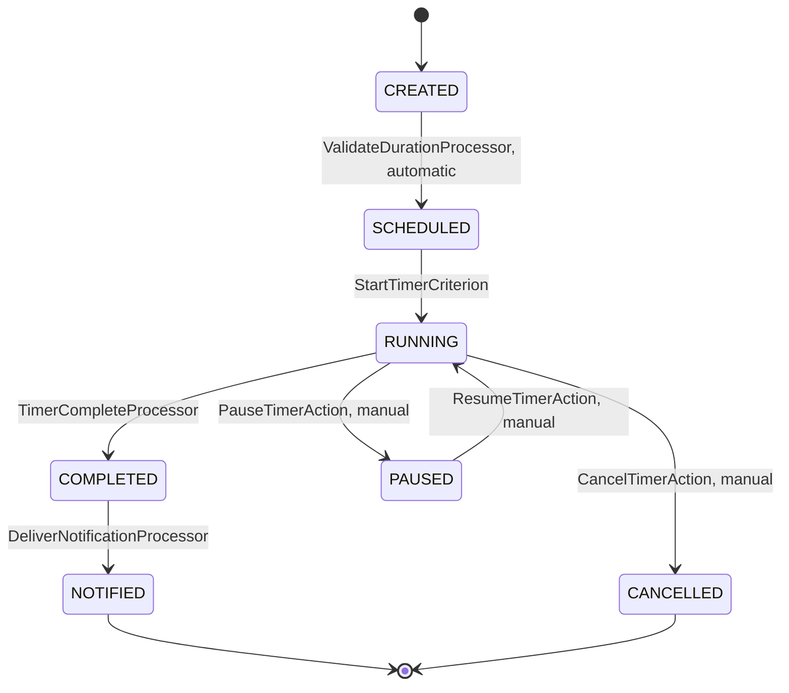
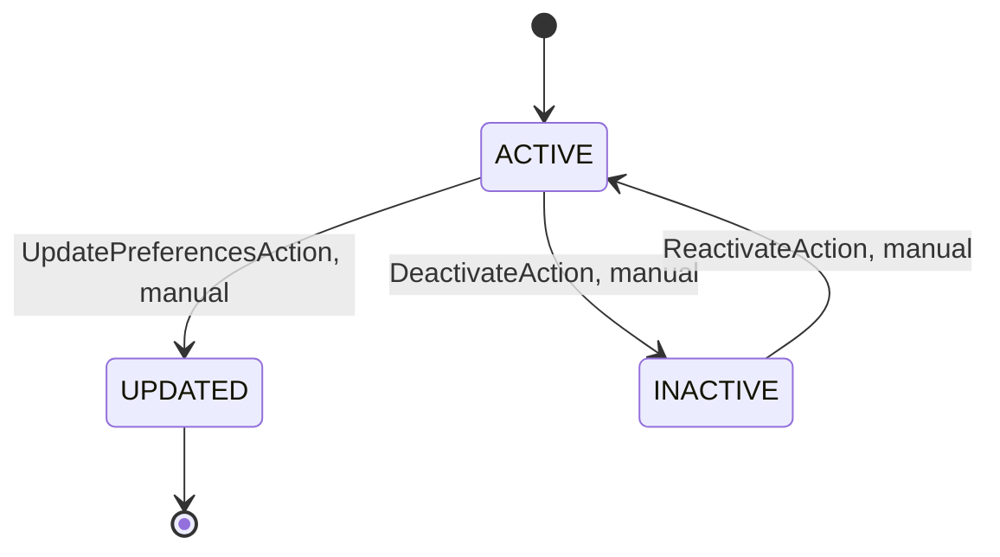
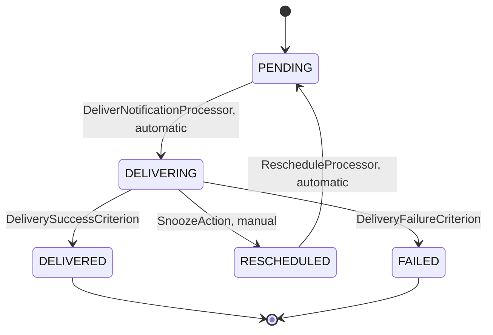

### 1. Entity Definitions
```
User:
- id: String (business id, e.g., email or UUID)
- name: String (display name)
- timezone: String (user timezone for scheduling)
- preferences: Object (defaultBoilType, defaultEggSize, allowMultipleTimers)

EggTimer:
- id: String (business id)
- ownerUserId: String (links to User.id)
- boilType: String (soft/medium/hard)
- eggSize: String (small/medium/large)
- eggsCount: Integer (number of eggs)
- durationSeconds: Integer (calculated or overridden)
- startAt: String (ISO timestamp when timer should start)
- state: String (created/scheduled/running/paused/completed/cancelled)
- createdAt: String (ISO timestamp)

Notification:
- id: String (business id)
- timerId: String (links to EggTimer.id)
- userId: String (links to User.id)
- notifyAt: String (ISO timestamp)
- method: String (alarm/sound/visual)
- delivered: Boolean
- snoozeCount: Integer
```

### 2. Entity workflows

EggTimer workflow:
1. Initial State: created when POSTed → SCHEDULED (automatic: Cyoda starts workflow on persist)
2. Validate: Check user preferences and compute duration (automatic)
3. Schedule: register Notification(s) and transition to RUNNING at startAt (automatic)
4. Running: countdown -> on completion create Notification and transition to COMPLETED (automatic)
5. User actions: pause/resume/cancel -> manual transitions to PAUSED/CANCELLED
6. Post-process: persist history and optionally create UsageRecord (automatic)


```mermaid
stateDiagram-v2
    [*] --> CREATED
    CREATED --> SCHEDULED : ValidateDurationProcessor, automatic
    SCHEDULED --> RUNNING : StartTimerCriterion
    RUNNING --> COMPLETED : TimerCompleteProcessor
    RUNNING --> PAUSED : PauseTimerAction, manual
    PAUSED --> RUNNING : ResumeTimerAction, manual
    RUNNING --> CANCELLED : CancelTimerAction, manual
    COMPLETED --> NOTIFIED : DeliverNotificationProcessor
    NOTIFIED --> [*]
    CANCELLED --> [*]
```

Processors and criteria (EggTimer):
- Criteria: StartTimerCriterion (checks startAt <= now), TimerCompleteCriterion (timer elapsed)
- Processors: ValidateDurationProcessor (compute duration from boilType/eggSize), ScheduleNotificationProcessor (create Notification), TimerCompleteProcessor (mark complete), DeliverNotificationProcessor (enqueue delivery), PersistHistoryProcessor

User workflow:
1. Created via POST -> ACTIVE
2. Update preferences -> MANUAL changes
3. Deactivate -> INACTIVE


```mermaid
stateDiagram-v2
    [*] --> ACTIVE
    ACTIVE --> UPDATED : UpdatePreferencesAction, manual
    ACTIVE --> INACTIVE : DeactivateAction, manual
    INACTIVE --> ACTIVE : ReactivateAction, manual
    UPDATED --> [*]
```

Processors/criteria (User):
- Processors: ValidateUserProcessor, ApplyPreferencesProcessor, DeactivateProcessor
- Criteria: None required beyond manual actions

Notification workflow:
1. Created by ScheduleNotificationProcessor -> PENDING
2. Attempt delivery -> DELIVERING (automatic)
3. On success -> DELIVERED
4. On failure or snooze -> RESCHEDULED or FAILED (manual retry or automatic retry)


```mermaid
stateDiagram-v2
    [*] --> PENDING
    PENDING --> DELIVERING : DeliverNotificationProcessor, automatic
    DELIVERING --> DELIVERED : DeliverySuccessCriterion
    DELIVERING --> RESCHEDULED : SnoozeAction, manual
    DELIVERING --> FAILED : DeliveryFailureCriterion
    DELIVERED --> [*]
    RESCHEDULED --> PENDING : RescheduleProcessor, automatic
    FAILED --> [*]
```

Processors/criteria (Notification):
- Criteria: DeliverySuccessCriterion, DeliveryFailureCriterion
- Processors: DeliverNotificationProcessor, RescheduleProcessor, MarkDeliveredProcessor

### 3. Pseudo code for processor classes (examples)
ValidateDurationProcessor:
```
process(timer):
  if timer.durationSeconds is null:
    timer.durationSeconds = lookupDuration(timer.boilType, timer.eggSize)
  persist(timer)
```
ScheduleNotificationProcessor:
```
process(timer):
  notifyAt = timer.startAt + timer.durationSeconds
  create Notification(timerId=timer.id,userId=timer.ownerUserId,notifyAt=notifyAt,method=alarm,delivered=false)
```
TimerCompleteProcessor:
```
process(timer):
  if now >= timer.startAt + timer.durationSeconds:
    timer.state = completed
    persist(timer)
    ScheduleNotificationProcessor.process(timer) // to ensure delivery
```

### 4. API Endpoints Design Rules (Cyoda event rules)
- POST /users -> creates User (triggers Cyoda user workflow)
  Request:
  ```json
  { "id": "user-123", "name": "Alice", "timezone": "Europe/Berlin", "preferences": {"defaultBoilType":"soft","defaultEggSize":"medium","allowMultipleTimers":true} }
  ```
  Response:
  ```json
  { "technicalId": "tech-usr-0001" }
  ```
- GET /users/{technicalId}
  Response: full stored User JSON

- POST /timers -> creates EggTimer (triggers EggTimer workflow)
  Request:
  ```json
  { "id":"timer-456","ownerUserId":"user-123","boilType":"soft","eggSize":"medium","eggsCount":2,"startAt":"2025-08-21T07:00:00Z" }
  ```
  Response:
  ```json
  { "technicalId": "tech-timer-0001" }
  ```
- GET /timers/{technicalId}
  Response: full stored EggTimer JSON

- GET /notifications/{technicalId}
  Response: full stored Notification JSON

Notes / questions for you
- Do you want multiple simultaneous timers per user? (affects allowMultipleTimers and scheduling)
- Should egg size/count modify duration rules or be informational only?
- Do you want a persistent timer history entity (would add 4th entity)?
Confirm and I will expand the model to include history/presets or increase entities up to 10 and produce a Cyoda-ready specification.