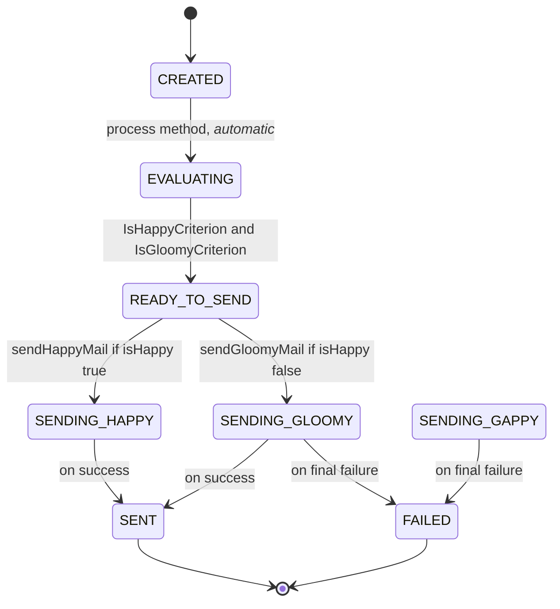

# Functional Requirements (Finalized)

### 1. Entity Definitions
```
Mail:
- isHappy: Boolean (nullable; set by evaluation criteria)
- mailList: List<String> (recipient addresses)
- status: String (current workflow state)
- attemptCount: Integer (number of send attempts)
- lastAttemptAt: DateTime (timestamp of last send attempt)
```

Note: You specified one entity (Mail). No additional entities added.

---

### 2. Entity workflows

Mail workflow:
1. Creation (automatic): Mail persisted -> status = CREATED -> Cyoda starts workflow (process method).
2. Evaluation (automatic): Run IsHappyCriterion and IsGloomyCriterion -> set isHappy true/false -> move to READY_TO_SEND.
3. Sending (automatic): If isHappy true -> invoke sendHappyMail processor. If isHappy false -> invoke sendGloomyMail processor.
4. On Send Success (automatic): status -> SENT.
5. On Send Failure (automatic): increment attemptCount, update lastAttemptAt -> if attemptCount < maxRetries -> status -> READY_TO_SEND (retry); else status -> FAILED (manual intervention required).

Entity state diagram


```mermaid
stateDiagram-v2
    [*] --> CREATED
    CREATED --> EVALUATING : process method, *automatic*
    EVALUATING --> READY_TO_SEND : IsHappyCriterion and IsGloomyCriterion
    READY_TO_SEND --> SENDING_HAPPY : sendHappyMail if isHappy true
    READY_TO_SEND --> SENDING_GLOOMY : sendGloomyMail if isHappy false
    SENDING_HAPPY --> SENT : on success
    SENDING_GAPPY --> FAILED : on final failure
    SENDING_GLOOMY --> SENT : on success
    SENDING_GLOOMY --> FAILED : on final failure
    SENT --> [*]
    FAILED --> [*]
```

(If your Cyoda model requires exact state names, replace as needed. maxRetries is a configurable runtime policy.)

Processors and Criteria needed
- Criteria:
  - IsHappyCriterion (returns true if mail considered happy)
  - IsGloomyCriterion (returns true if mail considered gloomy)
- Processors:
  - sendHappyMail
  - sendGloomyMail

---

### 3. Pseudo code for processor classes

sendHappyMail processor
```
class SendHappyMailProcessor {
  process(Mail mail) {
    try {
      for each recipient in mail.mailList {
        send email to recipient with happy template
      }
      mail.status = SENT
      persist mail
    } catch (transientError) {
      mail.attemptCount += 1
      mail.lastAttemptAt = now()
      if mail.attemptCount < MAX_RETRIES {
        mail.status = READY_TO_SEND
      } else {
        mail.status = FAILED
      }
      persist mail
    }
  }
}
```

sendGloomyMail processor
```
class SendGloomyMailProcessor {
  process(Mail mail) {
    try {
      for each recipient in mail.mailList {
        send email to recipient with gloomy template
      }
      mail.status = SENT
      persist mail
    } catch (transientError) {
      mail.attemptCount += 1
      mail.lastAttemptAt = now()
      if mail.attemptCount < MAX_RETRIES {
        mail.status = READY_TO_SEND
      } else {
        mail.status = FAILED
      }
      persist mail
    }
  }
}
```

IsHappyCriterion (behavior)
- Inspect mail content/metadata or explicit flag.
- Return true if rules match happy conditions; otherwise false.

IsGloomyCriterion
- Complementary to IsHappyCriterion; return true when mail is not happy.

---

### 4. API Endpoints Design Rules

Endpoints (Event-driven):
- POST /mails
  - Purpose: Persist Mail (this POST is the EVENT that triggers the Cyoda Mail workflow).
  - Response: JSON with only technicalId.
  - Request JSON:
    {
      "isHappy": null,
      "mailList": ["alice@example.com","bob@example.com"]
    }
  - Response JSON:
    {
      "technicalId": "generated-id-123"
    }

- GET /mails/{technicalId}
  - Purpose: Retrieve stored Mail result/state.
  - Response JSON:
    {
      "isHappy": true,
      "mailList": ["alice@example.com","bob@example.com"],
      "status": "SENT",
      "attemptCount": 1,
      "lastAttemptAt": "2025-08-18T12:00:00Z"
    }

Request/Response flow (mermaid)

```mermaid
flowchart LR
    A[POST /mails request] --> B[Store Mail entity]
    B --> C[Return technicalId]
    D[GET /mails/{technicalId}] --> E[Return Mail state]
```

Notes / decisions for you
- Confirm how IsHappyCriterion determines happiness (explicit flag in request vs content rules).
- Confirm retry policy (MAX_RETRIES) and whether manual transitions (e.g., manual resend) are needed.
- If you want additional metadata stored (subject/body), we can add fields to Mail.