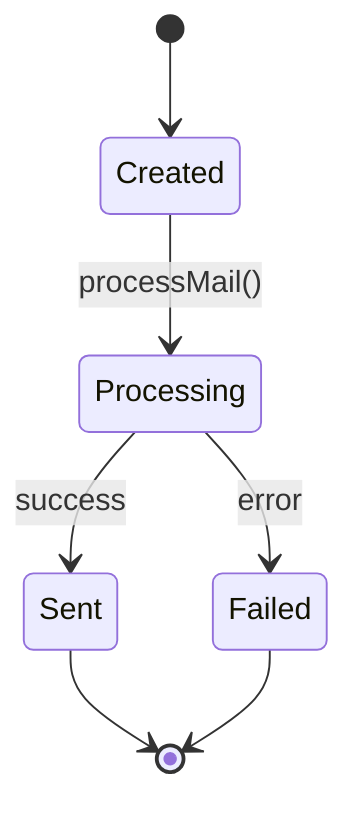
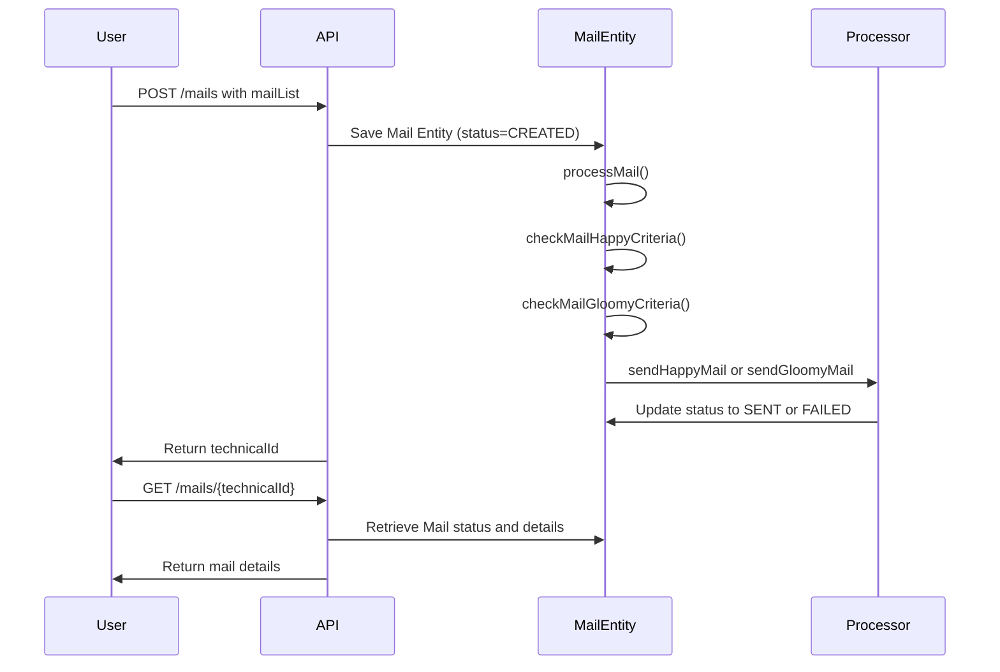

### 1. Entity Definitions

``` 
Mail:  
- isHappy: Boolean (Indicates if the mail is happy or gloomy)  
- mailList: List<String> (List of recipient emails)  
- status: MailStatusEnum (Entity lifecycle state: CREATED, PROCESSING, SENT, FAILED)  
```

### 2. Process Method Flows

```
processMail() Flow:  
1. Initial State: Mail entity created with status = CREATED  
2. Validation: Trigger checks  
   - checkMailHappyCriteria()  
   - checkMailGloomyCriteria()  
3. Classification:  
   - If happy criteria met → set isHappy = true  
   - Else if gloomy criteria met → set isHappy = false  
4. Processing:  
   - If isHappy == true → trigger sendHappyMail processor  
   - Else → trigger sendGloomyMail processor  
   - Update status to PROCESSING  
5. Sending:  
   - Execute mail sending logic (different templates for happy/gloomy)  
   - On success → update status to SENT  
   - On failure → update status to FAILED  
6. Notification/Logging: Log results for monitoring  
```

### 3. API Endpoints Design

| Method | Endpoint           | Description                                                | Request Body                   | Response                      |
|--------|--------------------|------------------------------------------------------------|--------------------------------|-------------------------------|
| POST   | `/mails`           | Create a new Mail entity and trigger processing            | `{ "isHappy": null, "mailList": [...] }` (isHappy nullable, determined by criteria) | `{ "technicalId": "uuid" }`    |
| GET    | `/mails/{technicalId}` | Retrieve Mail entity status and details by technicalId    | N/A                            | `{ "isHappy": bool, "mailList": [...], "status": "CREATED|PROCESSING|SENT|FAILED" }` |
| GET    | `/mails` (optional) | Retrieve all mails (only if explicitly requested)          | N/A                            | List of mails with details     |

### 4. Request/Response Formats

**POST /mails request example**

```json
{
  "isHappy": null,
  "mailList": [
    "user1@example.com",
    "user2@example.com"
  ]
}
```

**POST /mails response example**

```json
{
  "technicalId": "123e4567-e89b-12d3-a456-426614174000"
}
```

**GET /mails/{technicalId} response example**

```json
{
  "isHappy": true,
  "mailList": [
    "user1@example.com",
    "user2@example.com"
  ],
  "status": "SENT"
}
```

---

### Mermaid Diagrams

**Mail Entity Lifecycle State Diagram**


```mermaid
stateDiagram-v2
    [*] --> Created
    Created --> Processing : processMail()
    Processing --> Sent : success
    Processing --> Failed : error
    Sent --> [*]
    Failed --> [*]
```

**Event-Driven Processing Chain**

```mermaid
flowchart TD
    SaveMail[Save Mail Entity]
    Validate[Validate Criteria]
    CheckHappy[checkMailHappyCriteria()]
    CheckGloomy[checkMailGloomyCriteria()]
    Classify[Set isHappy Flag]
    ProcessorHappy[sendHappyMail Processor]
    ProcessorGloomy[sendGloomyMail Processor]
    MailSent[Mail Sent Successfully]
    MailFailed[Mail Sending Failed]

    SaveMail --> Validate
    Validate --> CheckHappy
    Validate --> CheckGloomy
    CheckHappy -->|true| Classify
    CheckGloomy -->|true| Classify
    Classify -->|isHappy = true| ProcessorHappy
    Classify -->|isHappy = false| ProcessorGloomy
    ProcessorHappy --> MailSent
    ProcessorHappy --> MailFailed
    ProcessorGloomy --> MailSent
    ProcessorGloomy --> MailFailed
```

**User Interaction Sequence Flow**


```mermaid
sequenceDiagram
    participant User
    participant API
    participant MailEntity
    participant Processor

    User->>API: POST /mails with mailList
    API->>MailEntity: Save Mail Entity (status=CREATED)
    MailEntity->>MailEntity: processMail()
    MailEntity->>MailEntity: checkMailHappyCriteria()
    MailEntity->>MailEntity: checkMailGloomyCriteria()
    MailEntity->>Processor: sendHappyMail or sendGloomyMail
    Processor->>MailEntity: Update status to SENT or FAILED
    API->>User: Return technicalId
    User->>API: GET /mails/{technicalId}
    API->>MailEntity: Retrieve Mail status and details
    API->>User: Return mail details
```

---

This completes the confirmed functional requirements for your Happy Mail sender backend application using Event-Driven Architecture on Cyoda platform.