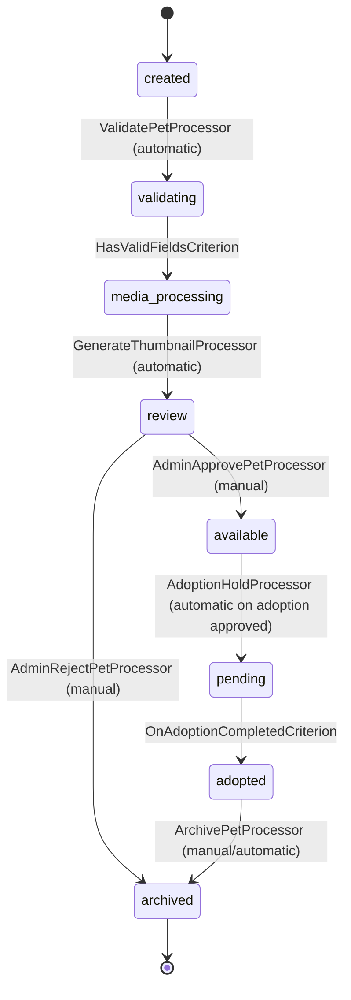
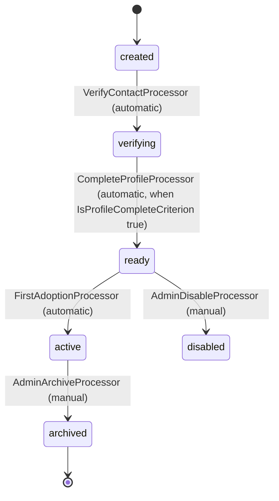
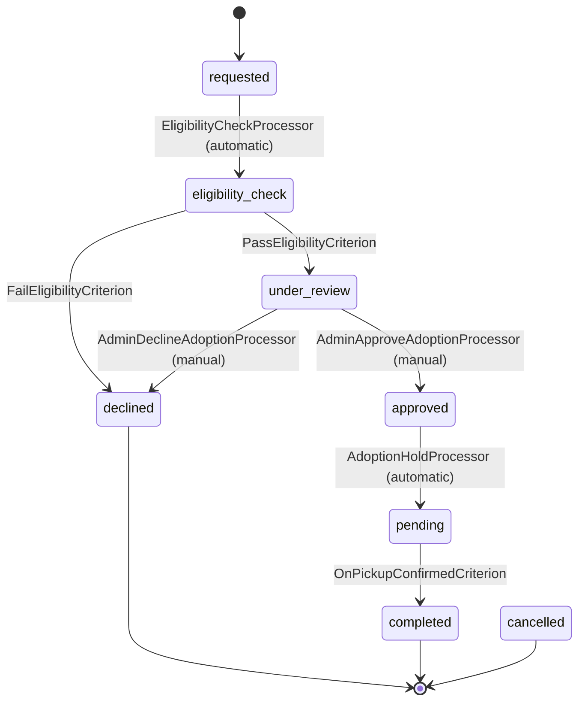

# Functional Requirements — Pet Adoption Prototype

This document describes the canonical functional requirements, entity models, workflows, processors, criteria, and API contract for the pet adoption prototype. It consolidates and normalizes terminology, states, and processor names so the implementation and orchestration (Cyoda) behavior is unambiguous.

CHANGELOG
- Normalized entity status enums and capitalisation to lower-case string values.
- Aligned workflow states, processors and criteria names with pseudo-code examples.
- Clarified behavior for POST responses (technicalId only), GET responses, and side effects (workflow triggers).
- Added explicit mapping: "pending" = held for adoption (previously "hold"/"pending").
- Made adoption order lifecycle and automatic eligibility behavior explicit.

---

## 1. Entity Definitions (canonical)

All business-visible entities have two identifiers:
- id: String — business id provided in client payload (human-readable, e.g. "pet-123").
- technicalId: String — internal technical id returned by POST endpoints and used for GET by technical id.

Entities and canonical fields:

Pet
- id: String (business id, human-readable)
- technicalId: String (internal id assigned by system)
- name: String (pet name)
- species: String (dog/cat/etc)
- breed: String (breed description)
- ageMonths: Integer (age in months)
- sex: String ("M" / "F" / "Unknown")
- status: String (one of: "available" / "pending" / "adopted" / "archived")
  - Note: "pending" is used to indicate the pet is held for an approved adoption (previously referred to as "hold").
- images: List<String> (image URLs)
- imageThumbs: List<String> (generated thumbnail URLs)
- location: String (store or foster location)
- vaccinationSummary: String (short text)
- medicalNotes: String (freeform medical details)
- tags: Map<String,String> (optional metadata, e.g. validation=passed)
- addedAt: String (ISO datetime)

User
- id: String (business id)
- technicalId: String (internal id)
- fullName: String
- email: String
- phone: String
- address: String
- preferences: List<String> (species/breed/age preferences)
- adoptionHistory: List<String> (business pet ids adopted)
- verified: Boolean (derived: whether contact verification completed)
- status: String (one of: "created" / "ready" / "active" / "disabled" / "archived")
- createdAt: String (ISO datetime)

AdoptionOrder
- id: String (business id)
- technicalId: String (internal id)
- petId: String (ref Pet.id)
- userId: String (ref User.id)
- status: String (one of: "requested" / "under_review" / "approved" / "declined" / "cancelled" / "completed")
- requestedDate: String (ISO datetime)
- approvedDate: String (ISO datetime, optional)
- completedDate: String (ISO datetime, optional)
- cancelledDate: String (ISO datetime, optional)
- notes: String (applicant notes or admin notes)
- pickupMethod: String ("inStore" / "homeDelivery")

Additional entities (optional): VetRecord, StoreLocation, FosterRecord — not included by default but can be added.

---

## 2. Workflows (behavioral logic)

General note: Each POST (entity creation) triggers a Cyoda event and begins the corresponding entity workflow automatically. Processors and criteria are invoked according to workflow definitions. Manual/admin transitions remain explicit and require human action.

Canonical state naming: workflows below use the canonical lower-case state strings documented in the entity definitions. The diagrams use named workflow states and processors for clarity.

### Pet workflow (high level)

Purpose: validate incoming pet listings, process media, allow admin review, publish, hold for adoption, complete adoption, and archive.

States and transitions (summary):
1. created — POST /pets creates the pet and starts validation.
2. validating — automatic validation of required fields and basic checks.
3. media_processing — automatic generation of thumbnails and media accessibility checks.
4. review — manual admin review; admin may approve or reject.
5. available — published and visible for adoption.
6. pending — pet is held for an approved adoption (adoption order approved).
7. adopted — adoption completed, adoption history updated, may trigger medical follow-up.
8. archived — admin-archived records for long-term storage.

Mermaid diagram (workflow visualization):


```mermaid
stateDiagram-v2
    [*] --> created
    created --> validating : ValidatePetProcessor (automatic)
    validating --> media_processing : HasValidFieldsCriterion
    media_processing --> review : GenerateThumbnailProcessor (automatic)
    review --> available : AdminApprovePetProcessor (manual)
    review --> archived : AdminRejectPetProcessor (manual)
    available --> pending : AdoptionHoldProcessor (automatic on adoption approved)
    pending --> adopted : OnAdoptionCompletedCriterion
    adopted --> archived : ArchivePetProcessor (manual/automatic)
    archived --> [*]
```

Pet processors and criteria (canonical list):
- Processors: ValidatePetProcessor, GenerateThumbnailProcessor, AdminApprovePetProcessor, AdminRejectPetProcessor, AdoptionHoldProcessor, ArchivePetProcessor
- Criteria: HasValidFieldsCriterion, HasValidImagesCriterion, OnAdoptionCompletedCriterion, NeedsMedicalFollowupCriterion

Behavioral notes:
- ValidatePetProcessor must ensure required fields (name, species) are present and that image URLs are reachable when present. On validation failure, the processor may attach tags and leave the entity in reviewing/created state pending admin intervention.
- GenerateThumbnailProcessor creates thumbnails and populates imageThumbs; failures should be retried and may block publish until resolved.
- AdminApprovePetProcessor sets pet.status = "available".
- AdoptionHoldProcessor sets pet.status = "pending" when an adoption order transitions to "approved".

### User workflow (high level)

Purpose: verify contact information, ensure profile completeness, activate on adoption, and allow admin disabling/archiving.

States and transitions:
1. created — POST /users creates the user and starts verification.
2. verifying — automatic verification of email/phone format and duplication checks.
3. ready — profile has required fields (verified and profile complete).
4. active — after first successful adoption or manual activation.
5. disabled — admin disabled the account.
6. archived — admin archived.

Mermaid diagram:


```mermaid
stateDiagram-v2
    [*] --> created
    created --> verifying : VerifyContactProcessor (automatic)
    verifying --> ready : CompleteProfileProcessor (automatic, when IsProfileCompleteCriterion true)
    ready --> active : FirstAdoptionProcessor (automatic)
    ready --> disabled : AdminDisableProcessor (manual)
    active --> archived : AdminArchiveProcessor (manual)
    archived --> [*]
```

User processors and criteria:
- Processors: VerifyContactProcessor, CompleteProfileProcessor, FirstAdoptionProcessor, AdminDisableProcessor, AdminArchiveProcessor
- Criteria: IsProfileCompleteCriterion, VerifyUserCriterion

Behavioral notes:
- VerifyContactProcessor sets user.verified = true if contact methods pass verification; otherwise, it may leave the account in verifying state and attach a flag.
- CompleteProfileProcessor marks the user.status = "ready" if IsProfileCompleteCriterion is true.

### AdoptionOrder workflow (high level)

Purpose: orchestrate adoption requests including eligibility checks, admin review, pet hold/release, completion, and cancellations.

States and transitions:
1. requested — POST /adoptions creates the order and starts eligibility checks.
2. under_review — if eligibility checks pass but require admin intervention (or if user requires manual verification).
3. approved — admin approved the adoption. On approval: order.approvedDate set, order.status="approved", NotifyUserProcessor invoked, pet.status -> "pending".
4. declined — admin or automatic checks declined the adoption; if the pet was held, pet.status -> "available".
5. cancelled — user or admin cancelled the order; if the pet was held, pet.status -> "available".
6. completed — pickup/delivery confirmed; order.completedDate set; order.status = "completed"; pet.status -> "adopted"; user.adoptionHistory updated.

Mermaid diagram:


```mermaid
stateDiagram-v2
    [*] --> requested
    requested --> eligibility_check : EligibilityCheckProcessor (automatic)
    eligibility_check --> under_review : PassEligibilityCriterion
    eligibility_check --> declined : FailEligibilityCriterion
    under_review --> approved : AdminApproveAdoptionProcessor (manual)
    under_review --> declined : AdminDeclineAdoptionProcessor (manual)
    approved --> pending : AdoptionHoldProcessor (automatic)
    pending --> completed : OnPickupConfirmedCriterion
    declined --> [*]
    completed --> [*]
    cancelled --> [*]
```

AdoptionOrder processors and criteria (canonical list):
- Processors: EligibilityCheckProcessor, AdminApproveAdoptionProcessor, AdminDeclineAdoptionProcessor, AdoptionHoldProcessor, NotifyUserProcessor, CancelAdoptionProcessor
- Criteria: PassEligibilityCriterion, FailEligibilityCriterion, OnPickupConfirmedCriterion, NeedsAdminReviewCriterion

Behavioral notes:
- EligibilityCheckProcessor should fetch the pet and user and ensure the pet.status == "available" and user.verified == true. If pet is not "available", the processor should set order.status = "declined" with a reason and persist that state. If the user is not verified but other checks pass, the order should move to "under_review" and notify admin for manual approval.
- AdminApproveAdoptionProcessor sets order.approvedDate = now, order.status = "approved", triggers AdoptionHoldProcessor and NotifyUserProcessor.
- AdoptionHoldProcessor sets pet.status = "pending" and records a hold metadata entry (e.g. holdExpiresAt optional) to avoid race conditions.
- On cancellation or decline while pet.status == "pending" for that order, a release action sets pet.status back to "available" unless another concurrent hold applies.

---

## 3. Processor pseudocode (consistent/canonical examples)

Each processor implements a process(entity) method invoked by Cyoda when the corresponding event occurs.

ValidatePetProcessor

```
class ValidatePetProcessor {
  void process(Pet pet) {
    if (pet.name == null || pet.name.trim().isEmpty()) throw new ValidationError("name required");
    if (pet.species == null || pet.species.trim().isEmpty()) throw new ValidationError("species required");
    if (pet.images != null && pet.images.size() > 0) {
      for (url in pet.images) {
        if (!isUrlReachable(url)) throw new ValidationError("image unreachable: " + url);
      }
    }
    pet.tags.put("validation","passed");
    persist(pet);
  }
}
```

GenerateThumbnailProcessor

```
class GenerateThumbnailProcessor {
  void process(Pet pet) {
    thumbnails = []
    for (url in pet.images) {
      thumbUrl = createThumbnailAndStore(url)
      thumbnails.add(thumbUrl)
    }
    pet.imageThumbs = thumbnails
    persist(pet)
  }
}
```

EligibilityCheckProcessor

```
class EligibilityCheckProcessor {
  void process(AdoptionOrder order) {
    pet = fetchPet(order.petId)
    user = fetchUser(order.userId)

    // If pet is not available, decline immediately
    if (pet.status != "available") {
      order.status = "declined"
      order.notes = "Pet not available"
      persist(order)
      return
    }

    // If user not verified, escalate to manual review
    if (user.verified != true) {
      order.status = "under_review"
      persist(order)
      notifyAdmin(order, "User requires verification")
      return
    }

    // Otherwise pass eligibility to admin review (or auto-approve per policy)
    order.status = "under_review"
    persist(order)
    notifyAdmin(order, "Order passed initial checks")
  }
}
```

AdminApproveAdoptionProcessor

```
class AdminApproveAdoptionProcessor {
  void process(AdoptionOrder order) {
    order.approvedDate = now()
    order.status = "approved"
    persist(order)

    AdoptionHoldProcessor.process(order)
    NotifyUserProcessor.process(order)
  }
}
```

NotifyUserProcessor

```
class NotifyUserProcessor {
  void process(Entity e) {
    payload = buildNotificationPayload(e)
    sendEmail(payload.email)
    sendSms(payload.phone)
  }
}
```

CancelAdoptionProcessor (brief)

```
class CancelAdoptionProcessor {
  void process(AdoptionOrder order) {
    order.status = "cancelled"
    order.cancelledDate = now()
    persist(order)
    // If order had held the pet, release it
    pet = fetchPet(order.petId)
    if (pet.status == "pending") {
      pet.status = "available"
      persist(pet)
    }
    NotifyUserProcessor.process(order)
  }
}
```

Notes on processors:
- Processors should be idempotent where possible. Re-processing an event that has already been handled should not produce inconsistent state.
- Processors may emit new events (for Cyoda) to transition workflows of related entities (e.g. changing an adoption order to "approved" should emit/persist and cause the pet workflow to react via AdoptionHoldProcessor).

---

## 4. API Endpoints Design Rules

General rules:
- POST endpoints create an entity and must return only a JSON object containing the assigned technicalId.
- The receipt of a POST triggers the corresponding Cyoda entity workflow automatically.
- GET by technicalId must exist for all entities created via POST and must return the stored entity together with the technicalId.
- List (GET all) endpoints are optional read-only and must not start workflows.
- All API timestamps are ISO-8601 (UTC preferred).
- Error responses should use standard HTTP codes and return a JSON body with { "error": "message", "details": {...} }.

Endpoints and JSON shapes (examples):

POST /pets
- Request body: Pet object (business id and fields). Do not provide technicalId.

Example request body:
```
{
  "id": "pet-123",
  "name": "Mittens",
  "species": "Cat",
  "breed": "Tabby",
  "ageMonths": 12,
  "sex": "F",
  "images": ["https://.../1.jpg"],
  "location": "Store A",
  "vaccinationSummary": "Rabies up to date",
  "medicalNotes": "",
  "addedAt": "2025-08-22T10:00:00Z"
}
```

Response (only technicalId):
```
{ "technicalId": "tech-pet-0001" }
```

GET /pets/{technicalId}
- Response: stored pet object including assigned technicalId and current pet.status.

Example response:
```
{
  "technicalId": "tech-pet-0001",
  "entity": {
    "id":"pet-123",
    "technicalId":"tech-pet-0001",
    "name":"Mittens",
    "species":"Cat",
    "breed":"Tabby",
    "ageMonths":12,
    "sex":"F",
    "status":"available",
    "images":["https://.../1.jpg"],
    "imageThumbs":["https://.../1-thumb.jpg"],
    "location":"Store A",
    "vaccinationSummary":"Rabies up to date",
    "medicalNotes":"",
    "addedAt":"2025-08-22T10:00:00Z"
  }
}
```

POST /users
- Request body: User object (business id and fields). Response: { "technicalId": "..." }

POST /adoptions
- Request body: AdoptionOrder object (business id and fields). Response: { "technicalId": "..." }

Example POST /adoptions body:
```
{
  "id":"order-900",
  "petId":"pet-123",
  "userId":"user-55",
  "status":"requested",
  "requestedDate":"2025-08-22T11:00:00Z",
  "notes":"Would prefer home delivery",
  "pickupMethod":"homeDelivery"
}
```

GET endpoints return { "technicalId": "...", "entity": { ... } } as shown above.

Behavior notes:
- On POST /adoptions, system runs EligibilityCheckProcessor. That processor may set order.status to "declined" or "under_review" immediately and persist that result — callers should retrieve the entity via GET to observe the current state.
- Admin actions (approve/decline/cancel) are explicit operations (e.g. POST /adoptions/{technicalId}/approve) and must persist changes and trigger associated processors (AdoptionHoldProcessor, NotifyUserProcessor, etc.).
- If multiple adoption orders compete for the same pet, the first order to be approved must set pet.status = "pending" and subsequent eligibility checks for that pet should fail (orders set to "declined") unless a policy allows queuing.

Optional APIs (recommendation):
- POST /adoptions/{technicalId}/approve (admin only)
- POST /adoptions/{technicalId}/decline (admin only)
- POST /adoptions/{technicalId}/cancel (user or admin)
- POST /pets/{technicalId}/archive (admin only)
- GET /pets?species=cat&location=Store%20A (search/filter read endpoints)

---

## 5. Operational considerations

- Idempotency: POST endpoints should support idempotency via an Idempotency-Key header or dedup by business id to avoid duplicate technicalIds for repeated requests.
- Concurrency: When moving pets to "pending", use transactional locks or compare-and-set semantics to avoid race conditions where two orders are approved simultaneously.
- Retries: Media processing (thumbnail generation) and external notifications should be retried with exponential backoff; repeated failures should be surfaced to admin.
- Auditing: All processors should emit audit events recording who/what caused status changes (processor name, admin user id for manual actions).

---

If you want I can:
- Add VetRecord and StoreLocation entities and their workflows (up to 10 additional entities).
- Expand the API contract to show exact request/response schema (OpenAPI/JSON Schema).
- Produce sequence diagrams for cross-entity interactions (adoption approval -> pet hold -> completion).

