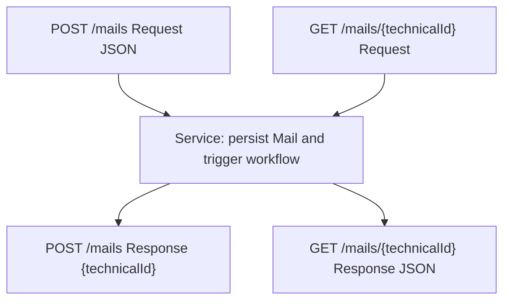

# Functional Requirements — Mail Processing Workflow

This document defines the up-to-date functional requirements for the Mail entity, its workflows, processors, criteria, and the API surface. It supersedes and clarifies parts of the original specification.

Key updates and clarifications made in this revision:
- The create (POST) request must provide the recipient list (mailList). Any provided isHappy value in the POST payload MUST be ignored: the system evaluates and sets isHappy automatically.
- Evaluation order is explicit: IsHappyCriterion is evaluated first; if it returns true the mail is considered happy, otherwise IsGloomyCriterion (or the complementary default) applies.
- Processors should be implemented as idempotent, injectable components (do not construct new processor instances inline in business logic).
- Retry behavior is clarified: retry increments a attempts counter and can be subject to configurable limits and backoff; retry uses the stored isHappy flag unless business rules mandate re-evaluation.
- State and delivery metadata fields are defined explicitly for storage and API responses.

---

## 1. Entity Definitions

Only the explicitly specified entity `Mail` is considered by the platform.

Mail (fields)
- technicalId: String (generated by the platform on creation — returned by POST)
- isHappy: boolean (nullable/optional on input — system-set during evaluation)
  - NOTE: Any isHappy value provided by the client on POST MUST be ignored. The platform determines and sets this field.
- mailList: List<String> (list of recipient email addresses) — required, must contain at least one valid email
- state: String (workflow state, see section "States") — managed by the platform
- deliveryStatus: object (metadata about delivery attempts)
  - deliveryStatus.attempts: integer (number of send attempts)
  - deliveryStatus.lastAttempt: ISO-8601 timestamp (string) for the last attempt or null
  - deliveryStatus.status: string (one of: PENDING, SENDING, SENT, FAILED)
  - deliveryStatus.lastError: string (error message or code from last failure, optional)
- createdAt: ISO-8601 timestamp
- updatedAt: ISO-8601 timestamp

Note: Do not use enums for fields (temporarily not supported). Use string values for states and deliveryStatus.status.

---

## 2. States and State Machine

Canonical states (string values)
- CREATED — Mail persisted, evaluation not yet performed
- EVALUATED — Criteria evaluated, isHappy set
- SENDING_HAPPY — Mail send attempt in progress for happy template
- SENDING_GLOOMY — Mail send attempt in progress for gloomy template
- SENT — Mail successfully delivered (terminal)
- FAILED — Last send attempt failed (non-terminal; can be retried)
- RETRY — Temporary state used when a retry is scheduled or manual retry initiated

State transitions

- [*] -> CREATED (on create/persist)
- CREATED -> EVALUATED (automatic; run EvaluateCriteriaProcessor)
- EVALUATED -> SENDING_HAPPY (automatic, if isHappy == true)
- EVALUATED -> SENDING_GLOOMY (automatic, if isHappy == false)
- SENDING_HAPPY -> SENT (on successful delivery)
- SENDING_GLOOMY -> SENT (on successful delivery)
- SENDING_HAPPY -> FAILED (on failure)
- SENDING_GLOOMY -> FAILED (on failure)
- FAILED -> RETRY (manual or automated retry processor invoked)
- RETRY -> SENDING_HAPPY (if isHappy == true)
- RETRY -> SENDING_GLOOMY (if isHappy == false)
- SENT -> [*] (terminal)
- FAILED -> [*] (may be terminal if permanent failure — see retry policy)

Mermaid diagram (state diagram)

```mermaid
stateDiagram-v2
    [*] --> "CREATED"
    "CREATED" --> "EVALUATED" : EvaluateCriteriaProcessor (automatic)
    "EVALUATED" --> "SENDING_HAPPY" : isHappy == true (automatic)
    "EVALUATED" --> "SENDING_GLOOMY" : isHappy == false (automatic)
    "SENDING_HAPPY" --> "SENT" : send success
    "SENDING_GLOOMY" --> "SENT" : send success
    "SENDING_HAPPY" --> "FAILED" : send failure
    "SENDING_GLOOMY" --> "FAILED" : send failure
    "FAILED" --> "RETRY" : RetryProcessor (manual or automated)
    "RETRY" --> "SENDING_HAPPY" : isHappy == true (automatic)
    "RETRY" --> "SENDING_GLOOMY" : isHappy == false (automatic)
    "SENT" --> [*]
    "FAILED" --> [*]
```

---

## 3. Processors and Criteria (behavioral requirements)

High-level rules that apply to all processors and criteria:
- Processors and criteria must be implemented in Java and designed for dependency injection (do not instantiate new processor objects inline in the processing code).
- Processor methods must be idempotent: repeated invocations (because of retries or duplicate events) must not cause duplicate sends.
- All processors must persist state updates atomically (state, isHappy, deliveryStatus) according to the platform's persistence guarantees.
- Criteria must be deterministic and pure functions of the Mail entity and external read-only inputs. Side-effects must be avoided in criteria.

Processors (required)
- EvaluateCriteriaProcessor (automatic)
  - Trigger: Automatically invoked after persistence of a new Mail (CREATED).
  - Responsibility:
    - Evaluate IsHappyCriterion first. If it evaluates to true, set mail.isHappy = true. Else evaluate IsGloomyCriterion.
    - If IsGloomyCriterion evaluates to true, set mail.isHappy = false. If neither criterion explicitly applies, default to isHappy = false.
    - Persist changes (isHappy, state -> EVALUATED, updatedAt).
    - Trigger the appropriate send processor (sendHappyMail or sendGloomyMail) according to mail.isHappy. Triggering can be synchronous or asynchronous depending on platform; processor invocation should set state to SENDING_* before sending attempts.
  - Notes: Do NOT rely on client-provided isHappy value. Always set based on criteria.

- SendHappyMail (processor)
  - Trigger: invoked when mail.isHappy == true and state transitions to SENDING_HAPPY.
  - Responsibility:
    - Set state to SENDING_HAPPY and persist.
    - Build the happy template message.
    - Iterate recipients in mail.mailList and attempt delivery to each recipient.
    - Aggregate per-recipient results into deliveryStatus.
    - On overall success set state -> SENT and deliveryStatus.status -> SENT.
    - On failure set state -> FAILED, deliveryStatus.status -> FAILED, increment deliveryStatus.attempts and set deliveryStatus.lastError and lastAttempt timestamp.
    - Persist after completion of attempt.
  - Idempotency: ensure duplicate invocations do not send duplicate emails (e.g., use per-mail send marker, message IDs, or de-duplication at mail provider level).

- SendGloomyMail (processor)
  - Same responsibilities as SendHappyMail but using the gloomy template and SENDING_GLOOMY state.

- RetryProcessor (manual or automated)
  - Trigger: invoked manually by an operator or automatically by retry scheduler when a Mail is in FAILED state and eligible for retry.
  - Responsibility:
    - Inspect deliveryStatus.attempts and compare to configured retry limit.
    - If retry is allowed, update state -> RETRY and persist (and optionally record scheduled nextAttempt metadata).
    - On RETRY transition, route to either SendHappyMail or SendGloomyMail according to the stored mail.isHappy value.
    - If configured to re-evaluate criteria on retry, the retry policy must specify this explicitly. Default behavior: reuse stored isHappy (do not re-evaluate) to avoid oscillation, unless business rules require re-evaluation.
    - On permanent exhaustion of retries, optionally mark a final state (e.g., FAILED with a flag) or keep as FAILED.

Criteria (required)
- IsHappyCriterion
  - Pure function evaluating whether a Mail should be considered "happy".
  - Evaluated first by EvaluateCriteriaProcessor.
  - Must not perform side effects.
  - Example placeholder logic (implement according to business rules):
    - Return true if mail.mailList is non-empty and other business conditions hold.

- IsGloomyCriterion
  - Complementary to IsHappyCriterion. Can be implemented as the logical negation of IsHappyCriterion or with explicit gloomy rules.
  - Prefer not to instantiate a new IsHappyCriterion inside IsGloomyCriterion; instead inject IsHappyCriterion if necessary.

Pseudocode guidance (updated)
- EvaluateCriteriaProcessor (dependency-injected style, simplified)

```java
public class EvaluateCriteriaProcessor {
    private final IsHappyCriterion isHappyCriterion;
    private final IsGloomyCriterion isGloomyCriterion;
    private final MailSenderCoordinator mailSender; // component responsible for invoking send processors

    public void process(Mail mail) {
        // Evaluate happy first
        boolean happy = isHappyCriterion.evaluate(mail);
        if (happy) {
            mail.setIsHappy(true);
        } else if (isGloomyCriterion.evaluate(mail)) {
            mail.setIsHappy(false);
        } else {
            // default
            mail.setIsHappy(false);
        }

        mail.setState("EVALUATED");
        persist(mail);

        // Delegate sending via coordinator which will set SENDING_* state then call send processor
        mailSender.sendAccordingToClassification(mail);
    }
}
```

- SendHappyMail / SendGloomyMail (processor responsibilities summarized)

```java
public class SendHappyMail {
    public void process(Mail mail) {
        // set state to SENDING_HAPPY, persist
        // attempt delivery to each recipient, update deliveryStatus (attempts, lastAttempt, lastError)
        // on success: set state -> SENT
        // on failure: set state -> FAILED
        // persist state and deliveryStatus
    }
}
```

- RetryProcessor

```java
public class RetryProcessor {
    public void process(Mail mail) {
        // check configured retry policy (max attempts, backoff etc.)
        // if allowed: set state -> RETRY and persist
        // then call the appropriate send processor based on mail.isHappy
    }
}
```

---

## 4. API Endpoints

Rules
- POST /mails persists the Mail entity and triggers the platform workflow. The response MUST contain only the technicalId.
- Any isHappy provided in the POST payload MUST be ignored by the server — it is evaluated by the platform.
- GET /mails/{technicalId} returns the stored Mail resource including workflow state and delivery metadata.

Endpoints

1) Create Mail
- POST /mails
- Request payload: JSON object containing at minimum mailList.
  - Validation: mailList must be present and non-empty; each value must be a valid email string per application validation rules.
- Response: HTTP 201 with body:
  - { "technicalId": "string" }

Example request
```json
{
  "mailList": [
    "recipient1@example.com",
    "recipient2@example.com"
  ]
}
```

Notes: If the client includes an isHappy field in the payload it will be ignored.

2) Retrieve Mail by technicalId
- GET /mails/{technicalId}
- Response: 200 with JSON body that includes stored Mail fields and workflow metadata.

Example response
```json
{
  "technicalId": "generated-unique-id",
  "mailList": [
    "recipient1@example.com",
    "recipient2@example.com"
  ],
  "isHappy": false,
  "state": "EVALUATED",
  "deliveryStatus": {
    "lastAttempt": "2025-01-15T12:34:56Z",
    "status": "FAILED",
    "attempts": 1,
    "lastError": "SMTP_421_TEMPORARY_FAILURE"
  },
  "createdAt": "2025-01-15T12:00:00Z",
  "updatedAt": "2025-01-15T12:34:56Z"
}
```

Mermaid flow diagram for API


```mermaid
flowchart TD
    POST_Request["POST /mails Request JSON"]
    Service["Service: persist Mail and trigger workflow"]
    POST_Response["POST /mails Response {technicalId}"]
    GET_Request["GET /mails/{technicalId} Request"]
    GET_Response["GET /mails/{technicalId} Response JSON"]

    POST_Request --> Service
    Service --> POST_Response
    GET_Request --> Service
    Service --> GET_Response
```

---

## 5. Persistence and Concurrency Considerations

- All state transitions and updates to isHappy and deliveryStatus must be persisted atomically.
- Processors should use optimistic locking or other concurrency controls to avoid race conditions (for example: two concurrent retry attempts).
- Processors must be idempotent. For example, mark a mail send as "in-flight" or record a unique send operation id so repeated processing does not duplicate outbound messages.

---

## 6. Retry Policy (recommended defaults)

- Default max attempts: configurable (example default: 3)
- Backoff: configurable (example: exponential backoff)
- On each failed attempt increment deliveryStatus.attempts and set lastAttempt timestamp
- If attempts exceed max attempts, leave state as FAILED and set a flag or provide a field in deliveryStatus to indicate permanent failure
- Manual retry (via operator action) must override or reschedule attempts only if operator has appropriate permissions

---

## 7. Logging, Monitoring and Observability

- Each processor must emit structured logs for key lifecycle events: evaluation result, send attempt start/finish, failures with error codes, and retries.
- Emit metrics for counts of created mails, happy vs gloomy classification, send success/failure rates, retry counts, and processing latencies.

---

## 8. Implementation Notes and DOs / DONTs

DO:
- Implement processors and criteria in Java, favor dependency injection frameworks (Spring, CDI, etc.)
- Make processors idempotent and persist state changes promptly
- Validate inputs (mailList presence/format) at API layer
- Treat isHappy as a system-calculated field (ignore client-provided values on create)

DON'T:
- Create new processor objects inline (e.g., new SendHappyMail()) — use DI/injected services/coordinators
- Perform side-effects in criteria classes
- Use enums for state or deliveryStatus fields (temporary platform restriction)

---

## 9. Required Classes Summary (to implement)

- Entities:
  - Mail (fields as defined above)
- Processors:
  - EvaluateCriteriaProcessor
  - SendHappyMail
  - SendGloomyMail
  - RetryProcessor
- Criteria:
  - IsHappyCriterion
  - IsGloomyCriterion
- API controllers/handlers:
  - POST /mails (returns technicalId)
  - GET /mails/{technicalId} (returns stored Mail)

---

If any part of the above needs further changes or you want stricter constraints (e.g., re-evaluation on retry, different retry policy, synchronous vs asynchronous sending), specify the desired policy and I will update the functional requirements accordingly.