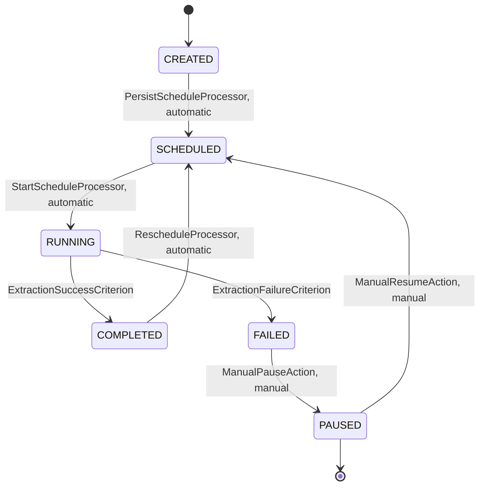
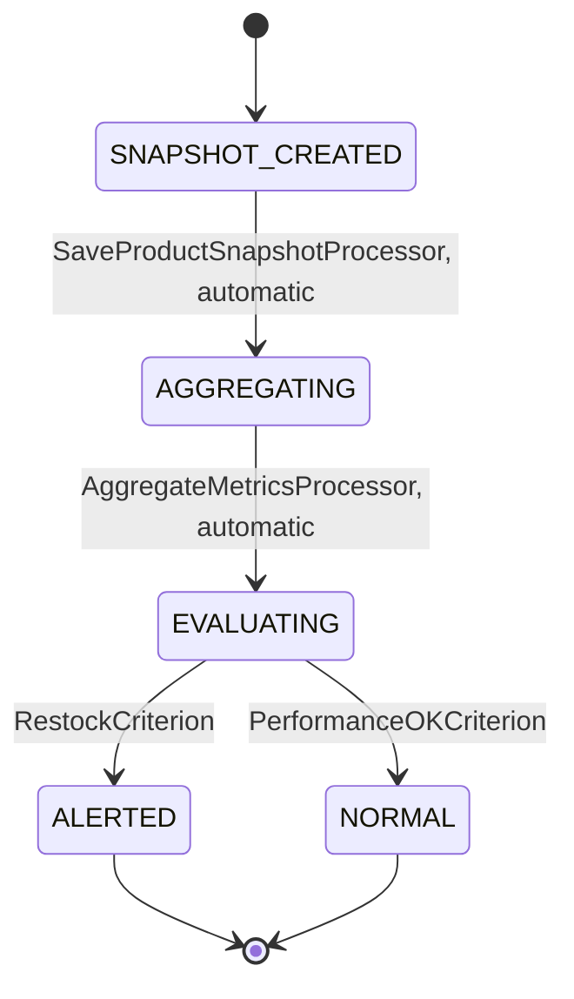
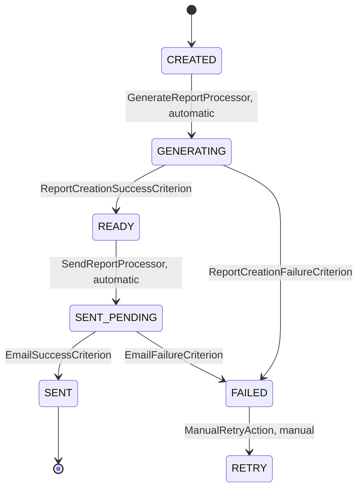
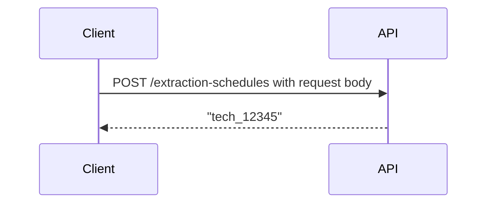
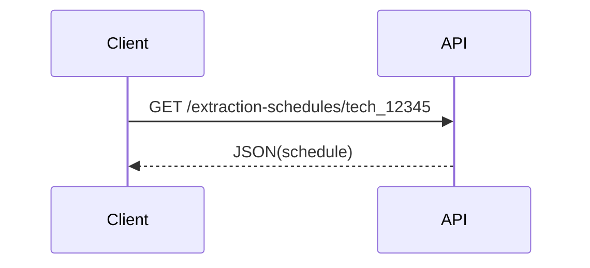
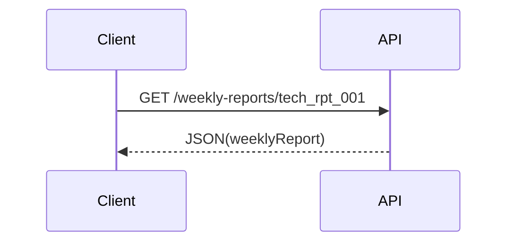
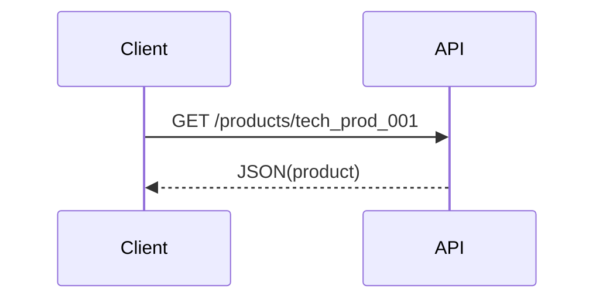

### 1. Entity Definitions
```
Product:
- product_id: String (external product identifier from Pet Store API)
- name: String (product name)
- category: String (product category)
- price: Number (sale price)
- cost: Number (cost price)
- stock_level: Number (current stock snapshot)
- store_id: String (store identifier)
- sales_history: Array (time series of sales snapshots with timestamp, quantity, revenue)

ExtractionSchedule:
- schedule_id: String (human identifier)
- frequency: String (e.g., weekly)
- day: String (e.g., Monday)
- time: String (HH:MM)
- timezone: String (IANA timezone)
- last_run: String (timestamp of last run)
- status: String (SCHEDULED | RUNNING | PAUSED | FAILED)
- recipients: Array (list of emails to receive reports)
- format: String (PDF or CSV)

WeeklyReport:
- report_id: String (report identifier)
- period_start: String (timestamp)
- period_end: String (timestamp)
- generated_on: String (timestamp)
- summary_metrics: Object (KPIs: sales_volume, revenue_by_product, inventory_turnover)
- top_products: Array (top N products by sales)
- restock_list: Array (products below restock threshold)
- attachment_url: String (link to generated report file)
- recipients: Array (emails)
- status: String (CREATED | GENERATING | SENT | FAILED)
```

### 2. Entity workflows

ExtractionSchedule workflow:
1. Initial State: CREATED when POSTed (event triggers schedule persistence)
2. Scheduled: system waits until scheduled time (automatic)
3. Start Run: at scheduled time, transition to RUNNING and trigger extraction (automatic)
4. Run Completed: if extraction + analysis succeed -> mark last_run and set to SCHEDULED or COMPLETED for this cycle (automatic)
5. Failure: on errors set status to FAILED and create Incident (automatic) -> human may manually set to PAUSED or RETRY (manual)
6. Pause/Update: users can manually PAUSE or UPDATE schedule (manual)


```mermaid
stateDiagram-v2
    [*] --> CREATED
    CREATED --> SCHEDULED : PersistScheduleProcessor, automatic
    SCHEDULED --> RUNNING : StartScheduleProcessor, automatic
    RUNNING --> COMPLETED : ExtractionSuccessCriterion
    RUNNING --> FAILED : ExtractionFailureCriterion
    FAILED --> PAUSED : ManualPauseAction, manual
    COMPLETED --> SCHEDULED : RescheduleProcessor, automatic
    PAUSED --> SCHEDULED : ManualResumeAction, manual
    PAUSED --> [*]
```

Processors/Criterions needed:
- PersistScheduleProcessor
- StartScheduleProcessor
- FetchFromPetStoreProcessor
- RescheduleProcessor
- ExtractionSuccessCriterion
- ExtractionFailureCriterion
- NotifyOnFailureProcessor

Product workflow:
1. Initial State: SNAPSHOT_CREATED when a product snapshot is saved by extraction (automatic)
2. Aggregate: new snapshot triggers aggregation into sales_history and KPI update (automatic)
3. Evaluate: run ProductPerformanceAnalysis to tag restock_candidate or underperformer (automatic)
4. Archive/Age: after retention period, older snapshots are archived/purged (automatic)
5. Manual update: product metadata can be updated via UI (manual)


```mermaid
stateDiagram-v2
    [*] --> SNAPSHOT_CREATED
    SNAPSHOT_CREATED --> AGGREGATING : SaveProductSnapshotProcessor, automatic
    AGGREGATING --> EVALUATING : AggregateMetricsProcessor, automatic
    EVALUATING --> ALERTED : RestockCriterion
    EVALUATING --> NORMAL : PerformanceOKCriterion
    ALERTED --> [*]
    NORMAL --> [*]
```

Processors/Criterions needed:
- SaveProductSnapshotProcessor
- AggregateMetricsProcessor
- ProductPerformanceAnalysisProcessor
- RestockCriterion
- PerformanceOKCriterion
- RetentionPurgeProcessor

WeeklyReport workflow:
1. Initial State: CREATED when analysis requests a report (automatic)
2. Generating: build report PDF/CSV and summary (automatic)
3. Ready: attachment created and status SENT_PENDING (automatic)
4. Sent: email dispatched to recipients (automatic)
5. Failure: on generation or email failure -> FAILED (automatic) -> human can RETRY (manual)


```mermaid
stateDiagram-v2
    [*] --> CREATED
    CREATED --> GENERATING : GenerateReportProcessor, automatic
    GENERATING --> READY : ReportCreationSuccessCriterion
    GENERATING --> FAILED : ReportCreationFailureCriterion
    READY --> SENT_PENDING : SendReportProcessor, automatic
    SENT_PENDING --> SENT : EmailSuccessCriterion
    SENT_PENDING --> FAILED : EmailFailureCriterion
    FAILED --> RETRY : ManualRetryAction, manual
    SENT --> [*]
```

Processors/Criterions needed:
- GenerateReportProcessor
- ReportCreationSuccessCriterion
- ReportCreationFailureCriterion
- SendReportProcessor
- EmailSuccessCriterion
- EmailFailureCriterion
- NotifyStakeholdersProcessor

### 3. Pseudo code for processor classes

PersistScheduleProcessor
```
class PersistScheduleProcessor {
  process(schedule) {
    // persist schedule entity
    schedule.status = SCHEDULED
    schedule.last_run = null
    save(schedule)
  }
}
```

StartScheduleProcessor
```
class StartScheduleProcessor {
  process(schedule) {
    schedule.status = RUNNING
    save(schedule)
    // trigger Extraction event for this schedule
    FetchFromPetStoreProcessor.process(schedule)
  }
}
```

FetchFromPetStoreProcessor
```
class FetchFromPetStoreProcessor {
  process(schedule) {
    try {
      data = PetStoreAPI.fetchAllStoresData()
      for each productSnapshot in data:
        SaveProductSnapshotProcessor.process(productSnapshot, schedule)
      schedule.last_run = now()
      schedule.status = SCHEDULED
      save(schedule)
      // trigger report generation
      GenerateReportProcessor.process(schedule.period)
    } catch (e) {
      schedule.status = FAILED
      save(schedule)
      NotifyOnFailureProcessor.process(schedule, e)
    }
  }
}
```

AggregateMetricsProcessor / ProductPerformanceAnalysisProcessor
```
class AggregateMetricsProcessor {
  process(product) {
    updateSalesHistory(product)
    computeKPIs(product)
    if RestockCriterion.isMet(product) then mark restock
    if PerformanceOKCriterion.isNotMet(product) then mark underperformer
    save(product)
  }
}
```

GenerateReportProcessor / SendReportProcessor
```
class GenerateReportProcessor {
  process(period) {
    report = buildSummary(period) // aggregate KPIs, top products, restock_list
    report.attachment_url = renderPDF(report)
    report.status = READY
    save(report)
    SendReportProcessor.process(report)
  }
}

class SendReportProcessor {
  process(report) {
    try {
      EmailService.send(report.recipients, report.attachment_url, report.summary)
      report.status = SENT
      save(report)
    } catch (e) {
      report.status = FAILED
      save(report)
      NotifyOnFailureProcessor.process(report, e)
    }
  }
}
```

### 4. API Endpoints Design Rules

Notes:
- Only ExtractionSchedule is an orchestration entity created via POST (event triggers runs).
- POST responses MUST return only technicalId.
- GET endpoints exist for retrieving stored results (by technicalId).

Endpoints (JSON shapes)

1) Create ExtractionSchedule (POST /extraction-schedules)
Request:
```json
{
  "schedule_id":"weekly_pets",
  "frequency":"weekly",
  "day":"Monday",
  "time":"08:00",
  "timezone":"Europe/Moscow",
  "recipients":["victoria.sagdieva@cyoda.com"],
  "format":"PDF"
}
```
Response (must contain only technicalId):
```json
"tech_12345"
```

Mermaid diagram for POST request/response:

```mermaid
sequenceDiagram
  participant Client
  participant API
  Client->>API: POST /extraction-schedules with request body
  API-->>Client: "tech_12345"
```

2) Get ExtractionSchedule by technicalId (GET /extraction-schedules/{technicalId})
Response:
```json
{
  "schedule_id":"weekly_pets",
  "frequency":"weekly",
  "day":"Monday",
  "time":"08:00",
  "timezone":"Europe/Moscow",
  "last_run":"2025-08-11T08:00:00Z",
  "status":"SCHEDULED",
  "recipients":["victoria.sagdieva@cyoda.com"],
  "format":"PDF"
}
```

Mermaid:

```mermaid
sequenceDiagram
  participant Client
  participant API
  Client->>API: GET /extraction-schedules/tech_12345
  API-->>Client: JSON(schedule)
```

3) Get WeeklyReport by technicalId (GET /weekly-reports/{technicalId})
Response:
```json
{
  "report_id":"rpt_2025_08_11",
  "period_start":"2025-08-04T00:00:00Z",
  "period_end":"2025-08-10T23:59:59Z",
  "generated_on":"2025-08-11T09:00:00Z",
  "summary_metrics":{ "sales_volume":1234, "revenue":45678 },
  "top_products":[],
  "restock_list":[],
  "attachment_url":"https://storage/reports/rpt_2025_08_11.pdf",
  "recipients":["victoria.sagdieva@cyoda.com"],
  "status":"SENT"
}
```

Mermaid:

```mermaid
sequenceDiagram
  participant Client
  participant API
  Client->>API: GET /weekly-reports/tech_rpt_001
  API-->>Client: JSON(weeklyReport)
```

4) Get Product by technicalId (GET /products/{technicalId})
Response:
```json
{
  "product_id":"pet_001",
  "name":"Deluxe Dog Food",
  "category":"Food",
  "price":19.99,
  "cost":10.00,
  "stock_level":25,
  "store_id":"store_01",
  "sales_history":[{"timestamp":"2025-08-10T00:00:00Z","quantity":5,"revenue":99.95}]
}
```

Mermaid:

```mermaid
sequenceDiagram
  participant Client
  participant API
  Client->>API: GET /products/tech_prod_001
  API-->>Client: JSON(product)
```

Additional rules:
- No POST endpoints for Product or WeeklyReport (these are created by processors after ExtractionSchedule triggers).
- GET by condition endpoints omitted (not explicitly requested).
- Error handling: failures generate Incident records surfaced in Cyoda and emails to configured recipients.

If you want, I can expand to include Incident or Recipient entities (up to 10 total), or add GET-by-condition endpoints — which would change the entity list. Which do you prefer?