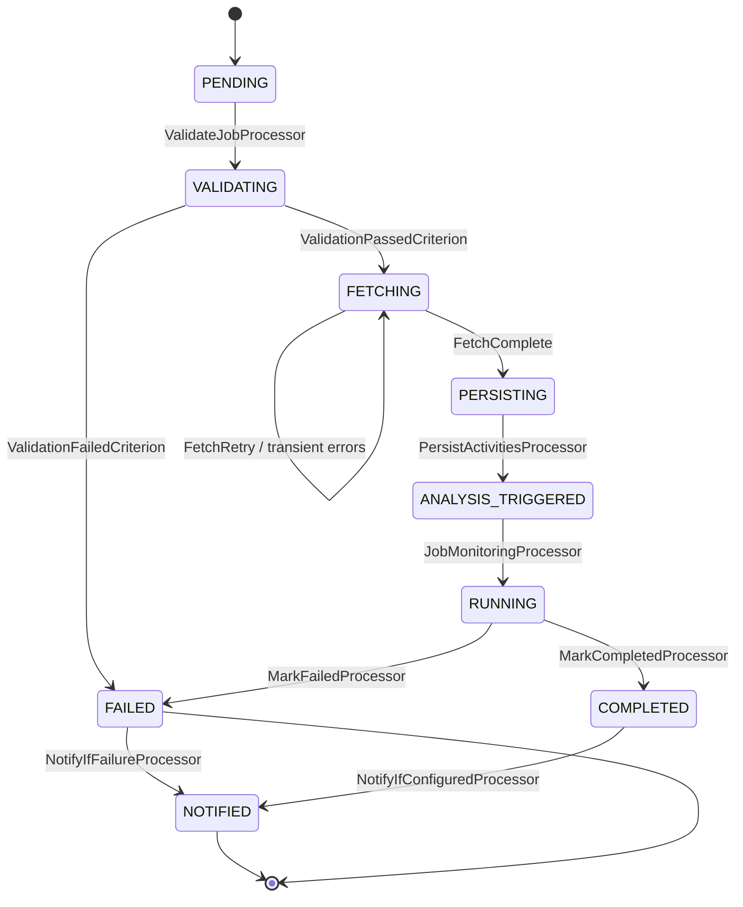
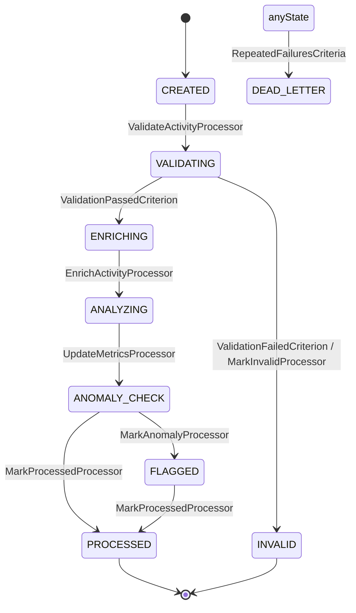
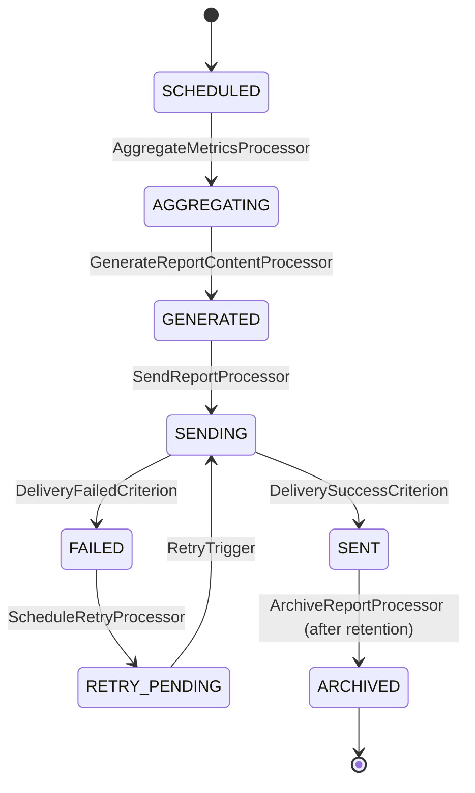

# Functional Requirements

This document describes entities, workflows, processors and API contract for the ingestion -> activity analysis -> reporting pipeline. It has been updated to reflect the latest logic: explicit idempotency, error handling and retry semantics, deduplication, paging for upstream fetches, clearer timestamp semantics, and delivery/archival rules.

---

## 1. Overview

- The system ingests activity data from external sources (example: Fakerest) according to scheduled or manual ingestion jobs.
- Each IngestionJob orchestrates fetch, persist and triggers downstream analysis for each Activity created.
- Activity entities drive per-event validation, enrichment, analysis and anomaly detection workflows.
- Report entities aggregate activity metrics for a reportDate, generate and attempt delivery to recipients, with retry/backoff and archival.

Assumptions and cross-cutting rules:
- All timestamps use ISO 8601 with timezone (e.g. 2025-08-19T12:34:56Z). Dates (runDate, reportDate) are ISO local dates interpreted in IngestionJob.timezone unless otherwise specified.
- Every create POST is idempotent when provided an external business id (jobId, activityId) and supports an Idempotency-Key header for completely client-driven idempotency.
- System-generated identifiers (technicalId) are returned to callers on create; POST endpoints return 201 Created with Location header and a small response body containing technicalId.
- All background processors are designed to be idempotent and safe to retry.
- Failures should be observable (metrics, logs, alerts) and retriable according to configured policies. Dead-letter handling is used for repeated processing failures.

---

## 2. Entity Definitions (updated)

IngestionJob (orchestration entity)
- technicalId: String (internal unique id)
- jobId: String (business id for this ingestion request). Optional but recommended for idempotency.
- runDate: String (ISO local date the job should ingest for). Required.
- timezone: String (IANA timezone, default UTC). Required.
- source: String (data source identifier, e.g., fakerest). Required.
- status: String (PENDING / VALIDATING / FETCHING / PERSISTING / ANALYSIS_TRIGGERED / RUNNING / COMPLETED / FAILED). Note: more granular states introduced: VALIDATING, FETCHING, PERSISTING, ANALYSIS_TRIGGERED, RUNNING.
- startedAt: String (timestamp when job processing started).
- finishedAt: String (timestamp when job processing finished).
- summary: Object (high level stats after run, e.g., activitiesFetched, activitiesPersisted, errors).
- initiatedBy: String (system or user id).
- retries: Integer (count of automatic retries attempted).
- failureReason: String (optional textual error when FAILED).

Activity
- technicalId: String (internal unique id)
- activityId: String (source activity id, used for deduplication). Optional if source does not provide one, but recommended.
- userId: String (user identifier). Required for valid activity.
- timestamp: String (ISO timestamp of activity). Required.
- type: String (activity type / name). Required.
- metadata: Object (free-form activity details). May include enrichment fields under metadata.enriched.*
- source: String (origin system).
- processed: Boolean (whether downstream analysis completed). Default false.
- anomalyFlag: Boolean (true if flagged).
- valid: Boolean (result of validation). null until validation runs.
- persistedAt: String (timestamp when persisted).
- failureReason: String (if marked invalid or processing error).

Report
- technicalId: String (internal unique id)
- reportDate: String (ISO date the report summarizes). Required.
- generatedAt: String (timestamp when report content was generated).
- summary: String or Object (textual summary or structured summary).
- metrics: Object (aggregated KPIs e.g., totals, per-type counts).
- anomalies: Array (list of flagged anomalies and reasons).
- recipients: Array (list of admin emails).
- deliveryStatus: String (SCHEDULED / SENDING / SENT / FAILED / RETRY_PENDING / ARCHIVED).
- attempts: Integer (number of delivery attempts).
- archivedAt: String (timestamp report was archived).
- failureReason: String (on failed deliveries).

---

## 3. Workflows and State Machines (updates)

### IngestionJob workflow (updated for retries, idempotency and fetch paging)

High-level steps:
1. PENDING when created.
2. VALIDATING: check runDate, timezone, source connectivity and idempotency (if jobId already processed, return existing technicalId + status).
3. FETCHING: call source API (supports paging) to fetch activities for runDate. Apply rate limits, backoff and retry on transient errors.
4. PERSISTING: deduplicate incoming activities by activityId (or content-hash) and create Activity entities for new events. Each persisted Activity emits an event to start its workflow.
5. ANALYSIS_TRIGGERED / RUNNING: enqueue any job-level aggregation (if required) and wait for activity-level processing to reach processed or dead-letter.
6. COMPLETED or FAILED: mark overall job status, populate summary, startedAt, finishedAt. On some failures, schedule a retry according to job retry policy or send failure notification.
7. NOTIFICATION: optional notification to admins on failure or summary when configured.

State diagram (kept as mermaid in source):


```mermaid
stateDiagram-v2
    [*] --> PENDING
    PENDING --> VALIDATING : ValidateJobProcessor
    VALIDATING --> FETCHING : ValidationPassedCriterion
    VALIDATING --> FAILED : ValidationFailedCriterion
    FETCHING --> FETCHING : FetchRetry / transient errors
    FETCHING --> PERSISTING : FetchComplete
    PERSISTING --> ANALYSIS_TRIGGERED : PersistActivitiesProcessor
    ANALYSIS_TRIGGERED --> RUNNING : JobMonitoringProcessor
    RUNNING --> COMPLETED : MarkCompletedProcessor
    RUNNING --> FAILED : MarkFailedProcessor
    FAILED --> NOTIFIED : NotifyIfFailureProcessor
    COMPLETED --> NOTIFIED : NotifyIfConfiguredProcessor
    NOTIFIED --> [*]
    FAILED --> [*]
```

Processors and criteria (new/updated):
- Processors: ValidateJobProcessor, FetchActivitiesProcessor (supports paging and retries), PersistActivitiesProcessor (deduplication), MarkCompletedProcessor, NotifyIfFailureProcessor, ScheduleRetryProcessor
- Criteria: ValidationPassedCriterion, ValidationFailedCriterion, FetchTransientErrorCriterion

### Activity workflow (updates: duplicate detection, dead-letter, idempotency)

High-level steps:
1. CREATED when persisted by IngestionJob. If duplicate activityId exists, mark DUPLICATE and drop or link to existing.
2. VALIDATING: check required fields (userId, timestamp, type) and schema.
3. ENRICHING: enrich with user metadata and other external lookups. Enrichment is optional and should be tolerant of failures (use cached data or continue with defaults).
4. ANALYZING: update aggregates and feed incremental metrics for Reports.
5. ANOMALY_DETECTION: apply configurable rules and statistical checks.
6. MARK_PROCESSED: set processed=true and persist anomalyFlag (true/false). If processing fails repeatedly, move to DEAD_LETTER and surface for manual intervention.

State diagram:


```mermaid
stateDiagram-v2
    [*] --> CREATED
    CREATED --> VALIDATING : ValidateActivityProcessor
    VALIDATING --> INVALID : ValidationFailedCriterion / MarkInvalidProcessor
    VALIDATING --> ENRICHING : ValidationPassedCriterion
    ENRICHING --> ANALYZING : EnrichActivityProcessor
    ANALYZING --> ANOMALY_CHECK : UpdateMetricsProcessor
    ANOMALY_CHECK --> PROCESSED : MarkProcessedProcessor
    ANOMALY_CHECK --> FLAGGED : MarkAnomalyProcessor
    FLAGGED --> PROCESSED : MarkProcessedProcessor
    PROCESSED --> [*]
    INVALID --> [*]
    anyState --> DEAD_LETTER : RepeatedFailuresCriteria
```

Processors and criteria for Activity (updates):
- Processors: ValidateActivityProcessor, EnrichActivityProcessor, UpdateMetricsProcessor (idempotent increments), AnomalyDetectionProcessor (configurable thresholds), MarkProcessedProcessor, MarkInvalidProcessor, MoveToDeadLetterProcessor
- Criteria: ValidationPassedCriterion, ValidationFailedCriterion, AnomalyThresholdCriterion, RepeatedFailuresCriterion

Notes:
- Enrichment lookups must be cached and have timeouts. Failures in enrichment should not necessarily invalidate the Activity unless enrichment is mandatory.
- UpdateMetricsProcessor must support idempotent updates (use compare-and-swap or event-sourcing patterns) to avoid double counting.

### Report workflow (updates: retry/backoff, retention rules)

High-level steps:
1. SCHEDULED: created daily for reportDate by scheduler or manual trigger.
2. AGGREGATING: collect metrics from Activities (for reportDate) and compute totals, per-type counts, top users and trends. Aggregation must be consistent with late-arriving activities policy.
3. GENERATED: create summary, charts and assemble anomalies.
4. SENDING: attempt to deliver via configured channels (email). Each send attempt increments attempts; on transient failures schedule retry with exponential backoff up to maxAttempts; permanent failures mark FAILED.
5. SENT: mark deliveryStatus = SENT and archive according to retention policy.
6. ARCHIVED: after retention period, archive or purge report content and set archivedAt.

State diagram:


```mermaid
stateDiagram-v2
    [*] --> SCHEDULED
    SCHEDULED --> AGGREGATING : AggregateMetricsProcessor
    AGGREGATING --> GENERATED : GenerateReportContentProcessor
    GENERATED --> SENDING : SendReportProcessor
    SENDING --> SENT : DeliverySuccessCriterion
    SENDING --> FAILED : DeliveryFailedCriterion
    FAILED --> RETRY_PENDING : ScheduleRetryProcessor
    RETRY_PENDING --> SENDING : RetryTrigger
    SENT --> ARCHIVED : ArchiveReportProcessor (after retention)
    ARCHIVED --> [*]
```

Processors and criteria for Report:
- Processors: AggregateMetricsProcessor, GenerateReportContentProcessor, SendReportProcessor, MarkSentProcessor, ArchiveReportProcessor, ScheduleRetryProcessor
- Criteria: DeliverySuccessCriterion, DeliveryFailedCriterion, ReportReadyCriterion

Important: Aggregation must consider a configurable cut-off for late-arriving Activities. Reports may be re-generated or annotated if late data arrives after initial generation.

---

## 4. Processor pseudocode (concise, updated for retries and idempotency)

ValidateJobProcessor:
```
function process(job) {
  if missing runDate or source unreachable then
    job.validationPassed = false
    job.failureReason = "validation failed: ..."
  else
    job.validationPassed = true
}
```

FetchActivitiesProcessor (paging + retries):
```
function process(job) {
  page = 1
  allActivities = []
  while (true) {
    response = callSourceAPI(job.source, job.runDate, page)
    if transientError(response) then retry with backoff up to N
    if permanentError(response) then throw
    allActivities.add(response.items)
    if response.hasMorePages == false then break
    page++
  }
  return allActivities
}
```

PersistActivitiesProcessor (dedupe + event emit):
```
function process(job, activities) {
  for each a in activities:
    dedupeKey = a.activityId ?: hash(a)
    if existsActivityWithDedupKey(dedupeKey) then continue
    create Activity entity (technicalId, activityId, persistedAt, processed=false)
    emit ActivityCreatedEvent(activity.technicalId)
}
```

ValidateActivityProcessor:
```
function process(activity) {
  if missing userId or timestamp or type then
    activity.valid = false
    activity.failureReason = "missing required fields"
    mark Invalid
  else
    activity.valid = true
}
```

AnomalyDetectionProcessor:
```
function process(activity) {
  metrics = fetchRecentMetrics(activity.userId, activity.type)
  if anomalyThresholdBroken(metrics, activity, config) then
    activity.anomalyFlag = true
}
```

AggregateMetricsProcessor:
```
function process(report) {
  activities = fetchActivitiesForDate(report.reportDate, applyCutoff=report.cutoff)
  compute totals, per-type counts, top users, trends
  store in report.metrics
}
```

SendReportProcessor:
```
function process(report) {
  payload = render(report.summary, report.metrics, report.anomalies)
  for recipient in report.recipients:
    result = sendEmail(recipient, payload)
    if transientFailure(result) then schedule retry
    if permanentFailure(result) then note failure
  set report.deliveryStatus = SENT or FAILED
}
```

---

## 5. API Endpoints Design Rules and JSON formats (updated)

General rules:
- POST endpoints are idempotent when either a business id is provided or an Idempotency-Key header is used.
- POST returns: 201 Created, Location: /{entity}/{technicalId}, and body { "technicalId": "..." }.
- GET endpoints return 200 with full entity JSON; 404 if not found.
- Errors return structured JSON: { "error": { "code": "INVALID_INPUT", "message": "...", "details": {...} } } with appropriate HTTP status codes (400/404/409/500).
- POST clients may receive 202 Accepted for long-running requests that are queued; but we prefer returning the created orchestration entity with PENDING status.
- No wildcard GET-by-condition endpoints implemented by default; they can be added as optional features with pagination and filtering.

Examples:

1) Create Ingestion Job (manual trigger)
POST /jobs/ingest
Request:
```json
{
  "jobId": "ingest-2025-08-20",
  "runDate": "2025-08-19",
  "timezone": "UTC",
  "source": "fakerest",
  "initiatedBy": "system"
}
```
Response: 201 Created
Headers: Location: /jobs/ingest/{technicalId}
Body:
```json
{
  "technicalId": "tech-abc-123",
  "status": "PENDING"
}
```

Notes: If a job with the same jobId already exists and is completed, return 200 with existing technicalId and status. If a job with same jobId is in-flight, return 409 Conflict or return existing technicalId depending on idempotency policy.

2) Get Ingestion Job by technicalId
GET /jobs/ingest/{technicalId}
Response 200:
```json
{
  "technicalId": "tech-abc-123",
  "jobId": "ingest-2025-08-19",
  "runDate": "2025-08-19",
  "timezone": "UTC",
  "source": "fakerest",
  "status": "COMPLETED",
  "startedAt": "2025-08-19T00:00:10Z",
  "finishedAt": "2025-08-19T00:02:03Z",
  "summary": {"activitiesFetched": 123, "activitiesPersisted": 120, "errors": 3},
  "initiatedBy": "system"
}
```

3) Get Activity by technicalId
GET /activities/{technicalId}
Response 200:
```json
{
  "technicalId": "tech-act-001",
  "activityId": "a-987",
  "userId": "u-55",
  "timestamp": "2025-08-19T12:34:56Z",
  "type": "login",
  "metadata": {"ip":"1.2.3.4"},
  "source": "fakerest",
  "processed": true,
  "anomalyFlag": false,
  "valid": true
}
```

4) Get Report by technicalId
GET /reports/{technicalId}
Response 200:
```json
{
  "technicalId": "tech-report-001",
  "reportDate": "2025-08-19",
  "generatedAt": "2025-08-20T01:00:00Z",
  "summary": "Daily activity summary",
  "metrics": {"totalActivities": 123, "perType": {"login":50,"purchase":10}},
  "anomalies": [{"activityId":"a-999","reason":"spike in purchases"}],
  "recipients": ["admin@example.com"],
  "deliveryStatus": "SENT",
  "archivedAt": "2025-08-20T01:05:00Z"
}
```

Optional expansions (available on request):
- User, Alert, Schedule entities.
- GET-by-condition endpoints (activities by user/date) with paging and filtering.
- Sequence diagrams for daily run and failure scenarios.

---

## 6. Operational considerations

- Monitoring: instrument counts for jobs started, succeeded, failed, activity processed rates, anomalies detected, report deliveries and retries.
- Alerts: notify on repeated ingestion failures, sudden spike in dead-letter activities, or repeated report delivery failures.
- Retention and archival: keep reports and raw activities according to retention policy; archive and purge after retention period.
- Security: validate and sanitize all inbound metadata; enforce least privilege on transport and storage; redact PII in logs.
- Scalability: fetch and persist in pages/chunks, process activities in parallel consumers with concurrency limits and backpressure.

---

If you want any of the optional expansions (additional entities, query endpoints, sequence diagrams, or concrete JSON schema definitions for each entity) I will add them next.