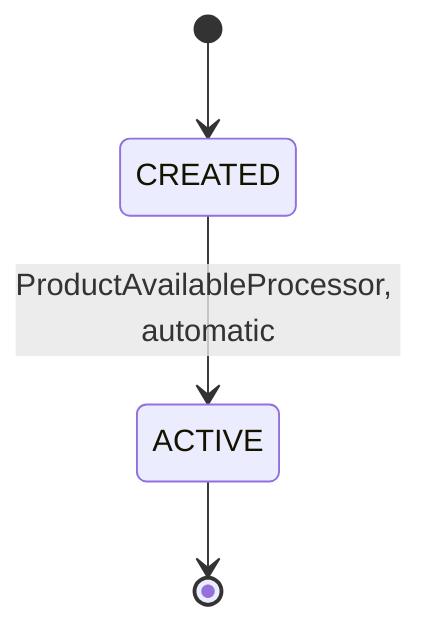
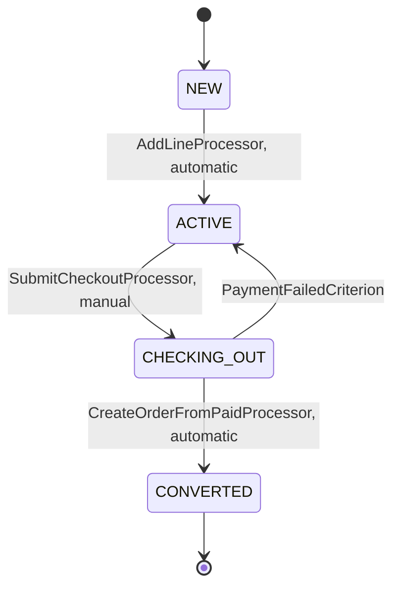
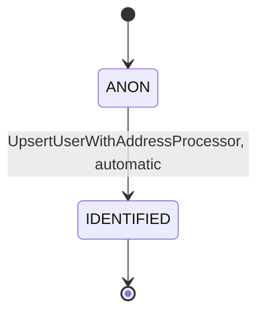
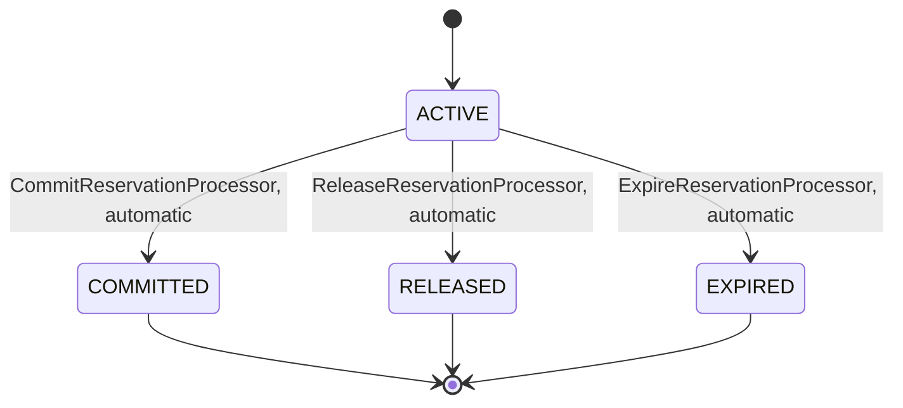
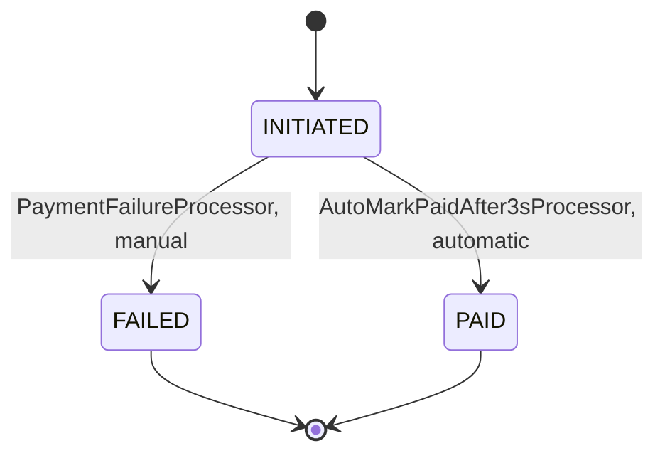
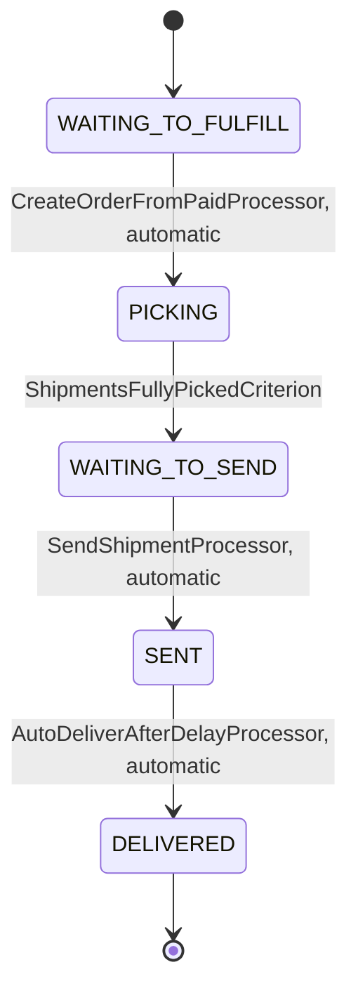
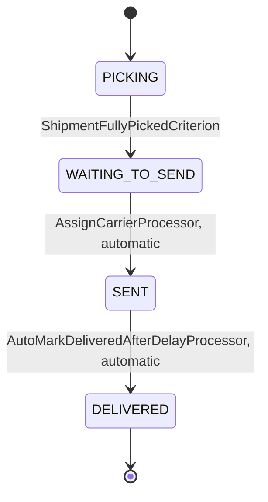

### Notice
You provided 8 entities; I will use those 8 (max 10). No extra entities added.

---

### 1. Entity Definitions
```
Product:
- sku: string (unique product code)
- name: string (display name)
- description: string (optional)
- price: number (unit price)
- quantityAvailable: number (current stock)
- category: string (optional)

Cart:
- cartId: string (id)
- userId: string (optional)
- status: string (NEW, ACTIVE, CHECKING_OUT, CONVERTED)
- lines: array of { sku: string, name: string, price: number, qty: number }
- totalItems: number
- grandTotal: number
- reservationBatchId: string (optional)
- createdAt: datetime
- updatedAt: datetime

User:
- userId: string
- name: string
- email: string (unique)
- phone: string (optional)
- address: { line1: string, city: string, postcode: string, country: string, updatedAt: datetime }

Reservation:
- reservationId: string
- reservationBatchId: string
- cartId: string
- sku: string
- qty: number
- expiresAt: datetime
- status: string (ACTIVE, EXPIRED, RELEASED, COMMITTED)

Payment:
- paymentId: string
- cartId: string
- amount: number
- status: string (INITIATED, PAID, FAILED, CANCELED)
- provider: string (DUMMY)
- createdAt: datetime
- updatedAt: datetime

Order:
- orderId: string
- orderNumber: string (short ULID)
- userId: string
- shippingAddress: { line1, city, postcode, country }
- lines: array of { sku, name, unitPrice, qty, lineTotal }
- totals: { items, tax, shipping, grand }
- status: string (WAITING_TO_FULFILL, PICKING, WAITING_TO_SEND, SENT, DELIVERED)
- createdAt: datetime
- updatedAt: datetime

Shipment:
- shipmentId: string
- orderId: string
- status: string (PICKING, WAITING_TO_SEND, SENT, DELIVERED)
- carrier: string (optional)
- trackingNumber: string (optional)
- lines: array of { sku, qtyOrdered, qtyPicked, qtyShipped }
- createdAt: datetime
- updatedAt: datetime

PickLedger:
- pickId: string
- orderId: string
- shipmentId: string
- sku: string
- delta: number
- at: datetime
- actor: string (optional)
- note: string (optional)
```

---

### 2. Entity workflows

Product workflow:
- Created/updated via POST/PATCH. No automated long flow; used by UI reads.

```mermaid
stateDiagram-v2
    [*] --> CREATED
    CREATED --> ACTIVE : ProductAvailableProcessor, automatic
    ACTIVE --> [*]
```
Processors: ProductValidationProcessor, ProductAvailableProcessor  
Criteria: ProductValidCriterion

Cart workflow:
- NEW -> ACTIVE on first add -> CHECKING_OUT on checkout start -> CONVERTED when order created.
- On add/remove: create/adjust Reservations and refresh TTL (4h); recalc totals.

```mermaid
stateDiagram-v2
    [*] --> NEW
    NEW --> ACTIVE : AddLineProcessor, automatic
    ACTIVE --> CHECKING_OUT : SubmitCheckoutProcessor, manual
    CHECKING_OUT --> ACTIVE : PaymentFailedCriterion
    CHECKING_OUT --> CONVERTED : CreateOrderFromPaidProcessor, automatic
    CONVERTED --> [*]
```
Processors: ReserveOnAdd, ReserveDelta, RecalculateTotals, RefreshReservationTTL  
Criteria: CartNotEmptyCriterion, ReservationsActiveCriterion

User workflow:
- ANON -> IDENTIFIED when upserted at checkout; address updates inline.

```mermaid
stateDiagram-v2
    [*] --> ANON
    ANON --> IDENTIFIED : UpsertUserWithAddressProcessor, automatic
    IDENTIFIED --> [*]
```
Processors: UpsertUserWithAddressInline  
Criteria: EmailPresentCriterion

Reservation workflow:
- ACTIVE -> COMMITTED on order commit -> RELEASED on payment cancel/fail -> EXPIRED via background job.

```mermaid
stateDiagram-v2
    [*] --> ACTIVE
    ACTIVE --> COMMITTED : CommitReservationProcessor, automatic
    ACTIVE --> RELEASED : ReleaseReservationProcessor, automatic
    ACTIVE --> EXPIRED : ExpireReservationProcessor, automatic
    COMMITTED --> [*]
    RELEASED --> [*]
    EXPIRED --> [*]
```
Processors: CreateReservationProcessor, CommitReservationProcessor, ReleaseReservationProcessor, ExpireReservations  
Criteria: ReservationActiveCriterion

Payment workflow:
- INITIATED -> PAID after 3s auto -> FAILED/CANCELED possible; on FAIL release reservations.

```mermaid
stateDiagram-v2
    [*] --> INITIATED
    INITIATED --> PAID : AutoMarkPaidAfter3sProcessor, automatic
    INITIATED --> FAILED : PaymentFailureProcessor, manual
    FAILED --> [*]
    PAID --> [*]
```
Processors: CreateDummyPayment, AutoMarkPaidAfter3s  
Criteria: PaymentAmountMatchCriterion

Order workflow:
- WAITING_TO_FULFILL -> PICKING when shipments created -> WAITING_TO_SEND -> SENT -> DELIVERED.
- Snapshot user.address at creation; totals include 10% tax + $5 shipping.

```mermaid
stateDiagram-v2
    [*] --> WAITING_TO_FULFILL
    WAITING_TO_FULFILL --> PICKING : CreateOrderFromPaidProcessor, automatic
    PICKING --> WAITING_TO_SEND : ShipmentsFullyPickedCriterion
    WAITING_TO_SEND --> SENT : SendShipmentProcessor, automatic
    SENT --> DELIVERED : AutoDeliverAfterDelayProcessor, automatic
    DELIVERED --> [*]
```
Processors: CreateOrderFromPaid, AutoSplitShipments, AggregateOrderStatus  
Criteria: ReservationsCommittedCriterion, ShipmentsAllDeliveredCriterion

Shipment workflow:
- PICKING -> WAITING_TO_SEND when qtyPicked == qtyOrdered -> SENT (dummy carrier/tracking) -> DELIVERED after 5s.

```mermaid
stateDiagram-v2
    [*] --> PICKING
    PICKING --> WAITING_TO_SEND : ShipmentFullyPickedCriterion
    WAITING_TO_SEND --> SENT : AssignCarrierProcessor, automatic
    SENT --> DELIVERED : AutoMarkDeliveredAfterDelayProcessor, automatic
    DELIVERED --> [*]
```
Processors: PickUpdateAndAudit, AssignCarrierProcessor, AutoMarkDeliveredAfterDelay  
Criteria: ShipmentFullyPickedCriterion

PickLedger workflow:
- Appends on each pick action; used for audit only.

```mermaid
stateDiagram-v2
    [*] --> APPENDED
    APPENDED --> [*]
```
Processors: LogPickProcessor  
Criteria: none

---

### 3. Pseudo code for key processor classes (concise)

ReserveOnAdd
```
process(cart):
  for line in cart.lines:
    if no reservation for (cart.reservationBatchId, line.sku):
      create Reservation ACTIVE qty=line.qty expiresAt=now+4h
    else:
      update Reservation.qty and expiresAt
  recalc cart.totals
  persist reservations and cart
```

AutoMarkPaidAfter3s
```
process(payment):
  schedule after 3s:
    if payment.status == INITIATED:
      payment.status = PAID
      persist payment
      emit event PaymentPaid(payment.paymentId)
```

CreateOrderFromPaid
```
process(payment):
  load cart by payment.cartId
  assert CartNotEmptyCriterion(cart)
  validate ReservationsActiveCriterion(cart.reservationBatchId)
  try:
    commit reservations -> mark COMMITTED
    decrement Product.quantityAvailable per sku (first-come)
  catch insufficient:
    set cart.status = ACTIVE
    persist and emit CheckoutFailed(cartId)
    return
  snapshot user.address into Order.shippingAddress
  compute totals (items, tax 10%, shipping 5.0)
  persist Order with short ULID orderNumber
  AutoSplitShipments(order, maxLines=3)
  set order.status = PICKING
  persist order
```

PickUpdateAndAudit
```
process(shipmentPatch):
  apply delta to shipment.lines.qtyPicked
  create PickLedger entry for delta
  if all qtyPicked == qtyOrdered:
    set shipment.status = WAITING_TO_SEND
    persist and emit ShipmentReady(shipmentId)
```

ExpireReservations
```
process():
  find reservations where expiresAt < now and status == ACTIVE
  for each:
    set status = EXPIRED
    adjust cart.lines to remove / update qty
    clear cart.reservationBatchId if no active reservations remain
    persist
```

---

### 4. API Endpoints Design Rules & JSON formats
Rules:
- POST returns only technicalId (string). All POST-created entities must have GET by technicalId.
- UI uses only /entity/<Entity> CRUD.

Endpoints (examples):
- POST /entity/Cart -> returns technicalId
- GET /entity/Cart/{technicalId} -> returns Cart record
- POST /entity/User -> returns technicalId
- GET /entity/User/{technicalId}
- POST /entity/Payment -> returns technicalId (triggers auto PAID)
- GET /entity/Payment/{technicalId}
- GET /entity/Product (list) and POST/PATCH for admin
- GET /entity/Order/{technicalId} (orders are created by processors; GET allowed)
- GET /entity/Shipment/{technicalId}
- GET /entity/Reservation/{technicalId}

Example POST Cart request/response:
```json
// POST /entity/Cart
{
  "userId": "user-123",
  "lines": [{"sku":"SKU1","name":"Duck","price":10.0,"qty":2}]
}
```
Response:
```json
{
  "technicalId":"t_cart_abc123"
}
```

Example GET Cart:
```json
// GET /entity/Cart/t_cart_abc123
{
  "cartId":"cart-1",
  "userId":"user-123",
  "status":"ACTIVE",
  "lines":[{"sku":"SKU1","name":"Duck","price":10.0,"qty":2}],
  "totalItems":2,
  "grandTotal":27.0,
  "reservationBatchId":"rb_1",
  "createdAt":"2025-08-27T12:00:00Z",
  "updatedAt":"2025-08-27T12:00:00Z"
}
```

Example POST Payment:
```json
// POST /entity/Payment
{
  "cartId":"cart-1",
  "amount":27.0,
  "provider":"DUMMY"
}
```
Response:
```json
{
  "technicalId":"t_payment_xyz"
}
```

Notes / guards summary
- CartNotEmptyCriterion enforced before CHECKING_OUT -> CREATE_ORDER_FROM_PAID.
- ReservationsActiveCriterion enforced at commit.
- Order.orderNumber must be short ULID.
- Shipping = $5 per order; tax = 10% items.

---

If you confirm this EDA-functional spec I will produce a compact Cyoda-ready mapping (entities → processors → triggers → criteria) suitable for direct import into Cyoda workflow definitions.