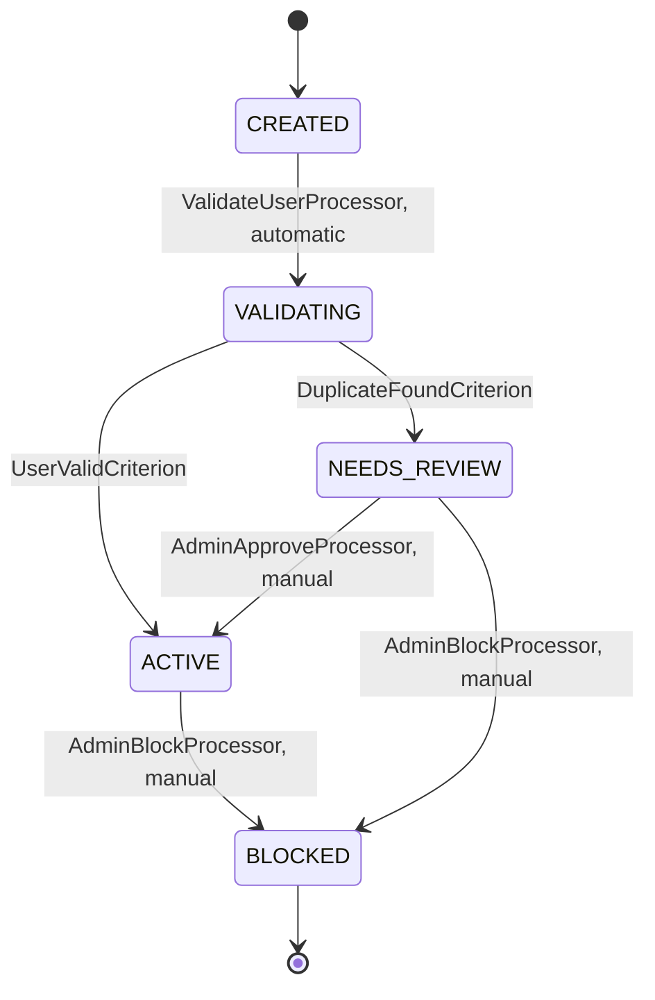
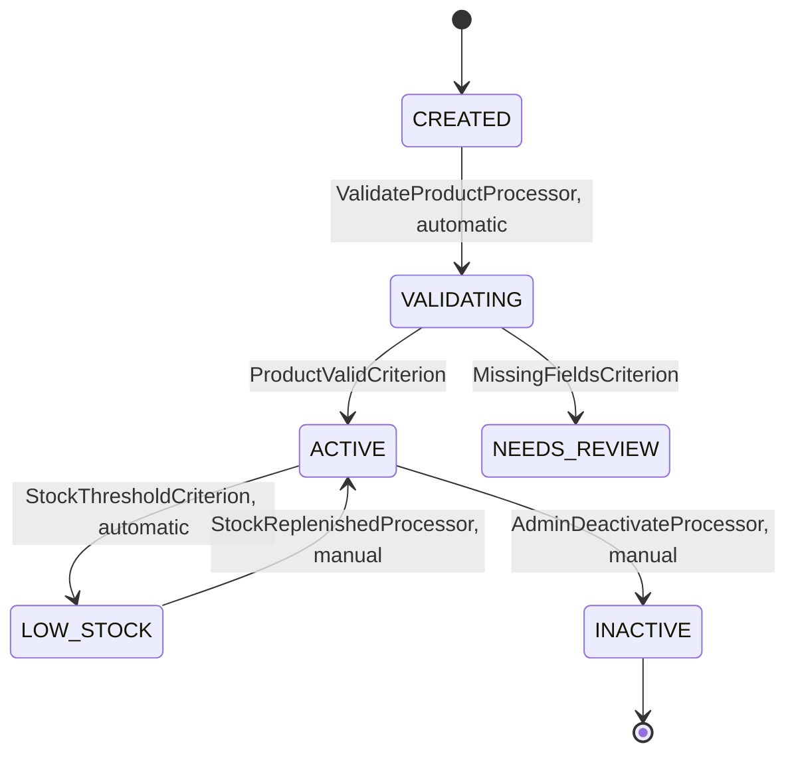
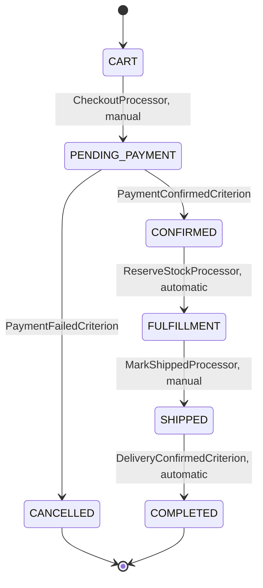
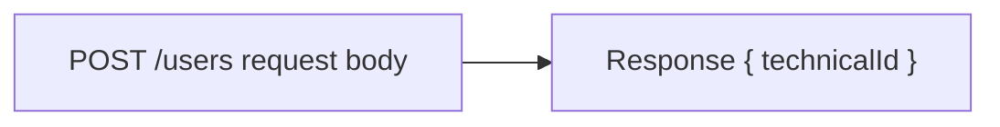

Thanks — below is an Event‑Driven (Cyoda) functional requirements draft for your order management system. I used 3 entities (default). If you want more (up to 10) tell me which ones to add (e.g., ImportJob, Payment, Inventory, Category).

### 1. Entity Definitions
```
User:
- userId: String (business id visible to users)
- name: String (full name)
- email: String (contact/login)
- role: String (Admin or Customer)
- status: String (Active, Blocked, PendingValidation)
- createdAt: String (ISO timestamp)
- importedFrom: String (optional source identifier)

Product:
- productId: String (business id)
- name: String (display name)
- description: String (product details)
- price: Number (unit price)
- sku: String (stock keeping unit)
- stockQuantity: Integer (available units)
- status: String (Active, Inactive, PendingValidation)
- createdAt: String (ISO timestamp)

CartOrder:
- orderId: String (business id)
- customerId: String (links to User.userId)
- items: Array of {productId: String, quantity: Integer, unitPrice: Number}
- subtotal: Number
- tax: Number
- total: Number
- status: String (Cart, PendingPayment, Confirmed, Shipped, Completed, Cancelled)
- createdAt: String (ISO timestamp)
- updatedAt: String (ISO timestamp)
```

### 2. Entity workflows

User workflow:
1. Initial State: Created when a User entity is persisted (event triggers processing)
2. Automatic Validation: Check email format, duplicate detection, importedFrom rules
3. Manual Review: Admin may approve or block (if flagged)
4. Active: user usable
5. Blocked: manual transition by admin


```mermaid
stateDiagram-v2
    [*] --> CREATED
    CREATED --> VALIDATING : ValidateUserProcessor, automatic
    VALIDATING --> ACTIVE : UserValidCriterion
    VALIDATING --> NEEDS_REVIEW : DuplicateFoundCriterion
    NEEDS_REVIEW --> ACTIVE : AdminApproveProcessor, manual
    NEEDS_REVIEW --> BLOCKED : AdminBlockProcessor, manual
    ACTIVE --> BLOCKED : AdminBlockProcessor, manual
    BLOCKED --> [*]
```

Processors/criteria for User:
- ValidateUserProcessor (processor): validate fields, normalize email.
- DuplicateFoundCriterion (criterion): detect existing email/identifier.
- AdminApproveProcessor (processor): mark Active.
- AdminBlockProcessor (processor): set status Blocked.

Product workflow:
1. Created event triggers validation (prices, SKU uniqueness)
2. Auto-check inventory defaults
3. Active or Put into Review/Inactive
4. On Order Confirmed events, decrement stock (automatic)
5. If stock below threshold, mark LowStock and notify Admin


```mermaid
stateDiagram-v2
    [*] --> CREATED
    CREATED --> VALIDATING : ValidateProductProcessor, automatic
    VALIDATING --> ACTIVE : ProductValidCriterion
    VALIDATING --> NEEDS_REVIEW : MissingFieldsCriterion
    ACTIVE --> LOW_STOCK : StockThresholdCriterion, automatic
    LOW_STOCK --> ACTIVE : StockReplenishedProcessor, manual
    ACTIVE --> INACTIVE : AdminDeactivateProcessor, manual
    INACTIVE --> [*]
```

Processors/criteria for Product:
- ValidateProductProcessor: check price>0, sku presence.
- MissingFieldsCriterion: flag incomplete entries.
- StockThresholdCriterion: evaluate stockQuantity.
- UpdateStockProcessor: decrement on confirmed orders.
- NotifyAdminProcessor: send low stock alert.

CartOrder workflow:
1. Initial State: Cart (created when customer starts shopping or when CartOrder created)
2. Checkout: Customer initiates checkout → status PendingPayment (automatic transition on checkout event)
3. Payment processing: external payment result triggers PaymentConfirmed or PaymentFailed
4. Confirmed: Reserve stock and create fulfillment task
5. Shipped -> Completed (automatic/manual updates)
6. Cancelled (manual or automatic on payment failure/timeout)


```mermaid
stateDiagram-v2
    [*] --> CART
    CART --> PENDING_PAYMENT : CheckoutProcessor, manual
    PENDING_PAYMENT --> CONFIRMED : PaymentConfirmedCriterion
    PENDING_PAYMENT --> CANCELLED : PaymentFailedCriterion
    CONFIRMED --> FULFILLMENT : ReserveStockProcessor, automatic
    FULFILLMENT --> SHIPPED : MarkShippedProcessor, manual
    SHIPPED --> COMPLETED : DeliveryConfirmedCriterion, automatic
    CANCELLED --> [*]
    COMPLETED --> [*]
```

Processors/criteria for CartOrder:
- CalculateTotalsProcessor: compute subtotal/tax/total on any item change.
- CheckoutProcessor: validate cart contents, stock availability.
- PaymentConfirmedCriterion / PaymentFailedCriterion: results from payment event.
- ReserveStockProcessor: attempt to reserve/decrement stock (atomic).
- MarkShippedProcessor: admin or fulfillment actor marks shipped.
- NotifyCustomerProcessor: email/SMS notifications.

### 3. Pseudo code for processor classes (concise)

ValidateUserProcessor:
```
process(user):
  if invalidEmail(user.email) -> set status PendingValidation; emit UserValidationFailedEvent
  if existsUser(user.email) -> emit DuplicateFoundEvent
  else set status Active; emit UserActivatedEvent
```

ValidateProductProcessor:
```
process(product):
  if product.price <= 0 -> set status PendingValidation; emit ProductValidationFailedEvent
  if skuExists(product.sku) -> emit DuplicateSkuEvent
  else set status Active; emit ProductActivatedEvent
```

CalculateTotalsProcessor:
```
process(cartOrder):
  subtotal = sum(item.quantity * item.unitPrice)
  tax = applyTaxRules(subtotal)
  total = subtotal + tax
  persist totals
```

ReserveStockProcessor:
```
process(order):
  for item in order.items:
    if product.stockQuantity < item.quantity:
      emit StockInsufficientEvent; set order.status Cancelled
      return
  for item in order.items:
    product.stockQuantity -= item.quantity
    persist product
  emit StockReservedEvent; set order.status Confirmed
```

NotifyCustomerProcessor:
```
process(entity, event):
  prepare message
  enqueue notification
```

Criterion examples:
- UserValidCriterion: returns true if validations passed
- PaymentConfirmedCriterion: returns true when external payment success event received for order

### 4. API Endpoints Design Rules

Rules summary:
- POST endpoints create entities and trigger Cyoda process method (events). POST returns only technicalId.
- GET by technicalId available for all POST-created entities.
- No GET by condition unless you ask.
- Business logic (imports, payments) → model as POST and external events consumed by Cyoda processors.

Endpoints and JSON examples:

POST /users
- Request: create user (triggers User workflow)
- Response: { "technicalId": "string" }

Mermaid representation:

```mermaid
flowchart LR
  POSTUsers["POST /users request body"]
  POSTUsers --> UsersResp["Response { technicalId }"]
```

Request body:
```
{
  "userId": "U123",
  "name": "Alice",
  "email": "alice@example.com",
  "role": "Customer",
  "importedFrom": "import-file-2025-08-01"
}
```
Response:
```
{ "technicalId": "tx-uuid-1234" }
```

GET /users/{technicalId}
- Returns stored User with status and createdAt.


```mermaid
flowchart LR
  GetUserReq["GET /users/{technicalId}"]
  GetUserReq --> GetUserResp["Response full User record"]
```

POST /products
- Request: create product (triggers Product workflow)
- Response: { "technicalId": "string" }

POST /orders
- Request: create CartOrder (creating cart or checkout depending on status)
- Response: { "technicalId": "string" }

For each of the above, GET /{entity}/{technicalId} returns the persisted entity with computed fields (totals, status, timestamps).

Next questions to refine:
- Do you want an explicit ImportJob orchestration entity for bulk CSV imports (recommended)?
- Guest checkout allowed or only registered users?
- When should stock decrement occur: on add-to-cart, on checkout, or on payment confirmation?
- Do you need discounts, taxes by region, or multi-currency?

Tell me which options you choose and I will expand entities and workflows (add processors, mermaid diagrams, and API samples) or increase entities up to 10.