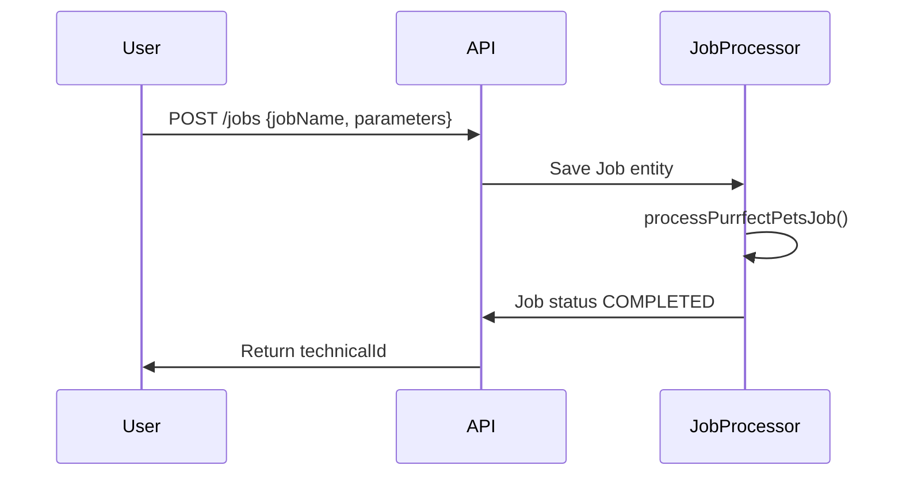

### 1. Entity Definitions

``` 
PurrfectPetsJob: 
- jobName: String (Name of the orchestration job, e.g., "IngestPetsData")
- status: String (Current job status: PENDING, COMPLETED, FAILED)
- createdAt: String (Timestamp of job creation)
- parameters: String (Optional JSON/text parameters for job configuration)

Pet:
- petId: Long (Unique pet identifier from Petstore API)
- name: String (Pet name)
- category: String (Pet category, e.g., dog, cat)
- status: String (Pet availability status: available, pending, sold)
- photoUrls: String (Comma-separated URLs of pet photos)
- tags: String (Comma-separated descriptive tags)

Order:
- orderId: Long (Unique order identifier)
- petId: Long (ID of the pet ordered)
- quantity: Integer (Number of pets ordered)
- shipDate: String (Date pet will be shipped)
- status: String (Order status: placed, approved, delivered)
- complete: Boolean (Indicates if the order is complete)
```

---

### 2. Process Method Flows

```
processPurrfectPetsJob() Flow:
1. Initial State: Job created with status PENDING.
2. Validation: Validate job parameters for ingestion.
3. Processing:
   - Fetch pet data from Petstore API.
   - For each pet, create immutable Pet entities.
   - Optionally fetch and create Order entities.
4. Completion: Update job status to COMPLETED or FAILED.
5. Notification: Log results and optionally notify.
```

```
processPet() Flow:
1. Initial State: Pet entity created.
2. Validation: Validate pet data and status values.
3. Processing: Persist pet as immutable record.
4. Completion: Pet available for retrieval.
```

```
processOrder() Flow:
1. Initial State: Order entity created.
2. Validation: Validate petId existence and quantity.
3. Processing: Persist order as immutable record.
4. Completion: Order available for retrieval.
```

---

### 3. API Endpoints Design

| HTTP Method | Endpoint                | Description                        | Request Body                | Response                      |
|-------------|-------------------------|----------------------------------|-----------------------------|-------------------------------|
| POST        | `/jobs`                 | Create a new orchestration job   | `{ "jobName": "...", "parameters": "..." }` | `{ "technicalId": "string" }` |
| GET         | `/jobs/{technicalId}`   | Retrieve job by technicalId      | N/A                         | Job entity JSON               |
| POST        | `/pets`                 | Create a new Pet entity          | Pet JSON (excluding technicalId) | `{ "technicalId": "string" }` |
| GET         | `/pets/{technicalId}`   | Retrieve pet by technicalId      | N/A                         | Pet JSON                     |
| GET         | `/pets/findByStatus`    | (Optional) Find pets by status   | Query param `status`         | List of Pet JSON              |
| POST        | `/orders`               | Create a new Order entity        | Order JSON (excluding technicalId) | `{ "technicalId": "string" }` |
| GET         | `/orders/{technicalId}` | Retrieve order by technicalId    | N/A                         | Order JSON                   |

---

### 4. Request/Response Formats

**POST /jobs Request**  
```json
{
  "jobName": "IngestPetsData",
  "parameters": "{\"fetchOrders\":true}"
}
```

**POST /jobs Response**  
```json
{
  "technicalId": "job-uuid-1234"
}
```

**POST /pets Request**  
```json
{
  "petId": 123,
  "name": "Fluffy",
  "category": "cat",
  "status": "available",
  "photoUrls": "http://url1.com,http://url2.com",
  "tags": "cute,furry"
}
```

**POST /pets Response**  
```json
{
  "technicalId": "pet-uuid-5678"
}
```

**GET /pets/{technicalId} Response**  
```json
{
  "petId": 123,
  "name": "Fluffy",
  "category": "cat",
  "status": "available",
  "photoUrls": "http://url1.com,http://url2.com",
  "tags": "cute,furry"
}
```

---

### 5. Visual Representation

**Entity Lifecycle State Diagram for Job**  

```mermaid
stateDiagram-v2
    [*] --> JobCreated
    JobCreated --> Processing : processPurrfectPetsJob()
    Processing --> Completed : success
    Processing --> Failed : error
    Completed --> [*]
    Failed --> [*]
```

**Event-Driven Processing Chain**  
```mermaid
graph TD
    JobCreated -->|processPurrfectPetsJob()| FetchPetstoreData
    FetchPetstoreData --> CreatePetEntities
    CreatePetEntities --> SavePetEntities
    SavePetEntities --> JobCompleted
    JobCompleted --> JobStatusUpdated
```

**User Interaction Sequence Flow**  

```mermaid
sequenceDiagram
    participant User
    participant API
    participant JobProcessor

    User->>API: POST /jobs {jobName, parameters}
    API->>JobProcessor: Save Job entity
    JobProcessor->>JobProcessor: processPurrfectPetsJob()
    JobProcessor->>API: Job status COMPLETED
    API->>User: Return technicalId
```

---

This completes the functional requirements for the **Purrfect Pets** API app using an Event-Driven Architecture approach on Cyoda platform.