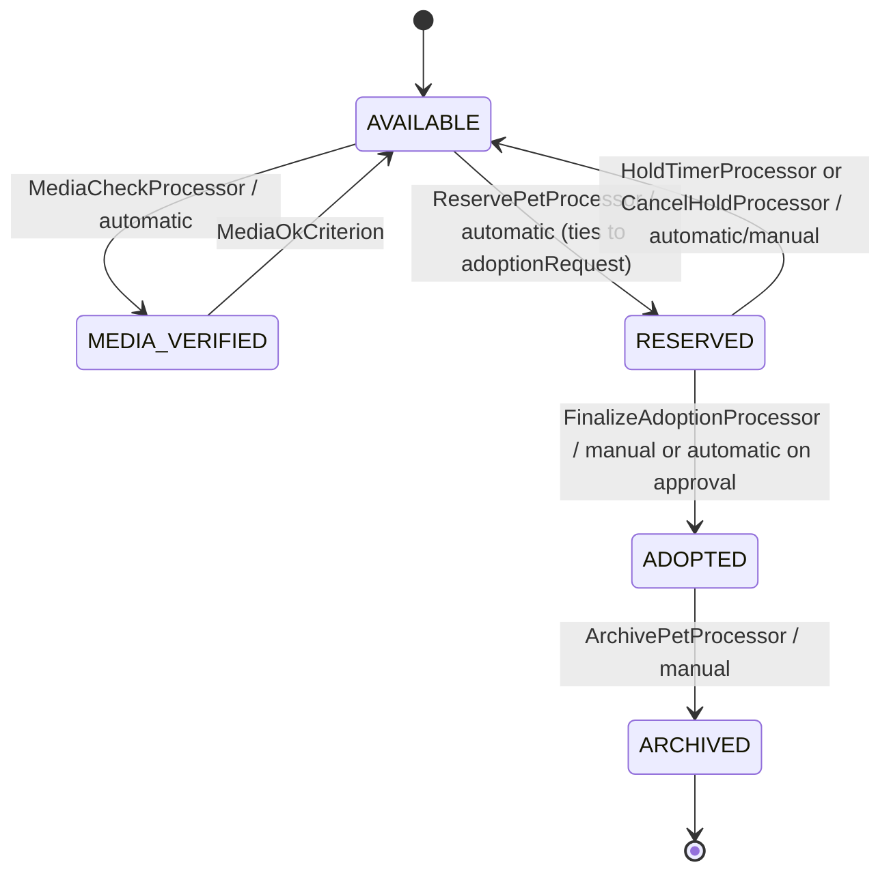
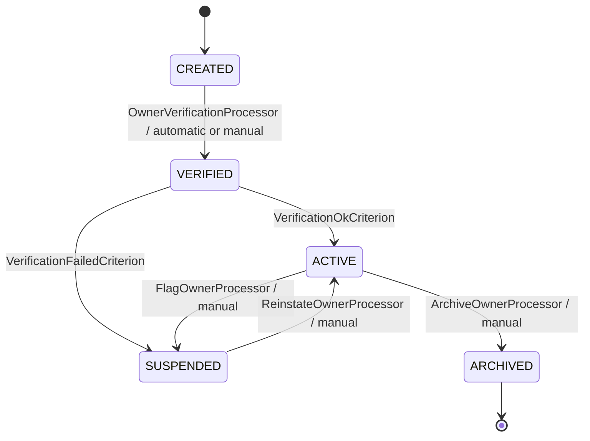
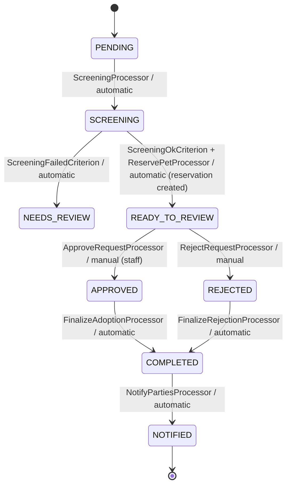
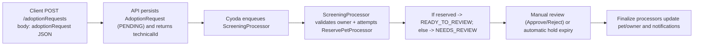

# Functional Requirements (Updated)

This document specifies the entities, their lifecycle workflows, processing components, and API design rules for the Pet/Owner/AdoptionRequest prototype. The functional logic has been normalized and inconsistencies resolved.

---

## 1. Entity Definitions

All fields are stored as persisted attributes unless noted. Where appropriate, explicit types and enumerations are provided.

### Pet
- id: String (business id from Petstore or internal)
- technicalId: String (internal technical identifier returned by POST)
- name: String
- species: String (dog/cat/etc)
- breed: String
- birthDate: String (ISO date) OR ageYears: Integer and ageMonths: Integer (choose one approach)
- sex: String (M/F/unknown)
- status: Enum {AVAILABLE, MEDIA_VERIFIED, RESERVED, PENDING, ADOPTED, ARCHIVED}
  - NOTE: `PENDING` is deprecated as a long-lived pet status; preferred is `AVAILABLE` or `RESERVED` for holds. `PENDING` may be used transiently in internal events, but persistent statuses should be the enumerated values above.
- photoUrl: String (media link)
- tags: Array(String)
- metadataVerified: Boolean (true when media/tags validated)
- reservation: object (nullable) {
  - requestTechnicalId: String
  - reservedAt: String (ISO datetime)
  - reservedUntil: String (ISO datetime)
}

### Owner
- id: String (business id)
- technicalId: String (internal technical id)
- name: String
- contactEmail: String
- contactPhone: String
- address: String
- role: Enum {CUSTOMER, ADMIN, STAFF}
- verified: Boolean (contact/identity verification)
- verificationRequestedAt: String (ISO datetime)
- verificationCompletedAt: String (ISO datetime)
- favorites: Array(String) (pet business ids or technicalIds — choose a canonical id form)
- adoptionHistory: Array(String) (adoptionRequest technicalIds)
- status: Enum {CREATED, VERIFIED, ACTIVE, SUSPENDED, ARCHIVED}

### AdoptionRequest
- id: String (business id)
- technicalId: String (internal technical id)
- petId: String (business id) / petTechnicalId: String (recommended to use technicalId for internal links)
- ownerId: String (business id) / ownerTechnicalId: String
- requestDate: String (ISO datetime)
- status: Enum {
  PENDING,       // created and awaiting automated screening
  SCREENING,     // screening in progress
  NEEDS_REVIEW,  // failed auto-screening and requires manual review
  READY_TO_REVIEW, // screening passed, pet reserved and ready for manual approval
  APPROVED,      // request approved (adoption finalized)
  REJECTED,      // request rejected
  CANCELLED,     // cancelled by owner or system (e.g., reservation expired)
  COMPLETED      // post-processing and notifications completed
}
- notes: String
- processedBy: String (staff/owner technicalId who processed)
- createdAt: String (ISO datetime)
- updatedAt: String (ISO datetime)

---

## 2. Workflows (Normalized)

High-level rules used across workflows:
- POST that creates an entity creates the persisted entity with a technicalId and triggers the associated workflow.
- Where reservations/locks are required (pet holds), they must be established atomically to avoid race conditions.
- Automatic processors should update entity workflow state and persist changes; manual processors are triggered by staff actions.

### Pet workflow (states & transitions)

Behavioral notes:
- Media verification is modeled as a metadata verification step that sets `metadataVerified` and may change `status` to MEDIA_VERIFIED.
- A pet is only RESERVED (a hold) when a screening/hold step successfully creates a reservation tied to a single AdoptionRequest. RESERVED includes reservation metadata.
- Adopted pets are set to ADOPTED and then may be ARCHIVED manually later.


```mermaid
stateDiagram-v2
    [*] --> AVAILABLE
    AVAILABLE --> MEDIA_VERIFIED : MediaCheckProcessor / automatic
    MEDIA_VERIFIED --> AVAILABLE : MediaOkCriterion
    AVAILABLE --> RESERVED : ReservePetProcessor / automatic (ties to adoptionRequest)
    RESERVED --> ADOPTED : FinalizeAdoptionProcessor / manual or automatic on approval
    RESERVED --> AVAILABLE : HoldTimerProcessor or CancelHoldProcessor / automatic/manual
    ADOPTED --> ARCHIVED : ArchivePetProcessor / manual
    ARCHIVED --> [*]
```

Pet processors/criteria required:
- MediaCheckProcessor (validate photoUrl, tags)
- MediaOkCriterion / MediaFailedCriterion
- ReservePetProcessor (establish atomic reservation for a specific adoptionRequest)
- HoldTimerProcessor (release reservation after timeout)
- CancelHoldProcessor (manual release)
- FinalizeAdoptionProcessor (finalize adoption, mark adopted)
- ArchivePetProcessor

### Owner workflow (states & transitions)


```mermaid
stateDiagram-v2
    [*] --> CREATED
    CREATED --> VERIFIED : OwnerVerificationProcessor / automatic or manual
    VERIFIED --> ACTIVE : VerificationOkCriterion
    VERIFIED --> SUSPENDED : VerificationFailedCriterion
    ACTIVE --> SUSPENDED : FlagOwnerProcessor / manual
    SUSPENDED --> ACTIVE : ReinstateOwnerProcessor / manual
    ACTIVE --> ARCHIVED : ArchiveOwnerProcessor / manual
    ARCHIVED --> [*]
```

Owner processors/criteria required:
- OwnerVerificationProcessor (send/check verification, record results)
- VerificationOkCriterion / VerificationFailedCriterion
- FlagOwnerProcessor / ReinstateOwnerProcessor
- ArchiveOwnerProcessor

### AdoptionRequest workflow (states & transitions)

Behavioral notes and corrections to earlier design:
- On POST /adoptionRequests, an AdoptionRequest entity is created with status PENDING and the workflow starts. The pet should not be marked RESERVED at creation time by a simple POST processor because screening must first validate owner and pet availability and then attempt to reserve the pet atomically.
- ScreeningProcessor is responsible for validating the owner and attempt to reserve the pet for a short hold window when screening succeeds.
- If screening fails, the request is set to NEEDS_REVIEW or REJECTED depending on failure reason.


```mermaid
stateDiagram-v2
    [*] --> PENDING
    PENDING --> SCREENING : ScreeningProcessor / automatic
    SCREENING --> NEEDS_REVIEW : ScreeningFailedCriterion / automatic
    SCREENING --> READY_TO_REVIEW : ScreeningOkCriterion + ReservePetProcessor / automatic (reservation created)
    READY_TO_REVIEW --> APPROVED : ApproveRequestProcessor / manual (staff)
    READY_TO_REVIEW --> REJECTED : RejectRequestProcessor / manual
    APPROVED --> COMPLETED : FinalizeAdoptionProcessor / automatic
    REJECTED --> COMPLETED : FinalizeRejectionProcessor / automatic
    COMPLETED --> NOTIFIED : NotifyPartiesProcessor / automatic
    NOTIFIED --> [*]
```

AdoptionRequest processors/criteria required:
- ReceiveAdoptionRequestProcessor (persists the request and triggers screening)
- ScreeningProcessor (checks owner verification and pet availability; attempts to reserve pet)
- ScreeningOkCriterion / ScreeningFailedCriterion
- ReservePetProcessor (atomic reservation tied to adoptionRequest — may be invoked by ScreeningProcessor or as an explicit processor)
- ApproveRequestProcessor / RejectRequestProcessor (manual actions)
- FinalizeAdoptionProcessor (links owner and pet; marks pet ADOPTED)
- FinalizeRejectionProcessor (releases reservation and sets final states)
- HoldTimerProcessor (releases reservation when expired and transitions related AdoptionRequest to CANCELLED/COMPLETED as appropriate)
- NotifyPartiesProcessor

---

## 3. Processor Pseudocode (concise, corrected logic)

These pseudocode examples reflect the updated, consistent logic and atomic reservation behavior.

Pet media check processor

```
class MediaCheckProcessor {
  process(petTechnicalId) {
    pet = loadPet(petTechnicalId)
    if validateUrl(pet.photoUrl) and notEmpty(pet.tags) then
      pet.metadataVerified = true
      pet.status = MEDIA_VERIFIED
      save(pet)
    else
      // schedule retry or mark for manual review
      scheduleRetryFor(petTechnicalId)
    end
  }
}
```

Receive adoption request processor

```
class ReceiveAdoptionRequestProcessor {
  process(adoptionRequestPayload) {
    // persist the adoption request as PENDING
    adoptionRequest = createAdoptionRequest(payload, status=PENDING)
    // start screening asynchronously
    enqueue(SCREENING, adoptionRequest.technicalId)
    return adoptionRequest.technicalId
  }
}
```

Screening and reservation processor

```
class ScreeningProcessor {
  process(adoptionRequestTechnicalId) {
    ar = loadAdoptionRequest(adoptionRequestTechnicalId)
    owner = loadOwner(ar.ownerTechnicalId)
    pet = loadPet(ar.petTechnicalId)

    ar.status = SCREENING
    save(ar)

    if owner.verified and pet.status == AVAILABLE then
      // attempt atomic reservation
      success = ReservePetProcessor.tryReserve(pet.technicalId, ar.technicalId)
      if success then
        ar.status = READY_TO_REVIEW
      else
        ar.status = NEEDS_REVIEW
      end
    else
      // either owner not verified or pet not available
      ar.status = NEEDS_REVIEW
    end

    save(ar)
  }
}

class ReservePetProcessor {
  // must be atomic; return true if reserved for this request
  tryReserve(petTechnicalId, adoptionRequestTechnicalId) {
    beginTransaction()
    pet = loadPetForUpdate(petTechnicalId)
    if pet.status == AVAILABLE then
      pet.status = RESERVED
      pet.reservation = { requestTechnicalId: adoptionRequestTechnicalId, reservedAt: now(), reservedUntil: now() + HOLD_WINDOW }
      save(pet)
      commitTransaction()
      return true
    else
      rollbackTransaction()
      return false
    end
  }
}
```

Finalize adoption processor

```
class FinalizeAdoptionProcessor {
  process(adoptionRequestTechnicalId) {
    ar = loadAdoptionRequest(adoptionRequestTechnicalId)
    pet = loadPet(ar.petTechnicalId)
    owner = loadOwner(ar.ownerTechnicalId)

    // ensure reservation belongs to this request
    if pet.status == RESERVED and pet.reservation.requestTechnicalId == ar.technicalId then
      beginTransaction()
      pet.status = ADOPTED
      pet.reservation = null
      owner.adoptionHistory.add(ar.technicalId)
      ar.status = APPROVED
      ar.processedBy = currentUser() // or processor id
      save(pet); save(owner); save(ar)
      commitTransaction()
    else
      // cannot finalize: inconsistent state
      ar.status = NEEDS_REVIEW
      save(ar)
    end
  }
}
```

Finalize rejection / release reservation

```
class FinalizeRejectionProcessor {
  process(adoptionRequestTechnicalId) {
    ar = loadAdoptionRequest(adoptionRequestTechnicalId)
    if ar.status in {READY_TO_REVIEW, NEEDS_REVIEW, SCREENING} then
      ar.status = REJECTED
      save(ar)
      // release reservation if exists
      pet = loadPet(ar.petTechnicalId)
      if pet.reservation and pet.reservation.requestTechnicalId == ar.technicalId then
        pet.status = AVAILABLE
        pet.reservation = null
        save(pet)
      end
    end
  }
}
```

Hold timer processor

```
class HoldTimerProcessor {
  // runs periodically or is scheduled when reservation created
  process(petTechnicalId) {
    pet = loadPet(petTechnicalId)
    if pet.status == RESERVED and now() > pet.reservation.reservedUntil then
      // release reservation
      arId = pet.reservation.requestTechnicalId
      pet.status = AVAILABLE
      pet.reservation = null
      save(pet)

      ar = loadAdoptionRequest(arId)
      if ar.status == READY_TO_REVIEW then
        ar.status = CANCELLED
        save(ar)
      end
    end
  }
}
```

---

## 4. API Endpoints Design Rules (confirmed and clarified)

- Every POST that creates an entity triggers the corresponding workflow.
- POST responses MUST return only { "technicalId": "..." } as the response body.
- A GET by technicalId MUST be provided for all created entities (GET /pets/{technicalId}, GET /owners/{technicalId}, GET /adoptionRequests/{technicalId}).
- No GET by non-technical fields unless explicitly requested and designed.
- GET all endpoints are optional and not included by default.

Endpoints and JSON formats (requests -> responses)

POST /pets
Request body example (create pet event):

```json
{ "id":"P123","name":"Whiskers","species":"cat","breed":"tabby","birthDate":"2023-08-01","sex":"F","photoUrl":"https://...","tags":["friendly"] }
```

Response body:

```json
{ "technicalId":"tech_pet_abc123" }
```

POST /owners
Request example:

```json
{ "id":"O456","name":"Alex Doe","contactEmail":"alex@example.com","contactPhone":"+1...","address":"...","role":"CUSTOMER" }
```

Response:

```json
{ "technicalId":"tech_owner_def456" }
```

POST /adoptionRequests
Request:

```json
{ "id":"R789","petId":"P123","ownerId":"O456","requestDate":"2025-08-15T10:00:00Z","notes":"I love cats" }
```

Response:

```json
{ "technicalId":"tech_req_ghi789" }
```

GET by technicalId (all entities)
- Example: GET /pets/{technicalId} returns the full persisted entity JSON representation as stored (including metadataVerified, reservation info, status, etc.).

Example request -> Cyoda -> response flow (AdoptionRequest)


```mermaid
flowchart LR
    A["Client POST /adoptionRequests\nbody: adoptionRequest JSON"] --> B["API persists AdoptionRequest (PENDING) and returns technicalId"]
    B --> C["Cyoda enqueues ScreeningProcessor"]
    C --> D["ScreeningProcessor validates owner + attempts ReservePetProcessor"]
    D --> E["If reserved -> READY_TO_REVIEW; else -> NEEDS_REVIEW"]
    E --> F["Manual review (Approve/Reject) or automatic hold expiry"]
    F --> G["Finalize processors update pet/owner and notifications"]
```

---

## 5. Notes, Constraints and Recommendations

- Reservation/hold logic must be atomic: implement using DB row locking or advisory locks to prevent double reservations.
- Prefer storing internal references using technicalId consistently across entities to avoid confusion between business ids and internal ids.
- Consider storing a birthDate instead of age fields for better accuracy and easier filtering.
- Limit of 3 entities modeled by default remains; additional entities (Appointments, Payments, Reviews, IngestJob, etc.) can be added up to 10 if required.
- All transitions map to processors and criteria (automatic vs manual flagged). Each persisted entity creation triggers its workflow automatically.

---

End of functional requirements (updated to resolve prior contradictions and to ensure reservation and screening logic are consistent and atomic).
