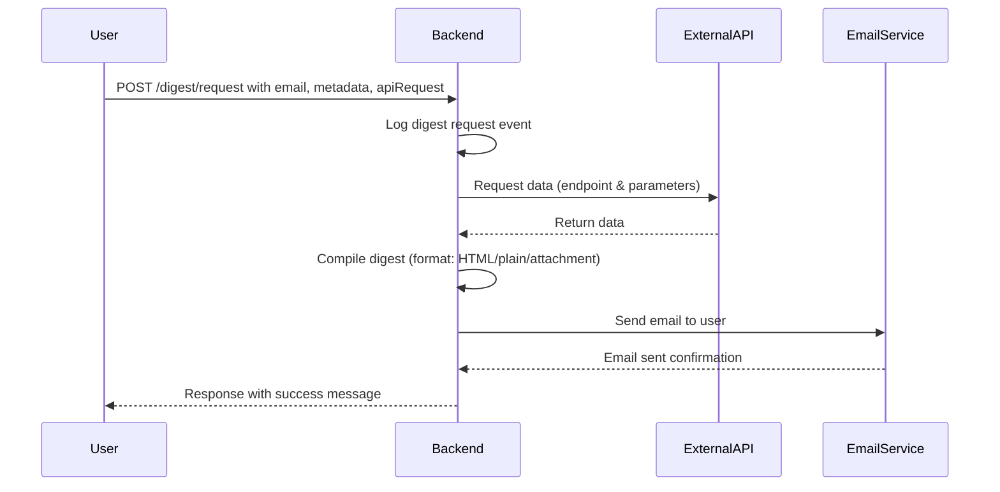
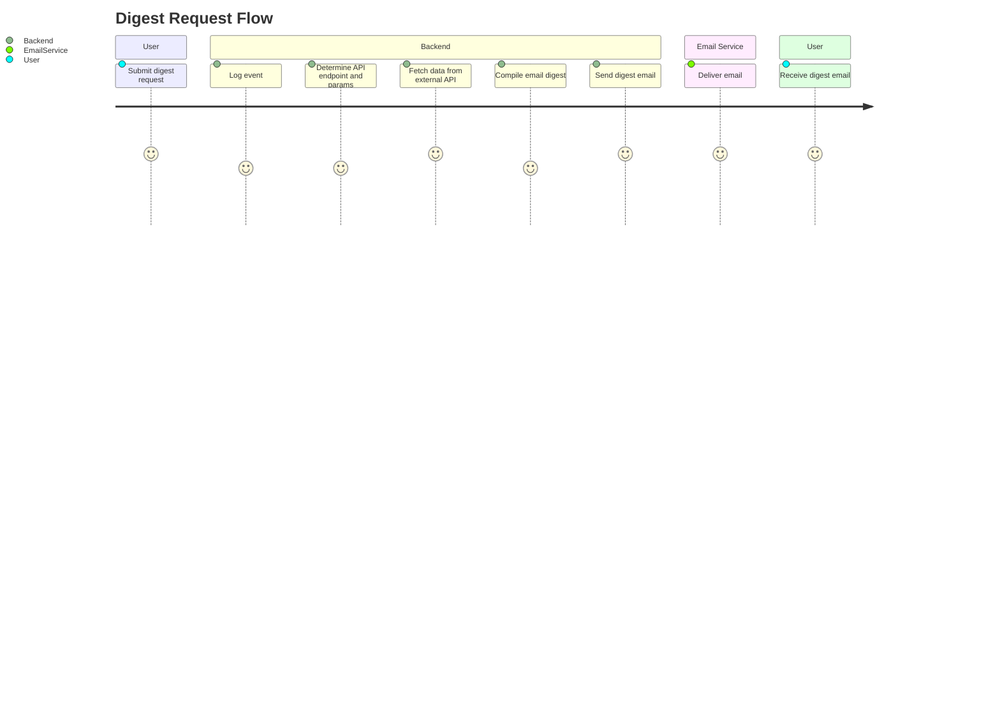

# Functional Requirements and API Design

## API Endpoints

### 1. POST /digest/request  
**Description:**  
Accepts and registers a digest request event, fetches data from the external API based on event contents or defaults, compiles the digest, and sends it via email.

**Request Body (JSON):**  
```json
{
  "email": "user@example.com",
  "metadata": {
    "key1": "value1",
    "key2": "value2"
  },
  "apiRequest": {
    "endpoint": "/pet/findByStatus",
    "parameters": {
      "status": "available"
    }
  },
  "emailFormat": "html"  // optional: "plain", "html", "attachment"
}
```

**Response (JSON):**  
```json
{
  "status": "success",
  "message": "Digest request processed and email sent."
}
```

**Notes:**  
- If `apiRequest` is missing, system defaults for endpoint and parameters are used.  
- `emailFormat` is optional; default is `html`.

---

### 2. GET /digest/status/{requestId}  
**Description:**  
Retrieves the status and metadata of a previously submitted digest request.

**Response (JSON):**  
```json
{
  "requestId": "abc123",
  "email": "user@example.com",
  "status": "completed",  // or "pending", "failed"
  "timestamp": "2024-06-01T12:00:00Z",
  "metadata": {
    "key1": "value1"
  }
}
```

---

# Mermaid Sequence Diagram of User-App Interaction


```mermaid
sequenceDiagram
    participant User
    participant Backend
    participant ExternalAPI
    participant EmailService

    User->>Backend: POST /digest/request with email, metadata, apiRequest
    Backend->>Backend: Log digest request event
    Backend->>ExternalAPI: Request data (endpoint & parameters)
    ExternalAPI-->>Backend: Return data
    Backend->>Backend: Compile digest (format: HTML/plain/attachment)
    Backend->>EmailService: Send email to user
    EmailService-->>Backend: Email sent confirmation
    Backend-->>User: Response with success message
```

---

# Mermaid Journey Diagram for Digest Request


```mermaid
journey
    title Digest Request Flow
    section User
      Submit digest request: 5: User
    section Backend
      Log event: 4: Backend
      Determine API endpoint and params: 4: Backend
      Fetch data from external API: 5: Backend
      Compile email digest: 4: Backend
      Send digest email: 5: Backend
    section Email Service
      Deliver email: 5: EmailService
    section User
      Receive digest email: 5: User
```