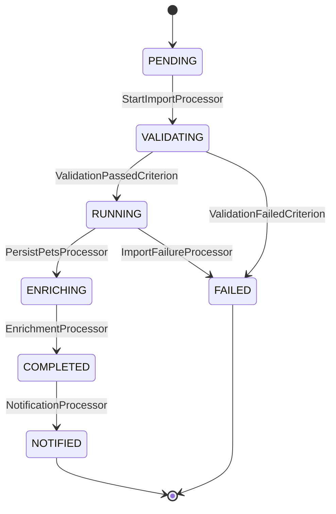
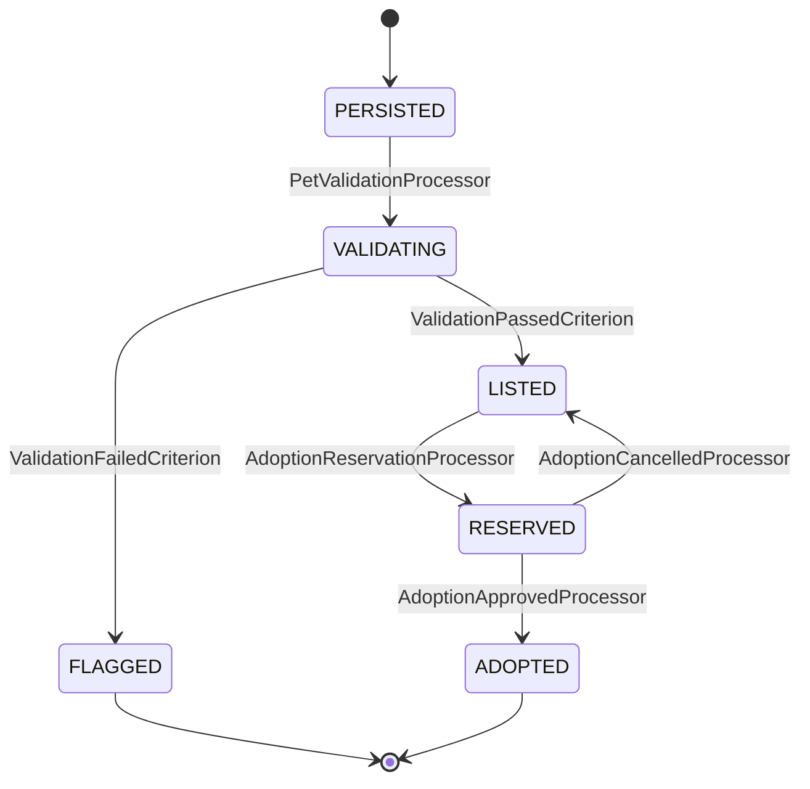
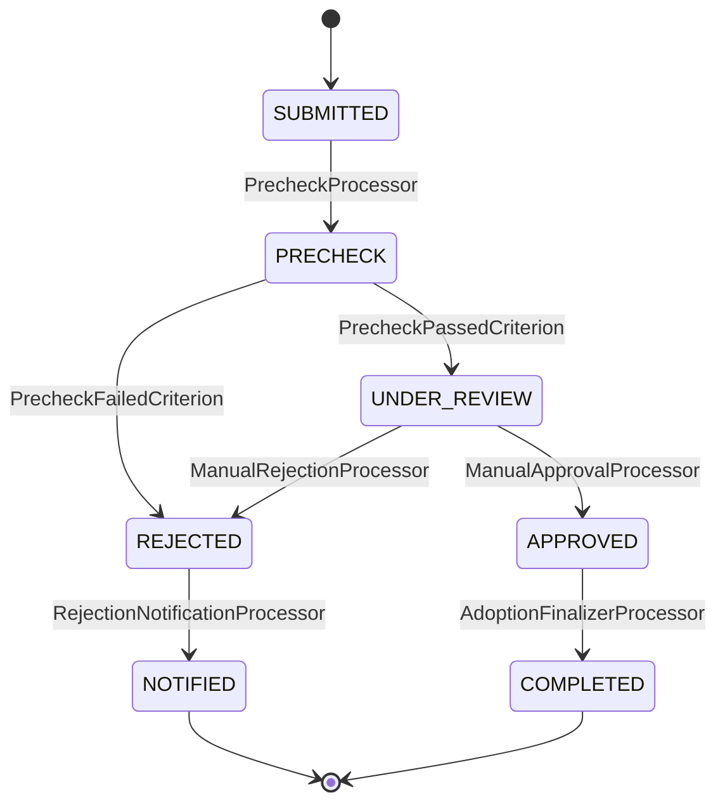

### 1. Entity Definitions
```
ImportJob:
- id: String (external id from client request)
- source: String (data source identifier, e.g., PetstoreAPI)
- schedule: String (one-time or cron expression for recurring imports)
- options: Object (filters/mapping options for import)
- status: String (PENDING, RUNNING, COMPLETED, FAILED)
- startedAt: String (timestamp)
- finishedAt: String (timestamp)
- result: Object (counts, errors summary)

Pet:
- id: String (source id from Petstore data)
- name: String (pet name)
- species: String (cat, dog, etc.)
- breed: String (breed description)
- age: Number (estimated age)
- gender: String (gender)
- photos: Array (urls)
- tags: Array (tags/keywords)
- status: String (available, pending, adopted)
- metadata: Object (additional attributes)

AdoptionRequest:
- id: String (business id)
- pet_id: String (reference to Pet.id)
- owner_name: String (applicant name)
- owner_contact: Object (email, phone)
- submitted_at: String (timestamp)
- status: String (submitted, under_review, approved, rejected, completed)
- notes: String (applicant notes)
- outcome: Object (approval details, pickup date)
```

### 2. Entity workflows

ImportJob workflow:
1. Initial State: Job created with PENDING status (POST ImportJob triggers event)
2. Validation: Validate source, credentials and options (automatic)
3. Execution: Fetch data from Petstore → transform → persist Pet entities (automatic)
4. Enrichment: Run Pet enrichment (photos validation, tag normalization) (automatic)
5. Completion: Update status to COMPLETED or FAILED, record result counts (automatic)
6. Notification: Notify admins/owners if configured (automatic)


```mermaid
stateDiagram-v2
    [*] --> PENDING
    PENDING --> VALIDATING : StartImportProcessor
    VALIDATING --> RUNNING : ValidationPassedCriterion
    VALIDATING --> FAILED : ValidationFailedCriterion
    RUNNING --> ENRICHING : PersistPetsProcessor
    ENRICHING --> COMPLETED : EnrichmentProcessor
    RUNNING --> FAILED : ImportFailureProcessor
    COMPLETED --> NOTIFIED : NotificationProcessor
    NOTIFIED --> [*]
    FAILED --> [*]
```

ImportJob processors and criteria:
- Processors: StartImportProcessor, PersistPetsProcessor, EnrichmentProcessor, ImportFailureProcessor, NotificationProcessor
- Criteria: ValidationPassedCriterion, ValidationFailedCriterion

Pet workflow:
1. Initial State: Pet persisted (created by ImportJob or later events) with status available/pending
2. Validation: Check required fields and photo accessibility (automatic)
3. Availability check: Ensure no conflicting adoption in progress (automatic)
4. Publication: Mark as listed/available (automatic) or mark as flagged (manual admin review)
5. Adoption transition: When AdoptionRequest approved, Pet status -> adopted (automatic)


```mermaid
stateDiagram-v2
    [*] --> PERSISTED
    PERSISTED --> VALIDATING : PetValidationProcessor
    VALIDATING --> LISTED : ValidationPassedCriterion
    VALIDATING --> FLAGGED : ValidationFailedCriterion
    LISTED --> RESERVED : AdoptionReservationProcessor
    RESERVED --> ADOPTED : AdoptionApprovedProcessor
    RESERVED --> LISTED : AdoptionCancelledProcessor
    FLAGGED --> [*]
    ADOPTED --> [*]
```

Pet processors and criteria:
- Processors: PetValidationProcessor, PetEnrichmentProcessor, AdoptionReservationProcessor, AdoptionApprovedProcessor
- Criteria: ValidationPassedCriterion, ValidationFailedCriterion, AvailabilityCriterion

AdoptionRequest workflow:
1. Initial State: Request created with submitted status (POST AdoptionRequest triggers event)
2. Pre-check: Validate owner contact and pet availability (automatic)
3. Review: Manual review by admin or automated rules (manual)
4. Decision: Approve or Reject (manual or automatic)
5. Completion: If approved -> create reservation and mark Pet adopted after pickup (automatic); if rejected -> notify applicant (automatic)


```mermaid
stateDiagram-v2
    [*] --> SUBMITTED
    SUBMITTED --> PRECHECK : PrecheckProcessor
    PRECHECK --> UNDER_REVIEW : PrecheckPassedCriterion
    PRECHECK --> REJECTED : PrecheckFailedCriterion
    UNDER_REVIEW --> APPROVED : ManualApprovalProcessor
    UNDER_REVIEW --> REJECTED : ManualRejectionProcessor
    APPROVED --> COMPLETED : AdoptionFinalizerProcessor
    REJECTED --> NOTIFIED : RejectionNotificationProcessor
    NOTIFIED --> [*]
    COMPLETED --> [*]
```

AdoptionRequest processors and criteria:
- Processors: PrecheckProcessor, ManualApprovalProcessor, ManualRejectionProcessor, AdoptionFinalizerProcessor, RejectionNotificationProcessor
- Criteria: PrecheckPassedCriterion, PrecheckFailedCriterion, AdoptionCompleteCriterion

### 3. Pseudo code for processor classes

Note: each processor runs when entity persisted or when workflow advances.

ImportJob - StartImportProcessor
```pseudo
class StartImportProcessor {
  process(importJob) {
    importJob.status = RUNNING
    importJob.startedAt = now()
    update(importJob)
    try {
      feed = fetchFromSource(importJob.source, importJob.options)
      for item in feed {
        pet = transformToPet(item)
        persistEntity(pet) // triggers Pet workflow
      }
      importJob.result = { imported: feed.size }
      importJob.status = COMPLETED
    } catch (e) {
      importJob.result = { error: e.message }
      importJob.status = FAILED
    } finally {
      importJob.finishedAt = now()
      update(importJob)
    }
  }
}
```

Pet - PetValidationProcessor
```pseudo
class PetValidationProcessor {
  process(pet) {
    errors = []
    if missingRequired(pet) then errors.add('missing fields')
    checkPhotosAccessible(pet.photos) or errors.add('photo error')
    if errors.empty() {
      pet.status = available
      normalizeTags(pet)
      update(pet)
    } else {
      pet.status = pending
      pet.metadata.validationErrors = errors
      update(pet)
    }
  }
}
```

AdoptionRequest - PrecheckProcessor
```pseudo
class PrecheckProcessor {
  process(request) {
    pet = findPetById(request.pet_id)
    if pet == null {
      request.status = rejected
      request.notes = 'pet not found'
      update(request)
      return
    }
    if pet.status == adopted {
      request.status = rejected
      request.notes = 'pet already adopted'
      update(request)
      return
    }
    // owner contact basic validation
    if invalidContact(request.owner_contact) {
      request.status = rejected
      request.notes = 'invalid contact'
      update(request)
      return
    }
    request.status = under_review
    update(request)
  }
}
```

AdoptionRequest - AdoptionFinalizerProcessor
```pseudo
class AdoptionFinalizerProcessor {
  process(request) {
    pet = findPetById(request.pet_id)
    pet.status = adopted
    update(pet)
    request.status = completed
    request.outcome = { adoptedAt: now() }
    update(request)
    sendNotification(request.owner_contact, 'approved')
  }
}
```

### 4. API Endpoints Design Rules

Summary (entities created by POST): ImportJob, AdoptionRequest
- POST endpoints must return only technicalId (string)
- GET by technicalId available for ImportJob, Pet, AdoptionRequest
- No GET by condition (not requested)
- GET all endpoints optional (not included)

Endpoints and JSON examples

1) Create ImportJob (orchestration) — triggers import processing
- POST /import-jobs
Request:
```json
{
  "id": "import-2025-08-21-01",
  "source": "PetstoreAPI",
  "schedule": "ONE_TIME",
  "options": { "category": "cats", "limit": 500 }
}
```
Response:
```json
{
  "technicalId": "tj_abc123"
}
```

- GET /import-jobs/{technicalId}
Response:
```json
{
  "technicalId": "tj_abc123",
  "id": "import-2025-08-21-01",
  "source": "PetstoreAPI",
  "status": "COMPLETED",
  "startedAt": "2025-08-21T10:00:00Z",
  "finishedAt": "2025-08-21T10:02:00Z",
  "result": { "imported": 120, "errors": 0 }
}
```

2) Create AdoptionRequest (business event) — triggers adoption workflow
- POST /adoption-requests
Request:
```json
{
  "id": "req-0001",
  "pet_id": "pet-123",
  "owner_name": "Alex Smith",
  "owner_contact": { "email": "alex@example.com", "phone": "+1-555-0100" },
  "notes": "Has prior experience with cats"
}
```
Response:
```json
{
  "technicalId": "tr_789xyz"
}
```

- GET /adoption-requests/{technicalId}
Response:
```json
{
  "technicalId": "tr_789xyz",
  "id": "req-0001",
  "pet_id": "pet-123",
  "owner_name": "Alex Smith",
  "owner_contact": { "email": "alex@example.com", "phone": "+1-555-0100" },
  "submitted_at": "2025-08-21T11:00:00Z",
  "status": "under_review",
  "notes": "Has prior experience with cats"
}
```

3) Get Pet by technicalId (read only)
- GET /pets/{technicalId}
Response:
```json
{
  "technicalId": "tp_pet123",
  "id": "pet-123",
  "name": "Mittens",
  "species": "cat",
  "breed": "Tabby",
  "age": 2,
  "gender": "female",
  "photos": ["https://.../1.jpg"],
  "tags": ["indoor","friendly"],
  "status": "available",
  "metadata": {}
}
```

Notes and rules reminder:
- Every POST that creates an entity returns only technicalId.
- Persisting an entity triggers Cyoda processing/workflow automatically.
- Orchestration entity ImportJob must be created via POST and supports GET by technicalId.
- Business entities that are user-driven (AdoptionRequest) are created via POST and also support GET by technicalId.
- Pet entities are created by ImportJob processing (no POST), but must be retrievable by GET by technicalId.

If you want, I can:
- Add Owner as a standalone entity (increase to 4 entities), or
- Add extra workflows (grooming booking, vet appointments, reviews) up to 10 entities.
Which would you like to expand next?