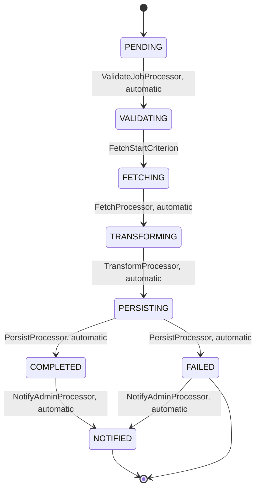
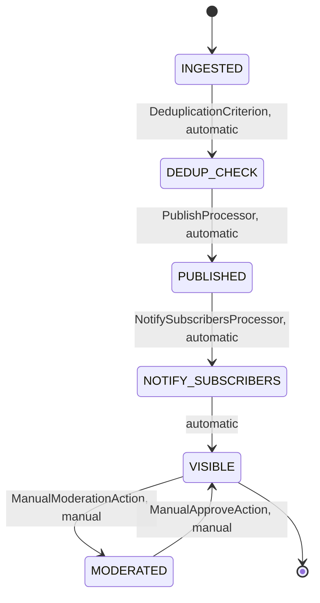
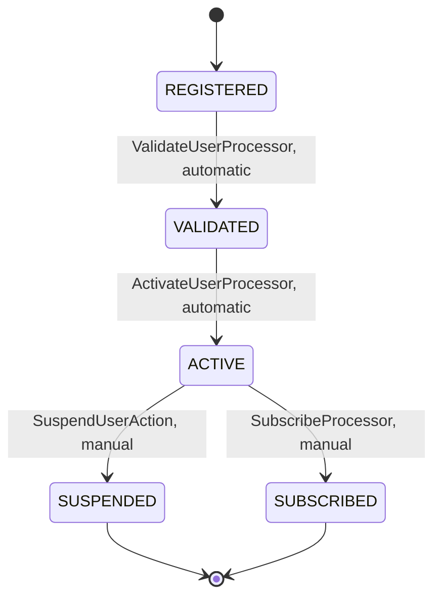

### 1. Entity Definitions
```
CoverPhoto:
- id: String (source id from API)
- title: String (display title)
- description: String (photo description)
- sourceUrl: String (original image url)
- thumbnailUrl: String (gallery thumbnail url)
- tags: Array(String) (keywords)
- publishedDate: String (ISO date when added)
- ingestionStatus: String (INGESTED/PUBLISHED/FAILED)
- viewCount: Integer (total views)
- comments: Array(Object) (embedded comments: {userId,String;text,String,createdAt,String,status,String})
- createdAt: String
- updatedAt: String

User:
- userId: String (business id)
- name: String
- email: String
- subscribed: Boolean (subscribe to new photo notifications)
- role: String (admin/regular)
- createdAt: String
- updatedAt: String

IngestionJob:
- jobId: String (business id)
- schedule: String (cron or weekly)
- sourceEndpoint: String
- initiatedBy: String (system/user)
- status: String (PENDING/RUNNING/COMPLETED/FAILED)
- startedAt: String
- finishedAt: String
- processedCount: Integer
- errorSummary: String
```

### 2. Entity workflows

IngestionJob workflow:
1. Initial State: PENDING when POSTed (event triggers processing)
2. Validation: automatic check of sourceEndpoint and schedule
3. Fetching: automatic fetch from external API
4. Transformation: map external records -> CoverPhoto payloads
5. Persistence: create/update CoverPhoto records (each creates CoverPhoto events)
6. Completion: set COMPLETED or FAILED and emit summary notification (automatic)

mermaid

```mermaid
stateDiagram-v2
    [*] --> PENDING
    PENDING --> VALIDATING : ValidateJobProcessor, automatic
    VALIDATING --> FETCHING : FetchStartCriterion
    FETCHING --> TRANSFORMING : FetchProcessor, automatic
    TRANSFORMING --> PERSISTING : TransformProcessor, automatic
    PERSISTING --> COMPLETED : PersistProcessor, automatic
    PERSISTING --> FAILED : PersistProcessor, automatic
    COMPLETED --> NOTIFIED : NotifyAdminProcessor, automatic
    NOTIFIED --> [*]
    FAILED --> NOTIFIED : NotifyAdminProcessor, automatic
    FAILED --> [*]
```
Processors: ValidateJobProcessor, FetchProcessor, TransformProcessor, PersistProcessor, NotifyAdminProcessor
Criteria: FetchStartCriterion, ErrorThresholdCriterion

CoverPhoto workflow:
1. Initial State: INGESTED when persisted by PersistProcessor
2. Deduplication: automatic dedupe check
3. Publication: PUBLISHED if dedupe passes
4. Notification: automatic NotifySubscribersProcessor triggers notifications to subscribed Users
5. Live: VISIBLE (serves gallery, viewCount increments)
6. Moderation (manual): Admin can mark comment status or hide photo (manual transition)

mermaid

```mermaid
stateDiagram-v2
    [*] --> INGESTED
    INGESTED --> DEDUP_CHECK : DeduplicationCriterion, automatic
    DEDUP_CHECK --> PUBLISHED : PublishProcessor, automatic
    PUBLISHED --> NOTIFY_SUBSCRIBERS : NotifySubscribersProcessor, automatic
    NOTIFY_SUBSCRIBERS --> VISIBLE : automatic
    VISIBLE --> MODERATED : ManualModerationAction, manual
    MODERATED --> VISIBLE : ManualApproveAction, manual
    VISIBLE --> [*]
```
Processors: PublishProcessor, NotifySubscribersProcessor, IncrementViewProcessor, ModerationProcessor
Criteria: DeduplicationCriterion, TopNReportCriterion

User workflow:
1. Initial State: REGISTERED when POSTed (user creation event)
2. Validation: automatic email format and duplicate check
3. Activation: manual or automatic verification (set active)
4. Subscription: user can toggle subscribed (manual)
5. Admin Actions: manual role changes or suspension

mermaid

```mermaid
stateDiagram-v2
    [*] --> REGISTERED
    REGISTERED --> VALIDATED : ValidateUserProcessor, automatic
    VALIDATED --> ACTIVE : ActivateUserProcessor, automatic
    ACTIVE --> SUBSCRIBED : SubscribeProcessor, manual
    ACTIVE --> SUSPENDED : SuspendUserAction, manual
    SUSPENDED --> [*]
    SUBSCRIBED --> [*]
```
Processors: ValidateUserProcessor, ActivateUserProcessor, SubscribeProcessor
Criteria: EmailUniqueCriterion

### 3. Pseudo code for processor classes

ValidateJobProcessor
```
class ValidateJobProcessor {
  process(job) {
    if missing job.sourceEndpoint throw ValidationError
    if invalid schedule throw ValidationError
    job.status = RUNNING
    save(job)
  }
}
```

FetchProcessor
```
class FetchProcessor {
  process(job) {
    records = httpGet(job.sourceEndpoint)
    if records empty set job.status = FAILED; job.errorSummary = no data; save(job); return
    persistRecords(records, job)
  }
}
```

TransformProcessor / PersistProcessor (combined)
```
class PersistProcessor {
  process(record, job) {
    photo = mapRecordToCoverPhoto(record)
    if DeduplicationCriterion.isDuplicate(photo) then update existing metadata else create new CoverPhoto
    set photo.ingestionStatus = INGESTED
    save(photo)
    // Cyoda will trigger CoverPhoto workflow on save
  }
}
```

NotifySubscribersProcessor
```
class NotifySubscribersProcessor {
  process(coverPhoto) {
    users = query Users where subscribed == true
    for user in users sendNotification(user, coverPhoto)
  }
}
```

IncrementViewProcessor
```
class IncrementViewProcessor {
  process(coverPhoto, viewer) {
    coverPhoto.viewCount += 1
    save(coverPhoto)
  }
}
```

### 4. API Endpoints Design Rules

Rules summary:
- POST endpoints trigger events; POST responses return only technicalId.
- IngestionJob and User are created via POST (they return technicalId). CoverPhoto created by ingestion job (no POST).
- GET endpoints only for retrieving stored results.

Endpoints

1) Create ingestion job (triggers weekly ingestion)
POST /jobs/ingest
Request:
```json
{
  "schedule":"0 0 0 ? * MON", 
  "sourceEndpoint":"https://fakerestapi.azurewebsites.net/api/covers",
  "initiatedBy":"system"
}
```
Response:
```json
{
  "technicalId":"job-abc-123"
}
```

GET job by technicalId
GET /jobs/{technicalId}
Response:
```json
{
  "jobId":"job-001",
  "schedule":"0 0 0 ? * MON",
  "sourceEndpoint":"https://fakerestapi.azurewebsites.net/api/covers",
  "status":"COMPLETED",
  "processedCount":42,
  "startedAt":"2025-08-01T00:00:00Z",
  "finishedAt":"2025-08-01T00:05:00Z",
  "errorSummary":""
}
```

2) Create user
POST /users
Request:
```json
{
  "name":"Alice",
  "email":"alice@example.com",
  "subscribed":true
}
```
Response:
```json
{
  "technicalId":"user-xyz-789"
}
```

GET user by technicalId
GET /users/{technicalId}
Response:
```json
{
  "userId":"u-1001",
  "name":"Alice",
  "email":"alice@example.com",
  "subscribed":true,
  "role":"regular"
}
```

3) Retrieve gallery (read-only)
GET /coverphotos
Response:
```json
[
  {
    "id":"10",
    "title":"Cover A",
    "thumbnailUrl":"https://...",
    "publishedDate":"2025-08-01T00:00:00Z",
    "viewCount":123,
    "comments":[]
  }
]
```

GET /coverphotos/{id}
Response:
```json
{
  "id":"10",
  "title":"Cover A",
  "description":"...",
  "sourceUrl":"https://...",
  "thumbnailUrl":"https://...",
  "tags":["landscape"],
  "publishedDate":"2025-08-01T00:00:00Z",
  "viewCount":123,
  "comments":[{"userId":"u-1001","text":"Nice!","createdAt":"...","status":"visible"}]
}
```

Notes and questions to finalize:
- Do you want comments as embedded arrays (current design) or as a separate entity (would require increasing entity count)?
- Preference for view counting: total hits or unique per user? Also, instant notifications or digest? Answering these will let me tune criteria/processors and reporting states.