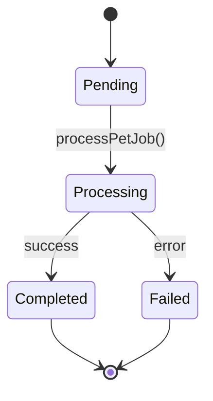
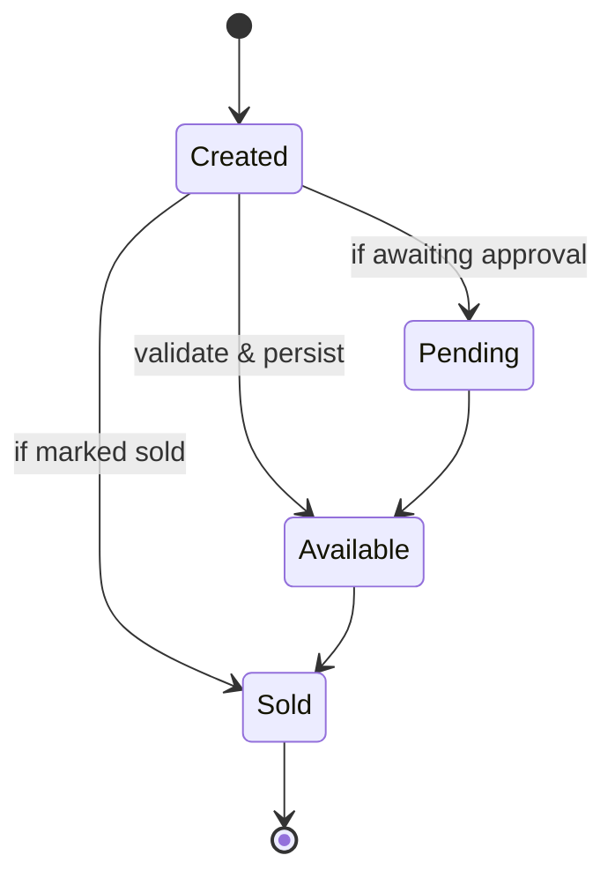
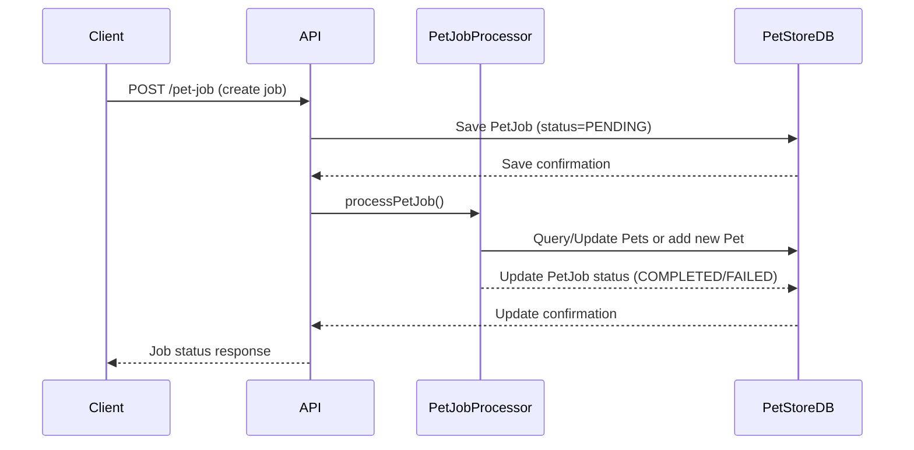

### 1. Entity Definitions

``` 
PetJob:  
- id: UUID (unique identifier for the job)  
- petId: Long (reference to the pet data)  
- operation: String (type of operation e.g., CREATE, PROCESS, SEARCH)  
- requestPayload: JSON (input data for the job)  
- status: StatusEnum (PENDING, PROCESSING, COMPLETED, FAILED)  

Pet:  
- id: Long (unique pet identifier from Petstore API)  
- name: String (pet name)  
- category: String (pet category, e.g., cat, dog, bird)  
- photoUrls: List<String> (images of the pet)  
- tags: List<String> (search tags or characteristics)  
- status: StatusEnum (available, pending, sold)  
```

### 2. Process Method Flows

``` 
processPetJob() Flow:  
1. Initial State: PetJob created with PENDING status  
2. Validation: Check if petId and operation are valid  
3. Execution: Based on operation type:  
   - CREATE: Add new Pet entity from requestPayload  
   - PROCESS: Perform business logic (e.g., enrich pet data)  
   - SEARCH: Query pets by criteria in requestPayload  
4. Completion: Update PetJob status to COMPLETED or FAILED  
5. Notification: Log outcome or notify external listeners if any  

processPet() Flow:  
1. Initial State: Pet created or updated (immutable creation of new state)  
2. Validation: Ensure required fields (name, category) are present  
3. Storage: Persist pet information (read-only after creation)  
4. Completion: Update status to available/pending/sold based on business logic  
```

### 3. API Endpoints Design Rules

| Method | Endpoint        | Purpose                         | Notes                                  |
|--------|-----------------|---------------------------------|----------------------------------------|
| POST   | /pet-job        | Create a PetJob (triggers processing) | Input: operation, pet info or search criteria |
| POST   | /pet            | Add a new Pet (immutable creation)    | Input: pet details                      |
| GET    | /pet/{id}       | Retrieve Pet information               | Output: pet data JSON                   |
| GET    | /pet-job/{id}   | Retrieve PetJob status and result      | Output: job status and processing info |

### 4. Request/Response Formats

**POST /pet-job**  
_Request_  
```json
{
  "petId": 123,
  "operation": "SEARCH",
  "requestPayload": {
    "category": "cat",
    "status": "available"
  }
}
```

_Response_  
```json
{
  "jobId": "uuid-1234",
  "status": "PENDING"
}
```

**POST /pet**  
_Request_  
```json
{
  "name": "Whiskers",
  "category": "cat",
  "photoUrls": ["http://example.com/cat1.jpg"],
  "tags": ["cute", "playful"],
  "status": "available"
}
```

_Response_  
```json
{
  "id": 456,
  "status": "available"
}
```

**GET /pet/{id}**  
_Response_  
```json
{
  "id": 456,
  "name": "Whiskers",
  "category": "cat",
  "photoUrls": ["http://example.com/cat1.jpg"],
  "tags": ["cute", "playful"],
  "status": "available"
}
```

**GET /pet-job/{id}**  
_Response_  
```json
{
  "jobId": "uuid-1234",
  "petId": 123,
  "operation": "SEARCH",
  "status": "COMPLETED",
  "result": {
    "petsFound": 5
  }
}
```

---

### Visual Representations

**PetJob Entity Lifecycle**


```mermaid
stateDiagram-v2
    [*] --> Pending
    Pending --> Processing : processPetJob()
    Processing --> Completed : success
    Processing --> Failed : error
    Completed --> [*]
    Failed --> [*]
```

**Pet Entity Lifecycle**


```mermaid
stateDiagram-v2
    [*] --> Created
    Created --> Available : validate & persist
    Created --> Pending : if awaiting approval
    Created --> Sold : if marked sold
    Available --> Sold
    Pending --> Available
    Sold --> [*]
```

**Event-Driven Processing Chain**


```mermaid
sequenceDiagram
    participant Client
    participant API
    participant PetJobProcessor
    participant PetStoreDB

    Client->>API: POST /pet-job (create job)
    API->>PetStoreDB: Save PetJob (status=PENDING)
    PetStoreDB-->>API: Save confirmation
    API->>PetJobProcessor: processPetJob()
    PetJobProcessor->>PetStoreDB: Query/Update Pets or add new Pet
    PetJobProcessor-->>PetStoreDB: Update PetJob status (COMPLETED/FAILED)
    PetStoreDB-->>API: Update confirmation
    API-->>Client: Job status response
```

---

If you need any further adjustments or additional details, feel free to ask!