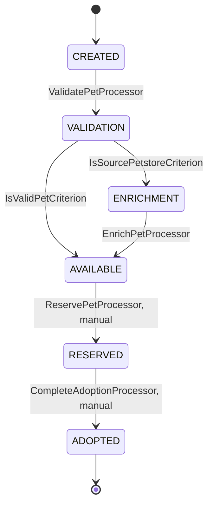
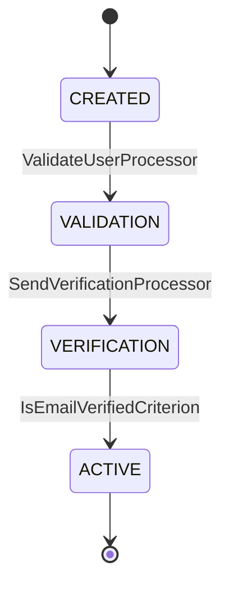
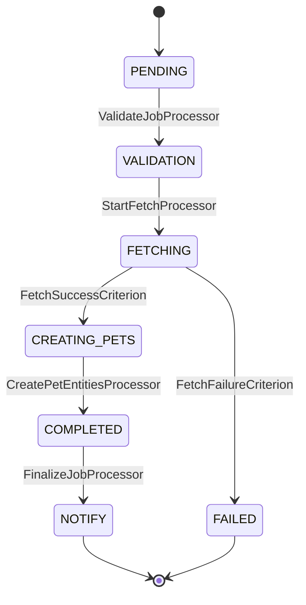

### 1. Entity Definitions
```
Pet:
- id: String (business id from Petstore or internal)
- name: String (pet name)
- species: String (dog/cat/etc)
- breed: String (breed description)
- age: Integer (years or months)
- gender: String (male/female/unknown)
- status: String (available/reserved/adopted)
- description: String (free text)
- photos: List<String> (URLs)
- source: String (Petstore/Manual)

User:
- id: String (business id)
- name: String (full name)
- email: String (contact email)
- phone: String (contact phone)
- address: String (shipping/contact address)
- role: String (customer/staff)
- verified: Boolean (email/identity verified)
- createdAt: String (ISO timestamp)

PetEnrichmentJob:
- jobId: String (business id)
- petSource: String (Petstore endpoint or catalog id)
- requestedBy: String (user id who triggered job, optional)
- status: String (PENDING/IN_PROGRESS/COMPLETED/FAILED)
- fetchedCount: Integer (number of pets fetched)
- errors: List<String>
- createdAt: String (ISO timestamp)
```

### 2. Entity workflows

Pet workflow:
1. Initial State: Pet created (persisted by job or manual)
2. Validation: automatic validation of required fields
3. Enrichment: automatic enrich missing fields if source is Petstore
4. Available: pet marked available for adoption
5. Reservation: manual reservation by staff/customer
6. Adoption: manual adoption completed


```mermaid
stateDiagram-v2
    [*] --> CREATED
    CREATED --> VALIDATION : ValidatePetProcessor
    VALIDATION --> ENRICHMENT : IsSourcePetstoreCriterion
    VALIDATION --> AVAILABLE : IsValidPetCriterion
    ENRICHMENT --> AVAILABLE : EnrichPetProcessor
    AVAILABLE --> RESERVED : ReservePetProcessor, manual
    RESERVED --> ADOPTED : CompleteAdoptionProcessor, manual
    ADOPTED --> [*]
```

Pet workflow processors and criteria:
- Processors: ValidatePetProcessor, EnrichPetProcessor, IndexPetProcessor, ReservePetProcessor, CompleteAdoptionProcessor
- Criteria: IsSourcePetstoreCriterion, IsValidPetCriterion

User workflow:
1. Initial State: User persisted (registration event)
2. Validation: automatic basic checks
3. Verification: send verification, await manual confirm (email)
4. Active: activate account


```mermaid
stateDiagram-v2
    [*] --> CREATED
    CREATED --> VALIDATION : ValidateUserProcessor
    VALIDATION --> VERIFICATION : SendVerificationProcessor
    VERIFICATION --> ACTIVE : IsEmailVerifiedCriterion
    ACTIVE --> [*]
```

User processors and criteria:
- Processors: ValidateUserProcessor, SendVerificationProcessor, ActivateUserProcessor
- Criteria: IsEmailVerifiedCriterion

PetEnrichmentJob workflow:
1. Initial State: Job created (POST triggers event)
2. Validation: check job parameters
3. Fetching: call Petstore, collect data
4. CreatingPets: create Pet entities (each is persisted -> triggers Pet workflow)
5. Completion: set COMPLETED or FAILED and notify


```mermaid
stateDiagram-v2
    [*] --> PENDING
    PENDING --> VALIDATION : ValidateJobProcessor
    VALIDATION --> FETCHING : StartFetchProcessor
    FETCHING --> CREATING_PETS : FetchSuccessCriterion
    CREATING_PETS --> COMPLETED : CreatePetEntitiesProcessor
    FETCHING --> FAILED : FetchFailureCriterion
    COMPLETED --> NOTIFY : FinalizeJobProcessor
    NOTIFY --> [*]
    FAILED --> [*]
```

PetEnrichmentJob processors and criteria:
- Processors: ValidateJobProcessor, StartFetchProcessor, CreatePetEntitiesProcessor, FinalizeJobProcessor
- Criteria: FetchSuccessCriterion, FetchFailureCriterion

### 3. Pseudo code for processor classes (short)

ValidateJobProcessor
```java
class ValidateJobProcessor {
  void process(PetEnrichmentJob job) {
    if(job.petSource == null) throw new ValidationException("missing source");
    job.status = "IN_PROGRESS";
    persist(job);
  }
}
```

StartFetchProcessor
```java
class StartFetchProcessor {
  void process(PetEnrichmentJob job) {
    List<RawPet> raw = PetstoreClient.fetch(job.petSource);
    job.fetchedCount = raw.size();
    job.errors = [];
    persist(job);
    publishEvent("RawPetsFetched", raw, job.jobId);
  }
}
```

CreatePetEntitiesProcessor
```java
class CreatePetEntitiesProcessor {
  void process(PetEnrichmentJob job, List<RawPet> raw) {
    for(r in raw) {
      Pet p = mapRawToPet(r);
      persist(p); // persisting Pet triggers Pet workflow
    }
    job.status = "COMPLETED";
    persist(job);
  }
}
```

ValidatePetProcessor (outline)
```java
class ValidatePetProcessor {
  void process(Pet pet) {
    if(pet.name == null || pet.species == null) markInvalid(pet);
    else markValid(pet);
    persist(pet);
  }
}
```

### 4. API Endpoints Design Rules

- POST /jobs/enrich-pets
  - Purpose: create PetEnrichmentJob (triggers fetch & pet creation)
  - Request/Response:
```json
// Request
{
  "petSource":"petstore/v1/pets?limit=50",
  "requestedBy":"user-123"
}
// Response
{
  "technicalId":"job-tech-789"
}
```

- GET /jobs/{technicalId}
```json
// Response
{
  "jobId":"job-123",
  "petSource":"petstore/v1/pets?limit=50",
  "status":"COMPLETED",
  "fetchedCount":48,
  "errors":[]
}
```

- POST /users
  - Purpose: create User (triggers verification workflow)
```json
// Request
{
  "name":"Alex Smith",
  "email":"alex@example.com",
  "phone":"+15551234",
  "address":"123 Pet Lane",
  "role":"customer"
}
// Response
{
  "technicalId":"user-tech-456"
}
```

- GET /users/{technicalId}
```json
// Response
{
  "id":"user-123",
  "name":"Alex Smith",
  "email":"alex@example.com",
  "verified":false,
  "createdAt":"2025-08-01T12:00:00Z"
}
```

- GET /pets/{id}
```json
// Response
{
  "id":"pet-789",
  "name":"Mittens",
  "species":"cat",
  "breed":"Tabby",
  "age":2,
  "status":"available",
  "photos":["https://..."],
  "source":"Petstore"
}
```

Notes and next steps
- I used 3 entities (default). If you want up to 10, tell me which additional entities to add (VaccinationRecord, Appointment, AdoptionRequest, Order, Shelter, etc.) and whether Pets should be creatable via POST in addition to job-driven ingestion.
Which extra behaviors would you like next (payments for adoption, vaccination tracking, staff approvals)?