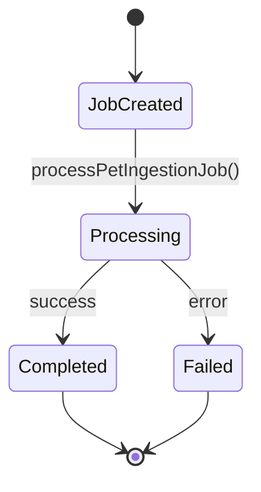
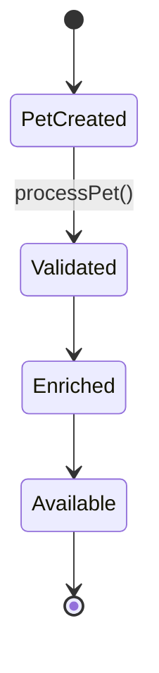
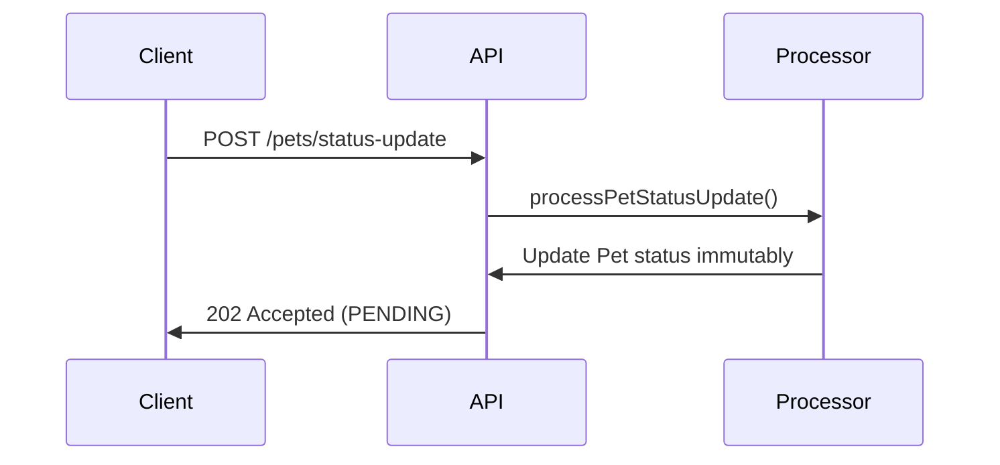

### 1. Entity Definitions

``` 
PetIngestionJob:
- id: UUID (unique identifier for the job)
- createdAt: DateTime (job creation timestamp)
- source: String (data source, e.g., Petstore API)
- status: StatusEnum (PENDING, PROCESSING, COMPLETED, FAILED)

Pet:
- id: UUID (unique pet identifier)
- name: String (pet's name)
- category: String (type of pet, e.g., cat, dog)
- photoUrls: List<String> (URLs of pet photos)
- tags: List<String> (tags/labels for the pet)
- status: StatusEnum (AVAILABLE, PENDING, SOLD)

PetStatusUpdate:
- id: UUID (unique identifier for the status update event)
- petId: UUID (reference to the Pet entity)
- newStatus: String (new status for the pet, e.g., AVAILABLE, SOLD)
- updatedAt: DateTime (timestamp of status update)
- status: StatusEnum (PENDING, PROCESSED)
```

---

### 2. Process Method Flows

```
processPetIngestionJob() Flow:
1. Initial State: PetIngestionJob created with PENDING status
2. Fetch Data: Call external Petstore API to retrieve pet data
3. Data Persistence: Save new Pet entities immutably with AVAILABLE status
4. Completion: Update job status to COMPLETED or FAILED based on success
5. Notification: (Optional) Trigger downstream workflows or monitoring

processPet() Flow:
1. Initial State: Pet entity created with AVAILABLE status
2. Validation: Confirm required pet fields are present and valid
3. Indexing/Enrichment: Add tags or categorize pet if needed
4. Completion: Status remains AVAILABLE (or updated via PetStatusUpdate)

processPetStatusUpdate() Flow:
1. Initial State: PetStatusUpdate created with PENDING status
2. Validation: Verify petId exists and newStatus is valid
3. Update Pet Status: Create a new Pet entity state reflecting newStatus (immutable)
4. Completion: Mark PetStatusUpdate as PROCESSED
```

---

### 3. API Endpoints Design

- **POST /jobs/pet-ingestion**  
  Request: `{ "source": "PetstoreAPI" }`  
  Response: `{ "id": "job-uuid", "status": "PENDING" }`  
  - Creates a PetIngestionJob → triggers `processPetIngestionJob()`

- **POST /pets**  
  Request: `{ "name": "...", "category": "...", "photoUrls": [...], "tags": [...] }`  
  Response: `{ "id": "pet-uuid", "status": "AVAILABLE" }`  
  - Creates a Pet entity → triggers `processPet()`

- **POST /pets/status-update**  
  Request: `{ "petId": "pet-uuid", "newStatus": "SOLD" }`  
  Response: `{ "id": "statusUpdate-uuid", "status": "PENDING" }`  
  - Creates PetStatusUpdate → triggers `processPetStatusUpdate()`

- **GET /pets/{id}**  
  Response: Full pet entity details (latest status)  

- **GET /jobs/pet-ingestion/{id}**  
  Response: Job status and summary  

---

### 4. Request/Response Formats

**PetIngestionJob POST Request:**

```json
{
  "source": "PetstoreAPI"
}
```

**PetIngestionJob POST Response:**

```json
{
  "id": "uuid-string",
  "status": "PENDING"
}
```

**Pet POST Request:**

```json
{
  "name": "Fluffy",
  "category": "cat",
  "photoUrls": ["http://example.com/photo1.jpg"],
  "tags": ["cute", "friendly"]
}
```

**Pet POST Response:**

```json
{
  "id": "uuid-string",
  "status": "AVAILABLE"
}
```

**PetStatusUpdate POST Request:**

```json
{
  "petId": "uuid-string",
  "newStatus": "SOLD"
}
```

**PetStatusUpdate POST Response:**

```json
{
  "id": "uuid-string",
  "status": "PENDING"
}
```

---

### Visual Representations

**PetIngestionJob Lifecycle:**


```mermaid
stateDiagram-v2
    [*] --> JobCreated
    JobCreated --> Processing : processPetIngestionJob()
    Processing --> Completed : success
    Processing --> Failed : error
    Completed --> [*]
    Failed --> [*]
```

**Pet Entity Lifecycle:**


```mermaid
stateDiagram-v2
    [*] --> PetCreated
    PetCreated --> Validated : processPet()
    Validated --> Enriched
    Enriched --> Available
    Available --> [*]
```

**PetStatusUpdate Processing Chain:**


```mermaid
sequenceDiagram
    participant Client
    participant API
    participant Processor
    Client->>API: POST /pets/status-update
    API->>Processor: processPetStatusUpdate()
    Processor->>API: Update Pet status immutably
    API->>Client: 202 Accepted (PENDING)
```

---

If you need any further adjustments or additions, feel free to ask!