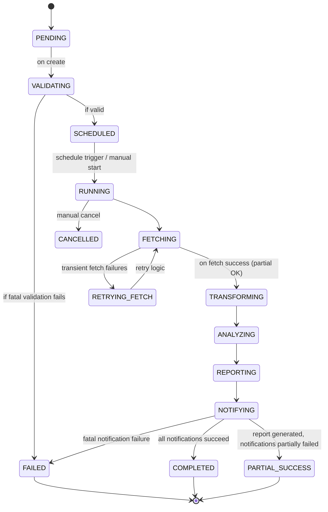
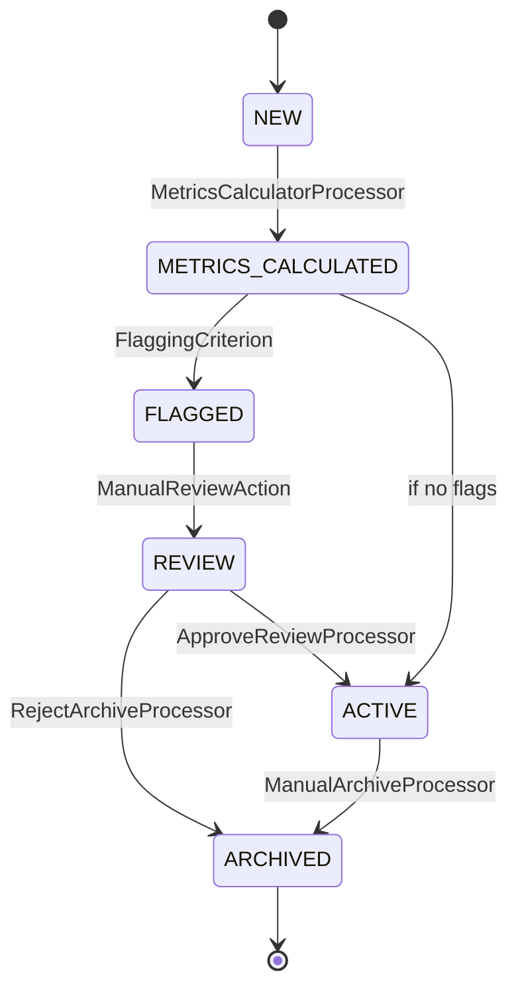
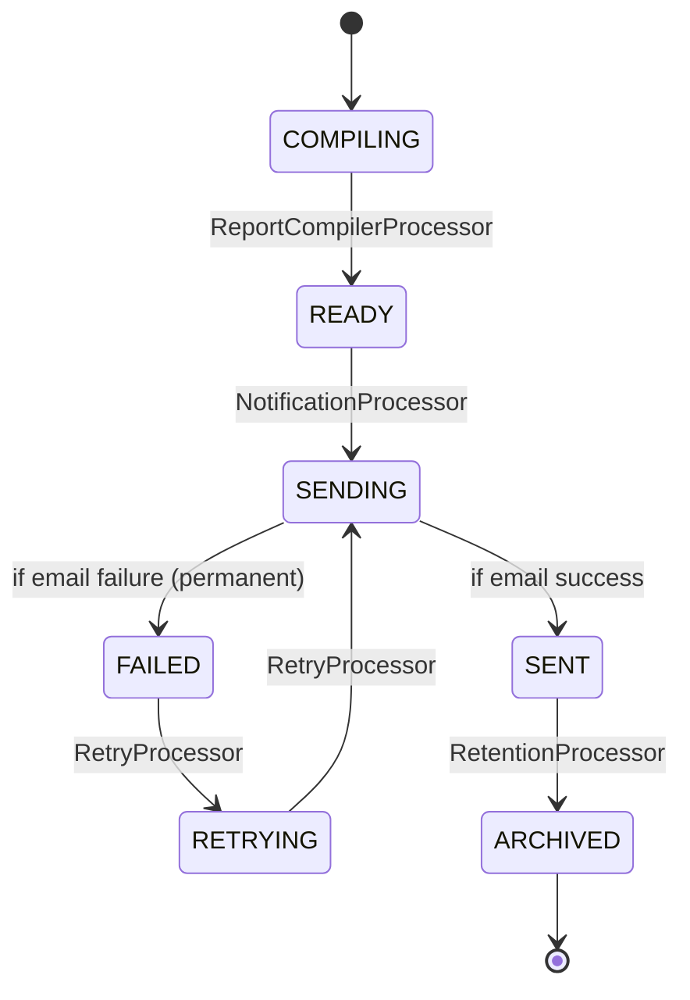

# Functional Requirements

## Note
- This document updates and clarifies the previously provided functional requirements. It includes small but important changes to workflows, error handling, retry and idempotency behavior, API actions, and KPI definitions.
- Default entity count used: 3 (ExtractionJob, Product, Report). If you want more entities, state which ones to add (up to 10 total).

---

## 1. Entity Definitions
All timestamps use ISO 8601 (e.g. 2025-08-18T09:00:00Z) unless otherwise noted.

### ExtractionJob
- jobId: String (business id for the job, stable across retries)
- technicalId: String (internal id / UUID for persistence)
- schedule: String (cron expression or human-friendly schedule; normalized to a scheduler engine, e.g., cron: "0 9 * * MON" + timezone)
- immediateStart: Boolean (if true run once immediately in addition to schedule; optional)
- sourceUrl: String (base API endpoint, e.g. https://petstore.swagger.io/v2)
- parameters: Object
  - endpoints: Array[String] (relative endpoints to fetch: e.g. ["/store/inventory","/product"])
  - format: String (JSON | XML)
  - filters: Object (optional filters to pass to source)
  - pagination: Object (optional instructions for paging the source)
- recipients: Array[String] (email addresses for report delivery)
- reportTemplateId: String (reference to chosen report layout)
- lastRunAt: DateTime (timestamp of last run attempt completion)
- lastAttemptAt: DateTime (timestamp of last attempt start)
- retryCount: Integer (number of retries attempted for latest run)
- status: String (enumeration: PENDING, VALIDATING, SCHEDULED, RUNNING, FETCHING, TRANSFORMING, ANALYZING, REPORTING, NOTIFYING, COMPLETED, PARTIAL_SUCCESS, FAILED, CANCELLED)
- failureReason: String (nullable; failure description or error code)
- createdAt: DateTime
- updatedAt: DateTime
- retentionPolicy: Object (optional; how long to keep generated reports/attachments)
- idempotencyKey: String (optional client-provided key for create to prevent duplicate jobs)

Notes:
- jobId is a business-facing id (visible in reports). technicalId is used in internal APIs.
- PARTIAL_SUCCESS exists to indicate the job completed with non-fatal errors (e.g., some endpoints failed but report generated with partial data).

### Product
- productId: String (id from source API)
- technicalId: String (internal id/UUID)
- name: String
- category: String
- sku: String
- price: Number (unit price)
- stockLevel: Integer (current inventory)
- reorderPoint: Integer (optional; threshold for restock candidate)
- salesHistory: Array[Object] (time series entries: {date: ISODate, unitsSold: Integer, revenue: Number})
- metrics: Object (computed KPIs)
  - salesVolume: Number (units sold in configured lookback window)
  - revenue: Number (sum of revenue in lookback window)
  - turnoverRate: Number (formula defined below)
  - avgDaysToSell: Number (optional)
  - lastPeriodComparison: Object (comparison vs previous period)
- flags: Array[String] (e.g., LOW_STOCK, LOW_PERFORMANCE, RESTOCK_CANDIDATE)
- lastUpdated: DateTime
- createdAt: DateTime

KPI calculation notes (explicit definitions):
- salesVolume: sum(unitsSold) for the reporting period.
- revenue: sum(price * unitsSold) for the reporting period.
- turnoverRate: unitsSold / averageStockLevel over reporting period. If averageStockLevel = 0, turnoverRate = null.
- restockCandidate: stockLevel <= reorderPoint OR dynamic rule: stockLevel <= expectedDemand * leadTime * safetyFactor.

### Report
- reportId: String (business-facing id)
- technicalId: String (internal id/UUID)
- jobId: String (extraction jobId from which this report was created)
- periodStart: Date (report period start)
- periodEnd: Date (report period end)
- generatedAt: DateTime
- status: String (COMPILING, READY, SENDING, SENT, FAILED, ARCHIVED)
- summaryMetrics: Object (topSellers, lowMovers, restockCandidates, highlights)
- attachments: Array[Object]
  - {type: String (PDF|CSV|XLSX|JSON), url: String (signed URL or internal path), filename: String, size: Integer, checksum: String}
- recipients: Array[String]
- createdFromJobId: String (ExtractionJob.jobId)
- failureReason: String (nullable)
- retentionExpiresAt: DateTime (computed from job.retentionPolicy or system default)
- createdAt: DateTime

Storage and access notes:
- Attachments are stored in object storage and delivered via time-limited signed URLs.
- AttachmentsReadyCriterion must be satisfied before status moves to READY.

---

## 2. Workflows (updated logic)
Changes summarized:
- Introduced stronger validation, idempotency, retry/backoff, PARTIAL_SUCCESS state, immediateStart option, and action endpoints (start, cancel, rerun).
- Added Circuit Breaker for unstable sources and rate limiting.

### ExtractionJob workflow (detailed)
1. Creation: Job is created via POST /extraction-jobs (PENDING). If idempotencyKey provided and duplicate, return existing technicalId.
2. Validation: ValidationProcessor checks schedule expression, parameters, recipients, and performs a SourceReachable pre-check (HEAD/OPTIONS) with authentication if provided. On non-fatal warnings, job transitions to SCHEDULED; on fatal validation failure -> FAILED.
3. Scheduling/Immediate Start: If immediateStart=true or schedule triggers, job is queued for run and status becomes RUNNING.
4. Run Start: RUNNING -> FETCHING. lastAttemptAt set, retryCount reset for new run.
5. Fetching: FetchDataProcessor executes fetch across requested endpoints, honoring rate limits and using backoff + retry per-endpoint. Partial fetch failure permitted; if enough data to proceed report may be generated and state becomes PARTIAL_SUCCESS at end.
6. Transforming: TransformProcessor normalizes and persists Product entities, deduplicates by productId/sku, emits ProductPersistedEvent.
7. Analyzing: AnalysisProcessor calculates KPIs (salesVolume, revenue, turnoverRate, avgDaysToSell). FlaggingProcessor sets product flags (LOW_STOCK, RESTOCK_CANDIDATE, LOW_PERFORMANCE).
8. Report Generation: ReportGeneratorProcessor compiles summary, creates attachments, persists Report and attachments.
9. Notification: NotificationProcessor sends report to recipients; on transient email failures schedule retries (with exponential backoff) and mark report SENDING -> FAILED -> RETRYING -> SENDING as needed.
10. Completion: Final job status set to COMPLETED if all stages succeeded, PARTIAL_SUCCESS if non-fatal issues occurred but report generated, or FAILED if fatal errors occurred. Job retains run history and may be re-run manually.
11. Retention: RetentionProcessor archives report and attachments after retentionExpiresAt.

State diagram (mermaid)


```mermaid
stateDiagram-v2
    [*] --> PENDING
    PENDING --> VALIDATING : on create
    VALIDATING --> SCHEDULED : if valid
    VALIDATING --> FAILED : if fatal validation fails
    SCHEDULED --> RUNNING : schedule trigger / manual start
    RUNNING --> FETCHING
    FETCHING --> TRANSFORMING : on fetch success (partial OK)
    FETCHING --> RETRYING_FETCH : transient fetch failures
    RETRYING_FETCH --> FETCHING : retry logic
    TRANSFORMING --> ANALYZING
    ANALYZING --> REPORTING
    REPORTING --> NOTIFYING
    NOTIFYING --> COMPLETED : all notifications succeed
    NOTIFYING --> PARTIAL_SUCCESS : report generated, notifications partially failed
    NOTIFYING --> FAILED : fatal notification failure
    RUNNING --> CANCELLED : manual cancel
    FAILED --> [*]
    COMPLETED --> [*]
    PARTIAL_SUCCESS --> [*]
```

Processor additions:
- ValidationProcessor
- ScheduleTriggerProcessor / ManualStartProcessor
- FetchDataProcessor (with per-endpoint retry/backoff, rate-limit handling)
- CircuitBreakerProcessor (tracks repeated failures to source)
- TransformProcessor (idempotent persistence and deduplication)
- AnalysisProcessor
- FlaggingProcessor
- ReportGeneratorProcessor
- NotificationProcessor (with retry and exponential backoff)
- RetryProcessor (generic scheduled retrier)
- RetentionProcessor

Criteria:
- SourceReachableCriterion: HEAD/OPTIONS to sourceUrl, auth check, pass/fail/warn modes.
- DataCompletenessCriterion: required fields present for KPI calculation.
- AnalysisCompleteCriterion: KPIs computed for expected product set.
- AttachmentsReadyCriterion

Retry and backoff behavior:
- Per-endpoint fetch retries: configurable (default 3 attempts) with exponential backoff and jitter.
- Job-level retries: controlled by retry policy; repeated failures update retryCount and may mark job FAILED after policy exhausted.
- Circuit breaker opens on repeated source errors and prevents further fetch attempts for a cooldown window.

Idempotency and concurrency:
- Create ExtractionJob supports idempotencyKey header and request body idempotencyKey; duplicate creates return same technicalId.
- Transform persistence must be idempotent: dedupe by productId + source digest.
- Jobs are single-run per scheduled trigger; concurrent runs are prevented by persistent run lock.

Partial success semantics:
- If at least one report can be produced from available data, proceed and create Report. Job status becomes PARTIAL_SUCCESS if errors occurred but report generated.

Manual actions:
- Manual start: POST /extraction-jobs/{technicalId}/start
- Manual cancel: POST /extraction-jobs/{technicalId}/cancel
- Manual rerun: POST /extraction-jobs/{technicalId}/rerun (optionally with parameters/dryRun)

### Product workflow (clarified)
1. Persistence: Product created/updated by TransformProcessor (state NEW or UPDATED)
2. Metrics Calculation: MetricsCalculatorProcessor computes KPIs automatically for relevant lookback period.
3. Flagging: FlaggingProcessor sets flags based on thresholds or dynamic models.
4. Review: ManualReviewAction allows a user to accept flags, adjust reorder points, or archive product.
5. Active / Archived: Products may be archived manually or automatically when not updated for configured period.

State diagram (mermaid)


```mermaid
stateDiagram-v2
    [*] --> NEW
    NEW --> METRICS_CALCULATED : MetricsCalculatorProcessor
    METRICS_CALCULATED --> FLAGGED : FlaggingCriterion
    FLAGGED --> REVIEW : ManualReviewAction
    REVIEW --> ACTIVE : ApproveReviewProcessor
    REVIEW --> ARCHIVED : RejectArchiveProcessor
    METRICS_CALCULATED --> ACTIVE : if no flags
    ACTIVE --> ARCHIVED : ManualArchiveProcessor
    ARCHIVED --> [*]
```

Processors for Product:
- MetricsCalculatorProcessor
- FlaggingProcessor
- ManualReviewProcessor

Criteria:
- FlaggingCriterion (underperformer or restock threshold)
- FreshDataCriterion (is product data updated recently)

### Report workflow (clarified)
1. Create: Report created by ReportGeneratorProcessor with COMPILING status.
2. Compile: compile summary metrics and generate attachments (PDF, CSV, JSON as requested).
3. Ready: mark READY when attachments are available.
4. Send: NotificationProcessor sends email (and store attachments). On transient failure, schedule retries. On permanent failures mark FAILED.
5. Finalize: mark SENT or FAILED; archive per retention policy.

State diagram (mermaid)


```mermaid
stateDiagram-v2
    [*] --> COMPILING
    COMPILING --> READY : ReportCompilerProcessor
    READY --> SENDING : NotificationProcessor
    SENDING --> SENT : if email success
    SENDING --> FAILED : if email failure (permanent)
    FAILED --> RETRYING : RetryProcessor
    RETRYING --> SENDING : RetryProcessor
    SENT --> ARCHIVED : RetentionProcessor
    ARCHIVED --> [*]
```

Processors for Report:
- ReportCompilerProcessor
- AttachmentGeneratorProcessor
- NotificationProcessor
- RetryProcessor
- RetentionProcessor

Criteria:
- AttachmentsReadyCriterion
- RecipientsReachableCriterion

---

## 3. Pseudocode for processors (expanded)

Extraction FetchDataProcessor (with retry/backoff)

```java
class FetchDataProcessor {
  process(job) {
    for (endpoint : job.parameters.endpoints) {
      attempt = 0
      success = false
      while (attempt < MAX_ATTEMPTS && !success) {
        try {
          resp = httpGet(job.sourceUrl + endpoint, job.parameters.format, timeout)
          if (resp.status == 200) {
            emit RawDataEvent(payload=resp.body, jobId=job.jobId, endpoint=endpoint)
            success = true
          } else if (resp.status in transientErrors) {
            attempt++
            sleepBackoff(attempt)
          } else {
            logFatal(resp)
            throw new FetchError(resp.status)
          }
        } catch (NetworkException e) {
          attempt++
          sleepBackoff(attempt)
        }
      }
      if (!success) {
        recordEndpointFailure(endpoint)
        if (circuitBreaker.shouldOpen()) circuitBreaker.open()
      }
    }
    // After attempting all endpoints decide success/partial/failure
  }
}
```

TransformProcessor (idempotent)

```java
class TransformProcessor {
  process(rawEvent) {
    records = parse(rawEvent.payload)
    for (r : records) {
      product = mapToProduct(r)
      // dedupe by source+productId or sku
      existing = findBySourceAndProductId(rawEvent.source, product.productId)
      if (existing == null || hasChanges(existing, product)) {
        persist product (idempotent upsert)
        emit ProductPersistedEvent(productId=product.productId)
      }
    }
  }
}
```

AnalysisProcessor

```java
class AnalysisProcessor {
  process(job) {
    products = queryProducts(updatedSince = job.lastRunAt)
    summary = new Summary()
    for (p : products) {
      metrics = computeKPIs(p.salesHistory, p.stockLevel, lookbackWindow)
      p.metrics = metrics
      persist(p)
      if (shouldFlag(metrics)) emit ProductFlaggedEvent(p.productId, reason)
      summary.accumulate(metrics)
    }
    emit AnalysisCompleteEvent(job.jobId, summary)
  }
}
```

ReportGeneratorProcessor

```java
class ReportGeneratorProcessor {
  process(analysisEvent) {
    report = buildSummary(analysisEvent.summary)
    attachments = createAttachments(report, formatsRequested)
    storeAttachments(attachments)
    persist report and attachments
    emit ReportPersistedEvent(reportId=report.reportId)
  }
}
```

NotificationProcessor

```java
class NotificationProcessor {
  process(reportEvent) {
    try {
      sendEmail(reportEvent.report.recipients, bodySummary, attachments)
      update report.status = SENT
    } catch (TransientEmailException e) {
      scheduleRetry(reportEvent.reportId)
      update report.status = SENDING
    } catch (PermanentEmailException e) {
      update report.status = FAILED
      log(e)
    }
  }
}
```

Retry policy notes:
- Retries use exponential backoff with jitter. Maximum retry attempts and backoff schedule are configurable per environment and per processor type.

---

## 4. API Endpoints Design Rules and JSON formats (updated)
Design rules:
- ExtractionJob is the orchestration entity and supports POST to create. Additional POST endpoints support manual operations (start, cancel, rerun).
- All POST create endpoints accept an optional Idempotency-Key header to avoid duplicate jobs.
- POST responses return technicalId and Location header when new resource is created.
- GET endpoints allowed for Jobs, Reports, Products. No direct POST for Product or Report creation (they are created by workflows).
- Actions (start/cancel/rerun) are POST on the job resource.
- All endpoints respond with appropriate HTTP status codes and error body with machine-readable error code and human message.

Common error response format:
```
{
  "errorCode": "INVALID_SCHEDULE",
  "message": "Schedule expression not recognized: 'foo'",
  "details": { ... }
}
```

1) Create Extraction Job (POST)
- POST /extraction-jobs
Headers:
- Idempotency-Key: optional
Request JSON (required fields shown):
```
{
  "jobId": "weekly_summary_aug",
  "schedule": "0 9 * * MON", // or human friendly string
  "timezone": "Europe/Moscow",
  "immediateStart": false,
  "sourceUrl": "https://petstore.swagger.io/v2",
  "parameters": {"endpoints":["/store/inventory","/product"], "format":"JSON"},
  "recipients": ["victoria.sagdieva@cyoda.com"],
  "reportTemplateId": "weekly_summary_v1",
  "retentionPolicy": {"keepReportsDays":90}
}
```
Response JSON (201 Created):
```
{
  "technicalId": "job_abc123"
}
```
- Location header: /extraction-jobs/job_abc123
- If idempotent duplicate: 200 OK with same technicalId

2) Start a job manually (POST)
- POST /extraction-jobs/{technicalId}/start
Request JSON (optional): {"dryRun": false}
Response: 202 Accepted with current job status or technicalId.

3) Cancel a job (POST)
- POST /extraction-jobs/{technicalId}/cancel
Response: 200 OK with updated status CANCELLED or 409 if cannot cancel.

4) Rerun a job (POST)
- POST /extraction-jobs/{technicalId}/rerun
Request JSON optional overrides: {"parameters":..., "immediateStart":true}
Response: 202 Accepted with new run information.

5) Get Extraction Job (GET)
- GET /extraction-jobs/{technicalId}
Response JSON:
```
{
  "jobId":"job_abc123",
  "technicalId":"job_abc123",
  "schedule":"0 9 * * MON",
  "timezone":"Europe/Moscow",
  "status":"RUNNING",
  "lastRunAt":"2025-08-18T09:00:00Z",
  "lastAttemptAt":"2025-08-18T09:00:00Z",
  "createdAt":"2025-01-01T10:00:00Z",
  "progress":{"stage":"ANALYZING","percent":65},
  "failureReason": null
}
```

6) Get Report (GET)
- GET /reports/{technicalId}
Response JSON:
```
{
  "reportId":"report_987",
  "technicalId":"report_987",
  "jobId":"job_abc123",
  "periodStart":"2025-08-11",
  "periodEnd":"2025-08-17",
  "status":"SENT",
  "generatedAt":"2025-08-18T02:00:00Z",
  "summaryMetrics":{...},
  "attachments":[{"type":"PDF","url":"https://.../signed/report_987.pdf","filename":"weekly_summary.pdf","size":12345}],
  "recipients":["victoria.sagdieva@cyoda.com"]
}
```

7) Get Product (GET)
- GET /products/{technicalId}
Response JSON:
```
{
  "productId":"p_555",
  "technicalId":"p_555",
  "name":"Dog Toy",
  "category":"toys",
  "price":9.99,
  "stockLevel":12,
  "reorderPoint":10,
  "metrics":{"salesVolume":34,"revenue":339.66,"turnoverRate":0.7},
  "flags":["RESTOCK_CANDIDATE"],
  "lastUpdated":"2025-08-17T12:00:00Z"
}
```

Notes and open questions (please confirm):
- What exact schedule precision, format (cron vs natural language) should be supported? (System supports cron; natural language is accepted and normalized but may produce a cron equivalent.)
- Report attachments preference: PDF + CSV by default; confirm additional formats.
- Restock/flag thresholds: confirm if fixed thresholds (e.g., reorderPoint, stockLevel < 10) are acceptable or dynamic thresholds should be calculated.
- Idempotency behavior: client-provided Idempotency-Key or server-generated. Confirm preference.
- Retention policy defaults: 90 days by default; confirm.

---

If you want more detail (sequence diagrams, example retry schedules, storage encryption requirements, or sample payloads for edge cases), tell me which area to expand and I will update this file.
