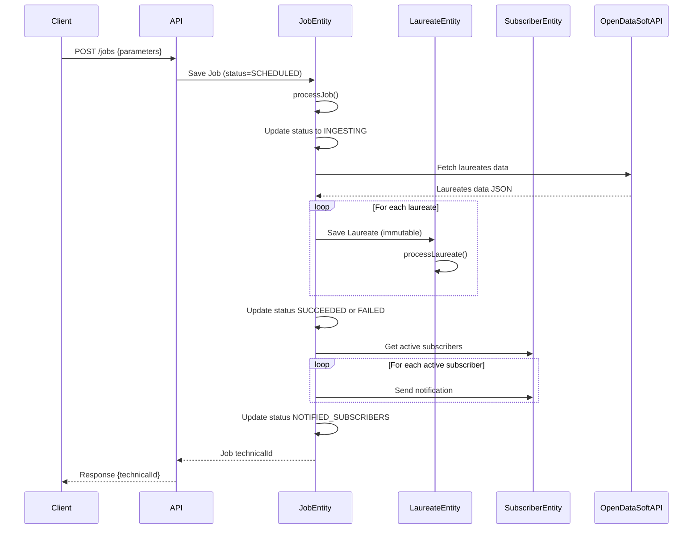
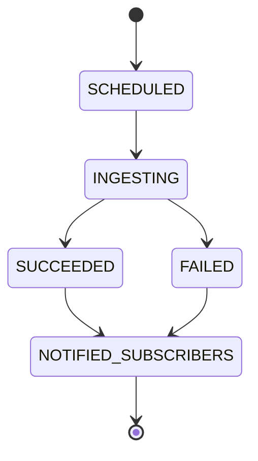

### 1. Entity Definitions

```
Job:
- jobId: String (unique identifier for the ingestion job, generated by the system)
- status: String (current job status; e.g., SCHEDULED, INGESTING, SUCCEEDED, FAILED, NOTIFIED_SUBSCRIBERS)
- createdAt: String (timestamp when job was created)
- startedAt: String (timestamp when ingestion started)
- completedAt: String (timestamp when ingestion completed)
- errorMessage: String (error details if the job failed)
- parameters: String (optional JSON string containing job-specific parameters, e.g., API query filters)

Laureate:
- laureateId: String (unique identifier from the data source)
- firstname: String (laureate first name)
- surname: String (laureate surname)
- born: String (birth date in ISO format)
- died: String (death date in ISO format or null)
- borncountry: String (country where laureate was born)
- borncountrycode: String (alpha-2 country code)
- borncity: String (city where laureate was born)
- gender: String (gender of laureate)
- year: String (year when Nobel prize was awarded)
- category: String (Nobel prize category)
- motivation: String (award motivation text)
- affiliationName: String (institution name)
- affiliationCity: String (city of the affiliation)
- affiliationCountry: String (country of the affiliation)

Subscriber:
- subscriberId: String (unique identifier)
- contactType: String (e.g., "email", "webhook")
- contactDetails: String (email address or webhook URL)
- active: Boolean (indicates if the subscriber is active and should receive notifications)
```

---

### 2. Process Method Flows

```
processJob() Flow:
1. Initial State: Job is created with status = "SCHEDULED"
2. Validation: Validate job parameters if present
3. Processing:
    - Change status to "INGESTING"
    - Call OpenDataSoft API to fetch laureates data
    - For each laureate record, create a new Laureate entity (immutable creation)
4. Completion:
    - If all laureates processed successfully, set job status to "SUCCEEDED"
    - If any errors occur, set job status to "FAILED" and populate errorMessage
5. Notification:
    - Notify all active Subscribers of job outcome
    - Set job status to "NOTIFIED_SUBSCRIBERS"
```

```
processLaureate() Flow:
1. Validation:
    - Check mandatory fields (e.g., laureateId, firstname, surname, category)
    - Validate data formats (dates, country codes)
2. Enrichment:
    - Normalize country codes or calculate additional attributes if needed
3. Persistence:
    - Save laureate record as immutable entity
```

```
processSubscriber() Flow:
1. Validation:
    - Verify contactType is either "email" or "webhook"
    - Verify contactDetails format matches contactType
2. Persistence:
    - Save subscriber entity
3. (No further processing or notification triggered here)
```

---

### 3. API Endpoints Design

| Entity     | POST Endpoint               | POST Request Body                                                      | POST Response                  | GET by TechnicalId Endpoint             | GET Response                          |
|------------|----------------------------|-----------------------------------------------------------------------|--------------------------------|----------------------------------------|-------------------------------------|
| Job        | `/jobs`                    | `{ "parameters": "{...}" }` (optional)                               | `{ "technicalId": "string" }` | `/jobs/{technicalId}`                   | Full Job entity JSON                 |
| Laureate   | *No POST endpoint* (created via Job processing)                                                     | N/A                            | `/laureates/{technicalId}`             | Full Laureate entity JSON            |
| Subscriber | `/subscribers`              | `{ "contactType": "email" \| "webhook", "contactDetails": "string", "active": true }` | `{ "technicalId": "string" }` | `/subscribers/{technicalId}`           | Full Subscriber entity JSON         |

- No update or delete endpoints for entities to maintain event immutability.
- GET all or GET by conditions supported only if explicitly requested later.

---

### 4. Request/Response JSON Examples

**POST /jobs**

Request:

```json
{
  "parameters": "{\"filterYear\":\"2023\"}"
}
```

Response:

```json
{
  "technicalId": "job_1234567890"
}
```

---

**GET /jobs/{technicalId}**

Response:

```json
{
  "jobId": "job_1234567890",
  "status": "NOTIFIED_SUBSCRIBERS",
  "createdAt": "2024-06-01T10:00:00Z",
  "startedAt": "2024-06-01T10:01:00Z",
  "completedAt": "2024-06-01T10:05:00Z",
  "errorMessage": null,
  "parameters": "{\"filterYear\":\"2023\"}"
}
```

---

**POST /subscribers**

Request:

```json
{
  "contactType": "email",
  "contactDetails": "user@example.com",
  "active": true
}
```

Response:

```json
{
  "technicalId": "subscriber_9876543210"
}
```

---

**GET /subscribers/{technicalId}**

Response:

```json
{
  "subscriberId": "subscriber_9876543210",
  "contactType": "email",
  "contactDetails": "user@example.com",
  "active": true
}
```

---

### 5. Mermaid Diagrams


```mermaid
sequenceDiagram
    participant Client
    participant API
    participant JobEntity
    participant LaureateEntity
    participant SubscriberEntity
    participant OpenDataSoftAPI

    Client->>API: POST /jobs {parameters}
    API->>JobEntity: Save Job (status=SCHEDULED)
    JobEntity->>JobEntity: processJob()
    JobEntity->>JobEntity: Update status to INGESTING
    JobEntity->>OpenDataSoftAPI: Fetch laureates data
    OpenDataSoftAPI-->>JobEntity: Laureates data JSON
    loop For each laureate
        JobEntity->>LaureateEntity: Save Laureate (immutable)
        LaureateEntity->>LaureateEntity: processLaureate()
    end
    JobEntity->>JobEntity: Update status SUCCEEDED or FAILED
    JobEntity->>SubscriberEntity: Get active subscribers
    loop For each active subscriber
        JobEntity->>SubscriberEntity: Send notification
    end
    JobEntity->>JobEntity: Update status NOTIFIED_SUBSCRIBERS
    JobEntity-->>API: Job technicalId
    API-->>Client: Response {technicalId}
```


```mermaid
stateDiagram-v2
    [*] --> SCHEDULED
    SCHEDULED --> INGESTING
    INGESTING --> SUCCEEDED
    INGESTING --> FAILED
    SUCCEEDED --> NOTIFIED_SUBSCRIBERS
    FAILED --> NOTIFIED_SUBSCRIBERS
    NOTIFIED_SUBSCRIBERS --> [*]
```