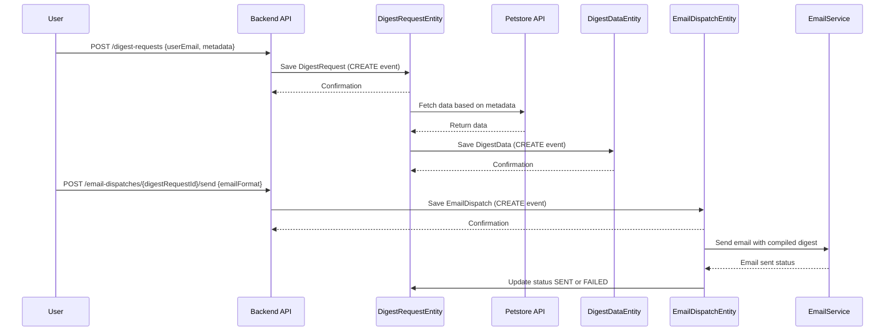

# Functional Requirements for Digest Request Processing System (Java Spring Boot on Cyoda)

---

## 1. Business Entities to Persist (Triggering Events)

- **DigestRequest**  
  - `id`: UUID  
  - `userEmail`: String  
  - `metadata`: JSON / Map  
  - `requestedAt`: Timestamp  
  - `status`: Enum { CREATED, PROCESSING, SENT, FAILED }  

- **DigestData**  
  - `id`: UUID  
  - `digestRequestId`: UUID (reference)  
  - `rawData`: JSON/String (external API response)  
  - `processedAt`: Timestamp  

- **EmailDispatch**  
  - `id`: UUID  
  - `digestRequestId`: UUID (reference)  
  - `emailSentAt`: Timestamp  
  - `emailFormat`: Enum { PLAIN_TEXT, HTML, ATTACHMENT }  
  - `status`: Enum { PENDING, SENT, FAILED }  

---

## 2. API Endpoints

### POST Endpoints (Add/Update Entities & Trigger Events)

- **`POST /digest-requests`**  
  - Request:  
    ```json
    {
      "userEmail": "string",
      "metadata": {
        "key": "value"
      }
    }
    ```  
  - Response:  
    ```json
    {
      "id": "uuid",
      "status": "CREATED"
    }
    ```  
  - Purpose: Create or update a digest request, triggering event-driven processing.

- **`POST /email-dispatches/{digestRequestId}/send`**  
  - Request:  
    ```json
    {
      "emailFormat": "PLAIN_TEXT" | "HTML" | "ATTACHMENT"
    }
    ```  
  - Response:  
    ```json
    {
      "id": "uuid",
      "status": "PENDING"
    }
    ```  
  - Purpose: Initiate email sending for a digest request.

### GET Endpoints (Retrieve Application Results Only)

- **`GET /digest-requests/{id}`**  
  - Response:  
    ```json
    {
      "id": "uuid",
      "userEmail": "string",
      "metadata": { "key": "value" },
      "status": "string",
      "requestedAt": "timestamp"
    }
    ```  
  - Purpose: Retrieve digest request details.

- **`GET /email-dispatches/{id}`**  
  - Response:  
    ```json
    {
      "id": "uuid",
      "digestRequestId": "uuid",
      "emailSentAt": "timestamp",
      "emailFormat": "string",
      "status": "string"
    }
    ```  
  - Purpose: Retrieve email dispatch status/details.

---

## 3. Event Processing Workflows

- **On DigestRequest Created/Updated:**  
  - Log the event.  
  - Retrieve external data from https://petstore.swagger.io/ based on metadata or defaults.  
  - Persist retrieved data as `DigestData` entity (triggers DigestData event).

- **On DigestData Created:**  
  - Process and format data into digest content.  
  - Update `DigestRequest` status to `PROCESSING`.

- **On EmailDispatch Created:**  
  - Send email with compiled digest in requested format.  
  - Update `EmailDispatch` and `DigestRequest` statuses to `SENT` or `FAILED`.

---

## 4. User Interaction Flow (Mermaid Sequence Diagram)


```mermaid
sequenceDiagram
    participant User
    participant API as Backend API
    participant DigestRequestEntity
    participant ExternalAPI as Petstore API
    participant DigestDataEntity
    participant EmailDispatchEntity
    participant EmailService

    User->>API: POST /digest-requests {userEmail, metadata}
    API->>DigestRequestEntity: Save DigestRequest (CREATE event)
    DigestRequestEntity-->>API: Confirmation

    DigestRequestEntity->>ExternalAPI: Fetch data based on metadata
    ExternalAPI-->>DigestRequestEntity: Return data

    DigestRequestEntity->>DigestDataEntity: Save DigestData (CREATE event)
    DigestDataEntity-->>DigestRequestEntity: Confirmation

    User->>API: POST /email-dispatches/{digestRequestId}/send {emailFormat}
    API->>EmailDispatchEntity: Save EmailDispatch (CREATE event)
    EmailDispatchEntity-->>API: Confirmation

    EmailDispatchEntity->>EmailService: Send email with compiled digest
    EmailService-->>EmailDispatchEntity: Email sent status
    EmailDispatchEntity->>DigestRequestEntity: Update status SENT or FAILED
```

---

If you need me to help with implementation or any adjustments, just let me know!