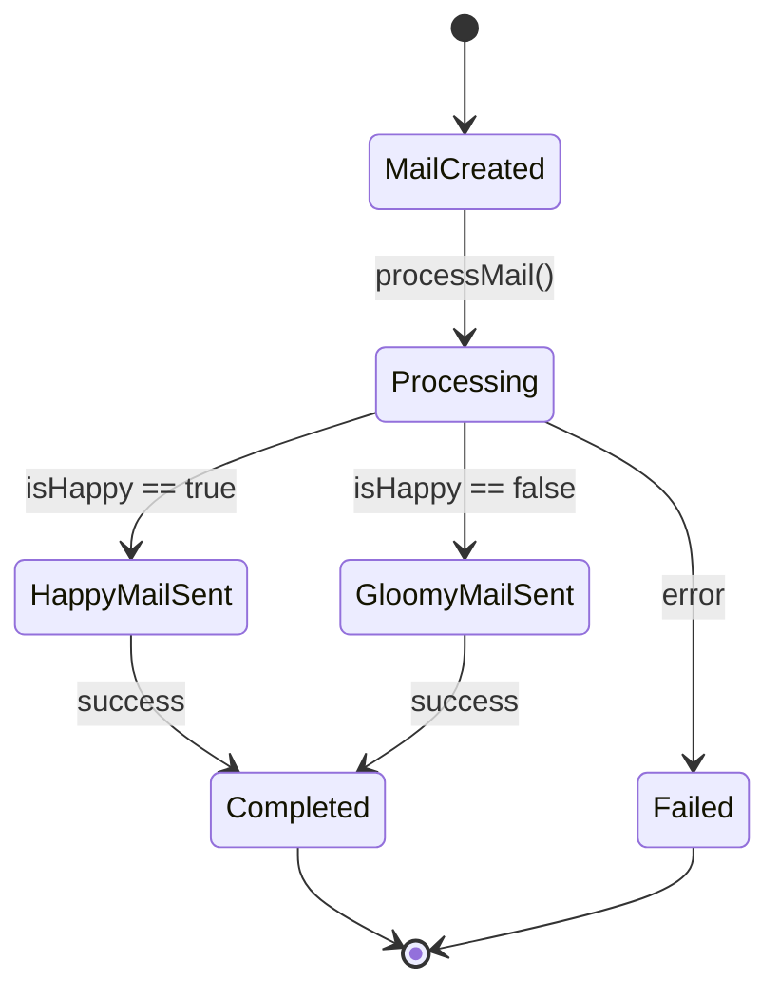
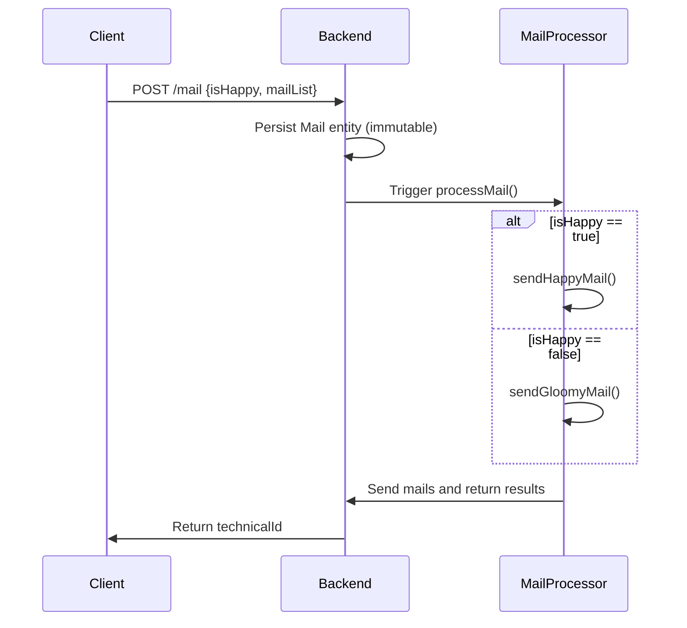
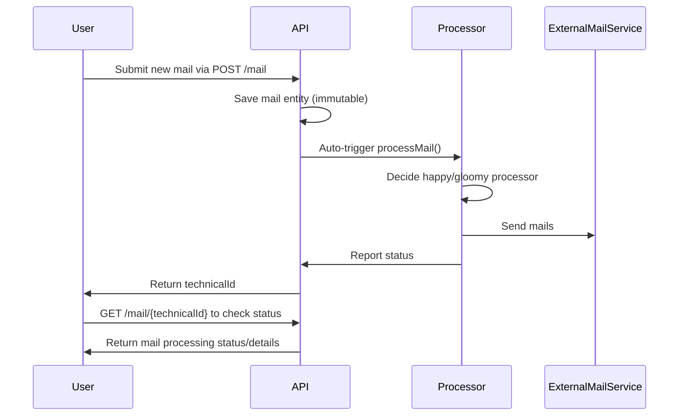

### 1. Entity Definitions

``` 
Mail:
- isHappy: Boolean (Indicates whether the mail is happy or gloomy)
- mailList: List<String> (List of recipient email addresses)
```

### 2. Process Method Flows

```
processMail() Flow:
1. Initial State: Mail entity is created and persisted with immutable data (isHappy, mailList).
2. Criteria Validation (optional): If specified, run checks like checkMailIsHappy() or checkMailIsGloomy() to validate mail properties.
3. Processing Branch:
   - If isHappy == true → sendHappyMail processor is triggered.
   - If isHappy == false → sendGloomyMail processor is triggered.
4. Mail Sending:
   - sendHappyMail: Compose and send happy-themed mails to all recipients in mailList.
   - sendGloomyMail: Compose and send gloomy-themed mails to all recipients in mailList.
5. Completion: Mail sending result is recorded (success/failure), no direct updates to Mail entity (immutable).
6. Notification/Logging: Log the outcome of mail sending.
```

### 3. API Endpoints Design

| Endpoint                | Method | Description                                         | Request Body                | Response                |
|-------------------------|--------|-----------------------------------------------------|----------------------------|-------------------------|
| `/mail`                 | POST   | Create a new Mail entity and trigger processing     | `{ "isHappy": bool, "mailList": [string] }` | `{ "technicalId": string }` |
| `/mail/{technicalId}`   | GET    | Retrieve stored Mail processing result or status    | N/A                        | Mail processing details (read-only) |

- No update or delete endpoints for Mail entity (immutable creation only).
- No GET by non-technicalId fields unless explicitly requested later.
- Processing triggered automatically on POST (save) operation via `processMail()` event.

### 4. Request/Response Formats

**POST /mail**  
Request:
```json
{
  "isHappy": true,
  "mailList": ["user1@example.com", "user2@example.com"]
}
```

Response:
```json
{
  "technicalId": "123e4567-e89b-12d3-a456-426614174000"
}
```

**GET /mail/{technicalId}**  
Response:
```json
{
  "technicalId": "123e4567-e89b-12d3-a456-426614174000",
  "isHappy": true,
  "mailList": ["user1@example.com", "user2@example.com"],
  "status": "COMPLETED",
  "result": "Happy mails sent successfully"
}
```

---

### Visual Representations

#### Mail Entity Lifecycle State Diagram


```mermaid
stateDiagram-v2
    [*] --> MailCreated
    MailCreated --> Processing : processMail()
    Processing --> HappyMailSent : isHappy == true
    Processing --> GloomyMailSent : isHappy == false
    HappyMailSent --> Completed : success
    GloomyMailSent --> Completed : success
    Processing --> Failed : error
    Completed --> [*]
    Failed --> [*]
```

#### Event-Driven Processing Chain


```mermaid
sequenceDiagram
    participant Client
    participant Backend
    participant MailProcessor

    Client->>Backend: POST /mail {isHappy, mailList}
    Backend->>Backend: Persist Mail entity (immutable)
    Backend->>MailProcessor: Trigger processMail()
    alt isHappy == true
        MailProcessor->>MailProcessor: sendHappyMail()
    else isHappy == false
        MailProcessor->>MailProcessor: sendGloomyMail()
    end
    MailProcessor->>Backend: Send mails and return results
    Backend->>Client: Return technicalId
```

#### User Interaction Sequence Flow


```mermaid
sequenceDiagram
    participant User
    participant API
    participant Processor

    User->>API: Submit new mail via POST /mail
    API->>API: Save mail entity (immutable)
    API->>Processor: Auto-trigger processMail()
    Processor->>Processor: Decide happy/gloomy processor
    Processor->>ExternalMailService: Send mails
    Processor->>API: Report status
    API->>User: Return technicalId
    User->>API: GET /mail/{technicalId} to check status
    API->>User: Return mail processing status/details
```

---

This completes the confirmed functional requirements for the Happy Mails application using an Event-Driven Architecture approach.