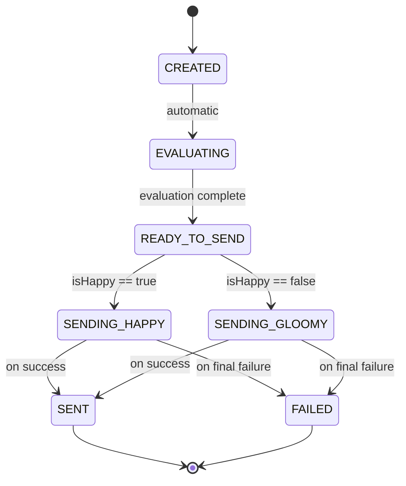

# Functional Requirements (Finalized)

## Summary

This document defines the functional requirements and up-to-date logic for the Mail workflow used by the prototype. It corrects inconsistencies in the prior version, clarifies determinism and concurrency behavior, and specifies default runtime policies (retries, backoff) and API semantics.

---

## 1. Entity Definitions

Entity: Mail

Fields and types:
- technicalId: String (generated, unique, system-assigned)
- isHappy: Boolean (nullable on create; evaluation will set to true/false)
- mailList: List<String> (recipient email addresses; non-empty)
- status: String (workflow state; one of: CREATED, EVALUATING, READY_TO_SEND, SENDING_HAPPY, SENDING_GLOOMY, SENT, FAILED)
- attemptCount: Integer (number of send attempts; default 0)
- lastAttemptAt: DateTime (timestamp of last send attempt; nullable)
- createdAt: DateTime (when entity persisted)
- updatedAt: DateTime (last update timestamp)

Notes:
- The Mail entity is the single primary domain object for this workflow. If fine-grained recipient tracking is desired later, a recipient-sub-entity or per-recipient status field may be added, but is out of scope for this iteration.
- attemptCount counts send *attempts* of the whole Mail object (not per recipient).

---

## 2. State Machine / Workflow

States (canonical names):
- CREATED: Mail persisted by client.
- EVALUATING: Automatic evaluation determining isHappy.
- READY_TO_SEND: Mail ready for sending (happy or gloomy determined).
- SENDING_HAPPY: Processor sendHappyMail running (or scheduled) for this Mail.
- SENDING_GLOOMY: Processor sendGloomyMail running (or scheduled) for this Mail.
- SENT: Mail successfully sent to all recipients.
- FAILED: Mail has exceeded retries and requires manual intervention.

Transition rules (deterministic):
1. On POST /mails -> persist Mail with status = CREATED, attemptCount = 0, timestamps set.
2. System automatically starts workflow: CREATED -> EVALUATING.
3. While in EVALUATING, run evaluation criteria to set isHappy value deterministically:
   - The system runs IsHappyCriterion.
   - If IsHappyCriterion returns true -> isHappy = true.
   - Otherwise -> isHappy = false (IsGloomyCriterion is defined as the complement; there is no scenario where both true or inconclusive).
   - After evaluation, status -> READY_TO_SEND.
4. From READY_TO_SEND -> choose processor based on isHappy:
   - If isHappy == true -> READY_TO_SEND -> SENDING_HAPPY (sendHappyMail).
   - If isHappy == false -> READY_TO_SEND -> SENDING_GLOOMY (sendGloomyMail).
5. Processors attempt to send; on successful complete send to all recipients -> status -> SENT.
6. On transient failure during sending:
   - increment attemptCount, set lastAttemptAt = now(), persist atomically.
   - if attemptCount < MAX_RETRIES -> status -> READY_TO_SEND (schedule retry using backoff policy).
   - else -> status -> FAILED (manual intervention required).

Default runtime policy (configurable):
- MAX_RETRIES: 3 (default; configurable at runtime/config).
- Retry backoff: exponential backoff; initialDelay = 30s, multiplier = 2, maxDelay configurable.

Corrected state diagram


```mermaid
stateDiagram-v2
    [*] --> CREATED
    CREATED --> EVALUATING : automatic
    EVALUATING --> READY_TO_SEND : evaluation complete
    READY_TO_SEND --> SENDING_HAPPY : isHappy == true
    READY_TO_SEND --> SENDING_GLOOMY : isHappy == false
    SENDING_HAPPY --> SENT : on success
    SENDING_HAPPY --> FAILED : on final failure
    SENDING_GLOOMY --> SENT : on success
    SENDING_GLOOMY --> FAILED : on final failure
    SENT --> [*]
    FAILED --> [*]
```

Concurrency and atomicity rules
- Only one processing attempt for a given Mail should run at a time. Implement via one of:
  - optimistic locking (version field) with retry loop, or
  - a status-based lock transition (e.g., READY_TO_SEND -> SENDING_* persisted atomically) and a database-level row lock, or
  - distributed lock (if multiple nodes).
- Status transitions and attemptCount increments must be persisted in the same transaction to avoid lost updates.
- Processors must be idempotent (or generate deduplication metadata for outbound messages) to avoid duplicates on retries.

---

## 3. Criteria and Processors

Criteria
- IsHappyCriterion
  - Deterministically returns true/false for a Mail.
  - Preferred implementation: if isHappy flag is provided in creation request (non-null), treat that as authoritative; otherwise evaluate content/metadata using business rules.
  - Business rule fallback must be deterministic and documented (e.g., subject/keywords/priority mapping). If the evaluation rule set is complex, configuration/version it.
- IsGloomyCriterion
  - Defined as the complement of IsHappyCriterion for this model (i.e., IsGloomy == !IsHappy).
  - Avoid running two independent, potentially conflicting criteria. Use IsHappyCriterion only and derive gloomy deterministically.

Processors
- sendHappyMail
  - Uses a "happy" template to send to all mailList recipients.
- sendGloomyMail
  - Uses a "gloomy" template to send to all mailList recipients.

Processor responsibilities and robust behavior
- Ensure only one processor instance processes a given Mail at a time (use status transition to SENDING_* atomically).
- For each recipient, attempt send operation. Handle partial failures as follows:
  - For the first implementation, treat the Mail as atomic: if any recipient send fails with a transient error, the processor treats the whole attempt as failed (increment attemptCount and schedule retry). This simplifies state and retry logic.
  - Optionally (future enhancement): track per-recipient status (SENT, FAILED) to avoid re-sending to successful recipients.
- Set appropriate headers/identifiers on outgoing messages to allow deduplication at the downstream mail service.
- On transient failures (network, 5xx), throw a transient exception to trigger retry logic. On permanent failures (invalid email format, 4xx client error), mark Mail as FAILED and do not retry unless manually overridden.
- Update lastAttemptAt on every send attempt.

Processor pseudo-code (updated, simplified for atomic mail semantics)

sendHappyMail processor

```
class SendHappyMailProcessor {
  process(Mail mail) {
    // Assumed: mail.status changed to SENDING_HAPPY and persisted before this invocation
    try {
      for (recipient : mail.mailList) {
        send email to recipient with happy template and idempotency metadata
      }
      mail.status = SENT
      persist mail (updatedAt)
    } catch (TransientSendException e) {
      mail.attemptCount += 1
      mail.lastAttemptAt = now()
      if (mail.attemptCount < MAX_RETRIES) {
        mail.status = READY_TO_SEND
      } else {
        mail.status = FAILED
      }
      persist mail (updatedAt)
      // rethrow or surface the transient exception to scheduling infra if needed
    } catch (PermanentSendException e) {
      mail.status = FAILED
      mail.lastAttemptAt = now()
      persist mail
    }
  }
}
```

sendGloomyMail processor

```
class SendGloomyMailProcessor {
  process(Mail mail) {
    // same behavior as SendHappyMail but using gloomy template
  }
}
```

Notes on idempotency
- Because the mail is retried as a whole, ensure either the external mail-sending system deduplicates messages (message-id) or the processor stores an outbound message id to avoid duplicates.

---

## 4. API Endpoints (Event-driven semantics)

Design rules
- POST /mails is an event: client posts a Mail request and receives a technicalId.
- Processing is asynchronous. The POST response does not include the final state; clients must call GET to poll status or subscribe to notifications.
- Use appropriate HTTP return codes and headers.

POST /mails
- Purpose: Persist Mail (this event triggers the Mail workflow evaluation and send process).
- Request JSON (example):
  {
    "isHappy": null,
    "mailList": ["alice@example.com","bob@example.com"]
  }
- Validation:
  - mailList must be present and non-empty; each recipient must be syntactically valid email.
  - If isHappy is provided (true/false), it is treated as authoritative for evaluation and will be used directly.
- Response:
  - 201 Created with body: { "technicalId": "generated-id-123" }
  - Location header: /mails/{technicalId}
  - Note: Accepting 202 Accepted is also valid for purely event-based semantics; prefer 201 Created with id for easier polling.

GET /mails/{technicalId}
- Purpose: Retrieve stored Mail object and current workflow state.
- Response JSON (example):
  {
    "technicalId": "generated-id-123",
    "isHappy": true,
    "mailList": ["alice@example.com","bob@example.com"],
    "status": "SENT",
    "attemptCount": 1,
    "lastAttemptAt": "2025-08-18T12:00:00Z",
    "createdAt": "2025-08-18T11:58:00Z",
    "updatedAt": "2025-08-18T12:00:00Z"
  }

Optional management endpoints (recommended)
- POST /mails/{technicalId}/retry
  - Purpose: Manual trigger to retry a FAILED Mail (sets attemptCount to a configurable value or decrements requirement) or transitions status back to READY_TO_SEND. Only allowed if Mail.status == FAILED.
  - Requires authorization and audit logging.
- POST /mails/{technicalId}/cancel
  - Purpose: Manually cancel an in-flight or READY_TO_SEND Mail.

Notes and decisions required
- How should IsHappyCriterion determine happiness?
  - Recommendation: If client supplies isHappy (non-null) in POST, honor it. Otherwise, run deterministic business rules. This gives callers control when needed and preserves deterministic automation.
- Retry policy (MAX_RETRIES): default 3. Confirm if your business requires a different default and whether manual retry flow should reset attemptCount.
- Manual transitions: add management endpoints for retry/cancel if operators need manual control. These are strongly recommended for operational resilience.
- Recipient granularity: if deduplication or partial-success handling is required, consider adding per-recipient status to the Mail entity in a future iteration.

---

## 5. Implementation & Operational Considerations

- Observability:
  - Emit events for state transitions (CREATED, EVALUATING, READY_TO_SEND, SENDING_*, SENT, FAILED) to allow auditing and metrics.
  - Track metrics: mails created, mails sent, mails failed, retry counts, average attempts.
- Error classification:
  - Explicitly classify exceptions into transient vs permanent.
- Security:
  - Validate/clean recipient inputs to avoid injection.
  - Protect management endpoints (retry/cancel) with RBAC.
- Backpressure & scaling:
  - Use a queue or scheduler to run send processors. Respect concurrency limits on downstream mail providers.

---

## 6. Changes from prior draft
- Fixed state diagram typos (SENDING_GAPPY -> SENDING_GLOOMY) and clarified canonical state names.
- Clarified deterministic evaluation: IsHappyCriterion is authoritative; IsGloomyCriterion is the complement (avoid running two conflicting criteria in parallel).
- Added concurrency/atomicity, idempotency and retry/backoff requirements.
- Defined default MAX_RETRIES and backoff policy.
- Clarified API semantics (201 Created, Location header) and proposed management endpoints for manual retries/cancels.
- Added timestamps and createdAt/updatedAt fields to Mail.

---

If you want, I can:
- Add the optional per-recipient status fields to the Mail entity and update processors to handle partial success explicitly.
- Produce sequence diagrams for processing and retry flow.
- Generate a JSON schema for the API requests/responses.

Please confirm any decisions (honoring client-provided isHappy, MAX_RETRIES value, whether to add manual retry endpoint) and I will update the document accordingly.