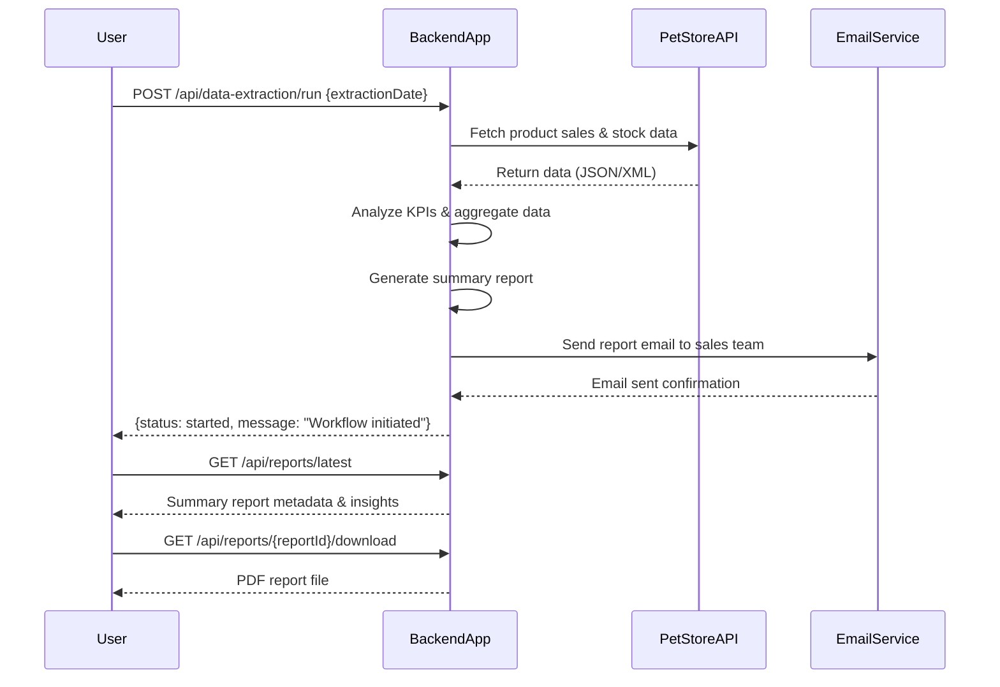
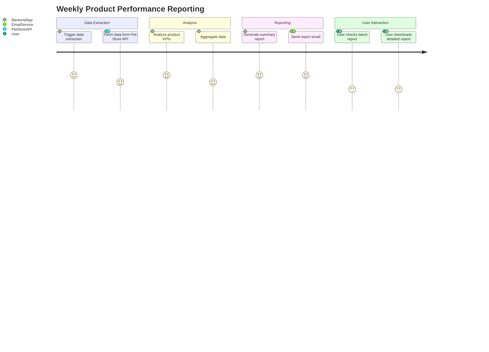

# Functional Requirements and API Design for Product Performance Analysis and Reporting System

## API Endpoints

### 1. POST /api/data-extraction/run
- **Description:** Trigger data extraction from Pet Store API, process product performance metrics, and generate the weekly report.
- **Request:**  
  ```json
  {
    "extractionDate": "2024-06-03"
  }
  ```
- **Response:**  
  ```json
  {
    "status": "started",
    "message": "Data extraction and analysis workflow initiated"
  }
  ```
- **Business Logic:**  
  - Fetch product sales and stock data from Pet Store API (JSON/XML).  
  - Analyze KPIs (sales volume, revenue per product, inventory turnover rates).  
  - Aggregate data by category/time period.  
  - Generate summary report.  
  - Schedule email dispatch to sales team.

---

### 2. GET /api/reports/latest
- **Description:** Retrieve the most recent generated product performance summary report metadata and summary.
- **Response:**  
  ```json
  {
    "reportId": "2024W22",
    "generatedAt": "2024-06-03T10:00:00Z",
    "summary": {
      "topSellingProducts": [
        {"productId": 101, "name": "Pet Food", "salesVolume": 5000},
        {"productId": 102, "name": "Pet Toys", "salesVolume": 3000}
      ],
      "restockItems": [
        {"productId": 103, "name": "Pet Shampoo", "stockLevel": 10}
      ],
      "performanceInsights": "Sales increased by 15% compared to last week."
    },
    "reportDownloadLink": "/api/reports/2024W22/download"
  }
  ```

---

### 3. GET /api/reports/{reportId}/download
- **Description:** Download the detailed report (PDF).
- **Response:**  
  - Content-Type: application/pdf  
  - Binary stream of the generated PDF report.

---

## Mermaid Sequence Diagram: User Interaction with the Application


```mermaid
sequenceDiagram
    participant User
    participant BackendApp
    participant PetStoreAPI
    participant EmailService

    User->>BackendApp: POST /api/data-extraction/run {extractionDate}
    BackendApp->>PetStoreAPI: Fetch product sales & stock data
    PetStoreAPI-->>BackendApp: Return data (JSON/XML)
    BackendApp->>BackendApp: Analyze KPIs & aggregate data
    BackendApp->>BackendApp: Generate summary report
    BackendApp->>EmailService: Send report email to sales team
    EmailService-->>BackendApp: Email sent confirmation
    BackendApp-->>User: {status: started, message: "Workflow initiated"}

    User->>BackendApp: GET /api/reports/latest
    BackendApp-->>User: Summary report metadata & insights

    User->>BackendApp: GET /api/reports/{reportId}/download
    BackendApp-->>User: PDF report file
```

---

## Mermaid Journey Diagram: Weekly Report Workflow


```mermaid
journey
    title Weekly Product Performance Reporting
    section Data Extraction
      Trigger data extraction: 5: BackendApp
      Fetch data from Pet Store API: 4: BackendApp, PetStoreAPI
    section Analysis
      Analyze product KPIs: 5: BackendApp
      Aggregate data: 4: BackendApp
    section Reporting
      Generate summary report: 5: BackendApp
      Send report email: 5: BackendApp, EmailService
    section User Interaction
      User checks latest report: 3: User, BackendApp
      User downloads detailed report: 3: User, BackendApp
```