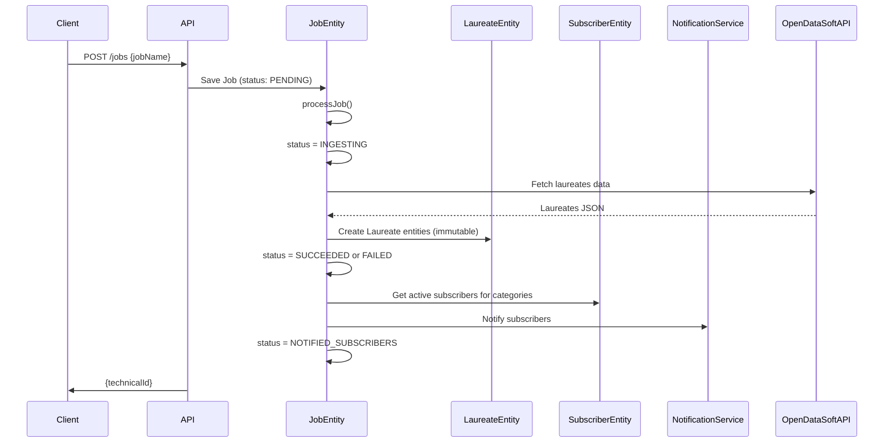
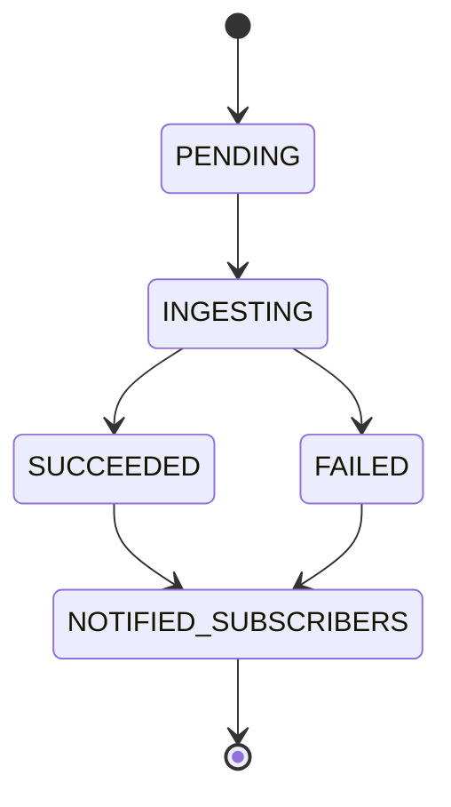

# Functional Requirements

---

## 1. Entity Definitions

```plaintext
Job:
- jobName: String (name of the ingestion job)
- status: String (current job status, e.g., PENDING, INGESTING, SUCCEEDED, FAILED, NOTIFIED_SUBSCRIBERS)
- createdAt: DateTime (timestamp of job creation)
- startedAt: DateTime (timestamp when ingestion started)
- endedAt: DateTime (timestamp when ingestion finished)
- resultSummary: String (summary or message about job outcome)

Laureate:
- laureateId: String (unique identifier from data source)
- firstname: String (first name of laureate)
- surname: String (surname of laureate)
- gender: String (gender of laureate)
- born: String (date of birth, ISO format)
- died: String (date of death, ISO format or null)
- borncountry: String (country where laureate was born)
- borncountrycode: String (ISO country code)
- borncity: String (city where laureate was born)
- year: String (year of Nobel Prize award)
- category: String (award category)
- motivation: String (award motivation)
- affiliationName: String (organization/university name)
- affiliationCity: String (city of affiliation)
- affiliationCountry: String (country of affiliation)

Subscriber:
- subscriberName: String (name of the subscriber)
- contactType: String (e.g., email, webhook URL)
- contactDetails: String (email address or webhook endpoint)
- subscribedCategories: String (comma-separated list of Nobel Prize categories interested in)
- active: Boolean (subscriber active status)
```

---

## 2. Process Method Flows

### processJob() Flow:

1. **Initial State:** Job entity created with status = "PENDING"
2. **Validation:** Optional checkJobParameters() to validate jobName and prerequisites
3. **Processing:**
   - Change status to "INGESTING"
   - Call OpenDataSoft API to fetch Nobel laureates data
   - For each laureate record, create a new Laureate entity (immutable creation)
4. **Completion:**
   - If all laureates processed successfully, set status to "SUCCEEDED"
   - Else, set status to "FAILED"
5. **Notification:**
   - Trigger notification to all active Subscribers matching laureate categories
   - Update Job status to "NOTIFIED_SUBSCRIBERS"

### processLaureate() Flow:

1. Upon Laureate entity creation, validate required fields using checkLaureateFields() if explicitly requested
2. Enrich or normalize data if needed (e.g., standardize country codes)
3. Persist laureate data immutable to maintain event history
4. No further automatic processing unless explicitly triggered

### processSubscriber() Flow:

1. Create Subscriber entity with provided contact info and subscription preferences
2. Validate contact details with checkSubscriberContact() if explicitly requested
3. Persist subscriber immutable record
4. Subscribers receive notifications only after Job completes and triggers notification step

---

## 3. API Endpoints

| Entity     | POST Endpoint                 | Returns                     | GET by technicalId Endpoint    | GET by condition Endpoint       |
|------------|------------------------------|-----------------------------|-------------------------------|--------------------------------|
| Job        | POST /jobs                   | `{ "technicalId": "string" }` | GET /jobs/{technicalId}        | Not required                   |
| Laureate   | No POST (created by Job processing) | N/A                         | GET /laureates/{technicalId}   | Optional (if user requests)    |
| Subscriber | POST /subscribers            | `{ "technicalId": "string" }` | GET /subscribers/{technicalId} | Optional (if user requests)    |

---

## 4. Request/Response Formats

### POST /jobs
Request:
```json
{
  "jobName": "Nobel Laureates Ingestion"
}
```
Response:
```json
{
  "technicalId": "job-uuid-1234"
}
```

### GET /jobs/{technicalId}
Response:
```json
{
  "jobName": "Nobel Laureates Ingestion",
  "status": "NOTIFIED_SUBSCRIBERS",
  "createdAt": "2024-06-01T10:00:00Z",
  "startedAt": "2024-06-01T10:05:00Z",
  "endedAt": "2024-06-01T10:10:00Z",
  "resultSummary": "Processed 50 laureates successfully."
}
```

### POST /subscribers
Request:
```json
{
  "subscriberName": "Science Weekly",
  "contactType": "email",
  "contactDetails": "alerts@scienceweekly.com",
  "subscribedCategories": "Physics,Chemistry",
  "active": true
}
```
Response:
```json
{
  "technicalId": "subscriber-uuid-5678"
}
```

### GET /subscribers/{technicalId}
Response:
```json
{
  "subscriberName": "Science Weekly",
  "contactType": "email",
  "contactDetails": "alerts@scienceweekly.com",
  "subscribedCategories": "Physics,Chemistry",
  "active": true
}
```

---

## 5. Mermaid Diagrams


```mermaid
sequenceDiagram
  participant Client
  participant API
  participant JobEntity
  participant LaureateEntity
  participant SubscriberEntity
  participant NotificationService

  Client->>API: POST /jobs {jobName}
  API->>JobEntity: Save Job (status: PENDING)
  JobEntity->>JobEntity: processJob()
  JobEntity->>JobEntity: status = INGESTING
  JobEntity->>OpenDataSoftAPI: Fetch laureates data
  OpenDataSoftAPI-->>JobEntity: Laureates JSON
  JobEntity->>LaureateEntity: Create Laureate entities (immutable)
  JobEntity->>JobEntity: status = SUCCEEDED or FAILED
  JobEntity->>SubscriberEntity: Get active subscribers for categories
  JobEntity->>NotificationService: Notify subscribers
  JobEntity->>JobEntity: status = NOTIFIED_SUBSCRIBERS
  API->>Client: {technicalId}
```


```mermaid
stateDiagram-v2
  [*] --> PENDING
  PENDING --> INGESTING
  INGESTING --> SUCCEEDED
  INGESTING --> FAILED
  SUCCEEDED --> NOTIFIED_SUBSCRIBERS
  FAILED --> NOTIFIED_SUBSCRIBERS
  NOTIFIED_SUBSCRIBERS --> [*]
```
