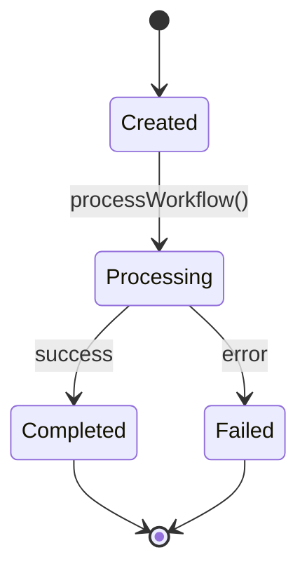
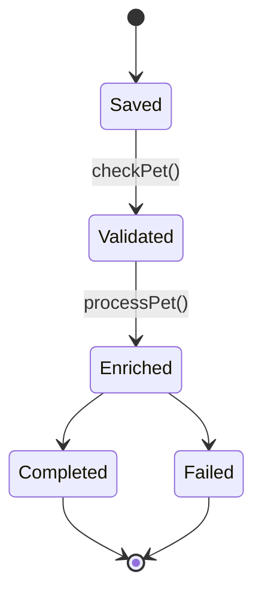
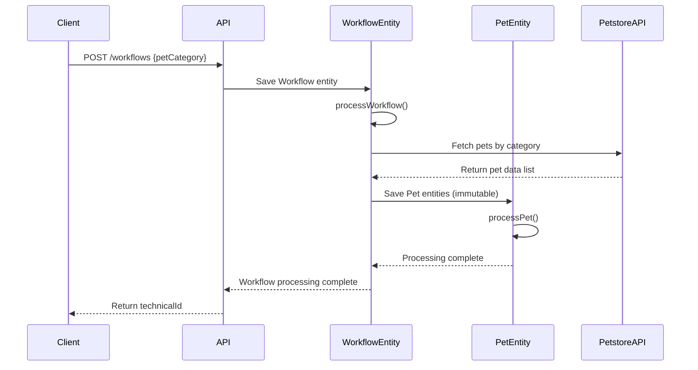

### 1. Entity Definitions

```
Workflow:
- name: String (Name of the orchestration workflow)
- description: String (Description of the workflow purpose)
- status: String (Current status: e.g., PENDING, RUNNING, COMPLETED, FAILED)
- createdAt: String (ISO timestamp of creation)
- petCategory: String (Category of pets to process, e.g., dogs, cats, etc.)

Pet:
- petId: Long (Petstore API pet identifier)
- name: String (Name of the pet)
- category: String (Category of the pet)
- status: String (Pet availability status, e.g., available, pending, sold)
- photoUrls: String (Comma-separated URLs of pet images)
- tags: String (Comma-separated tags related to the pet)
- createdAt: String (ISO timestamp of when pet data was saved in the system)
```

---

### 2. Process Method Flows

```
processWorkflow() Flow:
1. Initial State: Workflow created with status = PENDING
2. Validation: Check presence of petCategory and name
3. Processing:
   - Call Petstore API to fetch pets by petCategory
   - Save each Pet entity as immutable records
4. Completion:
   - Update Workflow status to COMPLETED if pets fetched successfully
   - Update status to FAILED if any error occurs during processing
5. Notification: (optional) Log completion or failure status for audit

processPet() Flow:
1. Initial State: Pet entity saved immutably (via Workflow processing)
2. Validation: Validate petId and mandatory fields exist
3. Processing: Enrich or tag pet data if needed (e.g., add fun emoji tags)
4. Completion: Mark Pet record as processed (optional flag or log)
```

---

### 3. API Endpoints Design

| Method | Endpoint                     | Description                              | Request Body        | Response                     |
|--------|------------------------------|--------------------------------------|---------------------|------------------------------|
| POST   | /workflows                   | Create a new Workflow (triggers pet data fetch) | `{ "name": "...", "description": "...", "petCategory": "cats" }` | `{ "technicalId": "uuid" }`  |
| GET    | /workflows/{technicalId}     | Get Workflow status and metadata      | N/A                 | `{ "name": "...", "status": "...", "petCategory": "...", "createdAt": "..." }` |
| GET    | /pets/{technicalId}          | Get Pet details by internal technicalId | N/A               | `{ "petId": ..., "name": "...", "category": "...", "status": "...", "photoUrls": "...", "tags": "...", "createdAt": "..." }` |
| GET    | /pets?category={category}    | (Optional) Get list of pets by category | N/A                | `[ {Pet}, {Pet}, ... ]`       |

---

### 4. Request/Response JSON Formats

**POST /workflows Request**
```json
{
  "name": "Daily Cat Fetch",
  "description": "Fetch all cats from Petstore API for the day",
  "petCategory": "cats"
}
```

**POST /workflows Response**
```json
{
  "technicalId": "123e4567-e89b-12d3-a456-426614174000"
}
```

**GET /workflows/{technicalId} Response**
```json
{
  "name": "Daily Cat Fetch",
  "description": "Fetch all cats from Petstore API for the day",
  "status": "COMPLETED",
  "petCategory": "cats",
  "createdAt": "2024-06-01T10:15:30Z"
}
```

**GET /pets/{technicalId} Response**
```json
{
  "petId": 101,
  "name": "Whiskers",
  "category": "cats",
  "status": "available",
  "photoUrls": "http://example.com/photo1.jpg,http://example.com/photo2.jpg",
  "tags": "playful,fluffy",
  "createdAt": "2024-06-01T10:16:30Z"
}
```

**GET /pets?category=cats Response**
```json
[
  {
    "petId": 101,
    "name": "Whiskers",
    "category": "cats",
    "status": "available",
    "photoUrls": "http://example.com/photo1.jpg,http://example.com/photo2.jpg",
    "tags": "playful,fluffy",
    "createdAt": "2024-06-01T10:16:30Z"
  },
  {
    "petId": 102,
    "name": "Snowball",
    "category": "cats",
    "status": "pending",
    "photoUrls": "http://example.com/photo3.jpg",
    "tags": "sleepy",
    "createdAt": "2024-06-01T10:17:00Z"
  }
]
```

---

### 5. Mermaid Diagrams

**Workflow Entity Lifecycle State Diagram**


```mermaid
stateDiagram-v2
    [*] --> Created
    Created --> Processing : processWorkflow()
    Processing --> Completed : success
    Processing --> Failed : error
    Completed --> [*]
    Failed --> [*]
```

**Pet Entity Lifecycle State Diagram**


```mermaid
stateDiagram-v2
    [*] --> Saved
    Saved --> Validated : checkPet()
    Validated --> Enriched : processPet()
    Enriched --> Completed
    Enriched --> Failed
    Completed --> [*]
    Failed --> [*]
```

**Event-Driven Processing Chain**


```mermaid
sequenceDiagram
    participant Client
    participant API
    participant WorkflowEntity
    participant PetEntity
    participant PetstoreAPI

    Client->>API: POST /workflows {petCategory}
    API->>WorkflowEntity: Save Workflow entity
    WorkflowEntity->>WorkflowEntity: processWorkflow()
    WorkflowEntity->>PetstoreAPI: Fetch pets by category
    PetstoreAPI-->>WorkflowEntity: Return pet data list
    WorkflowEntity->>PetEntity: Save Pet entities (immutable)
    PetEntity->>PetEntity: processPet()
    PetEntity-->>WorkflowEntity: Processing complete
    WorkflowEntity-->>API: Workflow processing complete
    API-->>Client: Return technicalId
```
