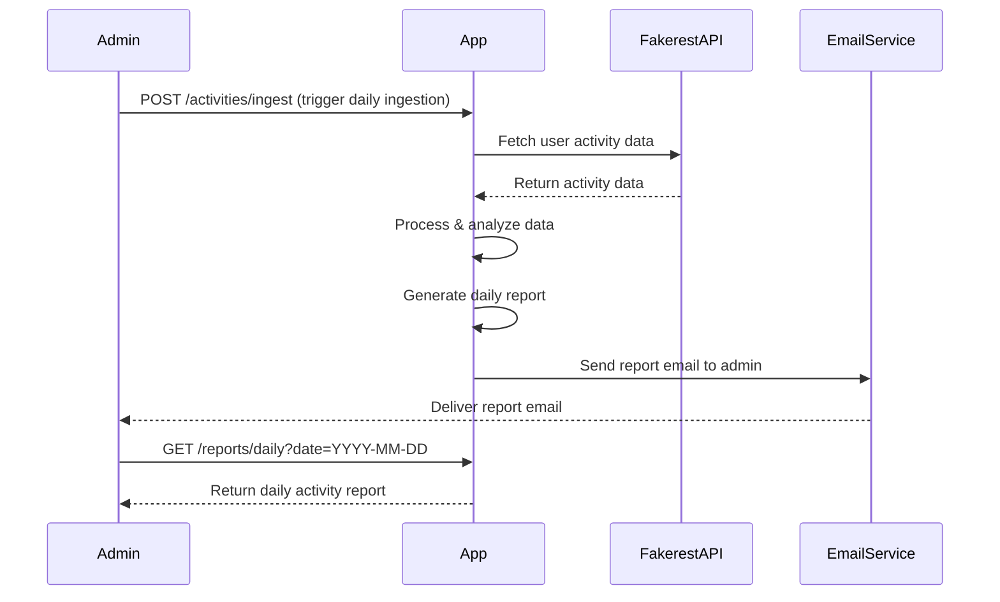

# Functional Requirements and API Design for Activity Tracker Application

## API Endpoints

### 1. **POST /activities/ingest**
- **Description:** Trigger data ingestion from Fakerest API, process data, analyze patterns, and generate the daily report.
- **Request Body:** (optional)  
  ```json
  {
    "date": "YYYY-MM-DD"  // Optional, to specify ingestion date; defaults to current date if missing
  }
  ```
- **Response:**  
  ```json
  {
    "status": "success",
    "message": "Data ingestion, processing, and report generation completed",
    "reportId": "string"  // unique identifier for the generated report
  }
  ```

### 2. **GET /reports/daily**
- **Description:** Retrieve the generated daily report.
- **Query Parameters:**  
  - `date` (required): The date of the report in `YYYY-MM-DD` format.
- **Response:**  
  ```json
  {
    "date": "YYYY-MM-DD",
    "totalActivities": 123,
    "activityTypes": {
      "typeA": 50,
      "typeB": 73
    },
    "trends": "Summary of trends detected",
    "anomalies": [
      "Anomaly description 1",
      "Anomaly description 2"
    ]
  }
  ```

### 3. **GET /reports/{reportId}**
- **Description:** Retrieve a specific report by its ID.
- **Response:** Same format as above.

---

## Business Logic Notes
- The **POST /activities/ingest** endpoint is responsible for:
  - Fetching activity data from the Fakerest API.
  - Processing/analyzing the data to identify patterns.
  - Generating and storing the daily report.
  - Triggering the email publishing workflow.
- All external API calls and data processing run in POST endpoints only.
- GET endpoints serve only to retrieve precomputed results.

---

## User-App Interaction Sequence (Mermaid Diagram)


```mermaid
sequenceDiagram
    participant Admin
    participant App
    participant FakerestAPI
    participant EmailService

    Admin->>App: POST /activities/ingest (trigger daily ingestion)
    App->>FakerestAPI: Fetch user activity data
    FakerestAPI-->>App: Return activity data
    App->>App: Process & analyze data
    App->>App: Generate daily report
    App->>EmailService: Send report email to admin
    EmailService-->>Admin: Deliver report email
    Admin->>App: GET /reports/daily?date=YYYY-MM-DD
    App-->>Admin: Return daily activity report
```

---

## Summary of Endpoints

| Method | Endpoint              | Description                              |
|--------|-----------------------|------------------------------------------|
| POST   | /activities/ingest    | Ingest, process, generate report         |
| GET    | /reports/daily        | Retrieve daily report by date             |
| GET    | /reports/{reportId}   | Retrieve report by unique report ID       |