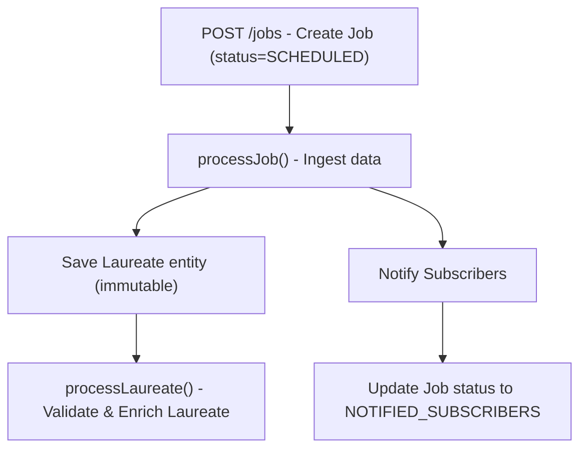

### 1. Entity Definitions

```
Job:
- jobId: String (unique identifier assigned by the datastore)
- status: String (current state of the job, e.g. SCHEDULED, INGESTING, SUCCEEDED, FAILED, NOTIFIED_SUBSCRIBERS)
- scheduledAt: String (ISO 8601 timestamp when job was scheduled)
- startedAt: String (ISO 8601 timestamp when ingestion started)
- finishedAt: String (ISO 8601 timestamp when ingestion finished)
- resultSummary: String (summary or description of ingestion results or errors)

Laureate:
- laureateId: String (unique identifier from source data)
- firstname: String (laureate first name)
- surname: String (laureate last name)
- born: String (date of birth, ISO 8601)
- died: String (date of death, nullable)
- borncountry: String (country of birth)
- borncountrycode: String (ISO country code of birth)
- borncity: String (city of birth)
- gender: String (gender)
- year: String (award year)
- category: String (award category)
- motivation: String (award motivation text)
- affiliationName: String (affiliation institution name)
- affiliationCity: String (affiliation city)
- affiliationCountry: String (affiliation country)

Subscriber:
- subscriberId: String (unique identifier)
- contactType: String (e.g., email, webhook)
- contactValue: String (actual contact detail)
- active: Boolean (whether subscriber is active for notifications)
```

---

### 2. Process Method Flows

```
processJob() Flow:
1. Initial State: Job created with status = SCHEDULED
2. Validation: Validate job parameters and API endpoint accessibility
3. Processing: Fetch Nobel laureates data from OpenDataSoft API
4. For each laureate record fetched:
   - Save a new Laureate entity (immutable creation)
   - This triggers processLaureate() event (if only one processor exists)
5. Completion: Update Job status to SUCCEEDED or FAILED based on ingestion result, set finishedAt timestamp
6. Notification: Trigger notification to all active Subscribers by creating notification events or directly sending messages
7. Update Job status to NOTIFIED_SUBSCRIBERS after notifications are sent
```

```
processLaureate() Flow:
1. Validation: Run validations (e.g., mandatory fields, data formats)
2. Enrichment: Normalize/standardize fields such as country codes or calculate derived attributes if needed
3. Persistence: Store the immutable Laureate entity data
4. (Optional) Trigger any downstream processes if needed (not specified here)
```

```
processSubscriber() Flow:
1. Validation: Check subscriber contact information and active status
2. Persistence: Save subscriber record
3. No further processing unless triggered by Job completion notifications
```

---

### 3. API Endpoints

**Job Endpoints:**

- `POST /jobs`  
  - Request JSON:  
    ```json
    {
      "scheduledAt": "2024-07-01T10:00:00Z"
    }
    ```  
  - Response JSON:  
    ```json
    {
      "technicalId": "job-uuid-1234"
    }
    ```

- `GET /jobs/{technicalId}`  
  - Response JSON:  
    ```json
    {
      "jobId": "job-uuid-1234",
      "status": "NOTIFIED_SUBSCRIBERS",
      "scheduledAt": "2024-07-01T10:00:00Z",
      "startedAt": "2024-07-01T10:05:00Z",
      "finishedAt": "2024-07-01T10:10:00Z",
      "resultSummary": "Ingested 10 laureates successfully."
    }
    ```

**Laureate Endpoints:**

- No POST endpoint for Laureate (created immutably during Job processing)  
- `GET /laureates/{technicalId}` (retrieve stored laureate by ID)  
- Optional: `GET /laureates?year=2010&category=Chemistry` (only if explicitly requested)

**Subscriber Endpoints:**

- `POST /subscribers`  
  - Request JSON:  
    ```json
    {
      "contactType": "email",
      "contactValue": "example@example.com",
      "active": true
    }
    ```  
  - Response JSON:  
    ```json
    {
      "technicalId": "subscriber-uuid-5678"
    }
    ```

- `GET /subscribers/{technicalId}`  
  - Response JSON:  
    ```json
    {
      "subscriberId": "subscriber-uuid-5678",
      "contactType": "email",
      "contactValue": "example@example.com",
      "active": true
    }
    ```

---

### 4. Event-Driven Processing Mermaid Diagram


```mermaid
graph TD
A["POST /jobs - Create Job (status=SCHEDULED)"] --> B["processJob() - Ingest data"]
B --> C["Save Laureate entity (immutable)"]
C --> D["processLaureate() - Validate & Enrich Laureate"]
B --> E["Notify Subscribers"]
E --> F["Update Job status to NOTIFIED_SUBSCRIBERS"]
```