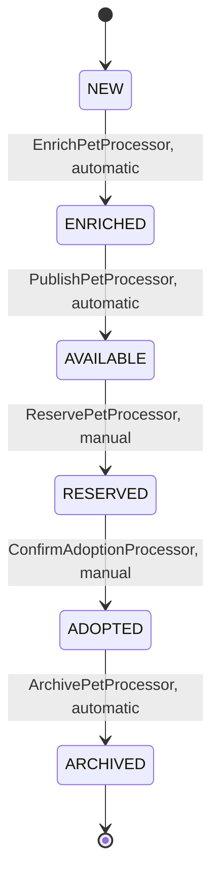
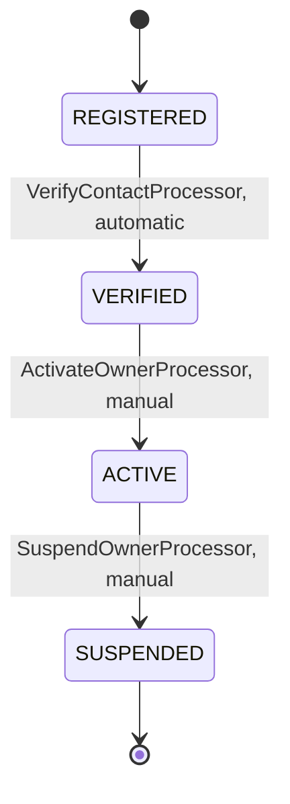
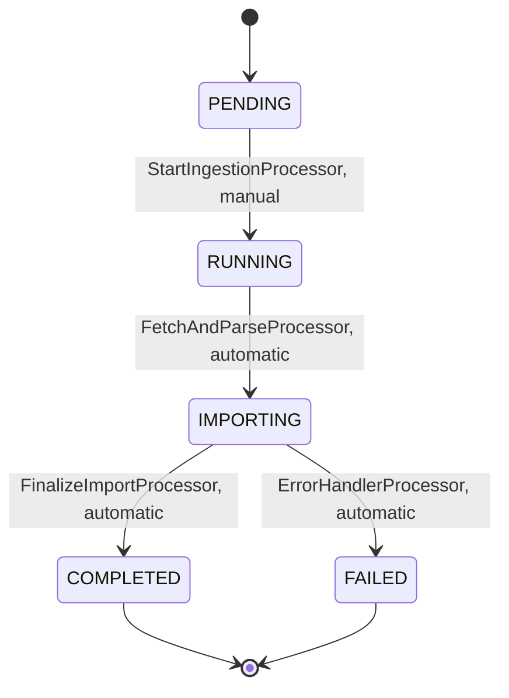

### 1. Entity Definitions
```
Pet:
- id: String (business id from Petstore or internal)
- name: String (pet name)
- species: String (dog cat etc)
- breed: String (breed description)
- age: Integer (years or months)
- gender: String (male female unknown)
- status: String (available reserved adopted archived)
- photos: Array(String) (URLs)
- description: String (free text)
- tags: Array(String) (searchable tags)
- owner_id: String (nullable when unassigned)

Owner:
- id: String (business id)
- name: String (full name)
- email: String (contact)
- phone: String (contact)
- address: String (postal address)
- registered_at: String (ISO datetime)
- favorites: Array(String) (favorite tags or breeds)
- pets_owned: Array(String) (pet ids)

IngestionJob:
- jobId: String (business id)
- source: String (e.g., Petstore API endpoint)
- started_at: String (ISO datetime)
- completed_at: String (ISO datetime)
- status: String (PENDING RUNNING COMPLETED FAILED)
- imported_count: Integer
- error_summary: String (nullable)
```

### 2. Entity workflows

Pet workflow:
1. Initial State: Created by IngestionJob or Admin -> NEW
2. Enrichment: System adds photos/tags or admin enriches -> ENRICHED
3. Availability: Visible to public -> AVAILABLE
4. Reservation: Owner reserves -> RESERVED (manual)
5. Adoption: Adoption confirmed -> ADOPTED (manual)
6. Archive: After adoption or removal -> ARCHIVED


```mermaid
stateDiagram-v2
    [*] --> NEW
    NEW --> ENRICHED : EnrichPetProcessor, automatic
    ENRICHED --> AVAILABLE : PublishPetProcessor, automatic
    AVAILABLE --> RESERVED : ReservePetProcessor, manual
    RESERVED --> ADOPTED : ConfirmAdoptionProcessor, manual
    ADOPTED --> ARCHIVED : ArchivePetProcessor, automatic
    ARCHIVED --> [*]
```

Processors and Criteria for Pet:
- Processors: EnrichPetProcessor, PublishPetProcessor, ReservePetProcessor, ConfirmAdoptionProcessor, ArchivePetProcessor
- Criteria: HasPhotosCriterion, OwnerApprovalCriterion
- Pseudo:
```
function EnrichPetProcessor(pet){
  if not pet.photos then fetchImagesFromSource(pet.id)
  addTagsFromDescription(pet)
  save(pet)
}
```

Owner workflow:
1. Initial State: Owner POSTed -> REGISTERED
2. Verification: System/Staff verifies contact -> VERIFIED (manual/automatic)
3. Active: Can reserve/adopt -> ACTIVE
4. Suspended: Policy issue -> SUSPENDED


```mermaid
stateDiagram-v2
    [*] --> REGISTERED
    REGISTERED --> VERIFIED : VerifyContactProcessor, automatic
    VERIFIED --> ACTIVE : ActivateOwnerProcessor, manual
    ACTIVE --> SUSPENDED : SuspendOwnerProcessor, manual
    SUSPENDED --> [*]
```

Processors and Criteria for Owner:
- Processors: VerifyContactProcessor, ActivateOwnerProcessor, SuspendOwnerProcessor
- Criteria: EmailValidCriterion, NoOpenComplaintsCriterion
- Pseudo:
```
function VerifyContactProcessor(owner){
  if EmailValidCriterion(owner.email) then owner.verified_at = now
  save(owner)
}
```

IngestionJob workflow:
1. Initial State: Job created -> PENDING
2. Run: System starts ingestion -> RUNNING
3. Import: Create/Update Pet entities -> IMPORTING
4. Complete: on success -> COMPLETED
5. Fail: on error -> FAILED


```mermaid
stateDiagram-v2
    [*] --> PENDING
    PENDING --> RUNNING : StartIngestionProcessor, manual
    RUNNING --> IMPORTING : FetchAndParseProcessor, automatic
    IMPORTING --> COMPLETED : FinalizeImportProcessor, automatic
    IMPORTING --> FAILED : ErrorHandlerProcessor, automatic
    COMPLETED --> [*]
    FAILED --> [*]
```

Processors and Criteria for IngestionJob:
- Processors: StartIngestionProcessor, FetchAndParseProcessor, FinalizeImportProcessor, ErrorHandlerProcessor
- Criteria: SourceReachableCriterion, DataValidCriterion
- Pseudo:
```
function FetchAndParseProcessor(job){
  data = fetch(job.source)
  if not SourceReachableCriterion(data) then throw Error
  for each record in data do createOrUpdatePet(record)
  job.imported_count = count(data)
  save(job)
}
```

### 3. Pseudo code for processor classes
(See inline short pseudocode above for representative processors: EnrichPetProcessor, VerifyContactProcessor, FetchAndParseProcessor, FinalizeImportProcessor, ErrorHandlerProcessor)

### 4. API Endpoints Design Rules
- POST /jobs/ingest
  - Purpose: create IngestionJob (triggers ingestion workflow)
  - Request:
```json
{
  "source":"https://petstore.example/api/pets",
  "jobId":"job-2025-06-01"
}
```
  - Response (must return only technicalId):
```json
"tech_123456"
```
- GET /jobs/ingest/{technicalId}
  - Response:
```json
{
  "jobId":"job-2025-06-01",
  "source":"https://petstore.example/api/pets",
  "status":"COMPLETED",
  "imported_count":42,
  "started_at":"2025-08-22T10:00:00Z",
  "completed_at":"2025-08-22T10:03:00Z"
}
```
- POST /owners
  - Purpose: register Owner (triggers Owner workflow)
  - Request:
```json
{
  "id":"owner-123",
  "name":"Alex Smith",
  "email":"alex@example.com",
  "phone":"123-456-7890",
  "address":"123 Pet Lane"
}
```
  - Response:
```json
"tech_654321"
```
- GET /owners/{technicalId}
  - Response: full Owner JSON as in entity definition
- GET /pets/{id}
  - Response: full Pet JSON as in entity definition
- GET /pets (optional list)
  - Response: array of Pet JSON

Notes
- Any creation via POST returns only technicalId string.
- Pet creation is normally produced by IngestionJob (process method) and by automated workflows; manual admin creation could be added as a POST if needed.
- All entity persistence triggers Cyoda workflows automatically; processor and criterion names above map to those actions. Next: which additional entities (Product, Order, Appointment) would you like added or should I expand Owner/Adoption rules?