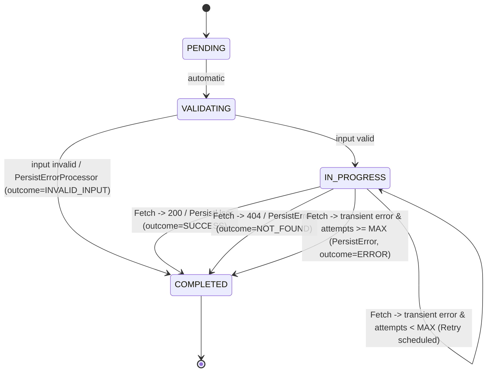
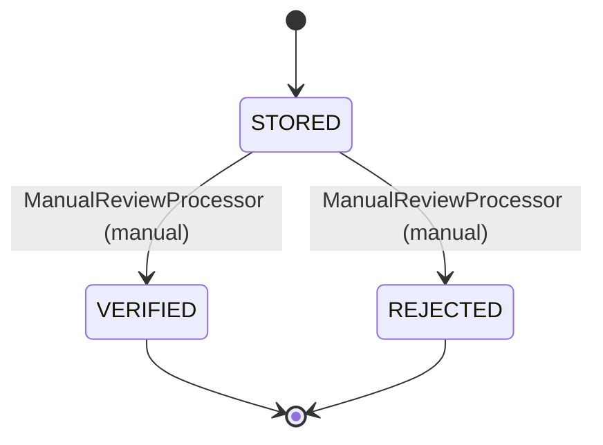
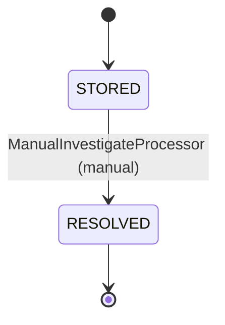

# Functional Requirements — Event-Driven Architecture (Updated)

This document defines the functional requirements for the LookupJob workflow implemented as an event-driven orchestration. It specifies entities, workflows, processors/criteria, API rules and business/configuration rules. The goal is to capture up-to-date logic, remove ambiguity, and make terminal states and retry behaviour explicit.

---

## 1. High-level overview

- The system exposes a single orchestration entrypoint to lookup users from an external ReqRes API.
- Clients create a LookupJob which drives the orchestration. The orchestration persists intermediate entities (User, ErrorEvent) as results of processing.
- The client receives only a technicalId for the LookupJob on creation and polls GET /lookupJobs/{technicalId} to obtain job progress and final result.
- The system is event-driven: processors publish and consume events to move job state; persistence of User and ErrorEvent is produced by processors.

---

## 2. Entities

All timestamps are ISO8601 (UTC). All "technicalId" values are internal opaque IDs (e.g., prefixed strings like `lkj_...`, `usr_...`, `err_...`).

LookupJob (orchestration entity) — fields and intent:
- technicalId: String (opaque internal id, returned to client)
- userId: Integer (requested ReqRes user id)
- lifecycleState: String (PENDING | VALIDATING | IN_PROGRESS | COMPLETED) — represents the workflow lifecycle
- outcome: String (null until terminal) (SUCCESS | NOT_FOUND | INVALID_INPUT | ERROR) — describes terminal result when lifecycleState == COMPLETED
- attempts: Integer (retry count, starts at 0)
- createdAt: String (ISO8601)
- startedAt: String (ISO8601) (when first transition to IN_PROGRESS occurs)
- lastAttemptAt: String (ISO8601) (optional — last time an attempt was made)
- completedAt: String (ISO8601) (when lifecycleState becomes COMPLETED)
- resultRef: String (technicalId of persisted User or ErrorEvent) — set when outcome becomes terminal
- metadata: Object (optional free-form for debugging/tracking — e.g., idempotency key, backoff attempts info)

User (persisted when external call returns user data):
- technicalId: String (internal id, e.g. `usr_...`)
- id: Integer (id returned by ReqRes)
- email: String
- first_name: String
- last_name: String
- avatar: String
- retrievedAt: String (ISO8601)

ErrorEvent (persisted on errors or validation failures):
- technicalId: String (internal id, e.g. `err_...`)
- code: Integer (HTTP or application error code)
- message: String (user-facing message)
- details: String (optional: internal debug details / stack trace / external response)
- occurredAt: String (ISO8601)
- relatedJobId: String (LookupJob.technicalId)

Notes:
- We separate lifecycleState and outcome to clearly distinguish workflow progress from final result reason.
- All persisted entities (User, ErrorEvent) must include an auditable created/occurred timestamp.

---

## 3. Workflows

### LookupJob workflow (orchestration)

1. Creation
   - Client POST /lookupJobs with payload { userId }
   - System creates LookupJob with lifecycleState = PENDING, attempts = 0, createdAt = now.
   - (Optional) If client supplied an idempotency key this is stored in job.metadata.idempotencyKey.
   - Creation triggers the asynchronous orchestration: Validate input automatically.

2. Validation (automatic)
   - lifecycleState -> VALIDATING
   - ValidateInputCriterion runs (checks presence, numeric type and positive range of userId)
   - If invalid:
     - Persist ErrorEvent (code = 400 or app-specific), set outcome = INVALID_INPUT
     - Set lifecycleState = COMPLETED, completedAt = now, resultRef -> ErrorEvent.technicalId
     - Processing ends.
   - If valid:
     - lifecycleState -> IN_PROGRESS, startedAt = now (if not already set)
     - Proceed to FetchUserProcessor.

3. Fetch attempt(s)
   - FetchUserProcessor invokes external GET /users/{userId} (ReqRes) and interprets response.
   - On HTTP 200 with user payload:
     - PersistUserProcessor persists the User, returns user technicalId
     - Update LookupJob: resultRef = user technicalId, outcome = SUCCESS, lifecycleState = COMPLETED, completedAt = now
   - On HTTP 404:
     - PersistErrorProcessor persists ErrorEvent with code = 404 & friendly message
     - Update LookupJob: resultRef = error technicalId, outcome = NOT_FOUND, lifecycleState = COMPLETED, completedAt = now
   - On transient errors (timeouts, network issues, 5xx):
     - Increment attempts. Update lastAttemptAt.
     - If attempts < MAX_ATTEMPTS -> schedule retry via RetrySchedulerProcessor applying backoff -> keep lifecycleState = IN_PROGRESS (job remains active)
     - If attempts >= MAX_ATTEMPTS -> PersistErrorProcessor persists ErrorEvent (code = 503 or app-specific), update LookupJob: resultRef = error technicalId, outcome = ERROR, lifecycleState = COMPLETED, completedAt = now

4. Completion
   - Terminal: lifecycleState == COMPLETED and outcome one of SUCCESS | NOT_FOUND | INVALID_INPUT | ERROR.
   - Client can GET the job and receive dereferenced result in the response (result payload included when available).

Diagram (lifecycleState + outcome semantics):


```mermaid
stateDiagram-v2
    [*] --> PENDING
    PENDING --> VALIDATING : automatic
    VALIDATING --> COMPLETED : input invalid / PersistErrorProcessor (outcome=INVALID_INPUT)
    VALIDATING --> IN_PROGRESS : input valid
    IN_PROGRESS --> COMPLETED : Fetch -> 200 / PersistUser (outcome=SUCCESS)
    IN_PROGRESS --> COMPLETED : Fetch -> 404 / PersistError (outcome=NOT_FOUND)
    IN_PROGRESS --> IN_PROGRESS : Fetch -> transient error & attempts < MAX (Retry scheduled)
    IN_PROGRESS --> COMPLETED : Fetch -> transient error & attempts >= MAX (PersistError, outcome=ERROR)
    COMPLETED --> [*]
```

Notes on retry semantics:
- attempts increments after each failed attempt (transient error).
- Scheduling retries is asynchronous: RetrySchedulerProcessor schedules a future re-run of the Fetch attempt and publishes the event to resume processing.
- While retrying, lifecycleState remains IN_PROGRESS so GET shows active status.

### User workflow
- Automatically created and stored by PersistUserProcessor.
- Optionally subject to manual review (VERIFIED / REJECTED) if the product requires manual review — not required for basic flow.

State diagram (unchanged):


```mermaid
stateDiagram-v2
    [*] --> STORED
    STORED --> VERIFIED : ManualReviewProcessor (manual)
    STORED --> REJECTED : ManualReviewProcessor (manual)
    VERIFIED --> [*]
    REJECTED --> [*]
```

### ErrorEvent workflow
- Created by processors when errors occur (validation or runtime errors).
- Can be investigated and resolved manually (RESOLVED).


```mermaid
stateDiagram-v2
    [*] --> STORED
    STORED --> RESOLVED : ManualInvestigateProcessor (manual)
    RESOLVED --> [*]
```

---

## 4. Processors and Criteria

Criteria
- ValidateInputCriterion
  - Verifies userId is present, integer, and positive.
  - Returns pass/fail; on fail the job transitions to COMPLETED with outcome = INVALID_INPUT.
- MaxRetryCriterion (implicit in retry logic)
  - Evaluates attempts < MAX_ATTEMPTS to determine whether to schedule another retry.

Processors
- FetchUserProcessor
  - Calls external GET /users/{userId} and returns a structured response (status, body, details).
  - Interprets network/timeout/5xx as transient error.
- PersistUserProcessor
  - Persists User entity and returns technicalId. Sets retrievedAt to now.
- PersistErrorProcessor
  - Persists ErrorEvent and returns technicalId.
  - Should accept code, message, details, relatedJobId.
- RetrySchedulerProcessor
  - Increments attempts, computes next backoff delay, schedules re-run event for the LookupJob.
  - If attempts >= MAX_ATTEMPTS it forwards to PersistErrorProcessor instead of scheduling.

Configuration constants (system-level)
- MAX_ATTEMPTS: Integer (default 3)
- BACKOFF_STRATEGY: exponential (base=2) with jitter — example delays: 1s, 2s, 4s (+/- jitter). Configurable base and maxDelay.
- RETRYABLE_STATUS_CODES: [502, 503, 504] and network/timeouts treated as retryable.

---

## 5. Processor pseudocode

FetchUserProcessor
```
input: LookupJob job
output: { status: Integer, body?: JSON, details?: String }
process:
  perform HTTP GET /users/{job.userId} with timeout
  if response.status == 200:
    return {status:200, body: response.json}
  else if response.status == 404:
    return {status:404}
  else:
    return {status:500, details: response or network error}
```

PersistUserProcessor
```
input: userJson, LookupJob job
process:
  create User entity with retrievedAt = now
  save User -> returns technicalId userTechId
  update job.resultRef = userTechId
  update job.outcome = SUCCESS
  update job.lifecycleState = COMPLETED
  update job.completedAt = now
  persist job
```

PersistErrorProcessor
```
input: code, message, details, LookupJob job
process:
  create ErrorEvent with relatedJobId = job.technicalId and occurredAt = now
  save ErrorEvent -> returns technicalId errorTechId
  update job.resultRef = errorTechId
  set job.outcome = (code == 404 ? NOT_FOUND : (input invalid -> INVALID_INPUT else ERROR))
  update job.lifecycleState = COMPLETED
  update job.completedAt = now
  persist job
```

RetrySchedulerProcessor
```
input: LookupJob job
process:
  job.attempts = job.attempts + 1
  job.lastAttemptAt = now
  persist job (attempts and lastAttemptAt)
  if job.attempts < MAX_ATTEMPTS:
    compute delay using BACKOFF_STRATEGY (exponential + jitter)
    schedule async event to re-run FetchUserProcessor for job after delay
  else:
    call PersistErrorProcessor(code=503, message="Max retries exceeded", details=last error details, job)
```

ValidateInputCriterion
```
input: LookupJob job
output: boolean
process:
  return (job.userId != null && job.userId is integer && job.userId > 0)
```

---

## 6. API Endpoints (design rules)

Principles
- Only LookupJob creation is a write endpoint. Persisted results (User, ErrorEvent) are created by processors.
- POST returns only the technicalId so clients must poll GET for results.
- GET will return job metadata and, when lifecycleState == COMPLETED, includes dereferenced result (User or ErrorEvent payload) in the response.
- API should support idempotency for POST: clients MAY supply an Idempotency-Key header; server records it in job.metadata.idempotencyKey and returns existing job if duplicate.

1) Create LookupJob
- POST /lookupJobs
Request JSON:
{
  "userId": 2
}
Headers (optional):
- Idempotency-Key: <string>

Successful response (201 Created):
{
  "technicalId": "lkj_3a1f..."
}

Behavioral notes:
- The POST is asynchronous. Creation triggers validation and processing in the background.
- If client submits the same idempotency key, server returns same technicalId rather than creating a duplicate job.

2) Get LookupJob by technicalId
- GET /lookupJobs/{technicalId}

Response JSON (example when completed successfully):
{
  "technicalId": "lkj_3a1f...",
  "userId": 2,
  "lifecycleState": "COMPLETED",
  "outcome": "SUCCESS",
  "createdAt": "2025-08-19T12:00:00Z",
  "startedAt": "2025-08-19T12:00:01Z",
  "lastAttemptAt": "2025-08-19T12:00:01Z",
  "completedAt": "2025-08-19T12:00:02Z",
  "attempts": 1,
  "resultRef": "usr_ab12...",
  "result": {
    "type": "User",
    "payload": {
      "technicalId": "usr_ab12...",
      "id": 2,
      "email": "janet.weaver@reqres.in",
      "first_name": "Janet",
      "last_name": "Weaver",
      "avatar": "https://...",
      "retrievedAt": "2025-08-19T12:00:01Z"
    }
  }
}

- If lifecycleState != COMPLETED the `result` field MAY be absent or partial; `outcome` will be null until terminal.

---

## 7. Business rules and notes

- The orchestration ensures a single logical flow: validation → external fetch attempts (with retries) → persist result (User or ErrorEvent) → completed.
- Terminal outcome values (SUCCESS/NOT_FOUND/INVALID_INPUT/ERROR) persist the reason for completion.
- All job transitions that mutate the LookupJob must be persisted atomically (or idempotently) to avoid duplicate retries or inconsistent attempt counts.
- Retry scheduler must be resilient to duplicated scheduling events (idempotent scheduling and attempt counting).
- External calls and error-handling: network/timeouts/5xx treated as retryable per configuration; specific client errors (4xx other than 429) are non-retryable.
- For observability, each Fetch attempt should record metrics (attempt number, duration, response code) and log correlation ids.

---

## 8. Configuration and operational defaults

- MAX_ATTEMPTS = 3 (configurable)
- BACKOFF = exponential (2^attempts seconds) with jitter, capped at MAX_BACKOFF (configurable)
- RETRYABLE_STATUS_CODES = [502, 503, 504] + timeouts and network errors
- DEFAULT_TIMEOUT_MS for HTTP calls = 2_000 ms (configurable)

---

## 9. Extensions and optional endpoints

- Optional GET endpoints to retrieve Users by domain id or list jobs can be added (read-only) but are not required for the core orchestration.
- Optional event streams / webhooks for job completion can be added to notify clients instead of polling.

---

## 10. Open items

- Decide if the system should return partial progress information in GET (e.g., current attempt count and lastAttemptAt). Current spec allows it.
- Decide on idempotency semantics and retention of idempotency keys (TTL).
- Backoff parameters (base, jitter, cap) should be set by ops.

---

If you want the functional requirements adjusted (more entities, different outcomes, or to externalize retry policy completely to a scheduler service) say which area you want changed and I will update.