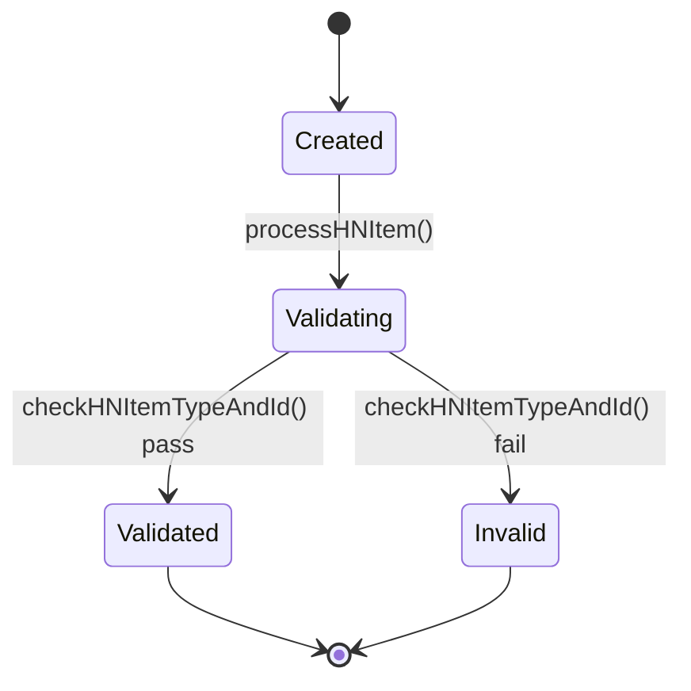
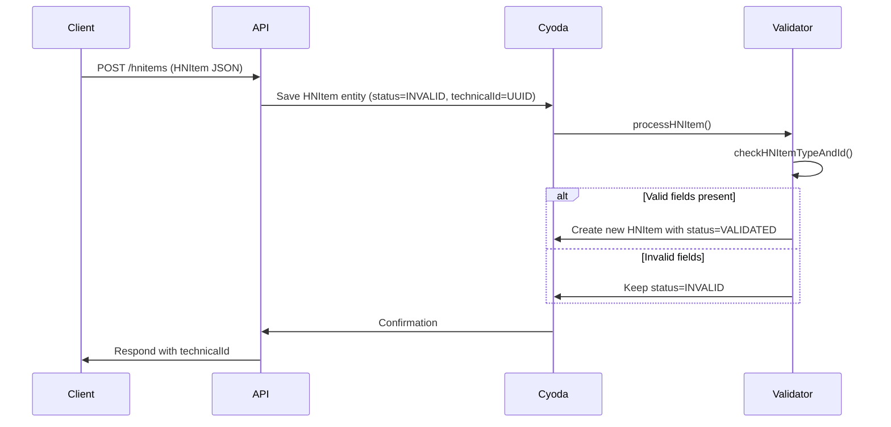

### 1. Entity Definitions

```
HNItem (Business Data Only):
- id: String (original Hacker News item ID, may be numeric or string)
- payload: JSON (full Hacker News item JSON as received)
- status: String (processing status: INVALID, VALIDATED)

Entity Metadata (Managed by Cyoda Platform):
- technicalId: UUID (unique datastore-generated identifier, retrieved via entityService.getItemWithMetaFields)
- createdAt: DateTime (entity creation timestamp, retrieved via entityService.getItemWithMetaFields)
- state: String (workflow state, retrieved via entityService.getItemWithMetaFields)
```

### 2. Process Method Flows

```
processHNItem() Flow:
1. Initial State: HNItem created with status = INVALID and a generated technicalId (UUID)
2. Validation: Trigger checkHNItemTypeAndId() event to verify presence of "type" and "id" in payload
3. Status Update:
   - If validation passes, create a new immutable HNItem entity version with status = VALIDATED
   - If validation fails, keep status as INVALID
4. Completion: End processing, item stored with validation status for retrieval
```

### 3. API Endpoints Design

| Method | Path           | Description                           | Request Body             | Response                    |
|--------|----------------|-------------------------------------|--------------------------|-----------------------------|
| POST   | /hnitems       | Create (save) a new HNItem entity   | Raw Hacker News item JSON | `{ "technicalId": UUID }`   |
| GET    | /hnitems/{technicalId} | Retrieve HNItem by technicalId       | N/A                      | Full stored HNItem entity   |

- POST endpoint generates UUID `technicalId` ignoring any input `id`.
- GET endpoint returns full entity including status and original JSON payload.
- No update or delete endpoints to maintain immutability and event history.

### 4. Request/Response Formats

**POST /hnitems**  
Request Example:

```json
{
  "by": "author",
  "descendants": 10,
  "id": "123456",
  "kids": [123, 124],
  "score": 50,
  "time": 1609459200,
  "title": "Example Hacker News Story",
  "type": "story",
  "url": "https://example.com"
}
```

Response Example:

```json
{
  "technicalId": "550e8400-e29b-41d4-a716-446655440000"
}
```

**GET /hnitems/{technicalId}**  
Response Example:

```json
{
  "technicalId": "550e8400-e29b-41d4-a716-446655440000",
  "id": "123456",
  "payload": {
    "by": "author",
    "descendants": 10,
    "id": "123456",
    "kids": [123, 124],
    "score": 50,
    "time": 1609459200,
    "title": "Example Hacker News Story",
    "type": "story",
    "url": "https://example.com"
  },
  "status": "VALIDATED",
  "createdAt": "2024-06-01T12:00:00Z"
}
```

---

### Mermaid Diagrams

**Entity Lifecycle State Diagram**


```mermaid
stateDiagram-v2
    [*] --> Created
    Created --> Validating : processHNItem()
    Validating --> Validated : checkHNItemTypeAndId() pass
    Validating --> Invalid : checkHNItemTypeAndId() fail
    Validated --> [*]
    Invalid --> [*]
```

**Event-Driven Processing Chain**


```mermaid
sequenceDiagram
    participant Client
    participant API
    participant Cyoda
    participant Validator

    Client->>API: POST /hnitems (HNItem JSON)
    API->>Cyoda: Save HNItem entity (status=INVALID, technicalId=UUID)
    Cyoda->>Validator: processHNItem()
    Validator->>Validator: checkHNItemTypeAndId()
    alt Valid fields present
        Validator->>Cyoda: Create new HNItem with status=VALIDATED
    else Invalid fields
        Validator->>Cyoda: Keep status=INVALID
    end
    Cyoda->>API: Confirmation
    API->>Client: Respond with technicalId
```

---

This completes the functional requirements for your Hacker News item storage service using Event-Driven Architecture on Cyoda.